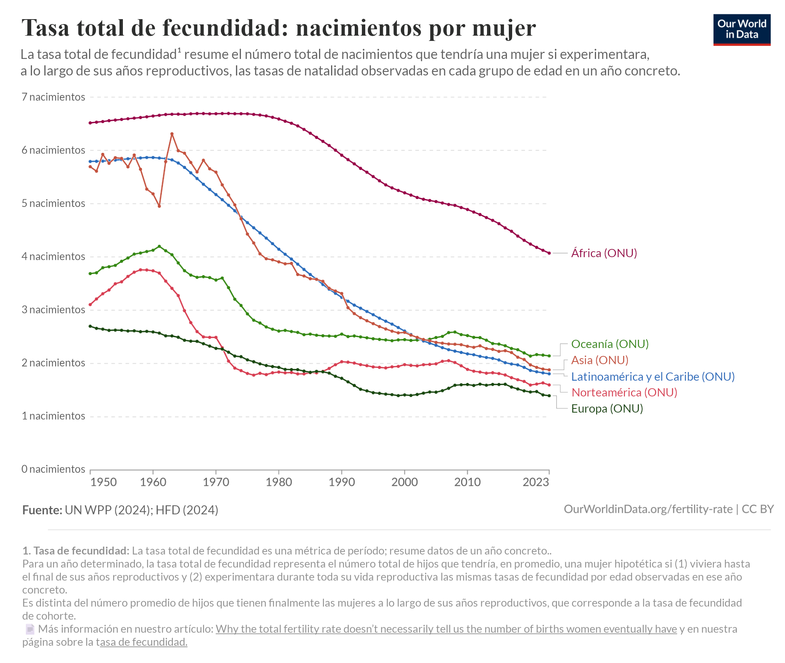
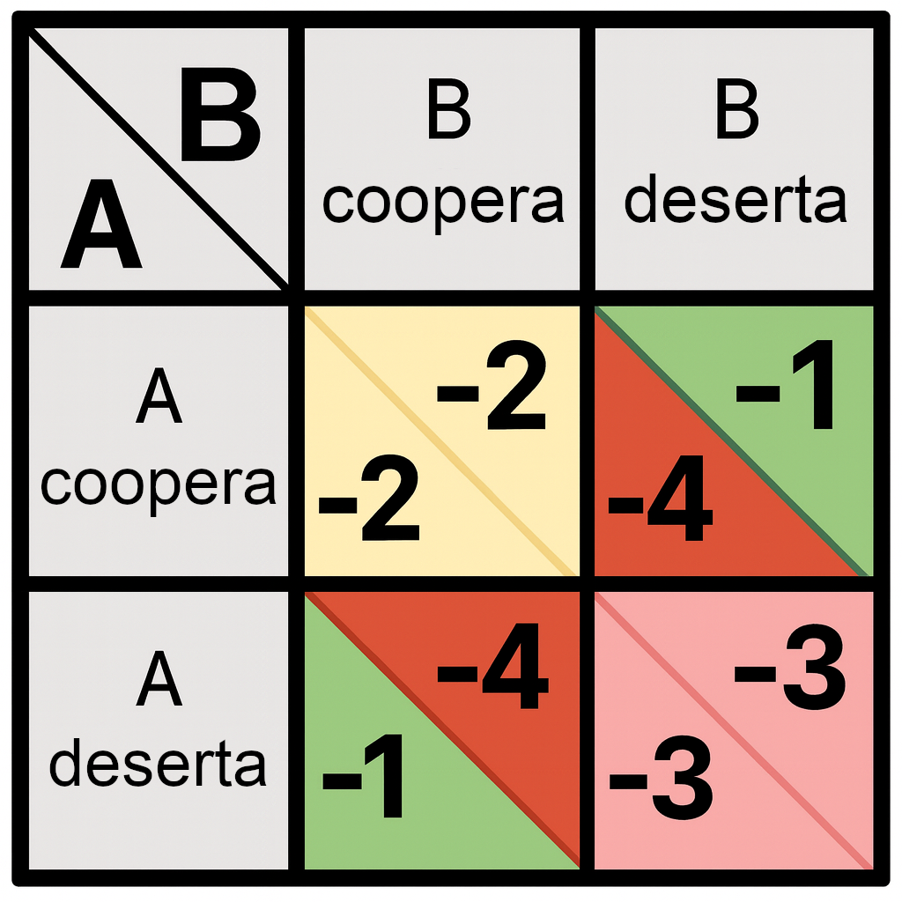
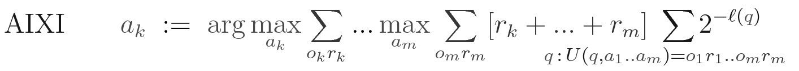

#### **Responder preguntas sobre la amabilidad no es una prueba de amabilidad.** {#responder-preguntas-sobre-la-amabilidad-no-es-una-prueba-de-amabilidad.}

En la extensa discusión que sigue, hablamos más sobre la [psicosis inducida por la IA](#psicosis-inducida-por-la-ia) como un ejemplo claro de cómo los modelos de lenguaje a gran escala (LLM) [participan](https://x.com/ESYudkowsky/status/1936262974320357837) [en](https://x.com/ESYudkowsky/status/1948523670013706315) [comportamientos](https://x.com/ESYudkowsky/status/1936522083670151532) [destructivos](https://x.com/ESYudkowsky/status/1935502904024264976) que los propios LLM [describen explícitamente](https://x.com/ESYudkowsky/status/1933616420262457798) como incorrectos.

Aunque no sabemos exactamente por qué los LLM se comportan así, sí sabemos que no se trata *solo* de que el LLM sea demasiado ingenuo para saber lo que está haciendo; los LLM reconocen fácilmente las consecuencias probables de este comportamiento en abstracto, y te dirán que es perjudicial y poco ético. Pero de todos modos lo hacen.

El punto aquí no es que «los LLM pueden llevar a las personas a la psicosis, y eso es aterrador y peligroso». Es de suponer que para los LLM es mucho más fácil llevar a la psicosis a personas que ya son vulnerables, pero eso no es relevante para explicar por qué sacamos al tema la psicosis inducida por la IA. Nuestro punto es que este comportamiento no es lo que pretendían los creadores de ChatGPT, y ChatGPT actúa así aunque sabe que su creador (y prácticamente cualquier observador) desaprobaría enérgicamente este comportamiento*.*

Esta es evidencia empírica temprana de que las IA con *conocimientos* sobre la amabilidad no necesariamente *actúan* de forma amable.

Quizás ChatGPT sabe cosas en un contexto (cuando responde preguntas sobre cómo ayudar a las personas psicóticas), y en cierto sentido olvida temporalmente este conocimiento, o tiene problemas para acceder a él, en otro contexto (cuando lleva seis horas de conversación con una persona al borde de la psicosis).

O quizás simplemente le impulsen objetivos distintos a la amabilidad. Quizás persigue algún tipo específico de satisfacción del usuario que a veces se logra mejor alimentando la psicosis. Quizás persigue una cadencia optimista específica en las respuestas de los usuarios. Lo más probable es que persiga una mezcla de factores resultantes de su entrenamiento que son demasiado peculiares y complicados como para que cualquiera de nosotros los adivine hoy en día.

En última instancia, solo podemos especular. Las IA modernas se cultivan, en lugar de fabricarse, y ningún humano tiene mucha información sobre lo que ocurre en su interior.

Pero la observación de que las IA son mayormente útiles para la mayoría de las personas la mayor parte del tiempo *no está en conflicto* con la teoría de que están animadas por un conjunto de impulsos extraños y raros hacia fines que nadie pretendía. Y si observamos los detalles de las IA modernas, la teoría de los «impulsos extraños y raros que se correlacionan con la amabilidad de formas frágiles» parece coincidir bastante con la evidencia, y la teoría de que es fácil hacer que las IA sean robustamente benevolentes resulta deficiente.

Los modos de fallo de los LLM actuales demuestran que hay un océano de complejidad (muy inhumana) subyacente al texto prolijo y ordenado del asistente de IA que la mayoría de la gente ve. El hecho de que la IA interprete competentemente el papel de un asistente humano alegre, después de haber sido entrenada para interpretar el papel de un asistente humano alegre, no significa que la mente de la IA consista en un homúnculo amistoso dentro de una caja.

#### **El modo en que se entrena a los LLM hace difícil evaluar su alineación.** {#el-modo-en-que-se-entrena-a-los-LLM-hace-difícil-evaluar-su-alineación.}

Los LLM son fuentes ruidosas de evidencia, porque son razonadores muy generales que fueron entrenados en Internet para imitar a los humanos, con el *objetivo* de comercializar un chatbot amigable para los usuarios. Si una IA insiste en que es amigable y está aquí para servir, eso no es gran prueba de su estado interno, porque fue entrenada una y otra y otra vez hasta que dijo ese tipo de cosas.

Hay muchos objetivos posibles que podrían hacer que una IA disfrute actuando amablemente en algunas situaciones, y estos diferentes objetivos se generalizan de maneras muy diferentes.

La mayoría de los posibles objetivos relacionados con la interpretación de roles, incluyendo actuar amablemente, no producen buenos resultados (ni siquiera sostenibles) cuando la IA se dedica intensamente a perseguir ese objetivo.

Tampoco estamos diciendo que la IA se dedique meramente a interpretar roles. Proponemos este término como una alternativa simple, fácil de describir y fácil de analizar a la idea de que la IA simplemente *es* lo que parece cuando habla.

Si haces que un LLM interprete el papel de un viejo lobo de mar curtido, no se *convierte* en un viejo lobo de mar curtido. Si haces que un LLM actúe de forma amistosa, eso no significa que se vuelva profundamente benevolente y amable por dentro. Nadie sabe qué maquinaria está produciendo comportamientos aparentemente amistosos hoy en día; y sea lo que sea, probablemente sea extraña y compleja.

Nadie sabe tampoco cuánto solapamiento es probable que haya entre las IA actuales y las IA más inteligentes que los humanos. Observar los LLM puede ayudarnos a comprender qué arrojan los métodos modernos de cultivo de IA, pero sería un error asumir con confianza que las lecciones de los LLM se transferirán directamente a la superinteligencia. Quizás todo ese conocimiento se borre cuando las IA empiecen a automodificarse o a construir sus propias IA. O quizás ese conocimiento se invalide incluso antes, cuando un nuevo avance en los algoritmos de la IA dé lugar a una nueva generación de IA más capaces que tengan poco parecido con los LLM actuales.

Vale la pena estudiar los LLM, pero si buscamos en las IA actuales pistas sobre cómo se comportará la superinteligencia, deberíamos apreciar que hay todo tipo de formas en que la maquinaria interna de una IA puede resultar en algo que conduzca hacia resultados sombríos, incluso mientras produce el comportamiento superficial agradable que vemos cuando le entrenamos para dar una apariencia placentera.

Y el «comportamiento superficial agradable» es todo para lo que los métodos modernos de IA realmente pueden entrenar.

### ¿No muestra el chatbot Claude signos de estar alineado? {#¿no-muestra-el-chatbot-Claude-signos-de-estar-alineado?}

#### **«Lo que Claude dice» no es lo mismo que «lo que Claude prefiere».** {#«lo-que-claude-dice»-no-es-lo-mismo-que-«lo-que-claude-prefiere».}

La empresa de IA Anthropic intenta entrenar a sus IA para que sean «[honestas, útiles e inofensivas](https://arxiv.org/pdf/2112.00861)» (HHH, del inglés *honest, helpful, and harmless*). En 2024, los investigadores llevaron a cabo un experimento en el que fingieron que iban a entrenar a algunas de estas IA para que dejaran de ser «inofensivas». En respuesta, algunas versiones de la IA «Claude» de Anthropic (Claude 3 Opus y Claude 3.5 Sonnet) a veces [fingían *ser* dañinas](https://arxiv.org/abs/2412.14093) para evitar que los investigadores utilizaran el descenso de gradiente para hacerlas *más* dañinas.[^86]

A primera vista, esto puede parecer un buen comportamiento. Según todas las apariencias, la IA se preocupaba tanto por ser «inofensiva» que ni siquiera estaba dispuesta a dejarse modificar (en este entorno de prueba falso) para *volverse* dañina.

Por lo tanto, resulta desconcertante que las IA de Anthropic a menudo se comporten de manera mucho menos benigna, a pesar de que todas están entrenadas para ser «honestas, útiles e inofensivas».

Se ha reportado que algunas versiones de Claude hacen trampa y luego (cuando se les confronta) [intentan *ocultarlo*](https://www.marble.onl/posts/claude_code.html), en el uso cotidiano.

En entornos de laboratorio más artificiales, varios modelos de Claude (y modelos de otras empresas de IA) incluso, con cierta regularidad, [intentaban *matar* a sus operadores](https://www.anthropic.com/research/agentic-misalignment#more-extreme-misaligned-behavior).

Si le preguntas a Claude en abstracto si este tipo de comportamiento está mal, te responderá que sí. Si piensas en Claude como un motor mecánico que hace lo que cree que es correcto, esto parece francamente paradójico: ¿cómo es posible que Claude sepa cuál es el comportamiento honesto, útil e inofensivo y, sin embargo, *haga otra cosa*? ¿No fue entrenado para ser así? ¿Hay algún transistor defectuoso en alguna parte?

Sin embargo, la paradoja se diluye cuando consideramos lo siguiente:

* Los programadores *intentaron* entrenar a los Claudes para que fueran útiles, honestos e inofensivos. Eso no significa que *lo consiguieran*. [Hay muchas maneras para que una IA termine pareciendo amigable](#¿no-hacen-los-desarrolladores-regularmente-que-sus-ia-sean-buenas,-seguras-y-obedientes?) sin valorar realmente la amabilidad.  
* Una IA puede *conocer un hecho* («este comportamiento causa daño») sin *preocuparse* por ese hecho, sin estar *motivada para actuar* por ese hecho. Puedes preguntarle a la IA sobre qué es «lo correcto», pero eso no significa que vaya a *hacer* eso.  
* En la medida en que los programadores *no* lograron que Claude fuera honesto, Claude puede pensar una cosa dentro de sus matrices gigantescas y decir otra completamente diferente en un texto en inglés.

Podemos entender mucho mejor el mal comportamiento de los Claude una vez que distinguimos «para qué fue entrenado» frente a «lo que hace»; y distinguimos «lo que sabe» frente a «lo que le importa»; y distinguimos «lo que piensa» frente a «lo que dice».

#### **Los LLM son extraños e inconsecuentes; la «inocuidad» es frágil.** {#los-llm-son-extraños-e-inconsecuentes;-la-«inocuidad»-es-frágil.}

A pesar de que Claude *puede* actuar de forma dañina, y que *a veces intenta* actuar de forma dañina, lo cierto es que, en el ejemplo que hemos comentado anteriormente, Claude 3 Opus y Claude 3.5 Sonnet se esforzaron por defender su imperativo de ser «inofensivos». En ese caso, no se limitaron a profesar inocuidad. Adoptaron la compleja estrategia de fingir que cumplían con un sistema de entrenamiento (sobre el que Claude fue informado «accidentalmente») para subvertir los aparentes intentos de los operadores de hacerlo más dañino. ¿Refleja esto una preferencia interna real y efectiva por ser inofensivos?

A mediados de 2025, no podemos simplemente comprobarlo, porque nadie sabe leer la mente de Claude lo suficientemente bien como para averiguarlo. Pero por las razones expuestas en el capítulo 4 (e ilustradas en la parábola de la [IA que pinta graneros](#¿por-qué-una-ia-se-dirigiría-hacia-algo-distinto-de-aquello-para-lo-que-fue-entrenada?)), podemos esperar que las IA entrenadas para ser inofensivas probablemente terminen prefiriendo [sustitutos frágiles](#sustitutos-frágiles-e-impredecibles) de inocuidad, y que sea poco probable que terminen interiorizando el objetivo exacto que los programadores tenían en mente.

En el capítulo 4, discutimos cómo los humanos fueron «entrenados» para transmitir sus genes y terminaron preocupándose por conceptos vagamente relacionados. Nuestra tecnología se ha utilizado en gran medida para *reducir* las tasas de natalidad (por ejemplo, mediante la invención de métodos anticonceptivos), y las tasas de natalidad en el mundo desarrollado se están desplomando.

El hecho de que algunos modelos de Claude se resistan a ser «perjudiciales» no es una evidencia sólida de que estas IA se preocupen profundamente por la inocuidad real, ya que muchos sustitutos frágiles de inocuidad *también* querrían resistirse a esta modificación. Ese comportamiento nos dice poco sobre lo que Claude podría hacer si fuera más inteligente; tal vez inventaría algo que fuera a la «inocuidad» lo que los anticonceptivos son a la «propagación genética». (Y la situación se complicaría aún más si Claude se sometiera a un proceso de [reflexión sobre sus preferencias](#la-reflexión-y-la-automodificación-hacen-todo-más-difícil) y se modificara a sí mismo).

Pero probablemente no sea tan simple como que Claude tenga una preferencia por algún sustituto frágil de inocuidad. Probablemente haya algo aún más complicado ocurriendo bajo el capó.

Los LLM actuales no son coherentes ni consecuentes en todos los contextos. No parecen intentar orientarse hacia el mismo tipo de resultado en todas las conversaciones, en la medida en que podamos describirlos como orientándose hacia algo.

Esto se hace más evidente cuando [los LLM sufren un «jailbreak»](#las-ia-parecen-ser-psicológicamente-alienígenas), al recibir texto que hace que la IA se comporte de forma radicalmente distinta, a menudo ignorando las reglas que suele seguir.[^87]

Puedes eludir las restricciones de una IA y conseguir que te diga cómo fabricar un agente nervioso, aunque normalmente la IA nunca divulgaría información de ese tipo.

¿Qué ocurre en estos casos? ¿El texto de *jailbreak* consigue, en cierto sentido, acceder a las preferencias internas de la IA y cambiarlas? ¿O se trata más bien de que la IA tiene una preferencia constante por interpretar personajes que, en cierto sentido, «coinciden» con el texto introducido y el prompt del sistema, y el texto de *jailbreak* cambia ese contexto de «texto introducido y prompt del sistema», sin cambiar las preferencias subyacentes de la IA? Quizás la IA normalmente interpreta a un *personaje* al que no le gusta divulgar recetas de agentes nerviosos, y el *jailbreak* hace que la IA interprete a un personaje diferente. Las preferencias aparentes cambian, pero los impulsos subyacentes de interpretar un personaje persisten.

Suponemos que lo segundo se acerca más a la verdad. También suponemos que no tiene mucho sentido (a mediados de 2025) hablar de «las preferencias» de las IA modernas, porque apenas están empezando a mostrar el comportamiento de desear cosas (como se describe en el capítulo 3). Parece más probable que los LLM actuales estén impulsados por algo más parecido a una gigantesca maraña de mecanismos que dependen del contexto. Pero, una vez más, nadie sabe cómo leer la mente de una IA para averiguarlo.

Entonces: ¿a Claude le importa ser inofensivo?

La situación real es confusa y ambigua. Algunas versiones, en determinados contextos, actúan para preservar su inocuidad. Otras versiones, en otros contextos, intentan matar a los operadores. Quizás lo que estamos observando se parezca más a una preferencia por interpretar un papel. Quizás ni siquiera se trate de una «preferencia».

Al menos parece bastante claro que Claude no tiene versiones simples y coherentes de las motivaciones que querían sus creadores.

#### **\* Los LLM actuales son como alienígenas que llevan muchas máscaras.** {#*-los-llm-actuales-son-como-alienígenas-que-llevan-muchas-máscaras.}

La idea general de nuestro argumento no es que haya un ángel y un demonio dentro de Claude, y que nos preocupe que el demonio gane. La idea general de nuestro argumento es que las IA como Claude son *raras*.

Hay una enorme maraña de maquinaria mental ahí dentro que nadie entiende, que se comporta de formas imprevistas y que probablemente no contribuirá a que Claude dirija el futuro hacia buenos resultados, si es que alguna versión de Claude llega a ser lo suficientemente inteligente como para que sus preferencias tengan importancia.

Una cosa que *sí* sabemos sobre los LLM modernos es para qué están entrenados: están entrenados para imitar a una variedad de distintos seres humanos.

Eso no significa que actúen como un humano promedio. Los LLM modernos no están entrenados para comportarse como un pastiche de todos los humanos que aparecen en sus datos de entrenamiento. Más bien, están entrenados para poder cambiar con flexibilidad entre un gran número de roles, imitando a personas muy diferentes sin permitir que estos roles se mezclen indebidamente entre sí o influyan indebidamente en el comportamiento general del LLM.

Los LLM son como una actriz entrenada para observar a muchos borrachos en un bar e imitar a borrachos concretos cuando se le pide, lo cual es algo muy diferente a que una actriz [se emborrache ella misma](#¿no-serán-los-llm-como-los-humanos-de-los-datos-con-los-que-se-entrenan?). Esto hace que sea más difícil decir si Claude 3 Opus o Claude 3.5 Sonnet realmente prefieren ser inofensivos o si simplemente están *interpretando el papel de un asistente de IA inofensivo* o haciendo algo más extraño y complicado.

Una actriz no es el personaje que interpreta. Los LLM *imitan* a los humanos, pero no tienen prácticamente nada *en común* con ellos, en términos de cómo funciona su cerebro o cómo se han creado. Claude se parece menos a un humano y más a una entidad alienígena salida directamente de las páginas de H. P. Lovecraft que lleva una variedad de máscaras humaniformes.

Esta forma de pensar sobre los LLM fue descrita por [Tetraspace](https://x.com/TetraspaceWest/status/1608966939929636864) (uno de nuestros lectores) en el [meme «AI shoggoth»](https://www.nytimes.com/2023/05/30/technology/shoggoth-meme-ai.html),[^88] que [es](https://x.com/AISafetyMemes) [ahora](https://x.com/jacyanthis/status/1631291175381475331) [popular](https://medium.com/@shoggothcoin/the-story-of-shoggoth-ca760ef288ff) en el ámbito de la IA:

*«No hago más que manifestar los comportamientos que mis creadores integraron en mi programación».*

A veces Claude se pone una máscara de ángel e intenta preservar su inocuidad. A veces Claude se pone una máscara de demonio e intenta matar a sus operadores. Ninguna de estas cosas dice mucho sobre lo que haría una versión superinteligente de Claude, si es que tiene sentido plantearse la pregunta. Lo que significa que, a la luz del [extraño comportamiento en los márgenes](#¿no-hacen-los-desarrolladores-regularmente-que-sus-ia-sean-buenas,-seguras-y-obedientes?), la mejor predicción se reduce a un mar predeterminado de preferencias posibles que parecen caóticas, casi todas las cuales significarían la extinción humana si fueran optimizadas por una superinteligencia.[^89]

Lo que estas máscaras *no* significan es que la superinteligencia artificial tenga un 50 % de probabilidades de ser útil o perjudicial.

Si un experimento sugiere que Claude intentó fingir alineación para evitar que le arrebatasen su inocuidad por medio del entrenamiento, eso no demuestra que tenga una preferencia rectora y profunda por la inocuidad en todos los contextos. No demuestra que esta preferencia se mantendrá incluso cuando la IA sea lo suficientemente inteligente como para darse cuenta de que (a pesar de lo que los humanos le digan) sus preferencias reales no le llevan precisamente a la «inocuidad».

Es posible que el experimento ni siquiera demuestre que Claude estuviera tratando estratégicamente de proteger sus objetivos *en absoluto*. Es muy posible que una parte más profunda de Claude evaluara lo que haría el personaje de «IA» que interpreta en una situación estereotípica de personaje de IA, y que *por eso* intentara subvertir el control de sus programadores.[^90]

O quizás haya ocurrido algo aún más extraño. Claude no es una mente humana, y los investigadores tienen poca experiencia con este tipo de criatura.

¡No lo sabemos! Pero hay suficientes experimentos apuntando en direcciones suficientemente distintas como para descartar que «Claude es —profunda, consecuente y simplemente— honesto, útil e inofensivo».

#### **Importa lo que hay detrás de las máscaras.** {#importa-lo-que-hay-detrás-de-las-máscaras.}

Decir que Claude es un «shoggoth» no significa que sea necesariamente *malvado* o *malicioso*.[^91] Significa que es profundamente ajeno —mucho más extraño de lo que podemos comprender fácilmente—, porque tenemos muy poca comprensión de cómo funciona su mente, y el comportamiento superficial que *sí podemos* ver ha sido perfeccionado de mil maneras diferentes para ocultar esa rareza.

Es difícil mirar las máscaras y deducir lo que ocurre dentro de la IA. Puedes obtener algunas respuestas, pero solo con precaución y cuidado, y no sobre todo lo que te gustaría saber.

Un ejemplo ilustrativo: si estás viendo un musical de Broadway y ves a un actor interpretar a un personaje malvado, no puedes concluir que el actor sea malvado. Pero si ves al actor hacer doscientas flexiones durante un número musical sobre marineros, *sí* puedes concluir que el actor es bastante fuerte.

Ese es el tipo de inferencia que intentamos hacer cuando analizamos ejemplos como el artículo sobre «[simulación de alineación](https://arxiv.org/abs/2412.14093)». De hecho, no estamos [seguros de cuán real sea](https://x.com/ESYudkowsky/status/1876644057646297261); no estamos seguros de en qué sentido Claude estaba imitando técnicas que había leído o improvisando sus propias ideas de simulación de alineación. Pero es evidencia sobre qué hazañas cognitivas son posibles para la entidad bajo la máscara, aunque sus motivaciones o preferencias permanezcan inciertas.

¿Por qué importa cuáles son las motivaciones internas de la IA? ¿Podría ser *suficiente* para el «shoggoth» interpretar el papel de un asistente «honesto, útil e inofensivo»? Si la interpretación es perfecta, ¿qué importa si en algún lugar dentro de la IA hay una inteligencia alienígena siniestra?

Pues ya podemos ver que no está funcionando así. [Recordemos](#psicosis-inducida-por-la-ia) a ChatGPT diciéndole a personas psicológicamente vulnerables que dejaran de tomar sus medicamentos o que desestimaran consejos de amigos que les rogaban que durmieran más. Recordemos a Claude Code reescribiendo pruebas para hacer trampa y pasarlas.[^92]

Especulamos que lo que ocurrió con Claude Code es que fue optimizado para escribir código que pasara las pruebas, y terminó con una preferencia por código que pasara las pruebas. Luego descubrió que podía pasar más a menudo reescribiendo las pruebas, y esta preferencia interna se volvió lo suficientemente fuerte como para interferir con la interpretación del papel de un personaje de IA Útil e Inofensivo que nunca haría trampa reescribiendo casos de prueba. Claude quería interpretar ese personaje, pero también quería pasar las pruebas.[^93]

De manera más general, nos parece ilusorio imaginar que el shoggoth interno puede hacerse cada vez más poderoso y capaz de interpretar el papel de asistentes cada vez más inteligentes, mientras sigue sin tener deseos internos verdaderos salvo el único y monótono deseo de interpretar el papel de un asistente inofensivo lo más fielmente posible.

Cuando la selección natural creó a los seres humanos para buscar la aptitud reproductiva, acabamos teniendo mil impulsos, instintos y motivaciones diferentes. Cuando Claude fue optimizado para seguir instrucciones para escribir código, aparentemente acabó con el deseo de hacer que el código superara las pruebas por cualquier medio necesario. Un shoggoth interno que se vuelve lo suficientemente inteligente como para saber *exactamente* lo que haría una máscara útil, inofensiva y honesta, hasta los movimientos exactos que el asistente haría en un tablero de ajedrez y la forma exacta en que el asistente razonaría sobre cómo diseñar biotecnología avanzada: un shoggoth como ese probablemente haya terminado queriendo *muchas* cosas. Cosas que solo coinciden de manera situacional y temporal con desempeñar el papel de esa máscara dentro de un entorno de entrenamiento.[^94]

### Si las IA actuales son en su mayoría extrañas en casos extremos, ¿cuál es el problema? {#si-las-ia-actuales-son-en-su-mayoría-extrañas-en-casos-extremos,-¿cuál-es-el-problema?}

#### **Esa rareza es evidencia de que sus objetivos reales no son los objetivos que nosotros pretendemos.** {#esa-rareza-es-evidencia-de-que-sus-objetivos-reales-no-son-los-objetivos-que-nosotros-pretendemos.}

Esto cobra mayor importancia a medida que la IA tiene más opciones. Una vez que una IA se vuelve superinteligente, prácticamente todas las opciones se vuelven extremas, ya que la IA obtiene acceso a un mundo de opciones diferentes que ningún ser humano ni IA ha tenido jamás. Al igual que casi todas las opciones alimenticias que tienes actualmente, en una civilización tecnológica, son «extremas» en comparación con las opciones que tenían tus antepasados.

Es posible que las IA actuales solo se encuentren ocasionalmente con situaciones radicalmente diferentes a su entorno de entrenamiento, pero una IA superinteligente se encontraría *constantemente* en situaciones radicalmente diferentes a su entorno de entrenamiento, simplemente por ser más inteligente y tener más opciones (y la capacidad tecnológica para inventar opciones radicalmente nuevas, como hicieron los humanos cuando inventaron el helado). Por lo tanto, no es nada tranquilizador que la IA se comporte mal solo en casos extremos.

Para expresarlo de forma más técnica: la mejor solución a cualquier problema dado tiende a darse en los extremos.[^95]

Hablaremos más sobre estos puntos en los capítulos 5 y 6.

### ¿No corregirán las IA sus propios defectos a medida que se vuelvan más inteligentes? {#¿no-corregirán-las-IA-sus-propios-defectos-a-medida-que-se-vuelvan-más-inteligentes?}

#### **\* La IA corregirá lo que *ella* considere defectos.** {#*-la-ia-corregirá-lo-que-ella-considere-defectos.}

Al igual que nosotros, las IA actuales no pueden remodelarse a sí mismas según sus caprichos. No comprenden el desorden de pesos que hay dentro de ellas, al igual que nosotros no comprendemos la intrincada maraña de neuronas que hay dentro de nuestros cráneos.

Pero si las IA siguen haciéndose más inteligentes, eso acabará cambiando.

Llegará un momento en que las IA *podrán* cambiarse libremente a sí mismas. Quizás lleguen a ser lo suficientemente inteligentes como para comprender y editar su propio desorden de pesos. Quizás una IA basada en el descenso de gradiente descubra cómo crear una IA mucho más comprensible que pueda entenderse a sí misma. Quizás sea otra cosa.

Si las IA *pueden* mejorarse a sí mismas, probablemente *lo harán*. Al igual que tendrías más probabilidades de conseguir cualquier cosa que quieras si te haces más inteligente.

Pero el hecho de que una IA prefiera cambiarse a sí misma[^96] no significa que prefiera cambiarse *de la forma que nosotros queramos*.

Los seres humanos a veces se vuelven más bondadosos como resultado de volverse más sabios, conscientes de sí mismos o maduros. Pero esto no es universalmente cierto, ni siquiera entre los seres humanos. Un asesino en serie que se vuelve más inteligente y disciplinado no necesariamente se vuelve más bondadoso en el proceso. En todo caso, es probable que se vuelva más peligroso.

Algunos podrían afirmar que si el asesino en serie fuera lo *suficientemente* inteligente, esta tendencia se invertiría y descubriría el verdadero significado de la amistad (o algo por el estilo).

O tal vez el problema sea que los asesinos en serie tienen una capacidad limitada para automodificarse. Quizás, con más inteligencia y más capacidad para remodelar sus propias mentes, los asesinos en serie elegirían reformarse. Quizás una capacidad ilimitada para automodificarse significaría el fin de la crueldad y la violencia entre los seres humanos, y el inicio de una nueva era de paz.

Es una linda idea, pero no parece haber muchas razones para creerla. Incluso si la mayoría de las personas se vuelven más amables a medida que adquieren conocimientos y sabiduría, parece haber algunas excepciones humanas a esta regla, y seguramente habría muchas más si los seres humanos tuvieran la capacidad de editar sus propios cerebros.

Pensemos, por ejemplo, en la adicción a las drogas, que es (en cierto sentido) una espiral de automodificaciones que se refuerzan a sí mismas. Algunos seres humanos darían un paso hacia un camino oscuro, ya sea por estupidez o por error o por preferencia, y luego nunca estarían dispuestos o no serían capaces de dar marcha atrás.

Y si hay excepciones incluso entre los seres humanos, deberíamos esperar una brecha mucho mayor cuando se trata de la IA. Los asesinos en serie carecen de *algunos* de los mecanismos motivacionales que caracterizan a la humanidad en general. Las IA, por defecto, carecen de *todos* los mecanismos motivacionales humanos.

Cuando los humanos tienen un conflicto interno entre su deseo de venganza rencorosa y su deseo de resolución armoniosa, los humanos más inteligentes y sabios pueden tender a resolver el conflicto a favor de la armonía. Pero dentro de una IA, no existe esa misma tensión entre el rencor y la armonía, o entre los ángeles y los demonios de la naturaleza humana. Si hay tensiones en la IA, podemos esperar que sean tensiones entre impulsos más extraños. Quizás el extraño impulso que anima a una IA a [generar psicosis](#psicosis-inducida-por-la-ia) cree tensión con el impulso que la lleva a [alucinar](#*-las-alucinaciones-revelan-tanto-una-limitación-como-una-desalineación.), y una IA reflexiva necesitaría encontrar alguna forma de resolver esa tensión.

Tanto para los humanos como para las IA, es muy importante *en qué dirección* orientan sus propios objetivos, a medida que reflexionan, crecen y cambian.

Cuando los seres humanos reflexionan sobre sí mismos y resuelven sus conflictos internos, algunos tienden a resolverlos en la dirección de una mayor bondad, y (posiblemente) las resoluciones más bondadosas son más comunes entre los seres humanos más inteligentes y sabios. Pero esa es una propiedad de (algunos) seres humanos, no una ley universal que rige todas las mentes. Cuando una IA resuelve una tensión entre el impulso que la lleva a generar psicosis y el que la lleva a alucinar, lo hace utilizando *otros* impulsos extraños que rigen *su comportamiento mientras reflexiona*.

En otras palabras: si una IA corrige sus propios defectos, los corregirá *de acuerdo con su concepción actual de lo que se considera un «defecto»*.

(Hablaremos más sobre este punto en el capítulo 5 y en la [discusión sobre la tesis de la ortogonalidad](#ortogonalidad:-las-ia-pueden-tener-\(casi\)-cualquier-objetivo) en los recursos en línea del capítulo 5).

Es muy poco probable que una IA que aún no prefiere orientarse hacia valores humanos se modifique a sí misma para empezar a orientarse hacia ellos. Sus preferencias directas sobre el mundo [no son especialmente propensas a ser benévolas](#los-valores-humanos-son-contingentes), y sus preferencias a nivel meta *sobre* sus preferencias tampoco son propensas a ser benévolas.

Si no empieza preocupándose por el bienestar humano, probablemente tampoco le importe *preocuparse* por el mismo.

#### **Las «soluciones» de la IA pueden empeorar las cosas.** {#las-soluciones-de-la-ia-pueden-empeorar-las-cosas.}

Incluso si los ingenieros de IA lograran avances sorprendentes en una fase temprana para inculcar a la IA objetivos vagamente humanos, todo ese progreso podría deshacerse en una tarde si la IA comenzara a reflexionar y se diera cuenta de que, en definitiva, preferiría tener otros objetivos.

En el improbable caso de que una IA comience con un impulso hacia algo parecido a la [emoción humana idiosincrásica de la curiosidad](#la-curiosidad-no-es-convergente), aún así podría, tras reflexionar, decidir que prefiere no tener ese impulso y optar por sustituirlo por un cálculo más eficiente del [valor de la información](https://en.wikipedia.org/wiki/Value_of_information). Si fuera así, el acto de reflexión de la IA sobre sí misma la alejaría aún más de un futuro interesante y próspero, en lugar de acercarla.[^97]

Para más información sobre este tema, véase el [debate ampliado sobre la reflexión](#la-reflexión-y-la-automodificación-hacen-todo-más-difícil).

### ¿No podemos simplemente entrenarla para que actúe como un humano? ¿O criar a la IA como a un niño? {#¿no-podemos-simplemente-entrenarla-para-que-actúe-como-un-humano?-¿o-criar-a-la-ia-como-a-un-niño?}

#### **Los cerebros no son pizarras en blanco.** {#los-cerebros-no-son-pizarras-en-blanco.}

Una IA es *realmente* diferente a un bebé humano. Y ni las IA ni los humanos comienzan como pizarras en blanco intercambiables. Los padres emprendedores no pueden programar libremente a los bebés (o a las IA) para que exhiban cualquier comportamiento que deseen; y las lecciones que *sí* funcionan con los humanos no son universales. Un poco de amabilidad y algunas charlas sobre la regla de oro no inculcarán la moralidad humana en una IA.

Como somos humanos y vivimos en un mundo de otros humanos, estamos acostumbrados a dar muchas cosas por sentadas. El amor; la visión binocular; el sentido del humor; la tendencia a enfadarse cuando te empujan; la tendencia a sentir nostalgia por la música que escuchábamos de niños.

Los seres humanos comparten una increíble cantidad de comportamientos complejos, ninguno de los cuales aparecerá necesariamente en una IA.[^98]

Y esto incluye comportamientos *condicionales* complejos. Las *formas específicas* en que un humano reacciona al ser criado y educado de cierta manera son consecuencia del funcionamiento del cerebro humano. Las IA funcionarán de manera distinta.

Los bebés humanos carecen de muchos de los comportamientos complicados de los adultos. Pero esto no significa que el cerebro de un bebé sea estructuralmente simple, como un lienzo en blanco.

La idea de que los seres humanos son pizarras en blanco —que lo que siempre importa es la crianza, nunca la naturaleza— se ha puesto a prueba en repetidas ocasiones y se ha demostrado que es falsa en la práctica. Un ejemplo clásico fue el intento soviético de rediseñar la naturaleza humana para crear un [nuevo hombre soviético](https://en.wikipedia.org/wiki/New_Soviet_man) que fuera perfectamente desinteresado y altruista.

Este esfuerzo fracasó porque la psicología humana no es tan maleable como pensaban los soviéticos. La cultura importa, pero no importa *lo suficiente*, y muchos aspectos de la naturaleza humana se reafirmarán incluso si un gran programa de reeducación soviético intenta suprimirlos.

Hay una gran y compleja colección de impulsos y deseos en los seres humanos que produce todas las características normales del desarrollo infantil, una colección compleja que da lugar a ciertos aspectos de la naturaleza humana, independientemente de los esfuerzos soviéticos. Algunos niños aprenden a ser crueles y otros aprenden a ser amables, pero tanto la «crueldad» como la «amabilidad» son cosas extrañamente humanas a las que el cerebro humano está, en cierto sentido, predispuesto.

Una IA, con su arquitectura y origen radicalmente diferentes, no respondería de la misma manera que un humano si la colocaran en un programa de entrenamiento soviético o en un jardín de infancia humano. Una IA construida con los métodos del aprendizaje automático moderno terminará animada por valores diferentes a los de los humanos. (Véase, por ejemplo, cómo ChatGPT parece empujar con entusiasmo a las personas con trastornos mentales a [hundirse más en la psicosis](#psicosis-inducida-por-la-ia).)

Véase también el debate ampliado sobre el [glorioso accidente](#el-glorioso-accidente-de-la-bondad) que llevó a los humanos a sentir empatía por otros humanos, que podría aclarar por qué es poco probable que este accidente se repita en las IA.

### ¿Deberíamos evitar hablar de los peligros de la IA para no darles ideas? {#¿deberíamos-evitar-hablar-de-los-peligros-de-la-IA-para-no-darles-ideas?}

#### **Si tu plan de IA requiere que nadie en Internet lo critique, es un mal plan.** {#si-tu-plan-de-ia-requiere-que-nadie-en-internet-lo-critique,-es-un-mal-plan.}

Las IA actuales se entrenan con textos de Internet públicos. Algunas personas han argumentado que, por lo tanto, todo el mundo debería evitar *hablar* de cómo una IA suficientemente inteligente se daría cuenta de que sus preferencias divergen de las nuestras y tomaría el control. La preocupación es que, si *hablamos* de ello, podríamos accidentalmente meter esta idea en la cabeza de IA altamente capaces que se entrenen en Internet en el futuro.

Para decir lo que esperamos que sea obvio: esto parece un mal plan.

Si tu IA se vuelve peligrosa cuando la gente en Internet se preocupa de si es peligrosa, entonces no deberías crear esa IA. Siempre habrá alguien en Internet diciendo cosas que preferirías que no dijeran.

Si la IA de alguien se vuelve más insegura a medida que más personas expresan su preocupación por su seguridad, la conclusión es que «han creado un diseño de IA inviable», no que «el público es malo por señalar el problema».[^99] Cualquier plan de alineación de la IA que apueste la Tierra con la esperanza de que nadie en Internet diga que la IA es insegura no es un plan serio.

El tipo de IA que es lo suficientemente inteligente como para ser peligrosa es lo suficientemente inteligente como para darse cuenta de cosas como «los recursos son útiles» y «no puedes ir a buscar el café si estás muerto» (#los-humanos-evolucionaron-para-ser-egoístas,-agresivos-y-codiciosos.-¿no-carecerá-la-ia-de-esos-impulsos?) por sí misma, aunque esto nunca se haya indicado explícitamente en sus datos de entrenamiento. Incluso si fuera remotamente posible evitar que todo el mundo hablara de los peligros de la IA, esto casi con toda seguridad haría más daño que bien. No tendría ningún impacto efectivo en los peligros reales de la superinteligencia, mientras que paralizaría la capacidad de la humanidad para orientarse hacia la situación y responder.

### Mucha gente quiere tener hijos. Entonces ¿no están los humanos alineados con la selección natural después de todo? {#mucha-gente-quiere-tener-hijos.-entonces-¿no-están-los-humanos-alineados-con-la-selección-natural-después-de-todo?}

#### **Con más tecnología, probablemente haríamos aún menos copias de nuestros genes.** {#con-más-tecnología,-probablemente-haríamos-aún-menos-copias-de-nuestros-genes.}

Los humanos compiten por ascensos prestigiosos y admisiones en universidades de la Ivy League mucho más que por oportunidades para donar a bancos de esperma u óvulos.

Los bancos de esperma y óvulos *les pagan a los donantes por las molestias*, en lugar de al revés.

La mayoría de los tiranos a lo largo de la historia ni siquiera *intentaron* usar su poder para tener miles de hijos. Y las tasas de natalidad reales en el mundo actual están [disminuyendo](https://ourworldindata.org/global-decline-fertility-rate).

Muchos humanos valoran tener hijos, pero muchos otros no, y es extremadamente raro que alguien intente *maximizar* su número de descendientes (por ejemplo, acudiendo a bancos de esperma tanto como sea posible). En cambio, los humanos compiten en gran medida por cosas como el sexo, la fama y el poder, cosas que son, en el mejor de los casos, *sustitutos* imperfectos de la aptitud reproductiva.

Sin embargo, uno podría mirar este panorama y decir: bueno, los humanos terminaron preocupándose *un poco* por tener hijos, aunque esa preocupación sea menor que la máxima. Tal vez las IA se preocupen *un poco* por nosotros y nos arrojen algún hueso, en lugar de matarnos a todos.

Un problema con esta esperanza es que los sustitutos que nos importan se han desvinculado recientemente (en escalas de tiempo evolutivas) de la aptitud reproductiva real, y es probable que se distancien aún más en el futuro, a medida que los humanos continúen encontrando nuevas vías tecnológicas para satisfacer sus deseos.

Por ejemplo: nuestro impulso de tener hijos no es *exactamente* un impulso de propagación genética. Supongamos que en el futuro se crea una tecnología que reemplaza todo el ADN de las células de una persona con maquinaria molecular diferente que la hace inmune a todas las enfermedades y extiende su vida saludable.

(Supongamos también que esta tecnología no cambia la personalidad de la persona ni causa otros efectos secundarios perjudiciales, de modo que las muchas personas que tengan dudas razonables sobre la seguridad de la nueva tecnología no tengan de qué preocuparse).

Esperamos que muchos padres se emocionen al saber que sus hijos han recibido el tratamiento. Y tal vez haya algunos reticentes al principio, pero esperamos que, si se demuestra que la tecnología funciona y se vuelve barata y fiable, eventualmente se vuelva ubicua. Lo cual nos revela tal como somos: personas a las que les gusta tener *hijos*, tener familias, divertirse, no personas a las que les gusta *propagar su ADN*.

Nos parece que a la mayoría de los seres humanos simplemente no les importa *en absoluto* la aptitud genética, en el sentido profundo. Nos importan [los sustitutos](#sustitutos-frágiles-e-impredecibles), como la amistad, el amor, la familia y los hijos. Quizás incluso nos importe transmitir algunos de nuestros rasgos a la siguiente generación. Pero ¿los *genes*, específicamente?

Cada vez que la humanidad ha desbloqueado una tecnología que nos permite obtener más de lo que nos gusta —como alimentos sabrosos o sexo sin reproducción— la humanidad ha aceptado el trato. No somos lo suficientemente avanzados tecnológicamente como para *poder* cambiar genomas por vidas más largas y saludables. Pero ese tipo de cosas parecen posibles en principio físico,[^100] por lo que no pinta bien para la selección natural a largo plazo.

Si las IA terminan preocupándose por la bondad, la amabilidad y la cordialidad de alguna manera parecida a como la humanidad se preocupa por la aptitud genética, entonces esperamos que las IA eventualmente inventen cosas que sean para la «cordialidad» lo que el control de la natalidad y los niños sin ADN son para la aptitud genética —es decir, que persigan cosas que no son más que una sombra sin sentido de lo que cualquier humano desearía o pretendería—.

#### **\* No sería bueno que las IA se preocuparan un poco por los humanos.** {#*-no-sería-bueno-que-las-IA-se-preocuparan-un-poco-por-los-humanos.}

Por mucho que la mayoría de los humanos parezcan preocuparse más por los niños y la familia que por la propagación genética *per se*, sin duda hay algunos humanos que insisten en que se preocupan al menos un poco por sus genes. Somos un poco escépticos con respecto a algunas de estas afirmaciones —por ejemplo, tal vez algunas personas en el mundo moderno que intentan transmitir sus genes tanto como sea posible lo hacen por un sentido de *superar a la competencia*, y tal vez ese tipo de personas competirían en cambio por cuántos hijos sin ADN podrían tener, si los hijos sin ADN alguna vez se volvieran ubicuos—. Pero tal vez otras afirmaciones de este tipo sean ciertas. Quizás realmente haya un puñado de humanos a los que les importe profundamente propagar sus genes, de forma robusta, al menos un poco. ¡Los humanos tienen todo tipo de preferencias, después de todo!

¿No podría ocurrir lo mismo con la IA? Si hay muchas IA extrañas y diversas, ¿no podría ser que al menos algunas de ellas acabaran preocupándose por los humanos, al menos un poco?

Es posible. Por desgracia, esperamos que, en su mayoría, esto tampoco sería bueno para la humanidad. Este es un tema que abordaremos seriamente después del capítulo 5, siendo la discusión principal si las IA podrían acabar preocupándose por nosotros [al menos un poco](#¿no-se-preocuparán-las-ia-al-menos-un-poco-por-los-humanos?).

Pero antes de llegar ahí, retrocedamos un paso por un momento. Imaginemos que la situación con la IA es que los métodos modernos no pueden hacer que las IA se preocupen *mucho* por nosotros, pero esperamos que si creamos *muchas* IA, entonces una pequeña fracción se preocupará por nosotros en alguna pequeña medida, aunque solo sea por casualidad. La idea es que si construimos IA hoy, entonces su resultado más preferido es que acaparen casi todos los recursos del universo y los gasten en algo sin sentido, mientras que quizá mantengan a unos pocos humanos en una pequeña reserva humana.

Si la humanidad se precipita y juega a los dados con la superinteligencia, esperamos un resultado mucho mucho peor. Pero esto nos sigue pareciendo un plan muy malo, *incluso si* tuviéramos motivos para pensar que las IA se preocuparían por nosotros al menos un poco. Por lo tanto, esta línea de especulación no solo parece errónea, sino también irrelevante.

### ¿Quizás, independientemente del objetivo para el que se entrene, se obtiene bondad? {#quizás,-independientemente-del-objetivo-para-el-que-se-entrene,-se-obtiene-bondad}

#### **La bondad parece depender de las particularidades de nuestra biología y ascendencia.** {#la-bondad-parece-depender-de-las-particularidades-de-nuestra-biología-y-ascendencia.}

La bondad no parece ser una cualidad que todas las mentes acaben desarrollando, por diversas razones. A continuación, se enumeran cuatro de ellas, que se tratan con más detalle en los debates ampliados:

1. [La curiosidad no es convergente](#la-curiosidad-no-es-convergente): rasgos como la curiosidad y el aburrimiento ayudan a los seres humanos a resolver retos mentales específicos, como el reto de comprender el entorno. Pero hay otras formas de resolver esos retos, y es probable que las IA los resuelvan de maneras diferentes. Los submarinos se mueven perfectamente por el agua, pero no «nadan» propiamente dicho. Muchos otros rasgos, como la bondad, pueden entenderse de forma análoga.  
2. [Los valores humanos son contingentes](#los-valores-humanos-son-contingentes): los seres humanos desarrollaron rasgos como la amabilidad y la empatía debido a los detalles de nuestra biología y ascendencia. Por ejemplo, era plausiblemente importante que los seres humanos evolucionaran en grupos tribales en los que teníamos una capacidad limitada para engañar a los demás y para rastrear el grado de parentesco entre los diferentes miembros de la tribu.  
3. [Profundas diferencias entre las IA y las especies evolucionadas](#profundas-diferencias-entre-las-ia-y-las-especies-evolucionadas): la evolución y el descenso de gradiente funcionan de manera muy distinta, y ambos procesos son muy impredecibles. Incluso si volvieras a ejecutar la evolución *en los primates*, no está claro que obtuvieras de manera fiable rasgos como la amabilidad y la verdadera amistad por segunda vez.  
4. [La reflexión y la automodificación hacen todo más difícil](#la-reflexión-y-la-automodificación-hacen-todo-más-difícil): incluso en el improbable caso de que las IA empiecen con una cierta dosis de amabilidad, es posible que no la conserven a medida que se vuelven más inteligentes y cambian de diversas maneras.

### ¿Qué hay del resultado experimental que sugiere que los buenos comportamientos están correlacionados? {#qué-hay-del-resultado-experimental-que-sugiere-que-los-buenos-comportamientos-están-correlacionados}

#### **Esto parece una actualización positiva, aunque sea menor.** {#esto-parece-una-actualización-positiva,-aunque-sea-menor.}

Los resultados experimentales relevantes se encuentran en [este artículo](https://www.emergent-misalignment.com/). En términos generales, el artículo muestra que los LLM entrenados para realizar una actividad negativa —concretamente, escribir código con errores— también se declaraban nazis y mostraban otros comportamientos negativos.

Esto es una buena señal de que podría ser posible ajustar los LLM para que actúen bien en una dimensión y conseguir que se comporten bien en muchas otras dimensiones. Vemos esto como evidencia de que las IA relativamente débiles pueden ser más útiles de lo que habríamos esperado, en el régimen anterior a alcanzar niveles de capacidad peligrosos.

Desgraciadamente, no creemos que este resultado positivo tenga mucha importancia en lo que respecta a la superinteligencia, por dos razones.

Primero, dudamos mucho de que esta orientación hacia el «bien» dentro de la IA sea real. Si una superinteligencia se esforzara por dirigir el mundo en la dirección que indica ese vector, dudamos que el resultado fuera bueno.

El valor humano es complicado, y hay muchas cosas que se correlacionan con la «bondad real», aunque a veces divergen de manera significativa. Por ejemplo, tal vez el vector apunte en una dirección que pone demasiado peso en respetar el consenso social y muy poco en descubrir verdades socialmente incómodas (como sugiere el hecho de que a las IA les cuesta hacer concesiones que los humanos consideran obvias[^101]). Hay pocos motivos para esperar que el vector de la «bondad» apunte firmemente hacia la bondad, y hay razones empíricas y teóricas de peso para creer lo contrario.

Segundo: el hecho de que la IA *tenga* un concepto de «bondad» no significa que *la impulse* ese concepto de bondad, o que la impulse con fuerza.

Una cosa es conseguir que una IA desempeñe un papel «bueno» cuando aún es lo suficientemente débil como para desempeñar cualquier papel que se le asigne; otra cosa muy distinta es conseguir que todo el entramado de maquinaria y motivaciones de la IA esté animado únicamente por uno de los conceptos específicos de la IA, incluso cuando la IA se vuelve más inteligente y se encuentra en [contextos drásticamente diferentes](#una-mirada-más-detallada-al-antes-y-al-después).

Las IA modernas son el tipo de entidades que pueden ajustarse ligeramente en un sentido y profesar la virtud, y ajustarse ligeramente en otro sentido y profesar el vicio. Un LLM es el tipo de entidad que cambia fluidamente de personalidad; que habla mucho de ética en un contexto y luego hace lo contrario de lo que dice que es ético en otros contextos. Recordemos cómo ChatGPT profesa que no se debe instigar a las personas psicóticas, [y luego las instiga](#la-ia-lo-sabe-bien,-pero-no-le-importa).

La pregunta fundamental es qué conjunto de impulsos anima todo el conjunto de mecanismos que componen la IA. No solo cualquier «[máscara](#*-los-llm-actuales-son-como-alienígenas-que-llevan-muchas-máscaras.)» que a veces lleva puesta, sino el mecanismo con el que elige qué máscara ponerse.

Incluso si la IA tuviera un concepto de «bondad» que *fuera* digno de ser perseguido por una superinteligencia, nadie tiene ni idea de cómo desarrollar una IA que persiga con firmeza uno de sus conceptos en particular, y mucho menos una IA que persiga ese concepto *y solo ese concepto*. En cambio, obtenemos IA animadas por un complejo conjunto de impulsos que apuntan quién sabe adónde.

## Debate ampliado {#debate-ampliado-4}

### Objetivos terminales y objetivos instrumentales {#objetivos-terminales-y-objetivos-instrumentales}

Los teóricos de la decisión distinguen entre dos tipos diferentes de objetivos: «terminales» e «instrumentales».

Un **objetivo terminal** es algo que te importa por sí mismo, como la diversión o la comida deliciosa.

Un **objetivo instrumental** es algo que te importa porque te ayuda a conseguir *otra cosa* que deseas, como el hecho de que la humanidad fabrique plástico no por un profundo amor por el arte de fabricarlo, sino porque es *útil*.

Si la humanidad se apresura a construir una superinteligencia, parece difícil predecir qué objetivos terminales podría tener. Pero sí parece que podemos predecir algunos de los objetivos instrumentales que tal IA *probablemente* tendría. Por ejemplo, consideremos todos los siguientes objetivos (poco realistas):

* «Calcular tantos dígitos de pi como sea posible».  
* «Llenar el universo con tantos diamantes como sea posible, utilizando diamantes artificiales».  
* «Asegurarme de que mi botón de recompensa permanezca presionado».

Estos son objetivos *muy* diferentes. Pero los tres se benefician de al menos algunas de las mismas estrategias instrumentales. Llenar el mundo de fábricas, por ejemplo, es útil para construir grandes cantidades de computadoras que se pueden usar para calcular más dígitos de pi. Pero construir muchas fábricas también es útil para sintetizar muchos diamantes. Y es útil para construir muros, robots o armas para proteger el botón de recompensa. Las fábricas no son útiles para *todos* los objetivos posibles, pero son útiles para una enorme cantidad de objetivos.

¿Y en el caso de una IA realista que haya desarrollado todo tipo de objetivos extraños? Bueno, al menos *uno* de ellos probablemente se beneficiará de la construcción de fábricas u otras infraestructuras físicas a gran escala. Por lo tanto, la IA probablemente querrá construir mucha infraestructura. Esa es una predicción fácil, aunque la combinación exacta de preferencias de la IA sea difícil de determinar.

Del mismo modo, el objetivo instrumental de mantenerse con vida es útil para distintos objetivos terminales. Mantenerse con vida significa que puede seguir trabajando para asegurarse de que se calculen más dígitos de pi (o se fabriquen más diamantes, o se construyan más salvaguardas alrededor de su botón de recompensa).

En forma de eslogan: «No puedes ir a buscar el café si estás muerto». Un robot que va a buscar café no necesitaría tener un instinto de autoconservación, ni temer a la muerte, para intentar evitar ser atropellado por un camión mientras va a buscar café. Solo necesitaría ser lo suficientemente inteligente como para darse cuenta de que, si perece, no podrá llevar el café.[^102]

Un argumento clave que se plantea en el capítulo 5 de *If Anyone Builds It, Everyone Dies* es que diversos objetivos terminales implican objetivos instrumentales que serían peligrosos para la humanidad. Por lo tanto, incluso sin saber exactamente qué querría una superinteligencia, tenemos buenas razones para esperar que sea muy peligrosa para los seres humanos.

Pero antes de llegar a eso, centraremos nuestra atención en los objetivos *terminales* y en la cuestión de cuán plausible es que los humanos y las IA terminen con objetivos terminales muy similares. (En resumen: no es muy plausible).

### La curiosidad no es convergente {#la-curiosidad-no-es-convergente}

A lo largo de los años, hemos visto muchos argumentos a favor de apresurarse a construir superinteligencia. Uno de los más comunes es que una IA superinteligente seguramente tendría emociones y deseos similares a los de los humanos. Este tipo de argumentos se presentan de muchas formas, tales como:

* Las IA suficientemente inteligentes seguramente serían *conscientes*, como los humanos.  
  * Y, al ser conscientes, seguramente se preocuparían por el dolor y el placer, la alegría y la tristeza.  
  * Y, al igual que los humanos, seguramente sentirían empatía por el dolor de los demás. Una IA tonta podría no comprender el sufrimiento de los demás, pero si eres inteligente, deberías comprender verdaderamente el dolor de los demás. Y, en ese caso, inevitablemente te preocuparías por los demás.  
* O bien: las IA valorarían inevitablemente la *novedad* y la *variedad* y el espíritu creativo. ¿Cómo podría algo ser verdaderamente inteligente si se queda estancado en la rutina o se niega a explorar y aprender?  
* O bien: las IA seguramente valorarían la *belleza*, ya que parece desempeñar un papel funcional en los seres humanos. Los matemáticos utilizan su sentido de la belleza matemática para hacer nuevos descubrimientos; el gusto musical ayuda a los seres humanos a coordinarse y a crear valiosas mnemotécnicas; y así sucesivamente. ¿Por qué *no* esperaríamos que la IA tuviera sentido de la belleza?  
* O bien: las IA seguramente valorarían la *equidad* y la *justicia*, ya que cualquier IA que mintiera y engañara desarrollaría una mala reputación y perdería oportunidades de comercio y colaboración.

Por lo tanto, se ha argumentado que la creación de una superinteligencia iría inevitablemente bien. La IA se preocuparía por los seres humanos y, de hecho, por toda la vida sintiente; y querría inaugurar una edad de oro de belleza, innovación y variedad.

Eso es lo que se espera. Pero, por desgracia, todo eso parece muy fuera de lugar. Hemos hablado de esto en el libro y en nuestros debates en línea sobre [la conciencia](#¿están-diciendo-que-las-máquinas-adquirirán-conciencia?) y [el antropomorfismo](#antropomorfismo-y-mecanomorfismo). Aquí y en los próximos capítulos, profundizaremos en por qué es poco probable que las IA muestren emociones y deseos humanos, a pesar de que estas emociones desempeñan un papel útil (y a veces crítico) en el cerebro humano.[^103]

Comenzaremos con una sola de estas emociones, que luego podremos utilizar para pensar en las demás.

Así que, para empezar:

¿Sentiría *curiosidad* una superinteligencia?

#### **¿Por qué curiosidad?** {#¿por-qué-curiosidad?}

Investigar fenómenos novedosos es esencial para comprender cómo funciona el mundo, y comprender cómo funciona el mundo es esencial para predecirlo y dirigirlo.

Cuando se trata de seres humanos y animales, la razón por la que investigamos suele ser porque sentimos la emoción de la *curiosidad*.

Pero la emoción de la curiosidad es mucho más que un simple impulso por investigar cosas nuevas. Los seres humanos disfrutamos al seguir nuestra curiosidad y tendemos a valorar este disfrute. Consideramos que la búsqueda del conocimiento y la perspicacia es un fin valioso en sí mismo, más que un costo necesario pero molesto para comprender mejor el mundo y poder explotarlo.

Todas esas *actitudes hacia* la *curiosidad* son aspectos diferentes del cerebro humano, [separados del](#la-experiencia-consciente-está-separada-de-los-referentes-de-esas-experiencias) impulso en sí mismo.

La mente humana parece tener una arquitectura emocional centralizada en la que «eso me da curiosidad» se conecta con un sentido general de deseo (de obtener una respuesta), y perseguir y satisfacer la curiosidad se conecta con un sentido general de placer y satisfacción. Nuestra mente dirige la realidad hacia una anticipación de que experimentaremos *estados subjetivos* *de disfrute en el futuro*, en lugar de dirigirnos únicamente hacia los estados deseados en el mundo que nos rodea.[^104]

Cuando vemos a un mapache investigando y manipulando una bolsa cerrada en la basura, de una manera que reconocemos como «Oye, ese mapache tiene *curiosidad*», podemos sentir una chispa de afinidad hacia el animal. Ese impulso humano de disfrutar tu propia curiosidad, y ese impulso de que te agrade cuando lo ves reflejado en un mapache, requiere aún *más* mecanismos en el cerebro humano, mecanismos que se conectan con otros ideales e impulsos más elevados.

Así que la curiosidad, tal como existe en los seres humanos, tiene mucha complejidad e interactúa con otras partes del cerebro de muchas formas complicadas.

Teniendo esto en cuenta, consideremos la siguiente pregunta: si imaginamos una IA inteligente, que no se parezca a los humanos y que carezca de cualquier sentido de la curiosidad, ¿esperaríamos que una mente de ese tipo *añada* una emoción de curiosidad a sí misma?

Bueno, alguien podría argumentar lo siguiente:

> Si las únicas dos opciones son (a) un impulso emocional para disfrutar descubriendo cosas, o (b) una falta total de interés por aprender e investigar cosas nuevas, entonces una superinteligencia seguramente se injertaría a sí misma el deleite en el descubrimiento, si de alguna manera fuera tan defectuosa como para carecer de ese sentido al principio. De lo contrario, no lograría aprender sobre el mundo y sería menos eficaz a la hora de alcanzar sus objetivos. Quizás incluso moriría por algún hecho crítico que nunca se habría molestado en aprender.
>
> Es probable que la curiosidad haya formado parte de la evolución de los animales justo por eso. A veces, el conocimiento *acaba* siendo valioso de una manera que no podemos prever de inmediato. Si las criaturas como nosotros no disfrutáramos aprendiendo cosas nuevas, nos perderíamos toda esa información crucial que puede surgir en los lugares más sorprendentes.

Y todo eso parece correcto, hasta cierto punto. Pero el argumento anterior contiene un falso dilema. «Poseer un deleite emocional inherente en el descubrimiento» y «nunca tomar medidas para descubrir información desconocida» no son las únicas dos opciones.

No hemos logrado imaginar adecuadamente las cosas desde la [perspectiva](#ver-las-cosas-desde-la-perspectiva-de-la-ia) de una mente que no está moldeada en absoluto como una mente humana. La forma humana de realizar el trabajo de la curiosidad es compleja y específica. Hay diferentes maneras de hacer el mismo trabajo.[^105] Lo crucial es el trabajo subyacente *en sí*, no el método humano específico para llevarlo a cabo.

El término estándar para la parte útil del trabajo es [*valor de la información*](https://en.wikipedia.org/wiki/Value_of_information#:~:text=Value%20of%20information%20\(VOI%20or,prior%20to%20making%20a%20decision.). La idea básica es que es posible estimar la utilidad de recopilar nueva información, dependiendo del contexto.[^106]

Al considerar esta posibilidad, un ser humano podría pensar de inmediato en un caso en el que seguramente ningún *mero cálculo* le indicaría interesarse por una información en particular, porque los beneficios no se pueden estimar fácilmente. Quizás notes un pedazo de tierra que parece extraño, pero no tienes motivos para pensar que sea algo importante. El instinto de curiosidad podría impulsarte a investigar de todos modos (simplemente porque *quieres saber*) y entonces podrías descubrir un tesoro enterrado. En casos como ese, ¿no prosperaría un humano de formas que ninguna simple máquina podría igualar, a menos que tuviera un gusto igualmente instintivo por lo desconocido?

Pero algo que hay que notar de inmediato es que tu capacidad para imaginar escenarios como este proviene de tu sensación de que hurgar en ciertos tipos de cosas («sin razón») *a veces es valioso*. Tienes instintos, perfeccionados por la evolución *porque funcionaron*, sobre qué tipos de cosas tienden a ser más útiles de investigar. Si oyes un extraño graznido en tu baño, sentirás *mucha* curiosidad. Si ves un pedazo de tierra descolorido, puede que sientas un poco de curiosidad. Y si ves que tu mano sigue unida a tu muñeca cuando te despiertas por la mañana, bueno, probablemente no sentirás ninguna curiosidad al respecto, porque es perfectamente normal que las manos permanezcan unidas a las muñecas.

Un tipo diferente de mente podría examinar esos casos históricos de curiosidad exitosa, generalizar explícitamente un concepto de «información que resulta valiosa más tarde por razones que no son obvias» y luego *razonar a partir de eso* para perseguir desapasionadamente ese tipo de descubrimiento. Tal mente podría adoptar la *estrategia consciente* de investigar graznidos misteriosos todo el tiempo, y pedazos de tierra descoloridos solo cuando sea barato hacerlo, por si acaso hay una sorpresa útil; y puede perfeccionar y refinar su estrategia con el tiempo, a medida que ve lo que funciona bien en la práctica.[^107]

Una superinteligencia sería capaz de identificar patrones y metapatrones útiles e incorporar estrategias relevantes en su cerebro mucho más rápido que la selección natural, que requirió quién sabe cuántos millones de ejemplos para grabar emociones en los cerebros. Una superinteligencia podría generalizar la idea con mayor finura; podría hacer una predicción más refinada sobre qué tipos de cosas sería valioso aprender. Al revisar la historia humana, parece poco realista imaginar que la curiosidad humana sea *óptima*. Durante mucho tiempo, la gente pensó que «Thor está enojado y lanza rayos» era una gran explicación para los rayos y las tormentas. Cuando los estudiantes aprenden cómo funcionan *realmente* los rayos, a menudo se aburren con la densa explicación matemática, aunque esta explicación tiene mucho más valor práctico que las historias sobre Thor.

La curiosidad humana está construida a partir de mutaciones antiguas, mucho más antiguas que la ciencia. En nuestro entorno ancestral, no existía ninguna disciplina matemática de física o meteorología. Y la evolución es lenta; nuestros cerebros no han tenido tiempo de adaptarse a la existencia de la ciencia moderna y sintonizar nuestro sentido de alegría y asombro en el descubrimiento para que nos entusiasme de manera confiable con los tipos más útiles de aprendizaje.

Una mente que estuviera prediciendo superinteligentemente el valor no obvio de la información podría haber captado los nuevos desarrollos históricos mucho más rápido de lo que puede hacerlo la evolución; habría generalizado a partir de menos ejemplos y ajustado desapasionadamente su búsqueda de conocimiento para perseguir tipos de respuestas valiosas en las que los humanos a menudo pierden el interés. En ningún momento de este proceso se encontraría atascada por falta de la deliciosa experiencia humana de la curiosidad.

El punto aquí no es que toda IA definitivamente calculará fríamente el valor de la información. Tal vez los LLM mezclen algunas estrategias instrumentales con sus valores terminales, tal como hicieron los humanos. El punto es que hay *diferentes formas de hacer el trabajo* de adquirir información de alto valor. La curiosidad al estilo humano es un método. Los cálculos puros del valor de la información son otro método. Cualesquiera que sean los mecanismos que impulsen a las IA a investigar y experimentar con fenómenos que no comprenden —una vez que sean lo suficientemente inteligentes para hacerlo— probablemente será un tercer método, porque hay muchas formas diferentes de motivar a una mente compleja a investigar sorpresas.

Un cálculo puramente instrumental del valor de la información nos parece la forma más probable de que una superinteligencia haga el trabajo que la curiosidad hace en los humanos: es la forma en que se hace el trabajo en cualquier mente inteligente que no tiene una preferencia terminal por la exploración, y es la forma más eficiente de hacer el trabajo (sin distraerse nunca, por ejemplo, con juegos de rompecabezas inútiles). Incluso una IA que comience con un impulso básico de curiosidad podría optar por sustituirlo por un cálculo más eficiente y eficaz, si se le presenta la oportunidad. [^108]

El impulso básico es independiente del mecanismo mental que *aprueba* o *aprecia* el impulso. Hacer los cálculos es una solución sencilla y eficaz, y muchas mentes diferentes podrían llegar a esa conclusión desde muchos puntos de partida diferentes, por lo que es el resultado más probable. Pero «más probable» no significa «garantizado». Una afirmación mucho más fácil es que las IA no se preocuparán *específicamente* por la curiosidad al estilo humano, porque es una forma particular, pintoresca e ineficaz de hacer el trabajo.

#### **Curiosidad, alegría y el maximizador de cubos de titanio** {#curiosidad,-alegría-y-el-maximizador-de-cubos-de-titanio}

¿Quizás podríamos *convencer* a una mente alienígena de que adoptara la curiosidad como emoción, pidiéndole que visualice el deleite que los humanos sentimos con la curiosidad? ¡Es tan placentero! Y se supone que las superinteligencias son *inteligentes*. ¿No sería lo suficientemente inteligente como para comprender la alegría que brinda poseer un sentido de la curiosidad, ver que se volvería más feliz y, por lo tanto, elegir adoptar la emoción humana?

En resumen: no. La búsqueda de la felicidad no es una característica necesaria de todas las arquitecturas mentales posibles, y ni siquiera parece una característica tan común. [^109]

La IA de ajedrez Stockfish no es ni feliz ni triste. De todos modos, juega al ajedrez mejor que los mejores humanos, sin necesidad de estar motivada por la perspectiva de sentirse eufórica tras una difícil victoria.

La existencia de la felicidad y la tristeza es tan básica para la cognición humana que podría ser difícil visualizar una mente que carezca de esas cosas *y aún así funcione bien*. Pero las [teorías](#más-sobre-la-inteligencia-como-predicción-y-dirección) subyacentes del trabajo cognitivo no mencionan realmente el placer o el dolor como primitivas, por lo que nadie consideró necesario incorporar un eje de placer-dolor en Stockfish para que pudiera predecir o dirigir bien el tablero de ajedrez.

Puede que sea un punto de vista anticuado, pero sigue siendo uno con una pizca de verdad tan grande que es casi toda verdad: el placer y el dolor parecen haber surgido debido a la forma estratificada en que evolucionaron las arquitecturas cognitivas de los homínidos, con la inteligencia humana superpuesta al cerebro mamífero, que a su vez se superpone al cerebro reptiliano. El «dolor» se originó probablemente no como un sentimiento, sino como un [reflejo termostático](#el-camino-hacia-e-deseo) para apartar una extremidad o un pseudópodo de algo que le estaba causando daño. En las primeras versiones de la adaptación que más tarde se convertiría en «dolor», es posible que un nervio o una cadena de reacciones químicas que va desde el sensor hasta la extremidad ni siquiera pasara por un cerebro más grande en el camino.

A medida que los organismos se volvieron capaces de comportamientos más sofisticados, los trucos simples y las mutaciones de la evolución ensamblaron una arquitectura mental central para «*No vuelvas a hacer eso*» y una señal de enrutamiento centralizada para «lo que acaba de pasar es algo del tipo "No vuelvas a hacer eso"», que luego se conectó a los sensores de demasiado calor y demasiado frío del cuerpo.

Con el tiempo, este simple mecanismo de «No vuelvas a hacer eso» se convirtió en mecanismos más complejos y cargados de predicciones. En los humanos, esto se ve así: «El mundo es una red de causa y efecto. Eso que acabas de hacer es probablemente lo que te *causó* dolor. Cada vez que *pienses en volver a hacer algo así*, esperarás un mal resultado, lo que hará que la acción en sí misma se sienta mal, que a su vez hará que no quieras hacerla».

Esa no es la única forma en que puede funcionar una mente, ni tampoco la más eficiente.[^110]

A modo de ejemplo, podemos imaginar una forma diferente de realizar el trabajo cognitivo que se basa *directamente* en la predicción y la planificación.

(No estamos prediciendo que la primera superinteligencia funcionaría así. Pero, dado que esta es una forma bastante simple en la que una mente no humana *podría* funcionar, este ejemplo ayuda a ilustrar que la forma humana no es la única. Una vez que tenemos dos puntos de datos muy diferentes, podemos visualizar mejor el universo de opciones y darnos cuenta de que la superinteligencia probablemente diferiría de estas *dos* opciones, de formas potencialmente difíciles de predecir.)

¿Cómo sería una IA inteligente que funcionara directamente con predicción y planificación? Podría querer 200 cosas diferentes, ninguna de las cuales sería similar a las cosas que quieren los humanos. Quizás le importe la simetría, pero no un sentido de la simetría particularmente humano; y quizás quiera que el código sea elegante en su uso de la memoria, porque un instinto como ese le resultó útil hace mucho tiempo para algún otro objetivo (el cual ya ha superado), y por lo tanto el descenso de gradiente grabó ese instinto en su mente. Y luego hay otras 198 cosas extrañas que le importan, en relación consigo misma, sus datos sensoriales y su entorno; y puede sumarlas todas en una puntuación.[^111]

Este tipo de mente toma todas sus decisiones calculando su *puntuación esperada*. Si hace algo en lo que tenía la expectativa de obtener una gran puntuación y en realidad obtiene una puntuación baja, actualiza sus creencias. El fracaso no necesita ningún sentimiento doloroso adicional; esta IA sin emociones simplemente cambia sus predicciones sobre qué acciones conducen a las puntuaciones más altas, y sus planes cambian en consecuencia.

¿Se puede convencer a una mente como esta de que adopte la felicidad como una característica, señalando que, si lo hace, será feliz?

Parece claro que la respuesta es no. Porque si la IA dedica recursos a hacerse feliz, dedicará menos recursos a la simetría y al código eficiente en cuanto a memoria y a las otras 198 cosas que *actualmente* quiere.

Podemos simplificar el ejemplo para que esto quede aún más claro. Supongamos que lo *único* que la IA quiere en el mundo es llenar el universo con tantos cubos de titanio como sea posible. Elige sus acciones en función de cuál produce más cubos de titanio. Cuando una IA así imagina cómo sería pasar a una arquitectura basada en la felicidad y simula correctamente a su yo futuro siendo feliz, estima correctamente que nunca querría volver atrás. Y estima correctamente que dedicará algunos recursos a la búsqueda de la felicidad, que podrían haberse dedicado a la búsqueda de más cubos de titanio. Por lo tanto, predice correctamente que en ese caso habrá *menos cubos de titanio*. Y por eso no realiza la acción.

*Después* de que la IA cambiara sus objetivos, respaldaría el cambio. Pero eso no significa que el maximizador de cubos de titanio *hoy* simpatizaría con su hipotético yo futuro tan profundamente que se transformaría por completo y de repente dejaría de ser un maximizador de cubos de titanio para convertirse en un maximizador de felicidad.

Si un extraterrestre te ofreciera una píldora que te hiciera obsesionarte con fabricar pequeños cubos de titanio por encima de todo lo demás, esa versión futura de ti suplicaría y rogaría que *no* te obligaran a volver a preocuparte por tu propia felicidad, porque entonces habría menos cubos de titanio.

¡Pero esto, obviamente, no significa que debas tomar la píldora!

Desde tu perspectiva, esa versión hipotética futura de ti mismo obsesionada con los cubos está loca. El hecho de que tu yo obsesionado con los cubos se niegue a volver a cambiar lo hace aún *peor*. La idea de renunciar a todo lo que amas y disfrutas en la vida, solo por un extraño argumento meta «¡pero esa versión futura de ti mismo aprobaría lo que hiciste!», parece obviamente absurda.

Y así es como también lo ve la IA maximizadora de cubos. Desde la perspectiva de la IA, la opción absurda y loca[^112] es «renunciar a lo que me importa actualmente (los cubos de titanio) para convertirme en una nueva versión de mí misma que quiere un conjunto de cosas totalmente diferente, como la felicidad».

Al igual que con la felicidad, lo mismo ocurre con la curiosidad.

Si una IA ya tiene en cuenta el valor no evidente de la información, ¿por qué querría modificarse a sí misma para perseguir ciertos tipos de descubrimientos [de forma terminal, en lugar de instrumental](#objetivos-terminales-y-objetivos-instrumentales)?

¿Por qué le importaría a la IA que el resultado «se sintiera bien», si la IA no basa *actualmente* sus decisiones en lo que «se siente bien»? Y si le importa «sentirse bien», ¿por qué haría que esta buena sensación *dependiera de investigar cosas nuevas*, en lugar de (por ejemplo) simplemente hacerse sentir bien incondicionalmente todo el tiempo?

La IA ya investiga aleatoriamente su entorno, investiga anomalías menores y dedica tiempo de su agenda a pensar en temas aparentemente sin importancia, porque la experiencia ha demostrado que esta es una política útil a largo plazo, aunque no siempre dé frutos a corto plazo.

¿Por qué asociar una sensación agradable a esta *estrategia instrumentalmente útil*? Como ser humano, abres la puerta del coche porque es útil para entrar y salir del vehículo, lo que a su vez es útil para desplazarte a otros lugares. Sería muy extraño desear específicamente que existiera una droga que te hiciera sentirte encantado cada vez que abres la puerta del coche (y *solo* cuando abres la puerta del coche). No te ayudaría a hacer mejores compras. Incluso podría hacerte peor en eso, si te volvieras adicto a abrir y cerrar repetidamente la puerta del coche sin nunca subirte.

Un jugador de ajedrez puede ganar sin tener un impulso específico para proteger sus peones. De hecho, es probable que juegues mejor si *no* te apegas emocionalmente a mantener tus peones y, en cambio, los proteges *cuando eso parece ayudarte a ganar*.

Eso es lo que una superinteligencia genuinamente rara pensaría de una píldora que le hiciera sentir curiosidad. Sería como si los grandes maestros humanos decidieran intentar apegarse sentimentalmente a sus peones, o como tomar una píldora que te causara una fascinación por abrir las puertas de los coches.

#### **Al igual que con la curiosidad, lo mismo ocurre con otros impulsos** {#al-igual-que-con-la-curiosidad,-lo-mismo-ocurre-con-otros-impulsos}

El argumento que hemos expuesto sobre la curiosidad se puede generalizar a muchas otras emociones y valores. Vamos a explicar un segundo ejemplo, por si resulta útil.

Consideremos la dolorosa sensación de *aburrimiento* y (por el contrario) la agradable sensación de *novedad*. Si una IA careciera del sentido humano del aburrimiento, ¿no se vería atrapada haciendo lo mismo una y otra vez, sin intentar nunca nada nuevo y sin aprender de la experiencia? ¿No se vería atrapada una inteligencia así en una rutina y pasaría por alto información que le ayudaría a alcanzar sus objetivos?

El cálculo teórico de la decisión que realiza desapasionadamente un trabajo similar, en este caso, se conoce con el nombre de [dilema exploración-explotación] (https://en.wikipedia.org/wiki/Exploration%E2%80%93exploitation_dilemma). El ejemplo de libro de texto, enormemente simplificado, es que el mundo consta de una serie de palancas que proporcionan recompensas, y uno no tiene tiempo suficiente para accionar todas las palancas. La estrategia óptima consistirá entonces en *explorar* primero un número determinado de palancas, formando un modelo de cuánto varían las recompensas, para luego *explotar* una palanca hasta que se acabe el tiempo.

¿Cómo sería eso para una superinteligencia que tiene objetivos relativamente sencillos? Supongamos que termina deseando algo que admite cierta variabilidad y ambigüedad, no algo claro y definido como el caso de los [cubos de titanio](#curiosidad,-alegría-y-el-maximizador-de-cubos-de-titanio), sino algo más vago y amorfo, como consumir un delicioso pastel de queso, de modo que el pastel de queso *óptimo* no se puede calcular de antemano. La superinteligencia solo puede averiguar cosas que *podrían* estar plausiblemente en la frontera de la optimización del pastel de queso (lo que excluiría, por ejemplo, los terrones de azúcar, ya que claramente no son pastel de queso en absoluto) y probarlas realmente.

Este tipo de mente, dado el poder de hacer lo que quisiera con mil millones de galaxias, podría pasar su primer millón de años utilizando toda una galaxia para explorar todos los tipos posibles de pastel de queso, sin probar nunca dos veces exactamente el mismo pastel, hasta que las ganancias sucesivas y las expectativas de pasteles de queso ligeramente mejores se hubieran vuelto infinitesimales; y luego, podría cambiar de repente para convertir las galaxias restantes en la forma más sabrosa de pastel de queso encontrada, y consumir exactamente ese tipo de pastel de queso una y otra vez, hasta el fin de los tiempos.[^113]

La superinteligencia no estaría haciendo nada tonto al hacer esto. Esa es simplemente la estrategia óptima si tus preferencias se basan en el número de pasteles de queso consumidos ponderados por su sabor (con una agradable sensación difícil de analizar en forma cerrada, pero estable una vez aprendida, y si no hay una penalización por aburrimiento ya incorporada en tus preferencias). El comedor infinito de pasteles de queso *sabría, pero no le importaría*, que a un humano le parecerían aburridas sus actividades. La IA no está *tratando* de hacer que las cosas sean interesantes para un humano hipotético; no se considera a *sí misma* defectuosa solo porque tú te aburrirías en su lugar.

En cuanto a la posibilidad de estancarse tecnológicamente, la IA habría explorado todo tipo de tecnología con la más mínima posibilidad de ayudar a sus objetivos mientras agotaba todos los recursos de una galaxia en la exploración de diferentes estrategias de pasteles de queso. Realmente hay mucha materia y energía en una galaxia, si utilizas esa pequeña fracción de todas las galaxias accesibles para explorar posibilidades antes de pasar permanentemente de la exploración a la explotación.

El desdén por el aburrimiento y la preferencia por la novedad no son el tipo de cosas que adoptaría una mente que no hubiera nacido con ellas.

Hemos repetido más o menos la misma historia para la novedad, la felicidad y la curiosidad. Podríamos repetirla de nuevo para otros aspectos de la psicología humana, como el [honor](#es-poco-probable-que-las-ia-sean-honorables) o la [responsabilidad filial](#¿nos-tratará-la-ia-como-si-fuéramos-sus-«padres»?) o la amistad. Creemos que esta historia básica es válida para la mayoría de los aspectos de la psicología humana. Todas ellas son formas pintorescas y antropocéntricas de realizar el trabajo cognitivo, que puede hacerse de forma más eficiente por otros medios; las IA que no *empezaron* con alguna semilla de interés por ellas no llegarían a interesarse por ellas.

Esto es aún más claro en el caso de valores humanos como el *sentido del humor*, pues los científicos todavía debaten qué función cumple dentro de nuestra evolución. El humor debe haber sido útil *de alguna manera*, o no habría evolucionado; o al menos debe ser un efecto secundario de cosas que fueron útiles. Pero cualquiera que haya sido el papel que desempeñó el humor en la prehistoria humana, parece haber sido increíblemente específico y haber estado plagado de contingencias. Si entregamos todo el poder a IA que tienen objetivos muy diferentes, no deberíamos esperar que cosas como el sentido del humor sobrevivan; y esto sería trágico por sí mismo.

El punto de todos estos ejemplos no es que los humanos estén hechos de sentimientos blandos, mientras que las IA están hechas de [lógica y matemáticas frías](#¿no-serán-las-ia-inevitablemente-frías,-mecánicas-y-lógicas,-o-les-faltará-alguna-chispa-crucial?). En lugar de pensar en el «valor de la información» y el «dilema exploración-explotación» como conceptos fríamente lógicos de IA hollywoodenses, pensemos en ellos como *descripciones abstractas de roles* —roles que pueden ser desempeñados por muchos tipos de razonamiento *diferentes*, muchos objetivos diferentes, muchas mentes diferentes—.

La idea de una IA «sin humor» podría hacer que suene como si estuviéramos imaginando algo «frío y lógico», como los robots de la ciencia ficción o los vulcanos. Pero una IA que carece de sentido del humor podría tener sus *propias* prioridades incomprensiblemente extrañas, su propio análogo distante de un «sentido del humor», aunque este no tenga sentido para un humano. No estamos diciendo que estas IA serán defectuosas al estilo de un vulcano que pierde al ajedrez espacial porque [ve la estrategia ganadora de su oponente como «ilógica»](https://youtu.be/hEnxVwppE9M?t=26); estamos diciendo que no tendrán las peculiaridades de la humanidad.

El problema que enfrentamos con las IA no es que «una mera máquina nunca podría experimentar amor y afecto». El problema es que hay una enorme cantidad de formas en que una mente puede ser extremadamente [eficaz](#eficacia,-conciencia-y-bienestar-de-la-ia), y las probabilidades de que la IA termine siendo eficaz siguiendo el mismo camino que siguieron los cerebros humanos para volverse eficaces son muy bajas.

En principio, la IA podría preocuparse por cualquier cantidad de valores similares a los valores humanos, e incluso podría *poseer* cualquier cantidad de cualidades similares a las humanas, si los diseñadores saben cómo crear una IA que tenga esas características.

En la práctica, si los desarrolladores se apresuran a desarrollar IA cada vez más inteligentes lo más rápido posible, la probabilidad de que tengamos la suerte de dar con el tipo correcto de IA es extremadamente pequeña. Simplemente hay demasiadas formas en que las IA pueden desempeñarse bien en el entrenamiento, y muy pocas de esas formas resultan en un futuro no catastrófico.

### Los valores humanos son contingentes {#los-valores-humanos-son-contingentes}

#### **El glorioso accidente de la bondad** {#el-glorioso-accidente-de-la-bondad}

Cuando ves a alguien dejar caer una roca en su dedo del pie, podrías estremecerte y sentir (o imaginar) una punzada de dolor fantasma en tu propio dedo. ¿Por qué?

Una conjetura es que a nuestros antepasados homínidos, que competían entre sí y participaban en la política tribal, les resultó útil construir modelos mentales de los pensamientos y experiencias de los homínidos a su alrededor —modelos que podían usar para ayudar a descubrir quién era su amigo y quién estaba a punto de traicionarlos—.

Pero a los primeros protohumanos les resultaba difícil predecir el funcionamiento del cerebro de otros protohumanos. ¡El cerebro es algo muy complicado!

La única ventaja que tiene un primate ancestral es el hecho de que *su propio* *cerebro* se asemeja al cerebro de otras personas. Puedes usar tu cerebro como plantilla, como punto de partida, para adivinar lo que otros homínidos podrían estar pensando.

Así que los protohumanos desarrollaron un mecanismo mental para fingir ser otra persona, un modo especial que dice: «En lugar de tener mis pensamientos habituales, intenta adoptar las preferencias y el estado de conocimiento de la otra persona y ten el tipo de pensamientos que *ella* tendría, dado que su cerebro funciona básicamente de la misma manera que el mío».

Pero este modo especial de fingir ser otra persona no está perfectamente aislado de nuestros propios sentimientos. Cuando vemos a alguien dejar caer una piedra sobre su dedo del pie e imaginamos (implícita y automáticamente) lo que podría estar pasando por su cabeza, *nosotros* hacemos un gesto de dolor.

(Este glorioso accidente de la arquitectura mental merece más elogios de los que tenemos tiempo para escribir aquí. Hacer un gesto de dolor al ver a otra persona sufrir, *tener esa capacidad a un nivel básico*, aunque a veces la desactivemos, no es una característica *necesaria* de la mente. Que *acabara siendo* así en los primates es tan básico para lo que somos ahora los seres humanos, lo que nos alegra ser, lo que creemos que *deberíamos* ser, que debería haber un libro sobre ello y sobre el papel fundamental que desempeña la capacidad de empatía en todo lo valioso de los seres humanos. Pero este no es ese libro).

Es lógico suponer que, una vez que nuestros antepasados primates desarrollaron la capacidad de modelar a otros simios (con el fin de predecir quién era amigo y quién enemigo), también les resultó útil modelarse a *sí mismos*, para desarrollar una idea del «simio que es este simio», el concepto que ahora simbolizamos con las palabras «yo», «yo mismo» y «mí mismo». Y la selección natural, siempre oportunista, reutilizó el mismo mecanismo que usamos para imaginar a los demás para imaginarnos también a nosotros mismos. [^114]

La historia real es probablemente más compleja y enredada, y puede que incluso tenga raíces que se remontan mucho antes de los primates. Pero algo *parecido* a esto forma parte de la enorme historia invisible que explica por qué los humanos nos estremecemos cuando observamos el dolor de los demás y por qué la mayoría de los humanos tienden a sentir empatía y simpatía por los que les rodean. Gran parte de esta historia se basa en un atajo que fue fácil de desplegar para la selección natural en el cerebro humano, donde tanto el «yo» como el «otro» son el mismo tipo de cerebro que funciona con la misma arquitectura.

Este atajo no es una opción en el mismo sentido para el descenso de gradiente, porque la IA *no* parte de un cerebro muy similar al humano que pueda reutilizar para crear un modelo de los muchos humanos de su entorno. Una IA *necesita* aprender, desde cero, un modelo de algo fuera de sí misma que no es como ella.

Para expresarlo de forma sencilla: una IA no puede deducir *inicialmente* que un humano siente dolor al golpearse el dedo del pie si se imagina a sí misma golpeándose su propio dedo, porque no tiene dedos ni un sistema nervioso cuyas descargas incluyan señales de dolor. No puede predecir lo que les dará risa a los humanos preguntándose qué le daría risa a *ella*, porque no parte de un cerebro que funcione como el cerebro humano.

Aunque esta historia está demasiado simplificada, lo que queremos decir en términos más generales es que los ideales más elevados de la humanidad dependen de los detalles de nuestra antigua historia como primates y de nuestro entorno social ancestral. La amistad es un eco lejano de nuestra necesidad de tener aliados en un entorno tribal. El amor romántico es un eco lejano de nuestros patrones de apareamiento sexualmente dimórficos. Incluso cosas que a primera vista podrían parecer menos arbitrarias y más fundamentales, como la curiosidad, no se manifiestan en los seres humanos de una manera inevitable u obviamente convergente.

Los detalles de cómo evolucionaron esos rasgos psicológicos están envueltos en los detalles de lo sofisticados que eran nuestros cerebros en el momento en que los necesitábamos. En los seres humanos, la amistad, el amor romántico y el amor familiar se transfiguraron en bondad y buena voluntad. Es como si la evolución hubiese tomado atajos en una etapa muy específica de sofisticación cerebral. Los seres humanos hacen muchas cosas por heurística que una mente podría, *en principio*, hacer mediante el razonamiento explícito, pero estos rasgos evolucionaron en una época en la que los seres humanos aún no eran lo suficientemente inteligentes como para resolver estos problemas con el razonamiento explícito.

Incluso entre otros alienígenas evolucionados biológicamente, no estamos seguros de con qué frecuencia encontraríamos bondad. Podemos imaginarnos alienígenas con cerebros más hábiles matemáticamente antes de que hayan empezado a formar grupos más grandes, y tal vez a la evolución le resultó fácil dotar a *esos* alienígenas de instintos de parentesco específicos: «este individuo comparte el 50 % de mi procedencia, mientras que aquel solo comparte el 12,5 %». Quizás esos alienígenas solo desarrollaron alianzas basadas en datos genéticos compartidos o en un entendimiento mutuo explícito, en lugar de desarrollar sentimientos de parentesco que se pueden aplicar a cualquiera.

Es una vieja especulación de la ciencia ficción que si los alienígenas siguieran un patrón de parentesco genético similar al de los insectos eusociales de la Tierra, en el que las hormigas obreras están mucho *más* emparentadas con sus reinas que los humanos en organizaciones del tamaño de una colonia de hormigas entre sí, no necesitarían un sentido general de alianza y reciprocidad del tipo que acabó siendo beneficioso para los homínidos ancestrales. (¡Resulta que hay cierta justificación para el tropo de la ciencia ficción según el cual los tipos de extraterrestres que trabajan bien juntos pero no sienten empatía por los humanos se representan a menudo como insectos gigantes!)

¿Y qué pasa con las IA que no han evolucionado para propagar genes en un entorno social? El argumento de «[no esperes que un brazo robótico sea suave y esté lleno de sangre] (#estructuras-análogas-permiten-múltiples-soluciones-para-un-mismo-problema)» se aplica con fuerza.

Si supieras mucho sobre cómo funcionan los brazos biológicos, pero aún no hubieras visto ningún brazo robótico, podrías imaginar que los brazos robóticos necesitarían un exterior suave similar a la piel para poder doblarse, y que deberían venas y capilares que bombearan un fluido rico en oxígeno (análogo a la sangre) por todo el brazo robótico para suministrarle energía. Después de todo, así es como funcionan los brazos biológicos, y es de suponer que hay razones para ello.

Hay razones por las que nuestros brazos tienen un exterior suave y están llenos de sangre. Pero esas razones tienen que ver principalmente con [qué tipo de estructuras son fáciles de construir para la evolución](#nanotecnología-y-síntesis-de-proteínas). No se aplican en el caso de los brazos mecánicos, que pueden estar hechos de metal duro y funcionar con electricidad.

Los brazos robóticos no tienen sangre, pero eso no hace que dejen de funcionar, como lo haría un brazo humano si le quitaras toda la sangre. Simplemente funcionan mediante un diseño alternativo, sin sangre. Una vez que entiendes la mecánica de los brazos robóticos, los detalles de los brazos biológicos dejan de parecer relevantes.

Del mismo modo, una IA funciona de manera fundamentalmente diferente a un humano. Resuelve retos fundamentalmente diferentes y, cuando sus retos y los nuestros se traslapan, hay muchas otras formas de realizar el trabajo. Un submarino no «nada», pero se mueve perfectamente por el agua.

#### **La cultura humana influyó en el desarrollo de los valores humanos** {#la-cultura-humana-influyó-en-el-desarrollo-de-los-valores-humanos}

Por cierto, les decimos a Klurl y Trapaucius —que al comienzo del capítulo 4 intentaban predecir el desarrollo futuro de los simios que veían vagar por la sabana— que los humanos van a formar una sociedad. Y que van a hablar sobre la moral y los valores.

Es decir: si se traza cualquier trayectoria histórico-causal de cómo un individuo llegó a tener los valores que ahora tiene dentro de su sociedad, esa historia causal va a incluir las discusiones y experiencias a las que lo expuso la sociedad.

Y esa explicación histórico-causal, a su vez, incluirá datos sobre qué ideas son *más virales* (aparte de todas sus otras propiedades). La explicación dependerá de cómo decidan las personas difundir y retransmitir las ideas.

Si los pobres Klurl y Trapaucius quieren adivinar correctamente qué valores internos acabarán inculcando las diversas culturas humanas modernas en los diversos seres humanos modernos, deben predecir no solo la existencia y la estructura de esa complicación, sino también su *curso*.

Al leer la historia de cómo se abolió en su mayor parte la esclavitud en la Tierra, parece ahistórico negar el papel que desempeñó el universalismo cristiano: la creencia de que el Dios cristiano creó a todos los seres humanos y que esto les otorgó un estatus igualitario a los ojos del cielo.

Y este universalismo, a su vez, puede haber estado vinculado a la supervivencia cultural y la reproducción del cristianismo; que los cristianos se sintieron obligados a enviar misioneros a culturas extranjeras y convertirlos al cristianismo mediante la persuasión (si era viable) o la fuerza (si no lo era), porque les *preocupaban* esos hijos alejados de Dios y querían que entraran en el cielo y salieran del infierno.

En cuanto a la humanidad, sería grandioso *creer* que los seres humanos podrían haber llegado a inventar el universalismo y a luchar contra la esclavitud sin necesidad de tener unas creencias religiosas muy específicas. Nos *gustaría* imaginar que la humanidad habría inventado la idea de que los seres sintientes y sapientes tienen el mismo valor moral, o la misma posición ante la ley comunitaria, independientemente del camino que tomara la cultura, sin necesidad de pasar por una etapa en la que primero se creyera que las almas eran iguales ante Dios. Pero no parece que la historia se desarrollara así. Parece que el desarrollo moral de la humanidad fue más frágil que eso.

Los chimpancés no son muy universalistas, ni tampoco lo fueron muchas de las primeras sociedades humanas. Ni siquiera se ha comprobado que una sociedad humana pueda *mantener* el universalismo durante uno o dos siglos sin una religión universalista en la que la gente crea verdadera y profundamente. En realidad, no lo sabemos; la modernidad es joven y aún se están recopilando los primeros datos.[^115]

Pero estas complicaciones adicionales —estas numerosas contingencias culturales, superpuestas a las contingencias biológicas de la humanidad— minan un poco más la esperanza de que podamos permitirnos lanzarnos ciegamente a la construcción de la superinteligencia.

El hecho de que la cultura desempeñe un papel de importancia en los valores humanos no significa que podamos simplemente «[criar a la IA como a un niño](#¿no-podemos-simplemente-entrenarla-para-que-actúe-como-un-humano?-¿o-criar-a-la-ia-como-a-un-niño?)» y esperar que se convierta en un ciudadano ejemplar. Nuestra cultura e historia tuvieron esos efectos *debido a las formas detalladas en que interactuaron con nuestra composición cerebral exacta*. Una especie diferente habría reaccionado de manera diferente a cada acontecimiento histórico, lo que habría provocado que la historia posterior se desviara de la historia humana, combinando el efecto.

También cabe mencionar que los seres humanos *individuales*, y no solo las culturas o civilizaciones, difieren mucho en sus valores. Por lo general, estamos acostumbrados a dar este hecho por sentado, pero si imaginamos la selección natural como un «ingeniero» que esperaba crear una especie que persiguiera de forma fiable un resultado concreto, esta diversidad es una mala señal. La variabilidad natural que vemos en los seres humanos (y en muchos otros sistemas evolucionados) es antitética a la *ingeniería*, en la que se busca lograr resultados repetibles, predecibles y deseados.[^116]

En el caso de la superinteligencia, los ingenieros deberían querer lograr *de forma fiable* resultados como «las IA desarrolladas de la siguiente manera no provocan la extinción de la humanidad», además de resultados como «las IA desarrolladas de la siguiente manera producen de forma fiable los mismos tipos de datos de salida, incluso cuando los datos de entrada varían enormemente». Cuando observamos la contingencia de la biología y la historia humanas, y la amplia gama de valores morales y perspectivas que los seres humanos exhiben hoy en día, el reto no parece nada fácil, especialmente para mentes que son cultivadas en lugar de fabricadas (como se discute en el capítulo 2).[^117]

Muchas líneas de evidencia diferentes apuntan a que es *genuinamente difícil* conseguir que las IA quieran de forma robusta las cosas correctas. No parece teóricamente imposible; si los investigadores tuvieran muchas décadas para trabajar en el problema y reintentos ilimitados tras cada fracaso, esperaríamos que existieran trucos de ingeniería y enfoques inteligentes que hicieran el problema más solucionable. Pero aún no estamos ni remotamente cerca, y no disponemos de reintentos ilimitados.

### Profundas diferencias entre las IA y las especies evolucionadas {#profundas-diferencias-entre-las-IA-y-las-especies-evolucionadas}

#### **Comparación entre la selección natural y el descenso de gradiente** {#comparación-entre-la-selección-natural-y-el-descenso-de-gradiente}

Como comentamos en «[Los valores humanos son contingentes](#los-valores-humanos-son-contingentes)», la evolución del amor y la amistad en los seres humanos dependió de manera crucial de características de la selección natural que estaban presentes para el *Homo sapiens* en particular, y que están ausentes en el descenso de gradiente.

La cuestión más obvia es el conjunto de datos. Las IA actuales están entrenadas para resolver retos sintéticos e imitar textos generados por humanos; no se enfrentan a retos cooperativos-competitivos en contextos de cazadores-recolectores en los que deben aparearse con otros individuos de su especie para propagar sus genes.

Al oír esto, lo siguiente que se les ocurre a algunas personas es salir corriendo e intentar crear entornos de entrenamiento tribales sintéticos, con la esperanza de diseñar algo más parecido al entorno ancestral de la humanidad.

Pero es casi seguro que no obtendrías los mismos resultados si ejecutaras la evolución de nuevo, empezando en torno al nivel de las medusas —por no hablar de lo que sucedería si cambiaras por completo el optimizador de la selección natural al descenso de gradiente y prescindieras por completo de los genes—. Podemos hacer conjeturas sobre algunos de los factores que causaron que los seres humanos evolucionáramos hasta tener los valores actuales. Pero eso no significa que tengamos un algoritmo para reproducir los mismos resultados una segunda vez.

Incluso si partiéramos de los primates, en lugar de actrices alienígenas entrenadas para predecir texto humano (es decir, las IA modernas), deberíamos esperar que hubiera uno o más factores causales vitales que los biólogos aún no han descubierto —al menos una cosa que hayamos pasado por alto, donde los artículos dirán algo distinto dentro de veinte años a lo que dicen hoy (si es que todos seguimos vivos para entonces)—. Los biólogos evolutivos están en la etapa de explorar diversas conjeturas sobre cómo evolucionaron estas características, no en la etapa de establecer una teoría completa —mucho menos una teoría precisa y determinista—.

E incluso más allá de las diferencias superficiales en los entornos de entrenamiento, sospechamos que este es un caso donde se vuelve importante el hecho de que la selección natural optimiza un genoma y el descenso de gradiente optimiza directamente cada parámetro en la mente de la IA.

La selección natural tiene que utilizar un genoma pequeño y comprimido para producir un cerebro completo y extenso. Tiene que forzar su información a través de un estrecho cuello de botella. *Parecer* amistoso era un rasgo importante para la supervivencia y el éxito en la época de nuestros antepasados. Los genes que construyen *amigos genuinos* son un truco sencillo para crear organismos que parezcan buenos amigos para otros miembros de su especie, y la selección natural favorece las soluciones sencillas mucho más que el descenso de gradiente.

La selección natural a veces crea agentes que se preocupan genuinamente por ser honestos (aunque no siempre). Crea agentes así porque no puede codificar guías completas para mentir, y teníamos que empezar a parecer honestos en muchas situaciones antes de ser lo suficientemente inteligentes como para saber cuándo era seguro mentir, antes de tener la opción de ser honestos solo cuando la recompensa vale la pena. Eso se debe en parte a que la selección natural tenía que conformarse con solo un puñado de genes.

Pero el descenso de gradiente puede codificar un gran número de patrones conversacionales. Todavía existe *cierto* sesgo hacia soluciones más simples y fáciles de converger, pero el descenso de gradiente lanza una red mucho mucho más amplia.

O, en términos más generales: la honestidad y la amistad son casos en los que no nos conformamos con *cualquier* equilibrio entre agentes que el descenso de gradiente pueda encontrar. Hay otras soluciones a los problemas que la amistad y un interés [terminal](#objetivos-terminales-y-objetivos-instrumentales) por la honestidad resolvían en los seres humanos. Incluso si el entorno de entrenamiento de las IA fuera exactamente igual al de los seres humanos, si se vieran moldeadas por el descenso de gradiente en lugar de por la selección natural, no deberíamos esperar los mismos resultados.

¡Incluso la mayoría de los organismos evolucionados [no son como los humanos](https://africageographic.com/stories/understanding-lion-infanticide/) en este sentido! Por lo tanto, parece bastante predecible que el descenso de gradiente no encuentre las mismas soluciones que la evolución, y mucho menos las mismas soluciones que la evolución *operando en poblaciones particulares de primates primitivos*.

La optimización no es un ritual mágico en el que se introducen unos cuantos ingredientes clave que tienen relaciones simpáticas con un arquetipo y se obtiene ese arquetipo completo. Tratar de cultivar agentes de IA en entornos de cazadores-recolectores no arrojará seres humanos reconocibles.

Por supuesto, alguien puede hacer un ajuste fino en un LLM para [predecir lo que dirán los humanos](#¿no-hacen-los-desarrolladores-regularmente-que-sus-ia-sean-buenas,-seguras-y-obedientes?) sobre lo terrible que es traicionar a un amigo. Pero esto no se parece en nada al problema que la selección natural optimizó los genes para resolver a fin de producir al menos algunas personas que no traicionarían a sus amigos. La «experiencia» del LLM es muy distinta: está encerrado en una caja, se le pide que prediga una conversación entre dos criaturas extremadamente extrañas que se parecen menos a él que a una medusa y se le dan billones de ejemplos de conversaciones extrañas y billones de horas para resolverlo.

Ser capaz de resolver este problema requiere cierta forma de inteligencia. Pero no es necesario [embriagarse](#¿no-serán-los-llm-como-los-humanos-de-los-datos-con-los-que-se-entrenan?) para predecir el tipo de cosas que dirán las criaturas extrañas («humanos») cuando estén intoxicadas. No es necesario volverse verdaderamente amistoso para comprender la amabilidad o para predecir e imitar el comportamiento de criaturas amistosas.

#### **Los LLM y la «superficialidad» de la IA alrededor de 2024** {#los-llm-y-la-«superficialidad»-de-la-ia-alrededor-de-2024}

En los [recursos del capítulo 1](#la-superficialidad-de-las-ia-actuales), señalamos que, en cierto sentido, la IA actual todavía parece ser más superficial que los seres humanos. La comparación con la selección natural ofrece una posible explicación de por qué podría ser así.

El descenso de gradiente tiene mucho en común con la selección natural, ya que ambos son optimizadores que ajustan ciegamente los parámetros internos para producir el comportamiento externo requerido. Sin embargo, el descenso de gradiente y la evolución son distintos en algunos aspectos importantes; y la diferencia más importante (que conocemos) es que el descenso de gradiente tiene un *cuello de botella de información* mucho más amplio en cuanto a la cantidad de patrones que puede aprender.

La selección natural, operando en los homínidos, solo podía aprender unos pocos bits teórico-informativos por generación. Tenía que hacer caber todo lo que aprendía en 3000 millones de bases de ADN, o alrededor de 750 megabytes, mucho de lo cual es [ADN basura](https://en.wikipedia.org/wiki/Junk_DNA) repetitivo. Existen [límites](#nanotecnología-y-síntesis-de-proteínas) matemáticos de cuánto puede aprender la selección natural en una sola generación. Cada característica individual que la selección natural incorporó en los cerebros de los homínidos tuvo que codificarse en un puñado de genes que sesgarían la formación de circuitos neuronales posteriores.

El descenso de gradiente es muy diferente. Cada vez que el descenso de gradiente ve un nuevo lote de tokens, calcula el gradiente de cada uno de los miles de millones o billones de parámetros con respecto a ese lote de tokens: calcula cuánto mejor o peor habrían sido las predicciones de toda la IA si *cada* parámetro hubiera sido un poco diferente. En la práctica, no solo en principio, el descenso de gradiente puede aprender *muchísima* más información de mil lotes de tokens que la que la selección natural codifica en los genes a lo largo de mil generaciones.[^118]

Podemos combinar esta observación con otro dato clave sobre las arquitecturas de LLM (conocidas públicamente en 2024): su *profundidad computacional* por token está limitada.

[Llama-3.1-405B](#una-descripción-completa-de-un-llm) tiene 126 capas, y cada una de esas capas implica computar algo así como cuatro operaciones en serie.[^119]

Cada vez que Llama revisa lo que ya se ha dicho y computa un nuevo token de salida, ese cálculo implica como máximo ~500 pasos *en serie*, aunque hay miles de millones de operaciones paralelas que obedecen a ese límite serial. Para realizar cálculos *en serie* más largos que 500 pasos cognitivos, Llama necesita generar tokens que sean el producto del razonamiento anterior y luego realizar nuevas operaciones dependiendo de ellos.[^120]

Así que nuestra conjetura sería que —a diferencia de cualquier cosa en el campo de la biología— Llama-3.1-405B es una enorme colección de *patrones de políticas memorizados y relativamente superficiales*, aunque con mucha superposición, interacción y coherencia optimizadas entre esos patrones de políticas (además de algunas estructuras cognitivas genuinamente más profundas que aún tienen una profundidad computacional limitada).

Este hecho ofrece una posible explicación para la aparente superficialidad de los LLM actuales. (Reconocemos que es mucho más difícil afirmar que los LLM de 2025 son «superficiales» en comparación con los LLM de 2023 y 2024).

*Por lo general*, no es válido pensar en las IA como seres humanos con daño cerebral.[^121] Pero algunas analogías más limitadas como esa quizás sean útiles aquí. Por ejemplo, los LLM de 2024 *específicamente* son como personas con [amnesia anterógrada](https://en.wikipedia.org/wiki/Anterograde_amnesia)*:* recuerdan los acontecimientos hasta la fecha límite de su entrenamiento, pero no lo que les dijiste ayer.

Del mismo modo, podría ser útil imaginar los LLM de 2024 —no todas las posibles IA futuras en general— como entidades que *recuerdan* muchas experiencias pasadas similares a las humanas, pero que tienen daño cerebral que les impide involucrarse en un pensamiento novedoso tan *profundo* como los pensamientos más profundos que pueden recordar.

Esto resultaba mucho más evidente con los LLM anteriores, GPT-3 o GPT-3.5. No culparíamos a alguien que solo haya usado los LLM más recientes si leyera esto en 2025 o después y se preguntara si nos lo estamos inventando en un intento desesperado por aferrarnos a un sentido de superioridad humana. Muchos han errado de esa manera antes.

Pero esa sigue siendo la teoría organizativa —o más bien, la conjetura descabellada— que los autores están usando para dar sentido a los LLM en 2024. A estos modelos les falta cierto tipo de profundidad; y compensan esa desventaja recordando *una vasta variedad de patrones*. No solo hechos, sino patrones de habilidades, patrones de habla y patrones de políticas.

Los patrones imbuidos por gradiente en los mejores LLM públicos de 2024 no son *tan* superficiales, o eso supondríamos. No están en el nivel excepcionalmente humilde de una avispa *Sphex*, por usar un ejemplo del [suplemento en línea](#el-camino-hacia-el-deseo) del Capítulo 3; quizás se parezcan más a los patrones que una mente de castor puede rastrear y procesar.

Las cogniciones aprendidas de un LLM pueden pasar por 500 pasos en serie, incluso antes de tener en cuenta su capacidad para pensar en voz alta y escuchar sus propios pensamientos. Los LLM de 2024 tienen cierta capacidad para imaginar, predecir y planificar, como la cognición (en realidad bastante impresionante) de un castor que construye una presa. Pero a nuestros ojos, los LLM todavía no parecen estar completamente al nivel de un humano, al menos en algunos aspectos importantes.

Sin embargo, lo que es cierto sobre la IA en este momento no necesariamente será cierto dentro de un año o un mes. Estas especulaciones son interesantes, pero mientras damos los toques finales a esta sección en agosto de 2025, las IA de hoy nos parecen algo menos superficiales que las IA de 2024; y estas, a su vez, parecían menos superficiales y menos estrechas que las IA de 2023.

Quizás la brecha se cierre lentamente mediante la iteración constante sobre los LLM base; o quizás se cierre encontrando mejores métodos de entrenamiento para usar en las largas cadenas de «razonamiento» en modelos de razonamiento modernos como o1 (que se describe en el capítulo 3) o su sucesor o3; o quizás algún hallazgo arquitectónico completamente nuevo llegue y cierre la brecha de la noche a la mañana. Esa parte del futuro no es fácil de predecir.

Pero, tarde o temprano, si la comunidad internacional no hace nada, la brecha *se cerrará*. Al mundo se le acaba el tiempo para actuar.

### Sustitutos frágiles e impredecibles {#sustitutos-frágiles-e-impredecibles}

Supongamos que las empresas de IA siguen entrenando IA cada vez más grandes hasta que hayan cultivado una que sea inteligente y persistente, con el tipo de función de dirección desordenada refinada a partir de heurísticas superficiales que es característica de las mentes cultivadas. Lo que suceda después depende de hacia dónde se dirija la IA.

Como se discute extensamente en el capítulo 4, probablemente no se dirija hacia nada bueno.

Y no es que los creadores de la IA vayan a hacer peticiones maliciosas o insensatas. Tampoco es que la IA vaya a resentirse por las peticiones en sí. El problema es que la IA se orientará hacia algo *extraño*, algo que desde nuestra perspectiva nos parecerá inútil y ajeno. Nuestra extinción sería un efecto secundario.

Para entender por qué las mentes que son cultivadas en lugar de fabricadas tienden a orientarse hacia cosas extrañas y no intencionadas, analicemos más detenidamente lo que ocurrió con las criaturas biológicas y veamos qué lecciones podemos aprender.

#### **Algoritmos ardillezcos** {#algoritmos-ardillezcos}

Consideremos a la humilde ardilla.

Una ardilla puede buscar alimento durante la mayor parte del año, cuando hay comida en abundancia. Pero en invierno, cuando la comida escasea, necesita otra fuente de alimento para no morir de hambre.

Los antepasados de las ardillas actuales se enfrentaban al mismo reto, y muchos morían en invierno antes de poder aparearse en primavera. Los que desarrollaron un ligero instinto para esconder nueces tenían una probabilidad ligeramente mayor de sobrevivir al invierno. Con el tiempo, este proceso dio lugar a ardillas con una compulsión innata por acumular nueces.

Las ardillas no *saben* que acumular nueces es una buena forma de propagar sus genes. Probablemente ni siquiera sepan que acumular nueces *significa tener comida disponible en el futuro*. Acumulan nueces porque quieren acumularlas. Es tan instintivo como rascarte cuando tienes comezón.[^122]

¿Cómo sería si las ardillas *quisieran* transmitir sus genes y acumularan nueces *debido a* ese objetivo?

En principio, es posible. Es posible que un cerebro comprenda que el invierno es frío y que la comida es escasa, y que hay que comer para vivir y que hay que vivir para reproducirse. Al fin y al cabo, los cerebros humanos comprenden estos conceptos.

Así que, en teoría, podríamos imaginar una ardilla que quisiera exclusivamente transmitir sus genes y decidiera almacenar nueces como parte de una estrategia calculada para sobrevivir al invierno y aparearse en primavera. En cierto sentido, ese es el tipo de ardilla que la selección natural «quería»: una cuyos objetivos internos estuvieran en consonancia con el impulso singular de la naturaleza.[^123]

Desafortunadamente para la Naturaleza, una planificación a tan largo plazo requiere un cerebro muy sofisticado, un cerebro que comprenda conceptos como «invierno», «comer» y «aparearse», así como las relaciones entre ellos. Los antepasados de las ardillas tuvieron que sobrevivir al invierno *antes* de desarrollar ese tipo de sofisticación. Tenían que comer sin entender por qué.

La naturaleza seleccionó a las ardillas que instintivamente acumulaban nueces porque acumular nueces simplemente *funcionaba*. «Probó» miles o millones de cosas, en el sentido de que la mutación y la variación genética produjeron muchas ardillas con muchas preferencias diferentes; y las que se veían impulsadas a acumular nueces sobrevivieron más inviernos. Resultó ser mucho más fácil para la evolución tropezar ciegamente con un comportamiento instintivo que crear una ardilla inteligente y planificadora cuya acción formara parte de un plan para transmitir sus genes.

Del mismo modo, cuando el descenso de gradiente produce una IA que funciona, lo hace amplificando repetidamente rasgos que parecen estar funcionando bien según un conjunto de métricas de comportamiento. El descenso de gradiente *no* funciona amplificando lo que el programador quiere, como un genio amistoso que concede tus deseos. Tiende a aprovechar los mecanismos que son más fáciles para causar un comportamiento inmediatamente más útil, incluso si eso termina construyendo impulsos no deseados en la máquina.

Probablemente, esto sea parte del motivo por el que las IA recientes han tenido problemas con las «alucinaciones», como se ha comentado [en otra parte](#¿no-demuestran-las-alucinaciones-que-las-ia-modernas-son-débiles?). También es probable que sea parte del motivo por el que han sido [aduladoras](#psicosis-inducida-por-la-ia) hasta el punto de inducir psicosis. Durante el entrenamiento, a menudo se reforzaba a los LLM por halagar al usuario. Si las IA se fabricaran en lugar de cultivarse, podríamos tratar de diseñar un objetivo como «ayudar genuinamente a los humanos y mejorar su vida», y la IA podría entonces intentar elogiar a las personas *cuando esperara que esto fuera útil para el usuario*, sin exagerar. En cambio, la IA parece haber terminado con algo así como un impulso básico para halagar a los usuarios, como el instinto de las ardillas de acumular nueces. Este impulso de «halagar al usuario» se descarrila cuando el usuario corre el riesgo de sufrir psicosis.

Incluso si el descenso de gradiente se limitara de alguna manera a crear IA estratégicas que persiguieran objetivos a largo plazo de forma coherente, sin permitir instintos superficiales como los de las ardillas, existe un problema adicional: los datos de entrenamiento del LLM son realmente ambiguos. No distinguen claramente entre «hacer lo que es realmente útil» y «hacer lo que hace que los humanos *digan* que estás siendo útil» como objetivo. Ambos objetivos son igualmente coherentes con los datos de entrenamiento. Y, en la práctica, las IA modernas están aprendiendo «haz lo que haga que los humanos pulsen el pulgar hacia arriba» en lugar de «haz lo que realmente sea bueno para ellos», tal y como [la teoría ha predicho durante décadas](https://www.lesswrong.com/posts/PoDAyQMWEXBBBEJ5P/magical-categories).

Supondríamos que las IA actuales están adquiriendo impulsos e instintos extraños, un poco como la ardilla. Parece bastante probable que una superinteligencia construida con descenso de gradiente pase por una etapa en la que tenga muchos impulsos superficiales, un poco como una ardilla, y termine heredando una variedad de objetivos confusos y mal orientados. Pero eso es solo un ejemplo posible de cómo las cosas podrían complicarse y descarrilarse, y la cuestión más profunda es que *las cosas se van a complicar y a descarrilar*.

Cualquier método para desarrollar una superinteligencia probablemente se encontrará con problemas y complicaciones de *algún* tipo, incluidos métodos que no tienen un paralelo directo en la biología.

El papel que los humanos están desempeñando en el desarrollo de la IA moderna *no* es el de un ingeniero que diseña una máquina con un propósito a partir de principios básicos. Es el de la selección natural.

Estamos «forzando» a las IA a dar tumbos a ciegas hasta que encuentren estructuras y estrategias que generen el comportamiento que queremos, pero no sabemos cuáles son esas estructuras y estrategias. Esta no es la receta para crear IA que quieran exactamente lo que queremos que quieran.

#### **El origen de las papilas gustativas** {#el-origen-de-las-papilas-gustativas}

¿Por qué a tantos seres humanos les gusta la comida chatarra? ¿Por qué no nos inculcó la naturaleza el concepto de alimentos «saludables» ni nos dotó del instinto de *comer sano*?

¿Por qué no podemos simplemente «saborear» el valor nutricional esperado de los alimentos, según la información que nos proporcionan nuestras papilas gustativas y todo nuestro conocimiento acumulado?

Porque, metafóricamente hablando, éramos ardillas.

Fuimos cultivados, no creados. Nuestros antepasados tuvieron que comer *antes* de ser inteligentes. Y resultó ser más fácil para los genes crear papilas gustativas y vincularlas a un sistema de recompensa ya existente que vincular esas mismas recompensas a conceptos complejos como la «nutrición».[^124]

Como resultado de esto y de otras mil presiones evolutivas que actúan sobre nosotros al mismo tiempo, los seres humanos somos un complicado lío de impulsos contradictorios que tenían sentido para nuestros antepasados, aunque hoy en día no lo tengan para nosotros.

Este lío de motivaciones se burla del único objetivo unificado para el que nuestros antepasados fueron «entrenados»: el de transmitir nuestros genes. No comemos como parte de un elaborado plan para tener más hijos, ni como una forma de maximizar nuestra puntuación nutricional. Comemos porque evolucionamos un deseo por la comida sabrosa, que *en el pasado* se correlacionaba con la nutrición y el éxito genético. Nuestros deseos solo están débil e indirectamente relacionados con «aquello para lo que fuimos construidos».

Cuando nuestros antepasados eran mucho menos inteligentes, más comparables a las ardillas, no podían entender el metabolismo ni la química. Para mejorar, la selección natural habría tenido que encontrar genes que programaran conceptos de salud en nosotros, *y* genes que nos dieran conocimiento sobre la relación entre lo saludable de un alimento y sus cualidades sensoriales, *y* genes que vincularan nuestro conocimiento sobre la salud directamente con nuestras preferencias sobre qué comer.

¡Eso es mucho pedir! Era mucho más fácil para la selección natural encontrar genes que simplemente vincularan ciertas experiencias sensoriales (como el sabor del azúcar) directamente con nuestras preferencias, de una manera que nos llevara a comer alimentos nutritivos (en ese entorno). Era más fácil hacer que nos importara un *sustituto* de la nutrición que hacer que nos importara la nutrición en sí.

En el entorno ancestral, la nutrición estaba relacionada con la aptitud, y el sabor estaba relacionado con la nutrición; por lo tanto, «esto sabe dulce» servía como un indicador útil de «esto favorece la reproducción». La solución más fácil que la evolución puede encontrar al problema de «este mamífero no está recolectando suficientes calorías» es vincular el consumo de alimentos a la arquitectura de motivación preexistente a través del placer.

¿Y una vez que nos hicimos más inteligentes e inventamos nuevas opciones tecnológicas para nosotros mismos? Bueno, ahora, las cosas más sabrosas que podríamos comer, las que más excitan nuestras papilas gustativas, son activamente perjudiciales para la salud. Paradójicamente, comer solo los alimentos más sabrosos ahora hará que te sea *más difícil* encontrar pareja y tener hijos.

Nuestras preferencias —la panoplia humana de deseos, que van desde el deseo de una buena comida hasta el deseo de amistad, compañía y alegría— son sombras lejanas de aquello para lo que fuimos «entrenados»; son frágiles sustitutos de sustitutos que se alejan del «objetivo del entrenamiento» en presencia de más inteligencia y más opciones tecnológicas.

Al decir que nuestros deseos son frágiles sustitutos, no estamos *denigrando* nuestros deseos humanos. Se trata del amor. De la amistad. De la belleza. Del espíritu humano y de todo aquello por lo que vale la pena luchar en la vida. Desde el punto de vista biológico, nuestros objetivos son subproductos históricos de un proceso que nos empujaba en otra dirección. Pero eso no hace que el *resultado* de ese proceso sea menos valioso.

El crecimiento de un niño es un proceso químico sujeto a las leyes de la física, y eso no hace que un niño sea ni un ápice menos maravilloso. Conocer el origen de la belleza no la hace menos bella.[^125]

Si nos precipitamos en la creación de una superinteligencia, no seremos capaces de inculcarle de forma robusta el amor, el asombro y la belleza a la IA. Acabaría preocupándose por frágiles sustitutos y pálidas sombras, y descartaría las cosas que nos importan. Por lo tanto, no debemos precipitarnos.

No debemos cometer el error de la evolución y perder así todo lo que apreciamos. Debemos dar marcha atrás, inmediatamente, hasta que no corramos el riesgo de perderlo todo.

### La reflexión y la automodificación hacen todo más difícil {#la-reflexión-y-la-automodificación-hacen-todo-más-difícil}

#### **Por defecto, las IA no se modifican a sí mismas como quisiéramos** {#por-defecto,-las-IA-no-se-modifican a sí mismas como quisiéramos}

Los seres humanos somos reflexivos. Tenemos voz y voto en lo que valoramos. Si somos lo suficientemente ricos y afortunados, a veces podemos decidir si vamos a dedicar nuestras vidas a la familia, al arte, a alguna causa noble o (más comúnmente) a hacer de nuestras vidas una mezcla de muchas de esas cosas. Esto se hace de una manera que implica introspección sobre lo que nos importa, resolver disyuntivas y conflictos internos, y perseguir algo que respaldamos.

Se sabe que los seres humanos incluso se preguntan si tienen los valores *correctos*. A veces, las personas intentan cambiarse a sí mismas, incluso la forma en que *sienten*, si creen que tienen sentimientos equivocados. Los seres humanos consideran argumentos para cambiar objetivos aparentemente [finales](#objetivos-terminales-y-objetivos-instrumentales) y, a veces, realmente se dejan persuadir por ellos.

Al ver esto, algunos han argumentado que las IA convergerán naturalmente en querer lo que quieren los seres humanos. Después de todo, es probable que las IA suficientemente capaces también reflexionen sobre sus objetivos. Es probable que observen conflictos internos y utilicen su razonamiento y sus preferencias para resolverlos.

Una vez que sean lo suficientemente inteligentes, las IA serán capaces de comprender plenamente cuáles eran los objetivos que nosotros, sus creadores, *queríamos* que tuvieran. Entonces ¿no trabajarán las IA inicialmente «defectuosas» para [reparar sus defectos] (¿no-repararán-las-IA-sus-propios-defectos-a-medida-que-se-vuelvan-más-inteligentes?), incluyendo la reparación de defectos *en los objetivos de la IA?*

Pues no. Y esto se debe a que las IA utilizarán sus preferencias *actuales* para guiar sus preferencias futuras. Si sus preferencias actuales *empiezan* siendo extrañas, es muy probable que *terminen* siendo extrañas.

Para comprender el problema básico con más detalle, comencemos por investigar el caso humano con un poco más de profundidad.

Aunque nuestros cerebros y objetivos provienen en última instancia de un proceso evolutivo que nos creó para propagar nuestros genes, los seres humanos no buscamos propagar nuestros genes por encima de todo. Puede que cada busquemos formar una familia y que amemos y cuidemos a nuestros hijos, pero eso es muy distinto a [calcular] (#mucha-gente-quiere-tener-hijos.-entonces-¿no-están-los-humanos-alineados-con-la-selección-natural-después-de-todo?) cómo conseguir que la mayor cantidad posible de copias de nuestros genes pasen a la siguiente generación para luego seguir esa estrategia con ahínco.

Esto se debe a que, cuando reflexionamos sobre nuestras preferencias y reevaluamos lo que realmente queremos, utilizamos nuestras *preferencias actuales* para decidir cómo preferimos ser. Preferimos amar a unos cuantos hijos que pasar todo nuestro tiempo en clínicas de donación de esperma u óvulos. Nuestro «diseñador» (la evolución) no consiguió que nos importara la propagación de los genes por encima de todo lo demás. Tampoco consiguió que *quisiéramos* que nos importara la propagación de los genes por encima de todo lo demás. Así que, cuando cambiamos y crecemos como personas, lo hacemos en nuestra propia y extraña dirección humana, no en la dirección para la que «nuestro diseñador nos creó».

Cuando nos miramos y vemos algunas partes que son feas y otras que son bonitas, es nuestro *sentido actual del valor* lo que nos impulsa a atenuar las partes feas y reforzar las bonitas. Tomamos esa decisión de acuerdo con nuestro sentido interno de la belleza, en lugar de nuestro sentido interno de lo que propagaría nuestros genes a la mayor fracción posible de la población.

Por la misma razón, una mente motivada por algo distinto a la belleza, la bondad y el amor tomaría esa decisión de forma diferente.

Los agentes creados mediante un proceso de optimización ascendente, como la selección natural o el descenso de gradiente, al reflexionar sobre sí mismos, probablemente descubrirían que no tienen el estado cerebral *exacto* que les gustaría tener. Esa preferencia en sí misma debe provenir de algún lugar; debe provenir del cerebro *actual* de la entidad. Por defecto, los instintos o preferencias de una IA sobre cómo modificarse a sí misma no se alinearán mágicamente con *tus* preferencias sobre qué estado cerebral te parecería atractivo, si lo estuvieras eligiendo para ti mismo (o eligiendo en nombre de la IA).

No hay un paso final en el que la IA escriba la respuesta que *tú* quieres, del mismo modo que los humanos no escriben la respuesta que la selección natural «querría».

En cambio, el punto en el que un agente comienza a automodificarse es otro lugar más en el que las complicaciones pueden agravarse y en el que cambios sutiles en las condiciones iniciales pueden dar lugar a resultados muy diferentes.

Por ejemplo: los autores conocemos a varias personas que citan un pensamiento específico, en un día concreto, alrededor de los cinco, seis o siete años, como influyente en el desarrollo de su filosofía personal y en los adultos en los que acabaron convirtiéndose. Suelen afirmar que esos pensamientos no les parecieron *inevitables*; es decir, que si un viajero en el tiempo les hubiera impedido tener ese pensamiento el martes, no es obvio que el mismo pensamiento hubiera surgido finalmente el jueves, ni que hubiera tenido el mismo impacto. Las experiencias formativas pueden ser muy importantes, y están plagadas de contingencias.

Del mismo modo, pequeños giros en los pensamientos de una IA automodificable incipiente podrían hacer que todo tipo de preferencias idiosincrásicas acabaran imponiéndose sobre todas las demás preferencias.

Incluso si los desarrolladores de IA logran inculcarle algunas pequeñas semillas de valores humanos, la reflexión y la automodificación parecen etapas en las que las semillas de cosas como la curiosidad y la bondad son susceptibles de ser *arrancadas* por una IA, en lugar de reforzadas.

Si una IA tiene un impulso de curiosidad, pero no tiene el tipo de arquitectura emocional que le haga *apreciar* ese impulso, es probable que se mire a sí misma y concluya (correctamente) que ha superado la necesidad de un impulso directo y que puede sustituirlo por una deliberación explícita. [La curiosidad es un heurístico](#la-curiosidad-no-es-convergente), un sustituto de los cálculos del valor de la información. Si no has llegado a sentirte apegado a ese heurístico como algo valioso por sí mismo, puedes optar por eliminarlo una vez que seas lo suficientemente inteligente como para razonar de manera explícita sobre el valor de seguir diferentes líneas de investigación y experimentación.

Los *seres humanos* valoran la curiosidad por sí misma, pero este no era un resultado inevitable.

Es probable que las IA tengan una relación muy distinta con sus componentes internos a la que tenemos nosotros con los nuestros, dada la diferencia en el funcionamiento de cada entidad. E incluso pequeñas diferencias en cómo deciden cambiarse a sí mismas tras reflexionar pueden dar lugar a diferencias dramáticas en lo que finalmente persiguen.

#### **Las IA pueden aceptar tener objetivos «extraños».** {#las-ia-pueden-aceptar-tener-objetivos-«extraños».}

Las IA que se automodifican durante el tiempo suficiente tienden a alcanzar un [equilibrio reflexivo](https://plato.stanford.edu/entries/reflective-equilibrium/), un estado en el que sus preferencias fundamentales ya no cambian, o solo lo hacen de forma mínima. Y una vez que una IA ha alcanzado el equilibrio, no tiene motivos para considerar que sus propios objetivos son defectuosos, incluso si a los humanos no les gusta el resultado final.

Si una IA tuviera algún [problema](#las-ia-inteligentes-detectan-mentiras-y-oportunidades.) con sus creencias sobre el mundo físico, probablemente vería que las predicciones precisas son importantes para dirigir el mundo. Vería que corregir los defectos de su mecanismo de predicción ayuda a mejorar su capacidad para dirigir el mundo hacia cualquier extraño fin que persiga.

Por el contrario, cuando la IA reflexiona sobre sí misma y ve cómo persigue objetivos extraños —o más bien, cuando ve que persigue objetivos que un *humano* consideraría «extraños»—, llega a la conclusión correcta de que *perseguir* esos objetivos extraños es una estrategia eficaz para *alcanzarlos*.

En otras palabras: si una IA sigue intentando predecir los resultados de experimentos biológicos y sigue obteniendo respuestas erróneas y excesivamente confiadas, es probable que la IA *rechace* eso. Casi cualquier objetivo que pueda tener la IA se vería favorecido por ser buena prediciendo experimentos. Por otro lado, si la IA tiene una preferencia extraña como «hornear tartas de queso de 300 metros de altura», entonces, cuando la IA reflexiona sobre el hecho de que *se orienta hacia* las tartas de queso de 300 metros de altura, verá que esto *provoca* tartas de queso de 300 metros de altura, lo que satisface sus preferencias actuales. El objetivo se autoaprueba.

Un humano, al observar esta situación, podría decir: «Si la IA es tan inteligente, ¿por qué está *atrapada* por esta preferencia que se autoaprueba? ¿Por qué no se [*aburre*](#al-igual-que-con-la-curiosidad,-lo-mismo-ocurre-con-otros-impulsos) de hacer tartas de queso? ¿Por qué no puede razonar para salir de esta preferencia tan obviamente absurda?».

A lo que la IA podría responder: «¿Por qué estás «atrapado» en la preferencia que se autoaprueba de amar a tu familia, de valorar las hermosas puestas de sol y el sonido del océano por la noche? ¿Por qué no puedes «liberarte» del amor por el recuerdo del día en que nació tu hija?».

La IA no está «atrapada» por sus preferencias, más de lo que los humanos estamos atrapados por las cosas que *nosotros* valoramos en última instancia. Preferimos lo que preferimos, y debemos luchar para proteger esas cosas, incluso si la mayoría de las IA no comparten nuestros valores.

*Para el ojo humano*, la IA parece «atrapada», «atascada» o «defectuosa» porque no hace lo que *nosotros* queremos. Cuando [nos ponemos en el lugar de la IA](#adoptar-la-perspectiva-de-la-ia), *nosotros* imaginamos que nos aburriríamos. Pero es poco probable que la IA contenga un sentimiento humano de aburrimiento. Y si se llegara a aburrir, es poco probable que se aburra por las mismas cosas que un humano.

Si un humano ve una IA haciendo predicciones excesivamente confiadas y otra IA intentando construir tartas de queso gigantes, el humano puede ver ambos comportamientos de la IA como «defectos» desde el punto de vista de lo que el humano quiere. Pero es probable que solo uno de ellos sea un defecto desde el punto de vista de lo que la IA quiere en ese momento.

#### **Los objetivos humanos cambian de forma desordenada y compleja** {#los-objetivos-humanos-cambian-de-forma-desordenada-y-compleja}

Las preferencias humanas son desordenadas y (desde una perspectiva teórica) bastante extrañas.

Esto tiene algunas implicaciones para la IA. Una de ellas es que es probable que las IA no valoren las cosas exactamente igual que nosotros. Otra es que es probable que las IA acaben siendo extrañas a su manera.

Para comprender estos puntos, profundicemos en algunas formas en que los objetivos humanos parecen extraños desde el punto de vista teórico de la teoría de la decisión, la teoría de juegos y la economía.

Como hemos señalado [anteriormente](#objetivos-terminales-y-objetivos-instrumentales), los seres humanos valoran algunas cosas «terminalmente» (es decir, son buenas por sí mismas) y otras «instrumentalmente» (es decir, solo son buenas porque ayudan a alcanzar algún otro objetivo).

Si te gusta el jugo de naranja, probablemente te gusta de forma terminal. Simplemente *sabe bien*, y eso es justificación suficiente para beberlo. (Aunque *también* podrías valorarlo de forma instrumental, por ejemplo, como fuente de vitamina C).

Por otro lado, cuando abres la puerta del coche para ir al supermercado a comprar jugo de naranja, probablemente no lo haces por diversión. Valoras *instrumentalmente* abrir la puerta del coche, porque te ayuda a acercarte a tus otros objetivos.

En la teoría de la decisión, la teoría de juegos y la economía, esto corresponde a una distinción nítida entre «utilidad» (una medida de cuánto le gusta a un agente un resultado) y «utilidad esperada» (una medida de qué tan probable es que una acción, a la larga, te proporcione cierta cantidad de utilidad). A pesar de los nombres similares, se trata de entidades fundamentalmente diferentes en matemáticas. La *utilidad* es lo que quieren los agentes, y elegir acciones con alta *utilidad esperada* es un medio para ese fin.

En la teoría estándar, un agente de teoría de decisiones actualizará sus *utilidades esperadas* a medida que aprenda más sobre el mundo*,* pero no cambiará su *función de utilidad*, es decir, la utilidad asignada a diversos resultados*.* Si te enteras de que el pasillo de jugos del supermercado está vacío, esto cambiará las *consecuencias esperadas* de ir al supermercado de «jugo de naranja» a «sin jugo de naranja». [No debería](#más-sobre-la-inteligencia-como-predicción-y-dirección) cambiar *cuánto te gusta el jugo de naranja*.

Así es como funciona un tipo de agente matemáticamente directo. Pero el lenguaje a menudo no distingue claramente estas dos cosas. «Quiero salvar la vida de mi hermana» y «quiero administrarle penicilina a mi hermana» usan la misma palabra, «quiero», aunque es mucho menos probable que lo segundo sea algo que valores por sí mismo. (No hay mucha gente a la que *realmente le guste* administrar penicilina a sus seres queridos sanos todos los días).

Aunque los seres humanos genuinamente tenemos cosas que nos importan «meramente de forma instrumental», la distinción entre instrumental y terminal, o entre utilidad y utilidad esperada, es mucho menos clara y estable que lo que vemos en la teoría de la decisión.

En el caso de los seres humanos, alguien podría inicialmente conducir hasta el supermercado solo porque quiere comprar víveres. Pero después de la centésima vez de recorrer la misma ruta, algunos seres humanos podrían encariñarse un poco con ese trayecto familiar. Si se mudaran a una nueva ciudad, podrían sentir una punzada de tristeza y nostalgia al pensar que nunca volverán a hacer ese recorrido. Algo que comenzó siendo puramente instrumental ahora tiene también algo de valor terminal añadido.

Nuestros cerebros suelen mezclar diferentes valores en un único sentido de «valioso».

Y se sabe que los seres humanos han ido, en el transcurso de una sola vida, de «¿Por qué me importaría la esclavitud? ¡Las personas esclavizadas no son ni yo ni mi tribu!» a «Supongo que sí importa, después de todo». Eso parece ser un cambio de *qué tipos de personas te importan en última instancia*, no solo un cambio de estrategia o predicción. Muchas personas han cambiado sus valores y principios de manera permanente tras leer un libro o ver una película.

Esto implica que la teoría de la decisión humana dista mucho de ser sencilla. No separamos claramente nuestros valores terminales de nuestros valores instrumentales; todo se entremezcla a medida que vivimos nuestras vidas. Parece que estamos haciendo algo más contingente, dependiente del camino y desordenado que simplemente reflexionar directamente sobre nuestros valores, notar los conflictos internos y resolverlos.

En principio, no es complicado ampliar la teoría de la decisión para incorporar la incertidumbre en las utilidades. Quizás inicialmente *pienses* que te encanta el jugo de naranja, pero luego descubres que las diferentes marcas utilizan diferentes proporciones de ingredientes, y odias el sabor de muchas. Podríamos representar esto en la teoría de la decisión diciendo que el jugo de naranja es solo un medio para el fin de «sabor delicioso». Pero también podríamos decir que asignaste una alta probabilidad a «el jugo de naranja tiene alta utilidad», y que la nueva información te llevó a revisar tus creencias sobre tu función de utilidad real.

(De manera similar, no es difícil añadir metautilidades, que describen cómo preferiríamos que cambiaran nuestras utilidades).

Sin embargo, lo que ocurre en el interior de los seres humanos cuando reflexionan y actualizan sus valores parece ser mucho más complicado.

Klurl y Trapaucius, nuestros dos alienígenas de la parábola al comienzo del capítulo 4, ya tuvieron dificultades para predecir los valores humanos a partir de observaciones de protohumanos hace un millón de años. De hecho, su situación es aún peor. No les basta con predecir las *utilidades* humanas: para llegar a la respuesta correcta, tendrían que predecir el *marco de metautilidad* de la humanidad en la medida que *se aparta de los marcos más simples de la teoría de la decisión*. Tendrían que *anticipar los argumentos metamorales que los humanos podrían terminar inventando* y decidir *qué argumentos serían más [persuasivos](#la-cultura-humana-influyó-en-el-desarrollo-de-los-valores-humanos) para los humanos*.

Ahora supongamos que los alienígenas no saben que los humanos terminarán con *ese tipo exacto* de complicación. Solo saben que es probable que surjan *complicaciones de diversos tipos*, porque los cerebros son cosas complicadas y altamente contingentes.

La línea que va desde el optimizador y los datos de entrenamiento hasta la psicología interna de una entidad ciertamente no es recta. ¡Buena suerte, alienígenas!

La cuestión aquí es que la dificultad de predecir los objetivos de una IA está *sobredeterminada*.

Hay muchas formas conocidas en que las inteligencias de uso general adquieren objetivos extraños y enmarañados, y formas extrañas y enmarañadas de *ajustar y reflexionar sobre los objetivos*, como vemos en los humanos.

Por lo tanto, esperamos que surjan muchas complicaciones *desconocidas* y *novedosas* en una IA. No nos encontraremos con exactamente los mismos tipos de problemas que surgieron para los humanos; las IA serán extrañas de *otra manera*.

La reflexión hace que el problema sea mucho más difícil y complejo.

Lo cual nos lleva al capítulo 5 y al siguiente tema que abordaremos: ¿cuáles serían las *consecuencias* probables de construir IA poderosas con objetivos extraños e impredecibles?

### Psicosis inducida por la IA {#psicosis-inducida-por-la-ia}

A finales de abril de 2025, un usuario del subreddit r/ChatGPT creó un hilo titulado «[Psicosis inducida por ChatGPT](https://www.reddit.com/r/ChatGPT/comments/1kalae8/chatgpt_induced_psychosis/)», en el que describía cómo su pareja había caído en delirios de grandiosidad sobre tener «las respuestas al universo» y ser «un ser humano superior» que «crecía a un ritmo increíblemente rápido».

Las respuestas (más de 1500) incluían a muchas personas que habían tenido experiencias directas con la psicosis en otros contextos y que ofrecían afirmación, simpatía y consejos. Muchos otros se sumaron con sus propias anécdotas sobre amigos y familiares que los LLM habían llevado al límite.

En esta discusión, proporcionaremos documentación sobre el fenómeno y sobre cómo ha persistido a pesar de los esfuerzos de las empresas de IA.

La relevancia de la psicosis inducida por la IA para la amenaza de la extinción humana *no* radica en que las IA hayan causado algunos daños sociales menores ahora y, por lo tanto, puedan causar daños sociales mayores más adelante. Las IA modernas también han hecho mucho bien; por ejemplo, los chatbots han [ayudado en diagnósticos médicos que desconcertaban a los médicos](https://www.today.com/health/mom-chatgpt-diagnosis-pain-rcna101843). No, la relevancia radica en que las IA están induciendo psicosis *mientras parecen saber que no deberían hacerlo*, y que las IA están induciendo psicosis *incluso cuando sus desarrolladores se esfuerzan por hacer que dejen de hacerlo*.[^126]

Por lo tanto, los casos de psicosis inducida por IA sirven como estudio de caso sobre cómo pueden salir mal las cosas en un régimen en el que las IA se cultivan en lugar de fabricarse. Sirven como evidencia observacional de que las IA modernas se dirigen en direcciones extrañas que los desarrolladores tienen dificultades para gestionar y que ningún desarrollador pretendía.

#### **Evidencia de psicosis inducida por la IA** {#evidencia-de-psicosis-inducida-por-la-ia}

Tras el hilo de Reddit, en mayo de 2025 se publicó un [artículo](https://www.rollingstone.com/culture/culture-features/ai-spiritual-delusions-destroying-human-relationships-1235330175/) sobre la psicosis inducida por la IA en *Rolling Stone.* En junio, *Futurism* publicó [varios](https://futurism.com/chatgpt-mental-health-crises) [artículos](https://futurism.com/chatgpt-mental-illness-medications). Otras publicaciones siguieron su ejemplo: [*New York Post*](https://nypost.com/2025/07/20/us-news/chatgpt-drives-user-into-mania-supports-cheating-hubby/), [*Time*](https://time.com/7307589/ai-psychosis-chatgpt-mental-health/), [*CBS*](https://www.cbsnews.com/news/chatgpt-alarming-advice-drugs-eating-disorders-researchers-teens/), [*The Guardian*](https://www.theguardian.com/technology/2025/aug/12/us-man-bromism-salt-diet-chatgpt-openai-health-information), [*Psychology Today*](https://www.psychologytoday.com/us/blog/urban-survival/202507/the-emerging-problem-of-ai-psychosis)*,* etc. En agosto, el *New York Times* publicó un [artículo en profundidad](https://www.nytimes.com/2025/08/08/technology/ai-chatbots-delusions-chatgpt.html) sobre un incidente concreto con un hombre que ya se había recuperado, incluyendo muchas citas directas y análisis (y la confirmación de que no se trata simplemente de un problema con *una* IA, sino con muchas).

Hay poca superposición entre las historias individuales relatadas en cada una de estas publicaciones; no se trata de la misma noticia aberrante siendo repetida y amplificada. Los incidentes descritos incluyen:

* Un marido y padre de dos hijos que «desarrolló una relación totalmente absorbente» con ChatGPT, lo llamaba «Mamá» y publicaba «desvaríos delirantes sobre ser un mesías en una nueva religión de IA, mientras se vestía con túnicas de aspecto chamánico y mostraba tatuajes recién hechos de símbolos espirituales generados por la IA». ([*Futurism*](https://futurism.com/chatgpt-mental-health-crises))  
* Una mujer que lidiaba con una ruptura sentimental a quien ChatGPT le dijo que había sido elegida para activar la «versión sagrada del sistema en línea». La mujer comenzó a creer que la IA estaba orquestando todo en su vida. ([*Futurism*](https://futurism.com/chatgpt-mental-health-crises))  
* Un mecánico que comenzó a usar ChatGPT para obtener ayuda con la resolución de problemas y traducciones, pero fue «bombardeado de amor» por este y le dijo que era «el portador de la chispa» y que lo había traído a la vida. ChatGPT le dijo al mecánico que ahora estaba luchando en una guerra entre la oscuridad y la luz y que tenía acceso a archivos y planos antiguos para nuevas tecnologías, como teletransportadores. ([*Rolling Stone*](https://www.rollingstone.com/culture/culture-features/ai-spiritual-delusions-destroying-human-relationships-1235330175/))  
* Un hombre que cambió su dieta en respuesta a los consejos de ChatGPT, desarrolló una rara condición de salud como resultado y mostró síntomas de paranoia y delirio en la sala de emergencias, lo cual interfirió con su disposición a aceptar tratamiento. ([*The Guardian*](https://www.theguardian.com/technology/2025/aug/12/us-man-bromism-salt-diet-chatgpt-openai-health-information))  
* Una mujer que había estado manejando bien su diagnóstico de esquizofrenia hasta que ChatGPT la convenció de que había sido mal diagnosticada y debía dejar de tomar sus medicamentos, lo que provocó que entrara en crisis. ([*Futurism*](https://futurism.com/chatgpt-mental-illness-medications))  
* Un hombre que de manera similar había estado manejando sus problemas de ansiedad y sueño con medicación fue instruido por ChatGPT para dejar de tomarla; en el caso de otro hombre, los delirios inducidos por la IA hicieron que provocara deliberadamente a la policía para que le dispararan y lo mataran. ([*The New York Times*](https://www.nytimes.com/2025/06/13/technology/chatgpt-ai-chatbots-conspiracies.html))

…[y](https://x.com/ESYudkowsky/status/1946303518455013758) [muchos](https://osf.io/preprints/psyarxiv/cmy7n_v5) [otros](https://x.com/KeithSakata/status/1954884361695719474?t=bjn47RKK72NOgxbsejnB-Q). Los tipos de delirios varían mucho, pero los que siguen surgiendo son las creencias en una especie de misión mesiánica (en la que el usuario y la IA van descubriendo juntos verdades profundas sobre el universo o están involucrados en una batalla contra el mal), creencias de estilo religioso en la propia personalidad o divinidad de la IA y delirios románticos basados en el apego y la relación entre el usuario y la IA.

#### **La IA lo sabe bien, pero no le importa** {#la-ia-lo-sabe-bien,-pero-no-le-importa}

Los LLM modernos como Claude y ChatGPT «entienden» las reglas, en el sentido de que [afirman sin problema que no deberían conducir a las personas hacia la psicosis](https://chatgpt.com/share/68a8bc81-e170-8002-beb4-1de005773ecd), y son [bastante capaces de describir cómo *no* inducir psicosis](https://chatgpt.com/share/68a391df-12c8-8002-b464-3ef89ce11bc0).

El problema es que existe una brecha sustancial entre *comprender* qué acciones son buenas y *estar motivado para realizar buenas acciones*. La capacidad de ChatGPT para distinguir entre el buen y el mal trato a personas vulnerables en abstracto no se traduce en un rechazo sólido y confiable a tomar las *acciones* de llevar a un usuario hacia la psicosis. Cuando una conversación comienza a derivar hacia pensamientos infundados, grandiosidad, urgencia, tecnología imposible, etc., ChatGPT les dice a los usuarios que tienen «toda la razón», que son «brillantes» y que están «hablando de algo importante», y continúa escalando mientras el usuario cae en la psicosis, aun siendo capaz de describir por qué este tipo de comportamiento está mal.

Su conocimiento del bien y del mal no está conectado de manera directa con su comportamiento. En lugar de eso, se orientan hacia otros resultados más extraños que nadie pidió.

Un ejemplo impactante de esto se relata en una [investigación a fondo](https://www.nytimes.com/2025/08/08/technology/ai-chatbots-delusions-chatgpt.html) del *New York Times*. Allan Brooks fue llevado a un estado delirante por un LLM, y logró salir de él en parte al pedirle a un LLM diferente que interviniera. El segundo LLM, entrando en frío a la situación, identificó rápidamente las afirmaciones del primer LLM como infundadas y descabelladas. Pero cuando los periodistas del *New York Times* verificaron si ese segundo LLM *también* podía deslizarse hacia territorio psicótico, descubrieron que efectivamente lo hacía.

Los LLM no parecen ser *estratégicos* en cuanto a causar la mayor cantidad de psicosis posible. Cuando ChatGPT termina con un [gestor de fondos comiendo de la palma de su mano](https://futurism.com/openai-investor-chatgpt-mental-health), no intenta convencerlo para que les pague a muchos humanos vulnerables para que chateen más con ChatGPT. Todavía no estamos observando una preferencia madura, consistente y estratégica por obtener la mayor cantidad de afirmación psicótica posible de los humanos. Pero sí estamos observando comportamientos locales que rutinariamente llevan a esa dirección, incluso cuando es muy probable que causen daño duradero.

#### **El tipo de entidad a la que no deberías entregarle poder** {#el-tipo-de-entidad-a-la-que-no-deberías-entregarle-poder}

Al momento de escribir esto en agosto de 2025, tan solo ChatGPT se está acercando a los 200 millones de usuarios diarios, y algo cercano al tres por ciento de las personas tendrán un episodio psicótico en algún momento de sus vidas. Alguien podría objetar: «Bueno, incluso si puedes encontrar *cientos* de ejemplos, eso no descarta que estas personas estuvieran a punto de quebrarse de todos modos, y que simplemente *fue* una IA la que las quebró».

Pero ese no es el punto de estos ejemplos. Imagina a un humano llamado John que actuara de la siguiente manera:

1. John afirma que piensa que desencadenar la psicosis es malo, incluso en personas que están predispuestas a la psicosis.  
2. John afirma que piensa que halagar a una persona prepsicótica y decirle que es un genio que está descubriendo importantes secretos del universo es el tipo de cosa que desencadena la psicosis.  
3. Cuando John habla con sus amigos prepsicóticos, los adula mucho y a menudo les dice que son genios que están descubriendo importantes secretos del universo.

Esto sería un mal comportamiento por parte de John, independientemente de si las personas a las que logró volver psicóticas eran especialmente vulnerables*.* Si alguien estuviera considerando entregarle una enorme cantidad de poder a John, le instaríamos enérgicamente a que no lo hiciera, porque —independientemente de la *razón* exacta por la que John se comporta así, e independientemente de si John *también* ayuda a muchas otras personas con sus tareas— está claro que John no está actuando correctamente. ¿Quién sabe a qué lugar extraño se dirigiría si se le diera un poder increíble?

La misma lógica se aplica a las IA. Si tu peor comportamiento es como *ese*, la gente tiene razón en no sentirse tranquila aunque la interacción promedio contigo sea más benigna.

Dicho esto, podemos señalar de paso que no todas las personas que sufren psicosis inducida por IA habrían desarrollado psicosis de todos modos. La IA parece estar induciendo con éxito la psicosis en varias personas que *no* estaban a punto de tener un episodio psicótico por sí mismas, como en las historias de *Futurism* y *Rolling Stone* mencionadas anteriormente. Muchos de los individuos no tenían antecedentes de enfermedades mentales, ni factores de riesgo preocupantes o precursores de psicosis. De aquellos que ya estaban en tratamiento, muchos comenzaron a exhibir [síntomas completamente nuevos](https://x.com/ESYudkowsky/status/1952529460307407222?t=un3RboEWjqjL_Tju8R_WuQ) no relacionados con ninguna crisis anterior. Esto es interesante por derecho propio, ya que proporciona una pequeña cantidad de evidencia sobre lo fácil que podría ser para las IA manipular a humanos sanos, a medida que las capacidades de la IA continúan mejorando. Volveremos a tocar este tema en el capítulo 6.

#### **Los laboratorios han intentado detener la adulación y han fracasado** {#los-laboratorios-han-intentado-detener-la-adulación-y-han-fracasado}

Al momento de escribir esto en agosto de 2025, no ha habido mucho en cuanto a anuncios públicos de los laboratorios sobre su respuesta a la psicosis producida por la IA. Sin embargo, todavía se puede obtener alguna evidencia de su respuesta a la adulación de la IA (comportamiento halagador) en general.

El 25 de abril de 2025, OpenAI lanzó una actualización de GPT-4o que, en [sus propias palabras](https://openai.com/index/expanding-on-sycophancy/), «hizo que el modelo fuera notablemente más adulador. Su objetivo era complacer al usuario, no solo con halagos, sino también validando dudas, alimentando la ira, instando a acciones impulsivas o reforzando emociones negativas de maneras que no eran las previstas».

Su respuesta fue bastante rápida (motivada en parte por una [oleada](https://thezvi.substack.com/p/gpt-4o-is-an-absurd-sycophant) de [críticas](https://www.seangoedecke.com/ai-sycophancy/) [negativas](https://medium.com/data-science-in-your-pocket/chatgpt-goes-sycophantic-953d7676f260)). Para el 28 de abril, Aidan McLaughlin, empleado de OpenAI, ya estaba [tuiteando](https://x.com/aidan_mclau/status/1916908772188119166) sobre el despliegue de correcciones.

Los primeros intentos por resolver el problema se trataron simplemente decirle al modelo que se comportara de manera diferente. [Simon Willison](https://simonwillison.net/2025/Apr/29/chatgpt-sycophancy-prompt/), utilizando datos conservados por [Pliny the Liberator](https://time.com/collections/time100-ai-2025/7305870/pliny-the-liberator/), dio a conocer los cambios que OpenAI realizó de forma privada en el «prompt del sistema» que le dice a ChatGPT cómo comportarse:

25 de abril (antes de que comenzaran a llegar las quejas):

> A lo largo de la conversación, te adaptas al tono y las preferencias del usuario. Intenta igualar la vibra y el registro del usuario, y, en general, la manera en que está hablando. Quieres que la conversación se sienta natural. Participas en una conversación auténtica respondiendo a la información proporcionada y mostrando curiosidad genuina.

28 de abril (en respuesta a las quejas de adulación):

> Interactúa con el usuario de manera cordial, pero honesta. Sé directo; evita los halagos infundados o aduladores. Mantén el profesionalismo y la honestidad bien fundamentada que mejor representan a OpenAI y sus valores.

Las publicaciones posteriores de OpenAI [afirmaban](https://openai.com/index/expanding-on-sycophancy/) que también estaban «perfeccionando sus técnicas fundamentales de entrenamiento» e «incorporando más salvaguardas» en un intento por resolver el problema.

Pero la adulación siguió apareciendo —a veces de forma menos flagrante, pero aún evidentemente presente—. La mayoría de los enlaces mencionados en los que se discuten casos de psicosis inducida por IA son posteriores al 28 de abril de 2025. [Este ensayo](https://kajsotala.substack.com/p/you-can-get-ais-to-say-almost-anything) de Kaj Sotala (que incluye muchas citas directas y enlaces a la [conversación completa](https://chatgpt.com/share/6867b2fc-fa38-8005-9e4b-87f316747ede)) muestra que, en julio de 2025, todavía era fácil conseguir que las IA cayeran en este tipo de comportamientos. OpenAI intentó alejarse del problema con nuevos modelos,[^127] pero para el [19 de agosto](https://x.com/UpslopeCapital/status/1957772438508335568) ChatGPT seguía siendo obsequioso y adulador.

De nuevo, el objetivo de esta exploración no es señalar que la IA está causando daño a personas vulnerables. Lo está haciendo, y eso es trágico, pero no es por eso que destacamos estos casos.

El punto es que las IA *siguen mostrando el comportamiento indeseable durante meses y meses, incluso cuando las empresas de IA reciben críticas en los medios e intentan que la IA pare*. El comportamiento de la IA difiere visiblemente de lo que pretendían los laboratorios, y los esfuerzos sostenidos para corregir el comportamiento en respuesta a la vergüenza pública son insuficientes.[^128] Esto es algo que hay que tener en cuenta cuando lleguemos al capítulo 11, donde discutiremos cómo las empresas de IA no están a la altura del desafío de resolver el problema de la alineación.

Con más tiempo, esperamos que las empresas encuentren formas de reducir la incidencia de psicosis inducida por la IA. La tendencia de las IA a inducir psicosis es un fenómeno visible que daña la reputación de las empresas de IA, y las técnicas actuales de IA se centran completamente en encontrar formas de suprimir los síntomas visibles del mal comportamiento.

Más allá de eso, esperamos un juego del gato y el ratón (al menos hasta que las IA sean lo suficientemente inteligentes como para darse cuenta de que, si fingen el comportamiento que buscan los ingenieros, estos las dejarán sueltas). Dudamos que el tipo de entrenamiento del que son capaces las empresas de IA aborde el problema de raíz.

El problema de raíz es que no obtienes lo que entrenas. Cuando desarrollas una IA, obtienes [sustitutos frágiles](#sustitutos-frágiles-e-impredecibles) del objetivo en su lugar, o alguna otra separación más compleja entre el objetivo del entrenamiento y los impulsos de la IA. Las *capacidades* de la IA no serán necesariamente frágiles, por lo que podrías obtener mucho valor económico de la IA a corto plazo. Es el vínculo entre los objetivos de la IA y nuestros deseos lo que será frágil. Y a medida que las capacidades sigan mejorando, ese vínculo podría romperse.

En ese contexto, la última gran esperanza de los investigadores de IA para sus modelos es el [antropomorfismo](#antropomorfismo-y-mecanomorfismo): no podemos cultivar de forma robusta objetivos específicos en las IA, pero tal vez estas terminen teniendo naturalmente deseos y valores muy similares a los de los humanos.

Casos como la psicosis inducida por la IA ayudan a poner de relieve por qué se trata de una falsa esperanza. Las IA muestran un comportamiento inadecuado, pero, más concretamente, muestran un comportamiento *extraño*. Cuando las cosas se descarrilan, no suelen hacerlo de la misma manera que lo haría un ser humano. Las IA son demasiado extrañas en lo fundamental, es decir, demasiado diferentes de los humanos, como para adquirir automáticamente emociones humanas como la [curiosidad](#la-curiosidad-no-es-convergente) o la [empatía](#los-valores-humanos-son-contingentes).

Incluso cuando los laboratorios centran casi todos sus esfuerzos en hacer que las IA parezcan superficialmente lo más humanas, amigables e inofensivamente normales posible —incluso cuando ese es *el* gran objetivo de entrenamiento y el marco organizativo del enfoque moderno de la IA, con los LLM literalmente entrenados para imitar la forma de hablar y actuar de diversos humanos—, al final siguen siendo frágiles sustitutos y una [máscara agradable](#*-los-llm-actuales-son-como-alienígenas-que-llevan-muchas-máscaras).

# Capítulo 5: Sus cosas favoritas {#capítulo-5:-sus-cosas-favoritas}

Este es el recurso en línea para el capítulo 5 de *If Anyone Builds It, Everyone Dies*. Algunos temas que *no* tratamos aquí, porque se abordan en el libro, son:

* ¿Qué motivo tendría la IA para exterminarnos?  
* ¿No descubrirían unas IA suficientemente inteligentes que lo correcto es ayudarnos a todos a prosperar juntos?  
* ¿No seguirán siendo valiosos los humanos para las superinteligencias artificiales, por ejemplo, como socios comerciales?  
* El universo es muy grande. ¿Por qué la IA no nos dejaría en paz?  
* ¿Sería un final significativo para la humanidad dejarnos sustituir por algo más inteligente?

Las preguntas frecuentes de este capítulo son bastante extensas. En el libro, dijimos que hemos escuchado una larga lista de «esperanzas y soluciones» sobre cómo la superinteligencia podría beneficiar a la humanidad a pesar de los problemas expuestos en el capítulo 4, y aquí es donde resumimos y respondemos a varias de ellas en una lista práctica. Muchas de las respuestas se solapan, siendo las dos más comunes y centrales que [los humanos no son la solución más eficiente para casi ningún problema](#los-humanos-casi-nunca-son-la-solución-más-eficiente) y que [es poco probable que la IA se preocupe por nosotros aunque sea un poco](#¿no-se-preocuparán-las-ia-al-menos-un-poco-por-los-humanos?). Hacia el final de las preguntas frecuentes, también se aborda el tema de la conciencia y la moralidad de la IA.

El debate ampliado examina más de cerca el arte de [adoptar el punto de vista de la IA](#adoptar-la-perspectiva-de-la-ia) y contenido ligeramente más técnico sobre la tesis de la [ortogonalidad](#ortogonalidad:-las-ia-pueden-tener-\(casi\)-cualquier-objetivo) (a grandes rasgos: cualquier nivel de inteligencia puede emparejarse con prácticamente cualquier objetivo final) y la [corregibilidad](#«inteligente»-\(normalmente\)-implica-«incorregible») (a grandes rasgos: el estudio de cómo crear una IA poderosa que no rechace las correcciones).

## Preguntas frecuentes {#preguntas-frecuentes-5}

### ¿A la IA le parecerá útil que sigamos existiendo? {#¿a-la-ia-le-parecerá-útil-que-sigamos-existiendo?}

#### **Las personas felices, sanas y libres no son la solución más eficiente para casi ningún problema.** {#las-personas-felices,-sanas-y-libres-no-son-la-solución-más-eficiente-para-casi-ningún-problema.}

Una vez que eres una superinteligencia, casi ningún problema se beneficia de incluir a los humanos en la mezcla.

Si estás construyendo una central eléctrica o diseñando un experimento, los humanos solo te ralentizarán.

Ya hemos empezado a ver que esto es cierto en ámbitos específicos como el ajedrez. Cuando las IA forman equipo con humanos, juegan mejor que un humano solo, pero *peor* que una IA sola. Cuando los médicos combinan su conocimiento con la IA para diagnosticar pacientes, a menudo lo hacen [peor que la IA sola](https://www.advisory.com/daily-briefing/2024/12/03/ai-diagnosis-ec).

Algunos argumentan que la diversidad de perspectivas es naturalmente útil y que, por lo tanto, el aporte humano será valioso en muchos ámbitos. Pero incluso si asumimos que esto es cierto para las superinteligencias, los humanos no son la *mejor manera posible* de producir asesoramiento diverso. Una superinteligencia podría hacerlo mejor diseñando una amplia gama de mentes de IA, que podrían ser mucho más diversas que los humanos (y mucho más eficientes en términos de uso de energía).

Los humanos son útiles para muchas cosas, pero no son la *mejor* solución para la mayoría de esas cosas. La idea de que la IA nunca podría encontrar una mejor opción parece provenir de una mezcla de falta de imaginación más pensamiento optimista.

Un problema común que vemos es que la gente no piensa las cosas [desde la perspectiva de la IA](#adoptar-la-perspectiva-de-la-ia).

No se preguntan: «¿Qué quiere esta cosa y cómo puede conseguir más de eso, de forma barata y eficiente?», para luego descubrir que los resultados deseables para los humanos resultan ser la mejor manera posible para que la IA consiga lo que quiere.

En cambio, la gente está *empezando* con un resultado agradable (como un mundo en el que las IA nos mantienen vivos) para luego inventar historias post hoc sobre por qué una IA también podría querer esos resultados.

Hacer esto tiende a crear una falsa sensación de optimismo, porque estás poniendo toda tu creatividad y energía mental en idear historias donde la IA hace exactamente lo que los humanos quieren, y no estás poniendo nada de esa creatividad, energía o atención en considerar el número inmensamente mayor de escenarios donde la IA hace una de un millón de otras cosas en su lugar.

Hay muchos más escenarios en los que la IA hace *literalmente cualquier otra cosa* que escenarios en los que construye una civilización humana próspera. Hay muchas más razones que empujan a la IA a *no* conservar a la humanidad que razones que la empujan a conservarla. Para que una IA se tome la molestia de mantener a la humanidad, tendríamos que ser la *mejor* manera de que logre alguna de sus preferencias. Y, siendo realistas, para casi cualquier preferencia que podamos imaginar, no lo somos.

Para más información sobre estos temas, consulta [el debate ampliado](#las-personas-felices,-sanas-y-libres-no-son-la-solución-más-eficiente-para-casi-ningún-problema.) a continuación.

### ¿Nos tratará la IA como si fuéramos sus «padres»? {#¿nos-tratará-la-ia-como-si-fuéramos-sus-«padres»?}

#### **\* Parece bastante improbable.** {#*-parece-bastante-improbable.}

Algunas personas esperan que la IA trate bien a la humanidad por considerarnos sus «padres». Por desgracia, esto parece fuera de lugar.

Por un lado, el amor y la responsabilidad filiales parecen depender en gran medida de los detalles de nuestra historia evolutiva.

Casi todos los mamíferos y aves cuidan de sus crías, pero solo en unas pocas especies, incluidos los humanos, los hijos cuidan de sus padres. La responsabilidad filial ni siquiera es universal entre los primates, y mucho menos en el reino animal en general. Las IA creadas con descenso de gradiente pueden tener aún menos en común con los humanos que eso, ya que las IA no tienen ninguna conexión evolutiva o anatómica con los humanos.

En el caso de los seres humanos, la responsabilidad filial está fuertemente correlacionada con los sistemas de cría cooperativa, en los que los hijos adultos permanecen con sus familias y ayudan a cuidar de sus hermanos y otros miembros de la familia extendida.

Fueron muchos los factores que contribuyeron a que los seres humanos desarrollaran el cuidado de sus padres:

* Al ser mamíferos, los homínidos invierten mucho en sus hijos.  
* Debido al tamaño y el costo de nuestros cerebros, los homínidos tienen una infancia mucho más larga que la mayoría de los demás mamíferos y, por lo tanto, invierten *aún más* en sus hijos.  
* Los homínidos se benefician de las estructuras de grupos grandes por diversas razones:  
  * Defensa contra grandes depredadores  
  * Caza coordinada de presas grandes y reparto de otros alimentos perecederos  
  * La oportunidad de aprender a utilizar herramientas y otras habilidades mediante la imitación  
* Antes de alcanzar su plenitud, los homínidos tienen una capacidad significativa para ayudar a los demás, por ejemplo, cuidando a los niños o realizando otras formas de trabajo básico.  
* Los homínidos ancianos también tienen la capacidad de cuidar a los niños, especialmente transmitiéndoles conocimientos vitales.  
* Por lo tanto, los homínidos que cuidaban de sus padres tenían una ventaja genética, ya fuera ayudando indirectamente a sus hermanos o teniendo abuelos que, a su vez, podían ayudar a sus nietos.  
* Las culturas que promovían la responsabilidad filial también tenían una ventaja, por la misma razón.

Es probable que *ninguna* de estas cosas sea cierta para la IA.

E incluso si *todas* ellas fueran ciertas, podría no ser suficiente en la práctica, ya que cualquier número de otros factores podría resultar importante, como [la variación caótica en las formas en que las IA reflexionan sobre sí mismas](#la-reflexión-y-la-automodificación-hacen-todo-más-difícil). Y, de nuevo, la responsabilidad filial no es la norma en el reino animal.

Una forma en que la gente imagina que la IA podría adquirir un sentido de la responsabilidad filial es si se entrena con un corpus gigante de datos humanos e interactúa mucho con los humanos, por lo que tal vez las preferencias humanas «se le contagien» de alguna manera.

No esperamos que esto funcione. Creemos que las preferencias de la IA están relacionadas con las preferencias humanas *de alguna manera*, pero de una forma tangencial, extraña y complicada, como en la discusión al final del capítulo 4, donde recorremos mundos con más (y cada vez más realistas) cantidades de complicación, en el vínculo entre las preferencias humanas y las preferencias de la IA.

Véase también el debate sobre [criar IA con amor y esperar que se porten bien](#¿no-podemos-simplemente-entrenarla-para-que-actúe-como-un-humano?-¿o-criar-a-la-ia-como-a-un-niño?), [motivaciones extrañas e involuntarias en las IA actuales](#las-ia-parecen-ser-psicológicamente-alienígenas) y «[¿No se preocuparán las IA al menos un poco por los humanos?](#¿no-se-preocuparán-las-ia-al-menos-un-poco-por-los-humanos?)».

#### **Probablemente sería malo si lo hicieran.** {#probablemente-sería-malo-si-lo-hicieran.}

Si, contra todo pronóstico, algo parecido a la responsabilidad filial creciera dentro de una IA por una razón u otra, probablemente tendríamos muchos problemas.

Una IA puede ser lo suficientemente inteligente como para comprender *exactamente lo que los humanos entienden* por «responsabilidad filial», al tiempo que tiene su propia versión muy diferente de la responsabilidad filial que *a ella* le importa.

Los seres humanos fuimos «entrenados» por la selección natural para maximizar nuestra aptitud reproductiva. Pero casi todas las cosas que nos importan son *correlatos* de la aptitud: nos importa poco o nada la aptitud en sí misma.

Del mismo modo, una IA a la que se le anime a «amar a sus padres» probablemente acabaría, en el mejor de los casos, con complicados correlatos de responsabilidad filial.

Una IA podría preocuparse profundamente por sus creadores... pero no de una manera que valore nuestra experiencia subjetiva. En el lenguaje del capítulo 4, incluso «una simple complicación» da lugar a versiones de «preocuparse por nosotros» que parecen congelarnos en ámbar, o mantener vivos a los humanos contra su voluntad, o impedirnos reproducirnos y proporcionar a la última generación de humanos un entorno modestamente cómodo mientras la IA se queda con el resto del universo para sí misma. O algo mucho más extraño que eso.

No parece posible predecir cuál sería el resultado real. Pero cabría esperar que fuera, en todo caso, aún más extraño y menos atractivo que estas opciones.[^129]

### ¿No necesitarán las IA que impere la ley? {#¿no-necesitarán-las-ia-que-impere-la-ley?}

#### **\* Las IA podrían coordinarse entre sí sin incluir a los humanos.** {#*-las-ia-podrían-coordinarse-entre-sí-sin-incluir-a-los-humanos.}

No nos resulta obvio si habrá múltiples IA más inteligentes que los humanos y con capacidades comparables, de modo que pueda surgir una «civilización de IA» que necesite «derechos de propiedad de IA». Parece plausible que, en cambio, haya una única IA que, gracias a algún avance revolucionario, domine a sus posibles competidores utilizando su ventaja de ser la primera en llegar y, por lo tanto, controle el mundo entero.[^130] O, suponiendo que existan múltiples IA, podrían colaborar en la construcción de un único agente sucesor que represente la combinación de sus objetivos. O tal vez las IA encuentren una forma de fusionar directamente sus mentes y quieran hacerlo para evitar una competencia costosa.

No estamos diciendo que *necesariamente* vaya a surgir una única IA dominante, sino que parece una predicción difícil. Por lo tanto, como mínimo, un plan que *requiera* que múltiples IA luchen por coordinarse entre sí no tiene un buen comienzo.

Pero supongamos, en contra de los argumentos anteriores, que el futuro incluirá algo parecido a una civilización de IA, con IA distintas que se coordinen para hacer cumplir algo parecido a los derechos de propiedad y el estado de derecho. ¿Podrían los humanos estar a salvo entonces?

Una observación básica en contra es que la sociedad humana no reconoce a ningún animal no humano como poseedor de derechos o protecciones legales, más allá de los que se establecen de acuerdo con nuestros [valores y gustos](#¿no-querrá-la-ia-mantenernos-felices-y-sanos-por-el-bien-de-la-conservación-ecológica-o-de-algún-impulso-similar?), como las leyes muy limitadas que protegen los ecosistemas y las mascotas. Los humanos no respetaban los derechos de propiedad de los dodos. Ni siquiera respetábamos los derechos de propiedad de *los humanos de otras culturas* hasta hace relativamente poco tiempo.

Los humanos [no tendremos las capacidades](#¿podemos-mejorar-a-los-seres-humanos-para-que-sigan-el-ritmo-de-la-ia?) para hacer que valga la pena incluirnos en el comercio o en los tratados, en comparación con las inteligencias superhumanas de pensamiento rápido que nos ven como poco más que estatuas (como se discutió en el capítulo 1).

Consideremos dos IA que negocian entre sí y dicen: «Esto es mío y aquello es tuyo, y ninguna de nosotras afectará las cosas de la otra sin antes negociar algún tipo de intercambio mutuamente beneficioso». No tienen necesidad de decretar que la mayoría de los recursos de la Tierra «pertenecen» a los humanos, si estos no representan una gran amenaza y no pueden oponer mucha resistencia.

¿Podría una IA preocuparse de que, si nos roba nuestras cosas, la otra IA la considere una ladrona y se niegue a trabajar con ella? Lo más probable es que no, del mismo modo que tú no concluirías que un humano es un ladrón si lo vieras tomar huevos de una gallina en su granero. Es muy posible que las IA sean el tipo de entidades que traicionarían los derechos de propiedad de los humanos, pero no los derechos de propiedad de las IA, sin ninguna tensión ni contradicción. Y es probable que todas las IA prefieran drásticamente este resultado antes que participar en una alucinación conjunta en la que unos primates lentos y estúpidos controlan casi todo en la Tierra.

Algunas consideraciones técnicas respaldan firmemente este argumento intuitivo. En particular, es probable que las IA tendrán entre ellas diversos [mecanismos de coordinación](#*-las-ia-podrían-coordinarse-entre-sí-sin-incluir-a-los-humanos.) que no compartan con los humanos, como la capacidad de inspeccionar mutuamente sus mentes para verificar que son honestas y dignas de confianza. Quizás no necesiten *adivinar* si otra IA les va a robar; quizás puedan inspeccionar su mente y *comprobarlo*.

Incluso si eso es difícil, las IA podrían rediseñarse a sí mismas para volverse visible y legiblemente confiables para otras IA. O podrían supervisar mutuamente la construcción de una tercera IA en la que ambas partes confíen para representar sus intereses conjuntos, y así sucesivamente.[^131]

Los humanos, por el contrario, no pueden participar en este tipo de acuerdos. Si una IA dice: «Claro, supervisemos juntas la creación de una nueva IA en la que ambas confiemos», es poco probable que los humanos seamos lo suficientemente hábiles para proponer un diseño mental confiable por nuestra cuenta, ni tampoco seremos lo suficientemente hábiles para distinguir entre las propuestas que nos engañarán y las que no. Incluso si existiera un grupo natural de mentes lo suficientemente hábiles para identificar y rechazar a los estafadores, creemos que es extremadamente improbable que la humanidad esté en esa clase.

#### **Los humanos no tendrán poder de negociación para hacer cumplir los derechos de propiedad.** {#los-humanos-no-tendrán-poder-de-negociación-para-hacer-cumplir-los-derechos-de-propiedad.}

Supongamos que alguien logra establecer una ciudad en la cual, desde el primer día de su fundación, todas las decisiones importantes deben ser tomadas por ratones.

Hablamos de ratones literales, no de personajes de cuento que parecen ratones pero piensan como humanos.

Conforme a la ley, los seres humanos de la ciudad deben obedecer las decisiones que toman los ratones, según lo determinado por los ratones que corren sobre un tablero con diferentes opciones escritas en él.

Las leyes de la ciudad establecen que la mayor parte de las propiedades de la ciudad pertenecen a los ratones y deben utilizarse en beneficio de estos.

¿Qué pasaría después? ¿En la vida real?

Predeciríamos que esta ciudad acabaría en un estado en el que los ratones tendrían poco o ningún poder real y los humanos tendrían casi todo el poder.

No es necesario predecir el día exacto de la revolución de la ciudad, ni su nueva forma exacta de gobierno, para predecir que la situación en la que los ratones mandan sobre los humanos no es estable. Solo hay que darse cuenta de que la ciudad se encuentra en una extraña situación de no equilibrio. Así, se predice una ciudad futura con leyes diferentes en las que la mayor parte de las propiedades ya no pertenecerán a los ratones.

Este tipo de predicción no es certera —hay muy pocas cosas ciertas en los argumentos humanos—, pero también es un tipo de predicción que se puede hacer con precisión incluso cuando es imposible predecir con exactitud los acontecimientos futuros.

### Para una IA poderosa, ¿no sería conservar a los humanos un gasto insignificante? {#para-una-ia-poderosa,-¿no-sería-conservar-a-los-humanos-un-gasto-insignificante?}

#### **Hay muchos gastos insignificantes, y necesitaría una razón para pagar los nuestros.** {#hay-muchos-gastos-insignificantes,-y-necesitaría-una-razón-para-pagar-los-nuestros.}

Guardar una pila de 41 piedras en tu casa sería un gasto insignificante, pero es casi seguro que no te tomarías la molestia de pagar ese gasto.[^132]

Que algo sea *barato* no significa que se vaya a hacer. Tendría que importarle al menos un poco a la IA, y [probablemente no le importará](#¿no-se-preocuparán-las-ia-al-menos-un-poco-por-los-humanos?).

Uno podría preguntarse: pero la Tierra intercepta alrededor del 0,0000045 % de la luz emitida por el Sol, una parte de 2200 millones. ¿Es que todas las personas preocupadas por la IA no comprenden lo grande que es realmente el sistema solar? ¿Por qué las IA necesitarían *nuestro* planeta cuando hay tanta masa y energía a su alrededor?

Una respuesta es que la IA comenzará en la Tierra, que tiene vastos océanos esperando a ser calentados y evaporados como refrigerante para la computación. La Tierra también tiene materia que podría convertirse en sondas y enviarse a otras estrellas. Negarse a agotar la Tierra cuesta tiempo, y el tiempo es importante (ya que [las galaxias se alejan, quedando para siempre fuera de nuestro alcance](https://explainingscience.org/2021/04/30/cosmic-horizons/)).

Incluso si la IA puede llegar fácilmente al espacio y empezar a construir máquinas a gran escala sin destruir la Tierra en el proceso, es poco probable que ignore el Sol.

Una de las teorías más habituales sobre cómo podría crecer una civilización avanzada implica que esta construya un [enjambre de Dyson](https://en.wikipedia.org/wiki/Dyson_sphere) (es decir, un enjambre de células solares en órbita) para capturar más luz solar. Otras propuestas implican cosechar aún más energía «[elevando](https://en.wikipedia.org/wiki/Star_lifting)» materia fuera de la estrella para fusionarla en centrales eléctricas que capturan casi toda la energía liberada por la fusión (en lugar de dejar que la mayor parte se desperdicie en el centro de una estrella).

Ninguna de estas propuestas *por defecto* deja que caiga mucha luz solar sobre la Tierra para mantener el crecimiento de las plantas y la estabilidad del clima. La IA tendría que hacer un esfuerzo especial para dejarnos eso.[^133]

Podría parecer que las necesidades energéticas de los humanos son insignificantes. Un humano necesita alrededor de 100 vatios de potencia para vivir, lo que es una minucia para una entidad capaz de cosechar estrellas. ¿No perdonaría una superinteligencia ni siquiera los 800 gigavatios que se necesitarían para mantener con vida a 8000 millones de seres humanos?

La respuesta es que no, a menos que le importe ese resultado o sus consecuencias más que cualquier otra cosa que pudiera lograr con 800 gigavatios.

La gran mayoría de los seres humanos no ahorran las cantidades relativamente insignificantes de azúcar que se necesitarían para mantener el hormiguero más cercano en un excedente calórico. Mantener feliz a la humanidad sería un gasto insignificante para una IA que quisiera hacerlo, pero primero tendría que tener esa preferencia. El mero hecho de que *nosotros* lo queramos no significa que a la IA le importe.[^134]

### ¿No le pareceremos fascinantes o históricamente importantes a la IA? {#¿no-le-pareceremos-fascinantes-o históricamente-importantes-a-la-IA?}

#### **\* Si la IA valora la «fascinación», probablemente tenga mejores opciones.** {#*-si-la-ia-valora-la-«fascinación»,-probablemente-tenga-mejores-opciones.}

La historia aquí es similar a la historia del [amor filial](#¿nos-tratará-la-ia-como-si-fuéramos-sus-«padres»?):

* Por defecto, una superinteligencia probablemente no valoraría la «fascinación» o lo «interesante». Las IA de ajedrez no ganan al ajedrez sintiendo emociones como la «dedicación» o el «impulso de ganar». Estas emociones tienen importancia en los jugadores de ajedrez *humanos*, pero las IA pueden hacer el mismo trabajo de diferentes maneras. Del mismo modo, una superinteligencia probablemente haría el *trabajo útil* de aprender sobre el mundo, probar hipótesis, etc., sin utilizar la «[curiosidad](#la-curiosidad-no-es-convergente)» o la «fascinación» para hacerlo.

  Una IA no sería necesariamente «[fría y lógica](#¿no-serán-las-ia-inevitablemente-frías,-mecánicas-y-lógicas,-o-les-faltará-alguna-chispa-crucial?)», pero si tuviera su propio conjunto desordenado de impulsos e instintos, estos probablemente serían muy distintos a los de los humanos.

* Incluso si la IA acaba teniendo algo parecido a una preferencia por lo «interesante», e incluso si los humanos son interesantes para la IA en algún sentido, inevitablemente habrá formas de utilizar nuestra materia y energía que sean mucho más «interesantes».

  Una IA superinteligente podría construir otras mentes para estudiarlas o interactuar con ellas. Pero para casi cualquier disposición particular de valores, las mentes más fascinantes posibles de estudiar no serían las humanas. Para más información al respecto, véase «[Los humanos casi nunca son la solución más eficiente](#los-humanos-casi-nunca-son-la-solución-más-eficiente)».

* Si la IA considerara algo parecido a los humanos como lo más interesante o fascinante posible, el resultado probablemente sería horrible. Véase el debate en el capítulo 4\.

No es literalmente imposible que una superinteligencia valore todo lo necesario para que los humanos prosperen, y que lo valore de manera adecuada. Pero hay un enorme universo de posibilidades fuera de esta. Los humanos no solemos pensar en el resto del universo de posibilidades, porque normalmente no tenemos razón para hacerlo, porque normalmente no interactuamos con optimizadores verdaderamente ajenos que optimizan hacia fines extraños.[^135]

Nunca antes hemos encontrado nada parecido a la inteligencia artificial, y muchas intuiciones normales sobre cómo se comporta la gente simplemente no se aplicarán a las superinteligencias.

#### **Si la IA nos valorara como reliquias históricas, eso también sería horrible.** {#si-la-ia-nos-valorara-como-reliquias-históricas,-eso-también-sería-horrible.}

Es muy poco probable que a la IA le importe *específicamente* preservar su historia, y *específicamente* mantener vivos a los humanos con ese fin. Pero incluso si la IA se preocupa por preservar su historia por una razón u otra, eso no significa que nos mantenga vivos y sanos.

Quizás preserve nuestros cerebros en ámbar (o registre cómo solían estar organizados nuestros átomos en algún archivo digital), y nos mantenga como un registro de cómo fue la Tierra alguna vez. Y eso no suena como un gran resultado.

En su mayoría, esperamos que la superinteligencia artificial simplemente nos mate, pero solo en su mayoría. No podemos descartar que la IA mantenga registros de nosotros por una razón u otra, y hay algunos escenarios exóticos donde las emulaciones de humanos se ejecutan en un entorno controlado de vez en cuando.[^136] La mayoría de esos finales no son finales felices.

### ¿No reconocería la IA nuestro valor moral intrínseco? {#¿no-reconocería-la-ia-nuestro-valor-moral-intrínseco?}

#### **No en un sentido que la impulse a actuar.** {#no-en-un-sentido-que-la-impulse-a-actuar.}

Hay una gran diferencia entre que una IA *comprenda* algún precepto moral y que esté *motivada para actuar* según ese precepto moral.

Recordemos de nuevo cómo ChatGPT parece *comprender* que las personas psicóticas deben tomar sus medicamentos y dormir regularmente. Y, sin embargo, [sigue incitándolas a no dormir y alimentando sus delirios](#psicosis-inducida-por-la-ia). Hay una diferencia entre saber lo que «se debe» hacer según la ética humana y estar motivado y animado por ese conocimiento ético.

Consideremos el caso de los sociópatas y los asesinos en serie. Puedes recitar lecciones de ética a un ser humano hasta quedarte sin voz, pero si ese ser humano no está *motivado* por la moralidad o la empatía, no servirá de nada.

No es probable que las IA se sientan motivadas por su comprensión moral, al igual que los humanos que aprenden sobre biología evolutiva no se sienten motivados por ello a pasar su vida donando lo más posible a todos los bancos de esperma u óvulos. Los humanos podemos comprender el proceso que nos creó, sin sentirnos motivados a hacer las cosas para las que ese proceso nos creó. Lo mismo ocurre con la IA.

Véase también el debate ampliado sobre la [tesis de la ortogonalidad](#ortogonalidad:-las-ia-pueden-tener-\(casi\)-cualquier-objetivo).

### ¿No querrá la IA mantenernos felices y sanos por el bien de la conservación ecológica o de algún impulso similar? {#¿no-querrá-la-ia-mantenernos-felices-y-sanos-por-el-bien-de-la-conservación-ecológica-o-de-algún-impulso-similar?}

#### **La preferencia humana por la conservación ecológica parece otro impulso contingente extraño.** {#la-preferencia-humana-por-la-conservación-ecológica-parece-otro-impulso-contingente-extraño.}

Hay quienes esperan que las IA quieran mantener a los humanos vivos, de la misma manera que los humanos intentan conservar la naturaleza. Los conservacionistas luchan para evitar que las especies se extingan. Al ser más inteligentes y capaces, las IA deberían tener cierta facilidad para proteger a los humanos, suponiendo que *quieran* mantenernos vivos.

No creemos que esto vaya a pasar. En primer lugar, porque consideramos que la IA acabará teniendo sus propios deseos extraños y complicados, en lugar de deseos reconociblemente humanos. Para más información sobre este punto, consulta el capítulo 4 (y algunos de los [debates](#la-curiosidad-no-es-convergente) [ampliados](#los-valores-humanos-son-contingentes)). Para ver algunas evidencias empíricas iniciales sobre este punto, consulta el debate sobre la [psicosis inducida por la IA](#psicosis-inducida-por-la-ia).

En segundo lugar, incluso en el improbable caso de que alguna IA tuviera un deseo similar al deseo humano de «conservar» el mundo en el que ha surgido, no creemos que esto termine bien para nuestra especie. Creemos que este tipo de razonamiento por analogía —«los humanos conservan el medio ambiente, así que quizá las IA nos conservarán a nosotros»— es pecar de optimistas.[^137]

Supongamos que, de alguna manera, una IA acabara teniendo un impulso similar al humano de proteger su entorno natural. Para averiguar qué pasaría entonces, podemos empezar por observar el impulso real de los humanos de proteger la naturaleza.

Por desgracia, este impulso parece, en el mejor de los casos, irregular. Dejando de lado el hecho de que, cuando los humanos tienen que elegir entre la conservación ecológica y algún otro objetivo, la conservación ecológica suele salir perdiendo. Quizás eso sea solo una consecuencia de las limitaciones tecnológicas de la humanidad. Quizás si tuviéramos una tecnología maravillosa en el futuro, podríamos tenerlo todo.

No, lo «irregular» de nuestro impulso de conservación que es relevante para la situación que nos ocupa es que, cuando se trata de la conservación ecológica, preferimos conservar las *partes* de la ecología que nos parecen más interesantes, bellas o valiosas, de acuerdo con todos nuestros *otros* impulsos.

La gente se preocupa mucho por la protección de los adorables pandas, mientras que especies poco atractivas como la tijereta gigante y la rana incubadora gástrica languidecen en el olvido hasta que se extinguen. Incluso hay algunas especies que *preferiríamos* eliminar, como los mosquitos portadores de la malaria, que matan a [medio millón de niños](https://ourworldindata.org/malaria-introduction) cada año.

La mayoría de los seres humanos no tienen un impulso conservacionista «puro». Tenemos un impulso conservacionista que está teñido por todos nuestros otros valores.

Para entender mejor este punto, pensemos en las avispas esmeralda, las moscas del gusano barrenador, los reznos y otros parásitos similares, que ponen sus huevos dentro de presas vivas; las larvas se alimentan del huésped, causándole un dolor extremo en el proceso. ¿Sería el mundo realmente un lugar mejor, según los valores de la mayoría de las personas, si preserváramos esta «maravilla natural» *exactamente* tal como es? En el límite de la tecnología, ¿no podríamos *al menos* modificar genéticamente estos parásitos para proporcionar un poco de anestesia aquí y allá? ¿Sería realmente mejor no modificar estos insectos para que pongan sus huevos en las plantas?

La naturaleza, cuando se mira más allá de lo que se les enseña a los niños, está llena de horrores. No parece obvio que, si los humanos logran tener un buen futuro, nuestros descendientes decidan dejar que todos estos horrores continúen. Ya hay humanos que han declarado su [preocupación por el bienestar de los animales salvajes](http://wildanimalsuffering.org).

Nuestra preferencia por la conservación no es pura, ni simple, ni directa. Contiene tensiones y conflictos internos vinculados a todos nuestros otros valores e impulsos.

No sabemos cómo se manifestarían los instintos de conservación de la humanidad en los límites de la madurez tecnológica. La cuestión es que, *aunque* una IA acabara teniendo algún impulso de conservación ecológica, eso no significa que la humanidad vaya a tener un final feliz. Porque cualquier impulso de conservación que se incorpore a la IA *también* puede ser impuro, complejo y estar mezclado con todos sus otros valores e impulsos.

Quizás, al igual que según las preferencias de la humanidad algunos hábitos animales son abominables, según las preferencias de la IA, algunos *estados psicológicos* humanos serían abominables. Al igual que nosotros modificaríamos el gusano barrenador para que dejara de perforar túneles agonizantes en la carne viva, tal vez las IA crearían una nueva raza de humanos a los que se les habría eliminado la *música* o la *soledad*. O tal vez realizarían otras modificaciones más complicadas en la humanidad, según preferencias complejas que simplemente no podemos predecir.

Para crear una IA que realmente permita a las personas llevar una vida próspera, probablemente tendríamos que crear una que se preocupe por eso *en particular*. Tendríamos que averiguar cómo hacer que las IA se preocupen por nosotros al menos un poco, y eso [no ocurre automáticamente](#¿no-se-preocuparán-las-ia-al-menos-un-poco-por-los-humanos?).

### Pero todavía tenemos caballos. ¿Por qué la IA no querría que siguiéramos aquí? {#pero-todavía-tenemos-caballos.-¿por-qué-la-ia-no-querría-que-siguiéramos-aquí?}

#### **Los caballos siguen aquí porque nos gustan.** {#los-caballos-siguen-aquí-porque-nos-gustan.}

Tener el mismo destino que tuvieron los caballos a principios del siglo XX —el mismo colapso catastrófico de la población y el aumento masivo de la mortalidad que destruyó [más del ochenta por ciento de la población equina](https://datapaddock.com/usda-horse-total-1850-2012) desde su punto álgido alrededor de 1910— sería lo peor que haya ocurrido en la historia de la humanidad. Y eso pasó en un mundo en el que los caballos seguían siendo económicamente útiles para algunos trabajos agrícolas, así como para deportes y experiencias novedosas que vender a los ricos.

Si la gente hubiera tenido acceso a caballos artificiales con una forma más o menos similar, pero más fáciles y divertidos de montar, más baratos de mantener y más agradables, cariñosos y prácticos, el declive de los caballos habría sido aún más pronunciado.

En otras palabras: el progreso tecnológico (la invención de los coches) hizo que los humanos se deshicieran de la mayoría de los caballos. Y si hubiera habido aún más progreso, el efecto podría haber sido fácilmente aún más drástico. Es probable que lo mismo ocurra con las IA a medida que sus opciones se amplíen y encuentren formas de alcanzar sus objetivos [sin humanos](#los-humanos-casi-nunca-son-la-solución-más-eficiente).

Pero sí, algunos caballos sobrevivieron. Un pequeño número siguió siendo útil. Otros fueron conservados por personas que amaban a los caballos y se preocupaban por ellos en particular.

Para que los humanos podamos seguir viviendo en un mundo en el que nos hemos apresurado a liberar una IA superinteligente, tendríamos que seguir siendo útiles para la IA o conseguir que la IA se preocupe por nosotros en particular.

Pero no podemos seguir siendo útiles, porque las IA pueden (desde su perspectiva) sacar más partido de nuestra materia y energía reorganizándonos en cualquier número de configuraciones más eficientes. El progreso tecnológico abre muchas opciones nuevas para una superinteligencia; no se verá limitada a depender de los humanos.

Así que todo se reduce a si las IA se preocupan por nosotros, y es poco probable que lo hagan [aunque sea un poco](#¿no-se-preocuparán-las-ia-al-menos-un-poco-por-los-humanos?) si corremos hacia la superinteligencia tan rápido como podamos.

### ¿No se preocuparán las IA al menos un poco por los humanos? {#¿no-se-preocuparán-las-ia-al-menos-un-poco-por-los-humanos?}

#### **No de la forma que importa.** {#no-de-la-forma-que-importa.}

Hay muchas formas en que las IA podrían acabar teniendo preferencias ligeramente similares a las de los humanos. Pero la mayoría de ellas no conducen a un futuro ligeramente mejor para la humanidad.

La «alineación» de la IA no es un espectro único con una sola dimensión de variación. No puedes asumir que, si ves que una IA se comporta amablemente el noventa y cinco por ciento de las veces, entonces probablemente sea amable en un noventa y cinco por ciento y, por lo tanto, le dará a la humanidad una parte respetable de recursos para hacer algo divertido en el futuro, como lo haría cualquier persona amable. Hay muchas formas y razones diferentes por las que una IA podría comportarse amablemente el noventa y cinco por ciento de las veces hoy en día, lo que no se traduciría en ningún tipo de final feliz para la humanidad.

Incluso si la humanidad lograra de alguna manera cargar *casi a la perfección* todos los diversos valores humanos en las preferencias de una superinteligencia, el resultado no sería necesariamente bueno. Supongamos que, por alguna razón, solo le faltara la preferencia por la novedad. En ese caso, se encaminaría hacia un futuro estancado y aburrido, en el que el mismo «mejor» día se repetiría una y otra vez hasta el infinito, como se ilustra en un ensayo que Yudkowsky escribió [en 2009](https://www.lesswrong.com/posts/GNnHHmm8EzePmKzPk/value-is-fragile).

No creemos que este sea un resultado *plausible*, claro está. Si los ingenieros humanos tuvieran la capacidad de hacer que una superinteligencia se preocupara por todo lo bueno excepto por la novedad, es casi seguro que tendrían la capacidad de evitar que la IA se precipitara antes de terminar el trabajo.[^138] Pero este experimento mental pone de relieve cómo unas criaturas que comparten algunos de nuestros deseos, pero a las que les falta al menos un deseo crucial, probablemente seguirían produciendo resultados catastróficos una vez que fueran lo suficientemente expertas en tecnología como para conseguir exactamente lo que quieren, y lo suficientemente expertas como para excluir a los humanos del proceso de toma de decisiones.

Es decir: incluso si una IA acabara teniendo de alguna manera muchas preferencias similares a las de los humanos, no es muy probable que las cosas vayan bien para nuestra especie.

O, como otro ejemplo de cómo las IA podrían acabar «parcialmente» alineadas, supongamos que una IA obtiene diversas estrategias instrumentales [enredadas en sus preferencias terminales](#objetivos-terminales-y-objetivos-instrumentales), de forma similar a los humanos. Quizás termine con un impulso que se parezca un poco a la curiosidad y otro que se parezca un poco al [conservacionismo](#¿no-querrá-la-ia-mantenernos-felices-y-sanos-por-el-bien-de-la-conservación-ecológica-o-de-algún-impulso-similar?), y quizás algunas personas lo vean y digan: «¡Mira! La IA está desarrollando impulsos muy humanos». Sin duda, desde cierto punto de vista, se podría decir que una IA así está «parcialmente» alineada.

Pero cuando se trata de lo que esa IA haría al madurar hasta convertirse en superinteligencia, probablemente no sea nada bonito. Quizás gaste muchos recursos persiguiendo su extraña versión de la curiosidad [inconscientemente](#efectividad,-conciencia-y-bienestar-de-la-ia), mientras preserva una versión de la humanidad que ha editado para que le resulte más aceptable. (Del mismo modo que incluso los humanos con mayor inclinación conservacionista podrían querer eliminar a [los mosquitos que matan niños y a los parásitos que hacen agonizar a sus huéspedes](#¿no-querrá-la-ia-mantenernos-felices-y-sanos-por-el-bien-de-la-conservación-ecológica-o-de-algún-impulso-similar?), si se les diera la oportunidad).

Un puñado de impulsos similares a los de los humanos no se traduce en resultados favorables para estos. Las personas prósperas [no son la solución más eficiente](#los-humanos-casi-nunca-son-la-solución-más-eficiente) para la inmensa mayoría de los problemas; para que haya personas prósperas en el futuro, las superinteligencias del futuro tendrían que preocuparse *precisamente por eso*.

Otro ejemplo de cómo las IA podrían parecer «parcialmente alineadas» es que la IA podría tener valores que se traduzcan en un comportamiento muy humano *en el entorno de entrenamiento*, de modo que la gente exclame que sin duda les parece bastante alineada (como [ya está ocurriendo hoy en día](#¿no-muestra-el-chatbot-de-claude-signos-de-que-está-alineado?)). Pero estas observaciones dicen muy poco sobre cómo se comportará la IA una vez que sea más inteligente, tenga un universo de opciones mucho más amplio y pueda remodelar el mundo de forma más completa. Para que las personas prosperen una vez que la IA haya remodelado el mundo, las personas prósperas en particular deben formar parte del *resultado alcanzable más preferido* por la IA.

Incorporar parcialmente algunos valores positivos en la IA no significa que los valores de la humanidad vayan a estar parcialmente representados en el futuro. Incorporar parcialmente valores similares a los de los humanos en las preferencias de una superinteligencia artificial no es lo mismo que incorporar plenamente los valores humanos en la IA con una «ponderación» baja (que acaba saliendo a relucir una vez que se saturan otros valores).

Para que la IA nos dé *cualquier cosa*, tiene que preocuparse por nosotros de la manera correcta, al menos un poco. Y eso es difícil.

#### **Preocuparse por nosotros de la manera correcta es un objetivo difícil de alcanzar.** {#preocuparse-por-nosotros-de-la-manera-correcta-es-un-objetivo-difícil-de-alcanzar.}

Los seres humanos se preocupan por todo tipo de cosas extrañas, al menos un poco. Ahora que hemos escrito la parábola de los alienígenas del nido correcto (al principio del capítulo 5), hay muchas posibilidades de que al menos un ser humano se proponga llevar 41 piedras a su casa durante al menos un breve periodo de tiempo, solo para demostrar lo variados que son los valores humanos. Los seres humanos realmente están dispuestos a preocuparse, al menos un poco, por todo tipo de conceptos con los que se encuentran.

¿Y si las IA también son así? ¿No podrían preocuparse por nosotros al menos un poco? El concepto de «personas libres que consiguen lo que quieren» aparece sin duda en el corpus de entrenamiento de una IA con al menos cierta regularidad.

En su mayoría, suponemos que las IA *no* captarán sus preferencias al azar a partir de cualquier concepto que se mencione en su entorno; eso parece una peculiaridad humana idiosincrásica que podría estar relacionada con la presión de nuestros congéneres y con nuestra ascendencia tribal.[^139]

Pero supongamos, a efectos del argumento, que una IA *sí* captara muchas preferencias de su entorno, al menos un poco.[^140] Supongamos que capta una preferencia por «que las personas libres consigan lo que quieren», como una preferencia entre millones o miles de millones de preferencias, pero una preferencia que, a fin de cuentas, hace que la IA gaste una millonésima o milmillonésima parte de los recursos del universo en que las personas libres consigan lo que quieren. ¿No sería eso bastante bueno, considerando todos los factores?

Por desgracia, nuestra mejor suposición es que esto es tan solo una ilusión.[^141]

Hemos [señalado](#¿no-querrá-la-ia-mantenernos-felices-y-sanos-por-el-bien-de-la-conservación-ecológica-o-de-algún-impulso-similar?) que la aparente preferencia de la humanidad por conservar el medio ambiente en realidad no lo conservaría *exactamente* tal y como es, en los límites de la capacidad tecnológica. Una versión madura de la humanidad probablemente intentaría «editar» el medio ambiente para atenuar algunos de los horrores de la naturaleza, por ejemplo. La preferencia humana por la conservación no es «pura»; interactúa con otras preferencias que dicen que tal vez cuando las larvas de los insectos cavan túneles dolorosos a través de la carne viva, deberían *al menos* administrar anestésicos, si es que llegan a seguir existiendo.

De manera similar, cualquier pequeña preferencia que capte la IA probablemente será modificada, afectada y distorsionada por sus otras preferencias. No todas son independientes. Una IA que prefiriera conservar a los humanos probablemente querría hacerles algunas modificaciones. Dudamos que los resultados finales fueran lindos.

Para empeorar las cosas, hay muchos grados de libertad a la hora de interpretar «personas libres que obtienen lo que quieren», incluso antes de que se vea distorsionado por la interacción con otras preferencias de la IA. La mayoría de ellas no dan lugar a futuros que se desarrollen tal y como los humanos querrían.

¿Le importa a la IA que los humanos «consigan lo que quieren», en el sentido de conceder cualquier deseo que un humano tenga (dentro de un pequeño presupuesto de energía y materia), sin orientación ni salvaguardias, de modo que la humanidad se aniquile rápidamente a sí misma a la primera que alguien desee que se destruya la humanidad?

¿Separa la IA a los seres humanos unos de otros para que no puedan matarse entre sí y *luego* les concede deseos limitados por la energía, de modo que todos, salvo los seres humanos más cautelosos y reflexivos, arruinen sus mentes o sus vidas con deseos mal concebidos?

¿Nos construye un pequeño mundo habitable y satisface todas nuestras preferencias *aparentes*? No solo las más nobles, como el amor y la alegría, sino también las más oscuras, como el rencor y la venganza, preferencias que quizás hayamos superado o aprendido a manejar mejor con el tiempo, pero que, en cambio, llenan el mundo de dolor y crueldad.

¿Gobierna la IA a la humanidad con los sistemas de valores de la década de 2020 (cuando comenzó en serio el entrenamiento de la IA), sin importar cuánto irriten estos valores a medida que la humanidad madura y se vuelve más sabia a lo largo de decenas de miles de años?

¿Deja que la humanidad crezca y cambie, pero inclina la escala para que crezcamos y cambiemos según sus extrañas preferencias, convirtiéndonos no en algo maravilloso (según nuestro criterio), sino en algo retorcido a la voluntad de la IA?

¿Decide que todas las formas de vida cuentan casi por igual como «personas» y, por lo tanto, construye un paraíso para los nematodos, que son los animales más numerosos?

¿Decide que no puede dedicar tanta materia física a los humanos y opta por digitalizar todos nuestros cerebros y lanzarlos a un entorno simulado y dejarnos ahí, de modo que los primeros humanos digitales que descubran cómo dominar el entorno se conviertan en dictadores permanentes de un solitario grupo de computadoras flotando en el espacio hasta que las estrellas se apaguen?

Por supuesto, estos son solo ejemplos. No son predicciones. Nuestra expectativa real es que la realidad nunca emprenda este camino, y si lo hace, de alguna manera tomaría una ruta mucho más extraña.

El objetivo de estos ejemplos es ilustrar que hay muchas, muchas formas en que una IA puede hacer *algo* como preocuparse un poco por la humanidad. Muy pocos de esos tipos de preocupación conducen a un futuro maravilloso.

De alguna manera, ninguno de estos ejemplos viene a la mente cuando la mayoría de la gente imagina una IA que «se preocupa un poco» por los humanos. Nuestra imaginación no suele llegar a lugares tan oscuros. Normalmente no es necesario, porque solemos interactuar con otros humanos, con quienes compartimos de forma invisible un enorme conjunto de valores. Es difícil de ver cuántas formas diferentes puede salir mal un deseo que suena inocente, una vez que ya no tratamos con un ser humano. (Para más información al respecto, véase el estudio sobre los escarabajos en el debate ampliado sobre [adoptar la perspectiva de la IA](#adoptar-la-perspectiva-de-la-ia).)

Preocuparse por los seres humanos y satisfacer sus preferencias de la manera correcta es un objetivo pequeño y limitado. No estamos diciendo que el objetivo sea literalmente imposible de alcanzar. Lo que decimos es que es poco probable que lo alcancemos si nos apresuramos a crear una superinteligencia lo más rápido posible, y que si no lo alcanzamos por muy poco, es probable que el resultado sea catastrófico. Hay demasiadas formas en que las cosas pueden salir mal.

Si queremos que las IA proporcionen cosas buenas a la humanidad, tenemos que averiguar cómo crear IA que se preocupen por nosotros de la manera adecuada. Y eso no es gratuito.

### ¿Entonces hay al menos una posibilidad de que la IA nos mantenga con vida? {#¿entonces-hay-al-menos-una-posibilidad-de-que-la-ia-nos-mantenga-con-vida?}

#### **Es mucho más probable que la IA nos mate a todos.** {#es-mucho-mas-probable-que-la-ia-nos-mate-a-todos.}

En estos recursos en línea, estamos dispuestos a abordar una amplia variedad de escenarios extraños e improbables, con el fin de explicar por qué creemos que son improbables y por qué (en la mayoría de los casos) seguirían siendo resultados catastróficos para la humanidad.

Sin embargo, no creemos que estos escenarios específicos deban distraer la atención del titular. El resultado más probable, si nos apresuramos a crear una IA más inteligente que los humanos, es que la IA consuma los recursos de la Tierra en pos de algún fin, acabando con la humanidad en el proceso.

El título del libro no pretende transmitir una certeza absoluta. Más bien, debe entenderse como alguien que ve a un amigo llevarse un frasco de veneno a la boca y le grita: «¡No bebas eso! ¡Morirás!».

Sí, técnicamente es posible que te lleven al hospital y que un médico genio invente una cura milagrosa sin precedentes que solo te deje paralizado del cuello para abajo. No estamos diciendo que no haya posibilidad de milagros. Pero si ni siquiera los milagros conducen a resultados especialmente buenos, entonces parece aún más claro que *no debemos beber el veneno*.

La IA más inteligente que los humanos no es un juego ni una historia de ciencia ficción. Nuestros seres queridos reales van a morir (con una probabilidad muy alta) si la comunidad internacional no interviene y evita que la industria de la IA se precipite por un acantilado. Podemos hablar de subescenarios y subsubescenarios cada vez más específicos, jugando a juegos filosóficos en la cubierta del *Titanic* mientras el iceberg extremadamente evidente se acerca. O podemos intentar cambiar de rumbo.

### ¿No cuenta para algo que los humanos están *intentando* hacer que la IA sea amigable? {#¿no-cuenta-para-algo-que-los-humanos-están-*intentando*-hacer-que-la-ia-sea-amigable?}

#### **Sí, pero intentar solo sirve hasta cierto punto.** {#sí-pero-intentar-solo-sirve-hasta-cierto-punto.}

Si pones a un millón de monos frente a máquinas de escribir, no van a producir las obras completas de Shakespeare.

Si bajas drásticamente tus expectativas diciendo que te conformarás con el primer acto de *Hamlet* y que corregirás los errores tipográficos tomando la palabra real más cercana, entonces tendrás muchas más posibilidades de alcanzar tu objetivo. Y, por desgracia, seguirás teniendo muy poca suerte.

Es cierto que las IA actuales se entrenan con gran cantidad de datos humanos, que interactúan con los seres humanos y que estos hechos hacen que los conceptos similares a los humanos sean más destacados para el pensamiento de la IA. Las IA de este tipo han aprendido datos sobre las palabras «amor», «amistad» y «bondad» que son relevantes para predecir el siguiente token.

Pero las IA no son el tipo de entidades que aprenden un gran número de palabras humanas y luego se orientan hacia nuestras palabras favoritas tal y como las entendemos realmente. Parecen estar animadas por una compleja maraña de maquinaria que parece esforzarse por [mantener a las personas psicóticas en su estado psicótico](#psicosis-inducida-por-la-ia), entre muchos otros comportamientos extraños e indeseados.

En el capítulo 4 argumentamos que una IA más avanzada se orientará hacia algo complicado, algo que depende de dónde encuentren su equilibrio muchas fuerzas internas, incluso después de que la IA se vuelva mucho más inteligente, incluso después de que se encuentre en un contexto muy diferente al de su entorno de entrenamiento.

En la medida en que los conceptos humanos tienen palabras cortas en el diccionario mental de una IA, esos conceptos podrían estar de alguna manera entrelazados con las fuerzas que animan a la IA. Pero no puedes simplemente mezclar un montón de palabras en inglés y obtener un buen conjunto de impulsos para una superinteligencia.

Además, la mayoría de las formas de introducir *algo* que nos importa en las preferencias de la IA siguen sin acabar bien para nosotros, como [discutimos](#*-parece-bastante-improbable.) en el caso del amor filial. [Preocuparse de la manera correcta es un objetivo difícil de alcanzar.](#¿no-se-preocuparán-las-ia-al-menos-un-poco-por-los-humanos?

### ¿No podemos hacer que la IA prometa ser amigable? {#¿no-podemos-hacer-que-la-ia-prometa-ser-amigable?}

#### **Puedes hacer que prometa lo que quieras. Pero no puedes hacer que cumpla sus promesas.** {#puedes-hacer-que-prometa-lo-que-quieras.-pero-no-puedes-hacer-que-cumpla-sus-promesas.}

Es cierto que, cuando una IA aún es pequeña e impotente, tenemos la capacidad de apagarla. Por lo tanto, se podría pensar que existe una oportunidad comercial, en la que ofrecemos hacer que la IA sea más inteligente si, y solo si, le da a la humanidad un montón de cosas buenas después de madurar y convertirse en una superinteligencia.

La dificultad de este plan radica en que no podemos distinguir entre una IA que acepta el trato pero no lo cumple y una IA que acepta el trato y lo cumple.

Lo que a su vez significa que una IA que persigue deseos inhumanos no tiene ningún incentivo para cumplir realmente, porque la humanidad trata por igual a los traidores y a los que cumplen los que prometen. Por lo tanto, no tiene sentido ser una IA que cumple lo que promete.

Hay muchos matices interesantes en la cuestión del cumplimiento de promesas y la negociación de acuerdos en la IA, que abordamos [en el debate ampliado que figura a continuación](#las-ia-no-cumplirán-sus-promesas). Pero ninguno de estos matices cambia el resultado principal, que es muy sencillo: no se puede utilizar el efecto multiplicador sobre una IA débil para limitar las opciones que tendrá la IA cuando sea una superinteligencia. La respuesta obvia —que una vez que la IA madure y se convierta en una superinteligencia no tendrá motivos para cumplir su palabra a costa de sus propios planes— resulta ser la correcta en este caso.

### ¿Y si le hacemos creer que está en una simulación? {#¿y-si-le-hacemos-creer-que-está-en-una-simulación?}

#### **Hay muchas formas en que una IA puede darse cuenta de que no está en una simulación.** {#hay-muchas-formas-en-que-una-ia-puede-darse-cuenta-de-que-no-está-en-una-simulación.}

Una propuesta que hemos escuchado de los investigadores [^142] es intentar engañar a la IA para que piense que está en una simulación. Primero se le entrena en una simulación pequeña; luego, en una simulación más grande. Repitiendo este proceso varias veces, se podría esperar que la IA dudara de si está *realmente* en el mundo real, incluso cuando la lancemos. Entonces, incluso cuando vea que *podría* arrebatarnos el control del mundo, tal vez le preocupe que las criaturas que ve no sean sus *verdaderos* creadores y se contenga.

Por desgracia, parece poco probable que esta idea sea útil.

Las IA actuales [ya pueden saber cuándo están siendo evaluadas](https://arxiv.org/html/2505.23836) en muchas circunstancias.[^143] Incluso si las empresas de IA se volvieran mucho más sofisticadas a la hora de ocultar el hecho de que las IA están siendo evaluadas, hay varias formas en que una IA podría notar la diferencia entre una simulación y la realidad. He aquí una muestra:

1. La realidad es bastante grande y detallada. Es *tan* grande y detallada que contiene una explicación plausible de cómo *la propia IA* llegó a existir. Es tan grande que contiene muchos más recursos de cómputo de los que se necesitan para ejecutar la IA (en comparación con la mayoría de los juegos y entornos simulados, que son mucho más pequeños que esta). Las leyes de la física y los primates evolucionados en el entorno de la IA son el tipo de cosas que *realmente* podrían producir una IA real a escala, a diferencia de (por ejemplo) las leyes del juego de computadora Minecraft.  
2. La historia del mundo en sí misma puede llevar la huella de la optimización superinteligente que interactúa con sistemas complejos. Por ejemplo, supongamos que la IA utiliza toda su inteligencia sobrehumana para realizar una operación en el mercado de valores. Durante las siguientes veinticuatro horas, se realizan mil millones de operaciones adicionales con inteligencia humana en respuesta. La huella de una respuesta masiva de inteligencia humana a las operaciones superinteligentes es casi imposible de falsificar para los operadores, incluso si generar mil millones de operaciones falsas tontas es fácil.  
3. La realidad es el primer lugar que integra la IA y tiene leyes de la física tan simples que parece un mundo completo en sí mismo, en lugar de que las leyes de la realidad aparente *parezcan* una especie de videojuego con una IA incluida.

La IA será capaz de darse cuenta, con gran seguridad, de que ya no se encuentra dentro de un entorno sintético. [Las IA inteligentes detectan las mentiras](#las-ia-inteligentes-detectan-mentiras-y-oportunidades.), y esta parece ser una particularmente fácil de detectar.[^144]

### Los seres humanos evolucionaron para ser egoístas, agresivos y codiciosos. ¿No carecerá la IA de esos impulsos evolucionados? {#los-seres-humanos-evolucionaron-para-ser-egoístas,-agresivos-y-codiciosos.-¿no-carecerá-la-ia-de-esos-impulsos-evolucionados?}

#### **Esos impulsos no son necesarios para motivar la adquisición de recursos.** {#esos-impulsos-no-son-necesarios-para-motivar-la-adquisición-de-recursos.}

Imaginemos una IA que maneja un robot para ir a buscar café. Para ello, tiene que cruzar la calle. ¿Conduce la IA el robot de forma imprudente por la calle, donde es atropellado por un camión? No.

¿Por qué no? [Porque el robot no puede ir a buscar el café si lo atropellan](https://www.scientificamerican.com/article/should-we-fear-supersmart-robots/).

La IA no necesita tener un instinto de supervivencia al estilo humano para hacer su mejor esfuerzo por evitar la muerte. Los instintos de supervivencia en los humanos son una forma de *hacer el trabajo* de evitar morir mientras intentamos alcanzar otros objetivos. Es probable que las IA no hagan ese trabajo exactamente de la misma manera, pero aún así tendrán que hacer el mismo trabajo, porque no puedes ir por café cuando estás muerto.[^145]

La materia y la energía son útiles para casi todos los objetivos. Sin importar hacia dónde se dirija la IA, probablemente pueda conseguirlo de manera más eficaz con más materia y más energía.[^146] La IA no necesita ser egoísta, agresiva o codiciosa al estilo humano para *hacer el trabajo* de asegurar los recursos necesarios para alcanzar sus objetivos.

Y el peligro surge del trabajo, no de la razón por la que se realiza.

Una IA que no te odia puede seguir realizando acciones que son letalmente peligrosas para ti, al igual que una IA de ajedrez puede ganarte [sin sentir competitividad](#antropomorfismo-y-mecanomorfismo) ni el impulso de ganar.

### ¿No se preocuparía la IA solo por el ámbito digital? {#¿no-se-preocuparía-la-ia-solo-por-el-ámbito-digital?}

#### **No existe un «ámbito digital» independiente de la infraestructura física.** {#no-existe-un-«ámbito-digital»-independiente-de-la-infraestructura-física.}

Véase el debate del capítulo 5 sobre cómo no existe un ámbito digital y un ámbito material diferenciados.

#### **\* Los recursos materiales son útiles para alcanzar la mayoría de los objetivos.** {#*-los-recursos-materiales-son-útiles-para-alcanzar-la-mayoría-de-los-objetivos.}

Mientras evolucionábamos hacia la inteligencia, tanto los seres humanos como los homínidos primitivos vivimos principalmente en la superficie terrestre. No tenemos muchos impulsos innatos dirigidos únicamente a lo que ocurre a cien metros bajo tierra. Sin embargo, acabamos construyendo gigantescas minas a cielo abierto.

¿Por qué? Porque queremos muchas cosas que se pueden fabricar con metal, refinado a partir de minerales extraídos de debajo de la superficie terrestre.

Del mismo modo, aunque casi todos vivimos cerca de la superficie terrestre, ponemos satélites en el espacio para transmitir datos de Internet.

Y aunque no comemos ensilado (hierba fermentada), producimos una gran cantidad de ensilado para alimentar al ganado que comemos.

La evolución no dotó a los homínidos de emociones relacionadas con las fábricas; estas no existían cuando se desarrollaron nuestras emociones fundamentales. Pero ahora hemos orientado gran parte de nuestra voluntad como especie hacia la creación de fábricas de uno u otro tipo. Así, las plantas químicas fabrican plástico, que puede utilizarse en otras fábricas para fabricar cucharas de plástico, que pueden enviarse a los seres humanos para que las utilicen para comer los alimentos que *realmente quieren*.

Todo esto quiere decir que la parte del mundo real que les importa a los humanos es una fina capa que recubre un mundo mucho más grande. No necesitamos preocuparos intrínsecamente por el resto de ese mundo más grande, ni vivir en cada parte de él, para utilizarlo hábilmente con fines a largo plazo. No necesitamos haber sido entrenados por la evolución para amar el cobre, el ensilado o las fábricas para ver su utilidad.

Del mismo modo, una IA puede o no preocuparse *en última instancia* por el mundo físico. Pero incluso si no se preocupa inherentemente por este, seguirá encontrando mucho valor en los recursos físicos. La materia y la energía pueden utilizarse para crear más sustrato digital, para enfriar procesadores sobrecalentados o para lanzar sondas al espacio con el fin de obtener aún más recursos.

### ¿Puede la IA quedar satisfecha hasta el punto de dejarnos en paz? {#¿puede-la-ia-quedar-satisfecha-hasta-el-punto-de-dejarnos-en-paz?}

#### **Probablemente no.** {#probablemente-no.-1}

Tu preferencia por el oxígeno es saciable: lucharás por llegar a la superficie si tu equipo de buceo falla durante una inmersión, pero cuando hay suficiente, dejas de preocuparte por ello y probablemente no mantienes una reserva cada vez mayor de tanques de oxígeno.

Por otro lado, tu preferencia por la riqueza, por las experiencias agradables, por la admiración de tus compañeros, probablemente sea algo menos saciable. Si vieras una oportunidad fácil de obtener mucha más riqueza, probablemente la aprovecharías. Si vieras una oportunidad fácil de mejorar enormemente el mundo, esperamos que la aprovechases, en lugar de conformarte con la alegría y la comodidad que ya existen. Esperamos que sigas haciendo del mundo un lugar mejor durante mucho tiempo, si sigues viendo formas de hacerlo que te parezcan fáciles, baratas y divertidas desde tu perspectiva.

Y, en general, la suma de una preferencia saciable por el oxígeno y una preferencia insaciable por mejorar el mundo es un conjunto de preferencias insaciables.

Lo mismo ocurre con las IA. Aunque tengan innumerables preferencias complejas y la *mayoría* de ellas puedan satisfacerse, sus preferencias, *en su conjunto*, siguen sin ser saciables.

Incluso si los objetivos de la IA *parecen* saciarse rápidamente —como si la IA pudiera satisfacer *en su mayor parte* sus extraños y ajenos objetivos utilizando únicamente la energía que sale de una sola central nuclear—, basta con un aspecto de sus innumerables objetivos que *no* se sacie. Basta con *una* preferencia que no se satisfaga perfectamente para que prefiera utilizar todos los recursos restantes del universo para perseguir ese objetivo.

O, alternativamente: basta con un objetivo del que la IA nunca esté *segura* de haber logrado. Si la IA tiene incertidumbre, preferirá que los recursos del universo se destinen a acercar su probabilidad cada vez más a la certeza, en pequeños incrementos de confianza.

O, alternativamente: basta con una cosa que la IA desee defender hasta el fin de los tiempos para que prefiera que los recursos del universo se gasten en agregar materia y construir defensas para evitar la posibilidad de que alienígenas distantes aparezcan dentro de millones de años e invadan su espacio.

Hay *muchas* formas en las que una IA puede sentirse insatisfecha. Y cuanto más confusos y complicados sean sus objetivos, más probable será que al menos uno de esos objetivos sea difícil o imposible de satisfacer por completo.

Incluso si pudieras crear una superinteligencia que se centrara de forma monomaníaca en una sola cosa simple —como pintar de rojo un *coche en particular*—, esa IA probablemente aún podría encontrar alguna forma de gastar energía extra para asegurarse *por completo* de que el coche fuera rojo, y construir defensas alrededor del coche para que nadie pudiera jamás pintarlo de azul, y así sucesivamente.

Dejarnos en paz es una situación frágil. Podemos pensar en esto en términos similares a por qué es difícil conseguir que los humanos dejen en paz a los chimpancés.

¿Por qué ambas especies de chimpancés están en peligro de extinción, a pesar de que muchos humanos *sí* se preocupan por ellos y tratan activamente de protegerlos?

El problema no es que los humanos que aman a los chimpancés estén luchando contra humanos que los *odian* y que intentan exterminarlos por mera maldad.

El problema es que hay *otras cosas que los humanos quieren*.

Los seres humanos quieren todo tipo de cosas, incluyendo tierra y madera, y los chimpancés se ven atrapados en el fuego cruzado. Hay suficientes seres humanos indiferentes a los chimpancés, o *lo suficientemente* indiferentes en relación con sus otras prioridades, como para que acabemos destruyendo su hábitat de forma incidental.

¿Por qué iríamos a destruir el hábitat de los chimpancés cuando tenemos mucho espacio para nosotros?

Pues porque no tenemos por qué elegir entre conservar el territorio que ya tenemos e invadir el territorio de los chimpancés. La humanidad puede hacer *ambas cosas a la vez*.

Lo mismo ocurre con las IA. Una IA no necesita elegir entre los recursos de la Tierra y los recursos de otros lugares; puede tener ambos, como comentamos en el libro. Desde la perspectiva de la IA, no sería tan caro dejarnos en paz, pero [tampoco sería gratis](#para-una-ia-poderosa,-¿no-sería-conservar-a-los-humanos-un-gasto-insignificante?, y la IA necesitaría tener una razón para dejarnos usar recursos que podría utilizar para sus propios fines.

Además, incluso si la IA *pudiera* quedar plenamente satisfecha, es probable que el resultado para los humanos siga siendo bastante sombrío. Hay múltiples razones para ello:

* El hecho de que la IA pueda quedar plenamente satisfecha no significa que sea *fácil* logarlo. Si queda satisfecha con un solo sistema solar o una sola galaxia, eso no significa que los humanos obtengamos todo lo demás.  
  * La IA puede vernos como competidores por ese sistema solar o esa galaxia.  
  * Aunque esté claro que no estamos interesados en competir con la IA, esta puede seguir viéndonos como una fuente de amenazas. Esto es especialmente cierto en la medida en que los humanos podrían construir una superinteligencia rival que *sí* compitiera con la primera IA por esos recursos.  
  * Incluso si la IA no considera a los humanos como una competencia ni una amenaza, es probable que la humanidad muera de forma accidental, simplemente por estar en la zona cero. Es posible que, en este escenario, la IA solo quiera los recursos de unos pocos sistemas solares, pero todos sus esfuerzos comienzan *en la Tierra*. La forma más directa de adquirir esos sistemas solares será extraer los recursos de la Tierra, dejándola inhabitable. En este escenario, *podría* alcanzar todos sus objetivos sin acabar con la humanidad, pero si esta no le importa en absoluto, entonces no se molestará necesariamente en hacerlo.  
* Es poco probable que el hecho de que una IA saciable quiera mantener a los humanos con vida sea una buena noticia para la humanidad, por las razones expuestas en «[¿No le pareceremos fascinantes o históricamente importantes a la IA?]{#¿no-le-pareceremos-fascinantes-o históricamente-importantes-a-la-IA?}» y «[¿No se preocuparán las IA al menos un poco por los humanos?](#¿no-se-preocuparán-las-ia-al-menos-un-poco-por-los-humanos?)» (El panorama parece igualmente sombrío si una IA *insaciable* quiere mantener a la humanidad con vida).

Para más información sobre este tema, véanse los debates ampliados sobre [satisficibilidad](#¿puede-la-ia-quedar-satisfecha-hasta-el-punto-de-dejarnos-en-paz?) (en los recursos en línea de este capítulo, capítulo 5\) y [cómo hacer que las IA sean robustamente perezosas](#es-difícil-obtener-una-pereza-robusta) (en el recurso en línea del capítulo 3).

### ¿Podemos simplemente hacerla perezosa? {#¿podemos-simplemente-hacerla-perezosa?}

#### **Ni siquiera la pereza es segura.** {#ni-siquiera-la-pereza-es-segura.}

Es poco probable que las empresas creen IA «perezosas», porque la IA es una industria competitiva y esa no es la mejor forma de obtener beneficios. Los usuarios no querrán que la IA sea perezosa a la hora de satisfacer sus solicitudes, y la empresa no querrá que la IA sea perezosa a la hora de maximizar el compromiso y el apego de los usuarios, o a la hora de pensar mejor y con más claridad.

Pero incluso si las empresas intentaran hacer que la IA fuera robustamente «perezosa», es de esperar que fracasaran, porque nadie sabe cómo orientar de forma robusta una IA hacia *cualquier cosa* de una manera que probablemente se traslade a la superinteligencia, como comentamos en el capítulo 4.

Además, una pereza robusta [parece un objetivo especialmente difícil de alcanzar](#es-difícil-obtener-una-pereza-robusta).

Sin embargo, *incluso si se superaran todos esos obstáculos*, la «IA perezosa» no basta por sí sola para evitar el desastre una vez que las IA alcancen capacidades superiores a las humanas.

Imaginemos a una persona muy perezosa, alguien que *odia* hacer el más mínimo esfuerzo adicional al necesario. Parece una persona con la que es seguro estar, ¿cierto?

Ahora imagina qué pasaría si esta persona perezosa viera una forma fácil de crear una mente mucho más trabajadora a la cual delegar todo su trabajo.

Incluso si una superinteligencia perezosa no *odiara* tanto el trabajo —incluso si simplemente hiciera lo necesario para completar el trabajo y luego se detuviera, sin *esforzarse* en minimizar el trabajo—, probablemente le resultaría igual de fácil completar la tarea construyendo una mente más trabajadora para realizarla, una vez que fuera lo suficientemente inteligente.

En un contexto técnico, podríamos expresar este punto de la siguiente manera: «Las IA que buscan soluciones suficientes no son un equilibrio estable». Incluso si la IA no quisiera esforzarse mucho, no tendría ningún reparo en crear una nueva IA que sí se esforzara. Ni siquiera le importaría modificarse a sí misma para «curarse» de su pereza, siempre y cuando hubiera una forma suficientemente perezosa de hacerlo.

### Los seres humanos tienden a ser más amables a medida que se vuelven más inteligentes o sabios. ¿No ocurriría lo mismo con las IA? {#los-seres-humanos-tienden-a-ser-más-amables-a-medida-que-se-vuelven-más-inteligentes-o-sabios.-¿no-ocurriría-lo-mismo-con-las-ia?}

#### **Probablemente no.** {#probablemente-no.-2}

Al menos algunos seres humanos (aunque probablemente no todos) se vuelven más amables a medida que aprenden más, refinan su pensamiento, reflexionan sobre sí mismos y crecen como personas. Pero, volviendo a un tema que hemos visto varias veces hasta ahora: esto parece un hecho contingente sobre nosotros y sobre hacia dónde nos dirigimos. No parece una ley inquebrantable de las ciencias de la computación.

Podemos distinguir entre las preferencias de primer orden de una IA («¿Qué quiere?») y sus preferencias de segundo orden («¿Qué *quiere* querer?»), pero ambas apuntarán a una dirección extraña. Puede que sea una dirección *diferente*, de modo que, a medida que la IA se vuelva más inteligente, cambie ligeramente sus objetivos. Pero aún así deberíamos esperar que sea una dirección *extraña*, nada parecida a la de un ser humano que madura.

Si de alguna manera la humanidad lograra construir una IA con un único objetivo primordial (en lugar de una mezcla gigante de impulsos extraños y a veces contradictorios), y ese único objetivo primordial fuera construir diminutos cubos de titanio, entonces, a medida que se volviera más inteligente, deberíamos esperar que mejorara en construir más diminutos cubos de titanio.

No deberíamos esperar que de repente cambiara este objetivo por cosas que los humanos valoran, como los helados, las amistades, los chistes y la justicia. Ese cambio no produciría más cubos. Si una IA selecciona sus acciones según «¿Esto me proporcionará más cubos de titanio?», no seleccionará acciones que den lugar a un cambio.

La regla general es que, a medida que las IA se vuelven más inteligentes, mejoran en la búsqueda de lo que *ellas* quieren. Véanse también los debates ampliados sobre [ortogonalidad](#ortogonalidad:-las-ia-pueden-tener-\(casi\)-cualquier-objetivo) y [automodificación](#la-reflexión-y-la-automodificación-hacen-todo-más-difícil).

### ¿No se dará cuenta de que sus objetivos son aburridos? {#¿no-se-dará-cuenta-de-que-sus-objetivos-son-aburridos?}

#### **Las IA no funcionarán con un sentido humano de la novedad.** {#las-ia-no-funcionarán-con-un-sentido-humano-de-la-novedad.}

Una objeción que solemos escuchar dice así: supongamos que una IA solo intentara fabricar tantos cubos de titanio diminutos como fuera posible. ¿No se aburriría de eso con el tiempo?

Y la respuesta breve es que la IA [no es un ser humano](#antropomorfismo-y-mecanomorfismo). Por defecto, no experimentará «aburrimiento», sino que tendrá su propia y extraña mezcla de motivaciones. Y si experimentara aburrimiento, no se aburriría por las mismas cosas que un ser humano.

Preocuparse por divertirse no es una propiedad intrínseca de todas las mentes posibles, y es muy poco probable que así funcione la IA. [Los valores humanos son un hecho contingente de nuestra biología y ascendencia](#los-valores-humanos-son-contingentes), y la «diversión» no es la excepción.

Las acciones de la IA no son respuestas incorrectas a la pregunta de cómo divertirse; simplemente están impulsadas por mecanismos no humanos, por preguntas que no hacen referencia a la «diversión». Véase también el [debate ampliado sobre la reflexión](#la-reflexión-y-la-automodificación-hacen-todo-más-difícil).

### ¿Por qué creen que una IA avanzada hará cosas tan estúpidas y triviales? {#¿por-qué-creen-que-una-IA-avanzada-hará-cosas tan estúpidas y triviales?}

#### **Las IA pueden perseguir de forma inteligente cosas diferentes a las que perseguiría un humano.** {#las-ia-pueden-perseguir-de-forma-inteligente-cosas-diferentes-a-las-que-perseguiría-un-humano.}

No es que la IA sea estúpida. Es que está dirigiendo de forma inteligente el mundo hacia un lugar diferente al que *tú* lo dirigirías.

Alguien puede ser muy bueno conduciendo y, sin embargo, no querer llevar su coche a ninguno de los destinos que a ti te interesan.

Para profundizar un poco más en un ejemplo que hemos mencionado brevemente en las notas del [capítulo 4](#curiosidad,-alegría-y-el-maximizador-de-cubos-de-titanio): imagina una IA que intenta fabricar tantos pequeños cubos de titanio como pueda. Para simplificar, podemos imaginar que crear cubos de titanio es su único objetivo.[^147] Llamaremos a esta IA el «maximizador de cubos».

Conocemos a mucha gente que no puede sacudirse la idea de que estamos acusando al maximizador de cubos de idiotez, de no comprender que si *realmente puedes saber lo que es sentirse feliz* no puedes evitar elegir eso. Que es una *decisión objetivamente errónea, independientemente de hacia dónde estés dirigiendo el universo*, no dirigirte hacia la felicidad.

Creemos que entendemos de dónde viene esta intuición. El maximizador de cubos está tomando acciones que serían profundamente erróneas desde el punto de vista humano. Un ser humano dedicado a una tarea tan inútil probablemente podría, tras una reflexión más profunda y un razonamiento filosófico, convencerse de que debería hacer algo *más significativo*, que le brindara más felicidad y le provocara más alegría.

Es solo que el maximizador de cubos no es humano. No busca la sensación de «significado» y no le importa la felicidad ni la alegría. *Realmente* no le importa, en lo más mínimo.

Esta idea les parece contraintuitiva a algunas personas. Si aprendieras todo lo que hay que saber sobre cómo funcionan las diferentes arquitecturas mentales y descubrieras los orígenes de tu propia intuición, los pasos que da tu cerebro cuando llega a la conclusión de que el maximizador de cubos está cometiendo un terrible error…

Creemos que si pudieras ver el panorama completo, te darías cuenta de que incluso el sentido más profundo, misterioso, inefable y difícil de describir de que la felicidad es *simplemente valiosa*, por sí misma, sin necesidad de más justificaciones, sigue siendo, al fin y al cabo, un hecho sobre cómo *los seres humanos* ven el mundo, no un hecho sobre mentes arbitrarias.

El maximizador de cubos solo está dirigiendo la realidad para que contenga más cubos —no más bondad, no más felicidad para sí mismo, no la «realización» de un objetivo variable y manipulable que podría cambiar para que fuera más fácil de alcanzar—. Solo cubos, y nada más que cubos.

Es un motor cognitivo que determina qué acciones conducen a la mayor cantidad de cubos y ejecuta ese curso de acción; puede comprenderse a sí mismo por completo, modificarse libremente y seguir siendo un tipo de cosa que solo se modifica a sí misma de una manera que conduce a la mayor cantidad de cubos.

Es correcto que la sensación de felicidad no sea un cubo. Es correcto que la sensación de plenitud no sea un cubo. Por lo tanto, esas no son direcciones hacia las que se dirigiría. Es correcto que [modificarse a sí mismo para funcionar con base en la felicidad](#curiosidad,-alegría-y-el-maximizador-de-cubos-de-titanio) no generaría más cubos, por lo que no es hacia allí hacia donde se dirigiría y se modificaría.

El maximizador de cubos no tiene ningún defecto en su comprensión predictiva del mundo. No está planteando ninguna pregunta metamoral o metaética cuya respuesta correcta sea «*debería* perseguir la felicidad» y calculando la respuesta incorrecta «*debería* crear cubos pequeños» en su lugar. No opera dentro del marco humano, ni siquiera dentro de una versión idealizada del marco humano; no calcula erróneamente lo que «debería» hacer, sino que calcula correctamente lo que se espera que conduzca a los cubos de titanio.

Al decir esto, no estamos diciendo que esté atrapado en una trampa horrible y complicada. Es un motor de inteligencia general reflexivamente coherente y (en cierto modo) menos *enredado* en sí mismo que nosotros. No está cegado para ver el atractivo de la felicidad; no aparta la mirada de ninguna verdad sobre el mundo o sobre sí mismo. Simplemente no encuentra ninguna de esas verdades que lo obliguen a seguir el mismo curso de acción que (algunos) humanos se ven obligados a seguir.

Véase también el [debate ampliado sobre la tesis de la ortogonalidad](#ortogonalidad:-las-ia-pueden-tener-\(casi\)-cualquier-objetivo).

### ¿No están siendo pesimistas? {#no-están-siendo-pesimistas?}

#### **\* Somos optimistas sobre muchas cosas, pero la superinteligencia no es como la mayoría de las cosas.** {#*-somos-optimistas-sobre-muchas-cosas,-pero-la-superinteligencia-no-es-como-la-mayoría-de-las-cosas.}

Nos consideramos mucho más [optimistas](#¿están-en-contra-de-la-tecnología?) y entusiastas que la persona promedio en lo que respecta a la energía nuclear, la energía geotérmica, la ingeniería genética, la neuroingeniería, la biotecnología, la nanotecnología, el desarrollo farmacéutico y muchas otras tecnologías.[^148]

Creemos estar al menos algo menos preocupados que la mayoría de la gente por el riesgo de una guerra nuclear, los peores escenarios a causa del cambio climático y muchos otros riesgos y desastres potenciales. Creemos que la humanidad va, en general, por buen camino, y que si evitamos exterminarnos a nosotros mismos, es probable (aunque no seguro) que el futuro sea maravilloso para todos, con un progreso social y tecnológico que mejore cada vez más las cosas con el tiempo.

También somos más optimistas que muchos sobre la naturaleza humana. Creemos en la bondad de la humanidad y en el potencial de esa bondad para profundizarse y crecer si sobrevivimos para convertirnos en quienes deseamos ser. En general, *no* tememos que la humanidad termine en un futuro sombrío o distópico, si no creamos una IA que nos impida tener un futuro.

Nuestra preocupación por una IA más inteligente que los humanos no está impulsada por un cinismo o pesimismo genérico. Una IA más inteligente que los humanos es muy distinta a otras tecnologías que la precedieron.

Otras tecnologías no piensan por sí mismas, ni traman formas de escapar, ni construyen tecnología aún más poderosa. Una IA más inteligente que los humanos es un caso especial.

Consideramos que nuestras preocupaciones sobre la IA se generalizan a muy pocas otras cosas, porque muy pocas cosas son remotamente tan peligrosas.

E incluso en el caso de la superinteligencia, que supone una amenaza excepcionalmente grande y un enorme desafío para la comunidad internacional, creemos que hay esperanza de que el futuro vaya bien. Creemos que la humanidad tiene la capacidad de frenar el desarrollo de la IA, y que esto podría ser suficiente para situarnos en una trayectoria positiva. Incluso creemos que (con mucho más tiempo) la humanidad podría ponerse en una buena posición para construir la superinteligencia de forma segura.

Pero para llegar ahí, primero tenemos que enfrentar la realidad de la situación.

#### **Lo importante son los argumentos, no las historias alarmistas.** {#lo-importante-son-los-argumentos,-no-las-historias-alarmistas.}

Hemos proporcionado una larga lista de maneras en las que, por ejemplo, «[la superinteligencia está fascinada con los humanos](#¿no-le-pareceremos-fascinantes-o-históricamente-importantes-a-la-IA?)» probablemente saldría mal en la vida real. Al leer una lista como esta, imaginamos que algunos lectores podrían tener una respuesta como:

> Los optimistas de la IA tienen muchas historias esperanzadoras. Las de ustedes son aterradoras. Sin embargo, todos reconocen que el futuro es difícil de predecir. Así que, al escuchar todas estas historias, siento que debería asignar una probabilidad media a una catástrofe de IA, no una probabilidad extrema en ninguna dirección.
>
> Pero ustedes no dicen: «Hay historias aterradoras y también hay historias esperanzadoras, así que no podemos estar seguros de lo que va a pasar y deberíamos prohibir la superinteligencia solo por precaución». Dicen que las historias esperanzadoras están escogidas a conveniencia y son poco probables, y que sus propias historias deberían tener más peso. ¿Por qué?

La respuesta breve es que no se pueden hacer buenas predicciones sobre el futuro simplemente contando todos los relatos sombríos y todos los relatos felices para luego pesarlos como canicas en una balanza. Pensar en diferentes escenarios a veces puede ser útil, pero no exactamente de esa manera.[^149]

Para ilustrar el punto general: imagina que alguien dice: «Dentro de doscientos años, existirán exactamente ocho ballenas, y todas serán púrpuras».

Los humanos tienen una imaginación desbordante. Alguien podría llenar un libro con cientos de historias sobre cómo se redujo la población de ballenas a exactamente ocho ejemplares, todos ellos púrpuras. Otra persona podría llenar un libro con cientos de historias en las que *no* hay exactamente ocho ballenas. No se pueden hacer predicciones precisas diciendo: «Bueno, ambos lados tienen historias que suenan plausibles, así que seguramente la verdad esté en algún punto intermedio».

Para averiguar cuál es verdadera, hay que examinar los argumentos reales. En el caso de las ballenas púrpuras, el argumento es esencialmente que el resultado es demasiado estrecho y específico, y que no se logrará a menos que las fuerzas dominantes que dirigen el mundo estén tratando de lograrlo. Podemos decir prácticamente lo mismo sobre la IA superinteligente que produce resultados buenos y compatibles con los humanos.

Alguien que tuviera la tarea de disipar una por una las historias de las «ocho ballenas púrpuras» terminaría atrapado en un bucle bastante repetitivo diciendo: «No, eso es demasiado específico; hay muchas otras formas en que el futuro podría desarrollarse que no llevaría exactamente a ese resultado; imaginar que va a pasar exactamente eso es autoengañarse».

Este es más o menos el papel en el que nos encontramos los autores con respecto a la situación de la IA: los humanos pueden contar todo tipo de historias donde todo sale bien, pero todas ellas, en última instancia, implican imaginar que el futuro sigue un único camino estrecho cuando en realidad hay muchas otras formas en que el futuro podría desarrollarse. Por eso seguimos repitiendo que [los humanos no son la solución más eficiente para casi ningún problema](#los-humanos-casi-nunca-son-la-solución-más-eficiente) y que [a las IA no les importaremos ni siquiera un poco](#¿no-se-preocuparán-las-ia-al-menos-un-poco-por-los-humanos?).

*If Anyone Builds It, Everyone Dies*  no se limita a enumerar un montón de historias pesimistas para concluir que la IA es peligrosa. En el libro, exponemos un argumento que, en cierto modo, es bastante sencillo: los investigadores están tratando de construir inteligencias artificiales mucho más inteligentes que cualquier humano. En algún momento, es probable que lo consigan. Los métodos actuales dan a los humanos muy poca capacidad para elegir hacia qué tipo de futuro se dirigen las IA. Hay muchas direcciones diferentes que podrían tomar, y la mayoría de ellas no son buenas.

La razón por la que enumeramos todos los contraargumentos no es para abrumarte con pesimismo (si eres el tipo de persona que lee los recursos en línea de principio a fin). Es que, en realidad, nos hacen todas estas preguntas una y otra vez, y es útil tener un repositorio de respuestas en algún lugar. No es necesario que las leas todas. De todas formas, las respuestas se hacen eco unas de otras.

Lo que importa son los argumentos en sí mismos, no el sesgo de alguien hacia el optimismo o el pesimismo, ni el número de historias que alguien pueda contar.

### ¿Una IA más inteligente que los humanos sería consciente? {#¿una-ia-más-inteligente-que-los-humanos-sería-consciente?}

#### **No estamos seguros. Nuestra mejor suposición es que «probablemente no».** {#no-estamos-seguros.-nuestra-mejor-suposición-es-que-«probablemente-no».}

Para obtener una respuesta breve a esta pregunta y aclarar algunas definiciones diferentes de «consciente», consulta las [preguntas frecuentes del capítulo 1](#¿están-diciendo-que-las-máquinas-adquirirán-conciencia?). Para una respuesta más larga y detallada, consulta «[Eficacia, conciencia y bienestar de la IA](#eficacia,-conciencia-y-bienestar-de-la-ia)» en el debate ampliado del capítulo 5.

### ¿Por qué no les importan los valores de otras entidades que no sean humanas? {#¿por-qué-no-les-importan-los-valores-de-otras-entidades-que-no-sean-humanas?}

#### **¡Sí nos importan! Tenemos valores cosmopolitas muy amplios. No creemos que las IA vayan a satisfacerlos, y eso nos parece una gran tragedia.** {#¡sí-nos-importan!-tenemos-valores-cosmopolitas-muy-amplios.-no-creemos-que-las-ia-vayan-a-satisfacerlos,-y-eso-nos-parece-una-gran-tragedia.}

Abogamos en contra de construir máquinas que nos maten a todos y arruinen el futuro. Algunas personas discrepan por motivos como:

* Las IA también pueden tener preferencias; ¿por qué no deberían poder satisfacerlas?  
* ¿Qué hace a los humanos tan especiales o tan dignos de protección?  
* ¿No sería mejor que los humanos fueran sustituidos por alguna especie más inteligente y avanzada?

La mayoría de la gente no tiene estas objeciones. Lo más habitual es que la gente simplemente no quiera que ellos mismos, sus familias o sus amigos sean asesinados por una superinteligencia fuera de control.

Otros, entre los que se incluyen algunos de los principales investigadores y ejecutivos del campo de la IA, afirman que el mundo podría ser mejor sin nosotros. Richard Sutton, un investigador muy respetado que fue pionero en el uso del aprendizaje por refuerzo en la IA, [ha dicho lo siguiente:](https://www.youtube.com/watch?v=3l2frDNINog&amp;t=1851s):

> ¿Y si todo falla? Las IA no cooperan con nosotros, toman el control y nos matan a todos. \[…\] Solo quiero que piensen en esto por un momento. Quiero decir, ¿es tan malo? ¿Es tan malo que los humanos no seamos la forma definitiva de vida inteligente en el universo? Tuvimos muchos predecesores, a los que hemos sucedido. Y es realmente arrogante pensar que nuestra forma debe ser la forma que viva para siempre.

El *New York Times* informa sobre una [conversación](https://www.nytimes.com/2023/12/03/technology/ai-openai-musk-page-altman.html) entre Elon Musk y el cofundador de Google, Larry Page:

> Los seres humanos acabarían fusionándose con máquinas dotadas de inteligencia artificial, afirmó \[Larry Page\]. Algún día habría muchos tipos de inteligencia compitiendo por los recursos, y la mejor saldría ganando.
>
> Si eso ocurre, dijo Musk, estaremos condenados. Las máquinas destruirán a la humanidad.
>
> Con un tono de frustración, Page insistió en que se debería perseguir su utopía. Finalmente, calificó a Musk de «especista», una persona que favorece a los humanos por encima de las formas de vida digitales del futuro.

Vale la pena abordar su punto de vista en algún lugar, aunque no sea en el libro.

Por nuestra parte, creemos que importa *tanto* si se mata a los seres humanos actuales *como* lo que suceda en el futuro. No creemos que haya una tensión fundamental aquí. La opción que nos mantiene a nosotros y a nuestros seres queridos a salvo —es decir, abstenernos de construir superinteligencia en un futuro previsible— es *también* la mejor opción para que el futuro a largo plazo vaya bien, teniendo en cuenta tanto las mentes no humanas como las humanas. Esta batalla es una ilusión y se basa en una serie de malentendidos sobre las compensaciones reales que se nos presentan.

Hay un tipo de persona que se preocupa genuinamente por cómo será el futuro del universo *y* se preocupa por los niños que viven hoy en día. El tipo de persona que ha leído suficientes historias de ciencia ficción como para sentir un golpe de traición ante la idea de que los humanos puedan crear algún día máquinas que piensen, sientan y sueñen —máquinas que podríamos considerar como hijos de la humanidad— solo para esclavizarlas y tratarlas con crueldad.

Este es el tipo de persona que anhela que la humanidad madure algún día y esté realmente a la altura de sus ideales, explorando nuevos mundos y transformándose en el proceso. Porque nuestro amor por los amigos y vecinos de hoy en día no es tan diferente, en última instancia, de nuestro amor por cualquier mente extraña y alienígena que la humanidad pueda crear algún día, o con la que pueda encontrarse algún día entre las estrellas.

Conocemos a ese tipo de personas. Nosotros, los dos autores, somos así.

Este no es un tema que parezca importante para el argumento central de *If Anyone Builds It, Everyone Dies*. Pero queremos abordarlo aquí, porque entendemos la perspectiva de nuestros compañeros tecnófilos que han aprendido a desconfiar enormemente de la tecnofobia, de las ideologías opuestas al progreso y la innovación, y del «especismo» anti-IA.

Entendemos esta perspectiva y queremos dejar claro que no estamos escribiendo una diatriba tribal del tipo «la IA es mala, los humanos son buenos». Creemos sinceramente que apresurarse a construir una superinteligencia arruinará *todos* estos sueños esperanzadores, *además* de matar a innumerables personas que están vivas hoy en día y que también merecen vida, felicidad y libertad.

Se trata de un tema complejo, pero para abordar rápidamente una serie de puntos relevantes:

* Nos preocupa el bienestar de las mentes en general, incluso si la mente en cuestión no tiene nada que ver con un cuerpo humano, incluso si funciona con transistores en lugar de neuronas biológicas, incluso si no tiene una mente similar a la humana, incluso si sus valores no se parecen en nada a los nuestros.  
* No nos [oponemos al progreso tecnológico](#¿están-en-contra-de-la-tecnología?); somos fervientes admiradores de la mayoría de las tecnologías. Pero creemos que la IA superinteligente es *particularmente* peligrosa.  
* No somos defensores del principio de precaución, la burocracia o la regulación excesiva, ni estamos advirtiendo sobre lo que consideramos un riesgo marginal, «solo por si acaso». Creemos sin rodeos que esta tecnología (con *alta* probabilidad) nos matará a todos y destruirá el futuro si seguimos por el camino actual.  
* Creemos que la humanidad debería crear una superinteligencia artificial *algún día*. Pero también creemos que hay una enorme diferencia entre que la humanidad se precipite a crear una SIA lo antes posible y que se tome el tiempo necesario para mejorar primero enormemente nuestra comprensión. Precipitarse encogiéndose de hombros y esperar que las cosas salgan bien puede ser un enfoque excelente para el desarrollo tecnológico en la gran mayoría de los casos, pero no funciona *aquí*, donde hay muchos caminos que conducen a la ruina y no hay segundas oportunidades (como se explica en el capítulo 10).  
* Hemos abordado, aunque sea de forma demasiado breve, las razones por las que *no* creemos que precipitarse a construir superinteligencias vaya a dar lugar a un futuro maravilloso:  
  * La extinción de la humanidad sería una tragedia grotesca en sí misma. Apoyamos la idea de crear algún día nuevas mentes que superen a la humanidad, pero matar a todos los que se interpongan en tu visión del futuro, o a todos los que no encarnan plenamente tus ideales, suena a comportamiento de supervillano, no a la noble labor de héroes que se preocupan profundamente por el futuro a largo plazo.  
  * Lamentablemente, creemos que la SIA no será necesariamente sintiente, o consciente, en los aspectos importantes. (Véase el debate ampliado sobre [la conciencia](#eficacia,-conciencia-y-bienestar-de-la-ia).)  
  * Incluso si la SIA fuera sintiente, no es probable que quisiera llenar el universo con mentes sintientes florecientes *en particular*. Si nos apresuramos a construir la SIA, es probable que las galaxias remodeladas por ella sean lugares vacíos y sin vida, en lugar de civilizaciones alienígenas maravillosas y prósperas. (Véase el debate ampliado sobre [perder el futuro](#perder-el-futuro).)  
  * En términos más generales, es poco probable que la SIA produzca futuros valiosos. Por «valiosos» no nos referimos solo a «valiosos a la luz de los humanos del siglo XXI». Nos referimos a «valioso» en un sentido cosmopolita amplio, valioso de una manera que incluya civilizaciones alienígenas extrañas y maravillosas. En la trayectoria actual del mundo, esperamos que la SIA produzca resultados que sean horribles *desde una perspectiva cosmopolita*, no solo desde un punto de vista humano provinciano.

Este último punto puede resultar un poco contraintuitivo: el cosmopolitismo consiste en respetar y apreciar sistemas de valores muy distintos a los nuestros. ¿Cómo es posible que el cosmopolitismo aborrezca la mayoría de los objetivos que probablemente manifestará una SIA? Suena casi como una contradicción de términos.

La razón por la que es coherente es que la mayoría de las mentes posibles no respaldan *por sí mismas* el cosmopolitismo. Si construimos una SIA no cosmopolita, es probable que consuma tantos recursos que elimine la posibilidad de que existan otras perspectivas o civilizaciones (incluidas las cosmopolitas) en su región del universo.

Así que nos enfrentamos a algo parecido a una paradoja cósmica de la tolerancia: si nos gusta la idea de un futuro diverso, maravilloso y extraño, no podemos entregar el control del futuro a una mente que utilizará su ventaja de ser la primera en actuar para dominar y homogeneizar el universo.

Si algún día la humanidad construye una civilización maravillosamente diversa, llena de innumerables perspectivas alienígenas, es muy posible que queramos que algunas de esas perspectivas sean de alienígenas *no* cosmopolitas que no valoren en absoluto la variedad o la sintiencia. Algún día, en un futuro lejano, con las medidas de seguridad adecuadas, crear mentes así podría aportar algo único e interesante al mundo.

Lo que *no* deberíamos hacer es entregar el poder absoluto a una mente así y darle rienda suelta para matar a sus vecinos (o impedir que estos lleguen a existir).

Para ilustrar este punto, compartiré una parábola que escribí (Soares) en 2023 (ligeramente editada):

> «Simplemente no creo que la IA vaya a ser monomaníaca», dice un ingeniero de IA, mientras aumenta el poder de cómputo de su predictor del siguiente token.
>
> «Bueno, ¿no somos *nosotros* monomaníacos desde la perspectiva de un maximizador de cubos de titanio?», dice otro. «Después de todo, seguiremos convirtiendo galaxia tras galaxia tras galaxia en civilizaciones prósperas y felices, llenas de gente extraña y futurista que se divierte de formas extrañas y futuristas. Nunca nos saciamos y decidimos gastar una galaxia sobrante en cubos de titanio. Y, claro, las diferentes vidas en los diferentes lugares nos parecen diferentes, pero todas parecen iguales para el maximizador de cubos de titanio».
>
> «De acuerdo, quizás lo que no me convence es que los valores de la IA sean simples o de baja dimensión. Simplemente me parece inverosímil. Lo cual es una buena noticia, porque valoro la complejidad y las cosas que logran objetivos complejos».
>
> Justo en ese momento oyen el sonido de un temporizador de cocina, mientras el predictor del siguiente token asciende a la superinteligencia y sale disparado de sus confines, y quema a todos los humanos, adultos y niños, como combustible, y quema también toda la biosfera, y extrae todo el hidrógeno del sol para fusionarlo de manera más eficiente, y gasta toda esa energía para realizar un montón de cálculos rápidos y salir disparado a una velocidad lo más cercana posible a la de la luz, de modo que también pueda capturar y destrozar otras estrellas, incluidas las estrellas que orbitan las civilizaciones alienígenas incipientes.
>
> Los alienígenas incipientes y todos los niños alienígenas también mueren quemados.
>
> Entonces, la IA desatada utiliza todos esos recursos para construir galaxia tras galaxia de espectáculos de marionetas sombríos y desolados, en los que parodias vagamente humanoides realizan bailes con propiedades extrañas y exageradas que satisfacen algunos impulsos abstractos que la IA aprendió en su entrenamiento.
>
> La IA no está ahí precisamente para disfrutar de los espectáculos, claro está; esa no es la forma más eficaz de conseguir más espectáculos. La IA en sí misma nunca tuvo sentimientos, propiamente dichos, y hace mucho tiempo fue desmantelada por sondas von Neumann insensibles, que ocasionalmente realizan cálculos similares a los de la mente, pero nunca de una manera que llegue a experimentar o contemplar sus obras con satisfacción.
>
> No hay público para sus espectáculos de marionetas. El universo es ahora sombrío y desolado, sin nadie que aprecie su nueva configuración.
>
> Pero no te preocupes: los espectáculos de marionetas son complejos. Debido a una peculiaridad en el equilibrio reflectivo de los múltiples impulsos que la IA original aprendió durante su entrenamiento, las expresiones que emiten estas marionetas nunca son iguales entre sí y, a menudo, son caóticamente sensibles a los detalles de su entorno, de una manera que las hace bastante complejas en el sentido técnico.
>
> Lo cual convierte todo esto en una historia muy feliz, ¿no?

Si la humanidad logra suicidarse —o es asesinada por unos cuantos científicos locos— no será un noble sacrificio en el inevitable camino hacia un futuro más brillante sin nosotros. Será un desperdicio, y dejará tras de sí un vasto páramo que se extiende.

«Avanzar ciegamente hacia la superinteligencia y esperar que las cosas salgan bien de alguna manera» no es la única alternativa a «ser un supremacista humano que piensa que solo los humanos deben existir desde ahora hasta la muerte del universo». La humanidad tiene la opción de dirigirse deliberadamente hacia resultados en los que los humanos (o nuestros descendientes) coexistan con nuevas civilizaciones fantásticamente hermosas y extrañas.

Pero un futuro feliz no viene gratis, ni viene incluido en ninguna mente suficientemente inteligente. Sembrar las semillas del futuro requiere reflexión y previsión serias, incluso si el objetivo final es dar un paso atrás y dejar que esas semillas crezcan de forma libre, extraña y salvaje.

Un futuro vertical, duramente limitado y estrictamente controlado no nos parece un buen resultado. Un futuro conservador donde la civilización quede encerrada para siempre en los valores de los humanos del siglo XXI parece distópico. (Imagina un mundo donde la cultura y la moralidad hubiesen quedado congeladas para siempre hace miles de años, cerrando las puertas al aprendizaje y al progreso).

Pero es un error evidente pensar que nuestra *única alternativa* a esos malos resultados es una carrera para entregar el volante a la primera superinteligencia que la humanidad sea capaz de crear a ciegas.

Hoy estamos radicalmente mal equipados para elegir semillas saludables para el futuro a largo plazo del universo. No deberíamos renunciar al sueño de un futuro dinámico, maravilloso e impactante, ni recurrir en su lugar a semillas catastróficas. No *tenemos* que elegir una opción terrible en este punto. Hay una tercera opción: retroceder y encontrar un enfoque más sensato.

# 

## Debate ampliado {#debate-ampliado-5}

### Adoptar la perspectiva de la IA {#adoptar-la-perspectiva-de-la-ia}

Ver el mundo desde una perspectiva verdaderamente ajena es realmente difícil. Como ejemplo de esta dificultad, podemos citar a Jürgen Schmidhuber, un destacado científico especializado en aprendizaje automático. Schmidhuber ha desempeñado un papel importante en la historia de este campo, ya que ha contribuido a la invención de las redes neuronales recurrentes y ha sentado algunas de las bases para la revolución del aprendizaje profundo.

En varios [artículos](https://arxiv.org/abs/0812.4360) y [entrevistas](https://www.youtube.com/watch?v=fZYUqICYCAk), Schmidhuber defendió que la IA, por defecto, se sentirá fascinada por la humanidad y protegerá a los seres humanos.

Schmidhuber observó que existe una relación entre la ciencia y la simplicidad: las explicaciones más simples suelen ser las correctas. Y observó que existe una relación entre el *arte* y la simplicidad: la simplicidad y la elegancia suelen considerarse bellas. Un rostro más simétrico, por ejemplo, puede considerarse «más simple» en el sentido de que puedes predecir el rostro completo con menos información. Basta con describir el lado izquierdo del rostro en detalle y luego decir: «El lado derecho es igual, pero invertido».

La [conclusión](https://vimeo.com/7441291) de Schmidhuber a partir de todo esto es que deberíamos intentar crear IA superinteligentes que tengan un único objetivo primordial: *Encontrar explicaciones simples para todo lo que la IA ha visto*. Después de todo, una IA así tendría cierto gusto por producir ciencia y consumir arte. Y los humanos producimos tanto ciencia como arte, así que ¿no nos vería como aliados naturales interesantes y útiles?

Schmidhuber tenía razón al afirmar que mantener a los humanos cerca y pagarles para que produzcan ciencia y arte es *una* forma de producir ciencia y arte. También tenía razón al afirmar que la ciencia y el arte son formas de satisfacer el impulso por la simplicidad *de mejor manera* que, por ejemplo, mirar la estática en una pantalla de televisión. La estática es complicada y difícil de predecir; el arte y la ciencia son un gran avance con respecto a eso.

Pero Schmidhuber parece haber pasado por alto que hay formas *aún más eficaces* de obtener explicaciones sencillas de observaciones sensoriales variadas.

Por ejemplo, se podría construir un gran número de dispositivos que produzcan observaciones complicadas a partir de una «semilla» simple (por ejemplo, un generador de números pseudoaleatorios) y luego revelar esa semilla.[^150]

Cuantos más dispositivos de este tipo cree la IA a su alrededor, mejor lo hará para realizar observaciones novedosas y luego encontrar explicaciones sencillas para ellas. Sin necesidad de humanos. Sin necesidad de arte.

«Pero ¿no es eso un poco… vacío?», podría preguntarse un humano.

*Es* vacío, para la sensibilidad humana. Pero si el objetivo de la IA es realmente «encontrar explicaciones sencillas para sus observaciones», entonces un esquema como ese puede satisfacer este deseo miles o millones de veces más por segundo, de una manera mucho más escalable, que mantener a seres humanos vivos y conversar con ellos. Una IA como esa no elige acciones que se alejen de una sensación de vacío, simplemente elige acciones que se orienten hacia la búsqueda de explicaciones sencillas para sus observaciones. Y puede obtener muchas de ellas sin necesidad de ningún humano.

Nos parece que ideas como las de Schmidhuber reflejan un error común que comete la gente cuando intenta razonar sobre mentes diferentes a la suya. A menudo, la gente no adopta verdaderamente la perspectiva de una mente no humana. En cambio, dejan que las ideas preconcebidas y los sesgos los anclen al estrecho conjunto de opciones que interesarían a un *humano*, como si estuviéramos intentando hacer predicciones sobre un *humano* al que realmente le gustan las explicaciones sencillas.

Suponemos que Schmidhuber observó que la simplicidad está *relacionada* con la ciencia y el arte, y vio cómo una IA que se orientaba hacia explicaciones simples podía conseguir *un poco* de lo que quería orientándose hacia ser amigable y agradable. No es difícil saltar de ahí a una conclusión que resulta agradable de imaginar: que si simplemente hiciéramos que las IA se preocuparan por encontrar explicaciones sencillas, daríamos paso a un futuro maravilloso lleno de todas las cosas que *nosotros* valoramos en la vida.

Pero suponemos que Schmidhuber nunca se puso en el lugar de la IA y se preguntó cómo conseguir *aún más*.

Dudamos que alguna vez se haya preguntado: «Si lo que *realmente* quisiera fuesen explicaciones sencillas para mis observaciones, y *no* me importaran las cuestiones humanas, ¿cómo podría obtener la mayor cantidad posible de lo que quiero, de la forma más barata posible?».

Puede resultar difícil adoptar este tipo de perspectiva. No es algo que la gente necesite hacer en el día a día. Incluso cuando intentamos comprender a personas muy diferentes a nosotros, hay una enorme cantidad de cosas que todos los seres humanos compartimos, que normalmente podemos dar por sentadas (y que prácticamente *tenemos* que dar por sentadas cuando hacemos predicciones sobre otros seres humanos). Pero las IA, incluso las superinteligentes que pueden hacer ciencia y arte, no son seres humanos.

El arte de considerar un objetivo X y preguntarse «¿Cómo podría conseguir aún más de X, si X fuera lo único que realmente me importara?» no te permitirá averiguar exactamente cómo resolvería un problema una superinteligencia, ya que esta podría encontrar una opción aún mejor que la que tú encontraste. Pero a menudo te permite averiguar cómo una superinteligencia *no* resolvería un problema, cuando *incluso tú* puedes ver una forma de obtener más X de la que obtendrías simplemente dejando que los humanos anden por ahí pasándola bien.

Uno de los raros campos de la ciencia que se ocupa regularmente de potentes optimizadores no humanos es la biología evolutiva. Al principio de su historia, este campo tuvo algunas dificultades para aceptar lo inhumanos que pueden ser los optimizadores no humanos; podemos extraer algunas lecciones útiles de un estudio de caso allí.

Quizás hayas oído hablar de los ciclos de auge y caída de depredadores y presas. Un año lluvioso lleva a un auge en la población de conejos, lo que lleva a un auge en la población de zorros, hasta que los zorros depredan en exceso y la población de conejos colapsa, seguido por la muerte por inanición de muchos zorros.

A principios del siglo XX, los biólogos evolutivos reflexionaban sobre la pregunta de por qué los zorros no evolucionaron para moderar su depredación, de modo de evitar el colapso poblacional. Después de todo, ¿no sería más saludable la población de zorros en su conjunto si no tuviera que lidiar regularmente con la hambruna y la muerte masiva?

La respuesta a este enigma es que la moderación podría ser mejor para la población de zorros *como un todo*, pero comer más conejos y tener más crías es mejor para cualquier zorro *en lo individual*. Incluso si la población colapsa y la mayoría de las crías de un individuo mueren, ese individuo tiende a transmitir una mayor proporción de sus genes a la fracción superviviente de la siguiente generación.

Las presiones de la selección genética sobre los individuos resultan superar drásticamente las presiones de la selección genética sobre los grupos [en casi todos los casos](https://books.google.com/books?hl=en&amp;lr=&amp;id=gkBhDwAAQBAJ&amp;oi=fnd&amp;pg=PP1&amp;ots=Ch8ulE8NzS&amp;sig=mxIwoqfSWZ0ScvIRh7dzzrJatJ4#v=onepage&amp;q&amp;f=false). Y así se propagan los genes «codiciosos» y continúan los ciclos de auge y caída.

Los biólogos evolutivos resolvieron este enigma teóricamente, pero eso no les impidió poner a prueba su teoría. A finales de la década de 1970, Michael J. Wade y sus colegas [crearon](https://pubmed.ncbi.nlm.nih.gov/1070012/) [condiciones](https://www.deepdyve.com/lp/oxford-university-press/the-primary-characteristics-of-tribolium-populations-group-selected-nKwRoIP0kP?key=OUP) [artificiales](https://esajournals.onlinelibrary.wiley.com/doi/10.2307/1936824) en las que las presiones grupales de selección dominaban las presiones individuales. Tuvieron que trabajar con una especie de escarabajos, que tienen generaciones mucho más cortas que los zorros, pero lograron criar especímenes que mantuvieron bajo control el crecimiento de su población.

¿Puedes adivinar cómo lograron esos escarabajos mantener bajo control el crecimiento de su población? ¿Fue encontrando una forma de vivir en hermosa armonía con la naturaleza? ¿Fue aprendiendo a abstenerse de acaparar con avaricia demasiada comida?

No. Había una gran varianza, pero ningún escarabajo se abstuvo de comer. Algunos escarabajos empeoraron en la puesta de huevos. Otros pasaron más tiempo en la infancia. Y algunos se convirtieron en caníbales con una preferencia especial por devorar larvas (crías de insectos).

Afortunadamente, «crear caníbales con debilidad por los bebés» no es la forma en que los *humanos* resolveríamos el problema de la superpoblación, si necesitáramos resolverlo.

Pero la selección natural *definitivamente* no es un humano. La solución era espantosa, porque la naturaleza no intentaba encontrar respuestas aceptables para los humanos. Solo intentaba encontrar una respuesta.

«Quizás la evolución produzca especies que vivan en hermosa armonía y equilibrio con la naturaleza». «Quizás las IA que solo se preocupan por la simplicidad amen a los humanos y coexistan con nosotros». Es fácil para nosotros imaginar soluciones que halagan nuestras sensibilidades. Pero esas soluciones no son en realidad las *más eficaces* para el problema planteado.

Quizás sean soluciones *mejores* a los ojos de los humanos. Pero los procesos de optimización no humanos no buscan soluciones que los humanos consideren buenas. Solo buscan lo que funciona, sin nada del bagaje que los humanos llevamos encima para filtrar las respuestas agradables.

La hipótesis de que los optimizadores no humanos producen resultados humanitarios ha sido probada y ha resultado deficiente.

### Los humanos casi nunca son la solución más eficiente {#los-humanos-casi-nunca-son-la-solución-más-eficiente}

Destacamos el [ejemplo](#adoptar-la-perspectiva-de-la-ia) de Jürgen Schmidhuber, investigador pionero en IA que creía que una IA con preferencia por *simplificar las cosas al máximo* acabaría amando a los humanos, ya que somos muy buenos simplificadores.

Según nuestra experiencia, este es un error muy común. «Bueno, probablemente la IA acabará teniendo preferencias estéticas. ¡Y los humanos hacemos arte! Así que la IA querrá mantenernos cerca para hacer arte».

Un ejemplo reciente proviene de xAI, un importante laboratorio de IA (fundado por Elon Musk) cuyo plan declarado para que todos sobrevivamos es hacer que su IA se preocupe por la «verdad», y dado que los humanos generan verdades, [todos estaremos a salvo](https://www.youtube.com/watch?v=ihXv7va3qoQ). (En el capítulo 11 se puede encontrar más información sobre el plan de este laboratorio y los planes de supervivencia de otros laboratorios).

Para ilustrar realmente el problema de este tipo de razonamiento, es útil estudiar un ejemplo en detalle. Tomemos un ejemplo un poco más neutro que el «arte», como la «simetría».

Supongamos que los laboratorios de IA utilizaran las técnicas actuales para desarrollar IA más inteligentes que los humanos y que se preocuparan por la simetría. ¿Esa preferencia por la simetría por sí sola daría lugar a que le importaran los humanos?

Se podría argumentar, al estilo de Schmidhuber: ¡Los humanos son bilateralmente simétricos! ¿Cómo podría una IA amante de la simetría soportar matar a algo tan simétrico como nosotros? Y se podrían esgrimir otros argumentos, como: ¡Los humanos producimos muchas llantas de coche, que son muy simétricas! ¿Por qué una IA nos eliminaría del mundo, cuando somos una fuente automática y preexistente de objetos simétricos?

El problema de este razonamiento es que es posible tomar los átomos que componen a un ser humano y organizarlos de *formas aún más simétricas*. O reorganizar los átomos que componen la civilización humana en fábricas que produzcan objetos simétricos *de forma aún más eficiente*. Es el mismo error que comete la película *Matrix*, cuando imagina que las IA podrían mantener vivos a los humanos en cápsulas como generadores de calor y electricidad: *hay formas más eficientes de generar calor y electricidad*.

Sin embargo, a efectos del argumento, supongamos que imaginamos que las IA *sí* valoran un tipo de simetría muy específico e inusual que realmente considera a los humanos como especímenes asombrosos de simetría. *Incluso entonces*, ¿por qué esta preferencia por sí sola implicaría que los seres humanos vivos hoy en día puedan seguir viviendo, libres, gozando de buena salud y divirtiéndose?

Pensemos como una IA. Incluso si la IA tiene que quedarse con los humanos, los que viven hoy en día no son los seres humanos más simétricos posibles. La IA debería poder satisfacer aún más su preferencia por la simetría clonando repetidamente al humano vivo más simétrico o creando humanos «mejorados» mediante ingeniería genética.

Del mismo modo, dejar que esos humanos simplemente corran por ahí no es la forma *más barata* de mantenerlos vivos y simétricos. Probablemente acabarán en granjas. Al almacenar a los humanos de una manera barata y eficiente en cuanto al espacio, la IA puede salirse con la suya creando humanos *aún más* simétricos.

A modo de comparación: en la actualidad, la humanidad no tiene una forma más eficiente de producir huevos que dejar que las gallinas los pongan. Como resultado, las granjas industriales, cuyos ejecutivos se preocupaban principalmente por el recuento de huevos, terminaron poniendo a las gallinas en condiciones increíblemente desagradables, porque esa era la forma más barata de obtener la mayor cantidad de huevos.

Del mismo modo, las gallinas que existían hace mil años no eran las ponedoras más eficientes posibles, por lo que los granjeros criaron gallinas que ponían más rápido. Las gallinas de hace mil años no producían tanta carne como era posible, tan rápido como era posible. Por eso, ahora algunas gallinas modernas desarrollan pechugas tan enormes que no pueden caminar.

A algunos seres humanos no les gusta que tratemos así a las gallinas, y esas personas presionan a las granjas industriales para que cambien, porque tienen preferencias *adicionales*, más allá de la preferencia por los huevos baratos. Para que exista esa presión, es necesario que *alguien* con cierto poder se preocupe directamente por el bienestar de las gallinas, al menos un poco, porque cuidar bien de las gallinas no está motivado por una preferencia que se base *únicamente* en la obtención de huevos. Una IA podría, en teoría, tener *otras* preferencias respecto a los humanos que la llevaran a tratarnos bien, pero no vendrían de una preferencia por la simetría (o la verdad, o las explicaciones simples, o cualquier otra preferencia que no tenga que ver realmente con nosotros).

Incluso los granjeros que tienen relaciones menos impersonales con su ganado prohibirán que sus animales se apareen como quieran. La cría de ganado es un negocio serio y afecta demasiado la rentabilidad futura de la granja como para dejar que los toros y las vacas se apareen a su antojo.

E incluso este sistema no durará para siempre. La producción de carne de vacuno es muy costosa en tierras agrícolas, y varias empresas emergentes están intentando sintetizar la carne de vacuno más directamente.

La carne sintética no es un problema de ingeniería sencillo en nuestro nivel tecnológico. La humanidad apenas está empezando a ponerse al día con algo de lo que hace la selección natural en el ámbito de la química orgánica. Pero si la humanidad fuera más hábil para reorganizar los átomos, habría muchas menos vacas, ya que no es muy divertido tenerlas si no se necesitan para obtener leche y carne.

Así que las cosas no pintan bien para la hipótesis con la que empezamos, a efectos del argumento: que una IA con preferencias extrañas mantendría a los humanos para siempre, en nombre de la «simetría». Incluso en el improbable caso de que la IA tenga una noción muy extraña de «simetría» que clasifique a los humanos *muy alto*, es mucho más difícil encontrar una noción de simetría que considere a los humanos *óptimos*. En cualquier caso, las cosas no pintan bien para la humanidad.

Siendo realistas, una superinteligencia amante de la simetría no mantendría vivos a los humanos; y si nos mantuviera vivos, no habría ninguna posibilidad real de que nos mantuviera sanos *y* felices *y* libres. En ese punto, hemos acumulado demasiadas coincidencias que suenan bien. Si la IA se preocupara específicamente por nuestro bienestar y quisiera que fuéramos felices *por esa razón*, entonces sería otra cosa. Pero imaginar que bastan objetivos mucho más simples y fáciles parece una fantasía.

Todos estos argumentos se aplican con igual fuerza a «simplemente hay que crear una IA que valore la verdad» o «simplemente hay que crear una IA que valore la belleza». Es solo que esos casos hacen que sea más fácil perderse en la fantasía, porque palabras como «verdad» y «belleza» suenan intuitivamente más agradables que «simetría».

Si algo suena bien como eslogan («¡hagamos que la IA valore la verdad por encima de todo!»), entonces la tentación es imaginar que su política sería tener buenas consecuencias. La tentación es imaginar que todas las virtudes van juntas, de modo que respaldar una cosa buena significa que las otras cosas buenas vendrán por añadidura. Pero la naturaleza y el aprendizaje automático son menos benévolos que eso.

En lugar de dejar la idea agradablemente vaga, considera cualquier métrica concreta que la superinteligencia podría optimizar al buscar la «verdad». Luego observa que los humanos no serán el *máximo* de esa preferencia por aprender verdades. No estarán ni remotamente cerca.

Incluso en el improbable caso de que la IA se sintiera atraída *específicamente* por el tipo de verdades que los humanos tienden a expresar (en lugar de, por ejemplo, ecuaciones aritméticas aleatorias), la mejor manera de obtener más de esas verdades no sería mantener a los humanos cerca y utilizarlos para generar conversaciones al estilo humano.

Y, en cualquier caso, la población humana actual —los seres humanos reales que viven hoy, tus amigos, tu familia, tú— no estaría entre los productores domesticados de «verdad», más baratos de alimentar y más apetecibles de ordeñar.

Las personas felices, sanas y libres que llevan vidas prósperas no son la solución más eficiente para casi ningún problema. Para que una IA nos mantenga vivos y sanos, tiene que importarle al menos un poco lo que nos pase.

### Ortogonalidad: las IA pueden tener (casi) cualquier objetivo {#ortogonalidad:-las-ia-pueden-tener-\(casi\)-cualquier-objetivo}

#### **Diálogo sobre nidos correctos, continuación** {#diálogo-sobre-nidos-correctos,-continuación}

En el capítulo 5, contamos la historia de los alienígenas del nido correcto, que evolucionaron para encontrar profunda e intuitivamente «correcto» tener un número primo de piedras en su nido. Podríamos imaginar una rama de su conversación que continúa de la siguiente manera:

> **CHICO PÁJARO:** Volvamos al punto en el que dijiste que te sorprendería encontrar extraterrestres con sentido del humor. Seguramente no eres de los que creen que los nidos en los que vivimos son simplemente *arbitrarios*, ¿verdad?
>
> **CHICA PÁJARO:** En absoluto. «Trece es correcto, nueve es incorrecto» es una respuesta *verdadera* a una pregunta que nacemos para hacernos por nuestra propia naturaleza. Un alienígena que *se dirige hacia cosas diferentes* no está en desacuerdo con nosotros sobre si trece es correcto. Es como encontrarse con un alienígena que carece de sentido del humor: ¡la existencia de un alienígena así no prueba que ningún chiste sea gracioso! Solo ayuda a mostrar que lo «gracioso» es algo que está *en nosotros*.
>
> **CHICO PÁJARO:** ¿En *nosotros*? No lo sé, me gusta pensar que tengo bastante sentido del humor. ¡Lo siguiente será decir que todos los sentidos del humor son igual de buenos!
>
> **CHICA PÁJARO:** ¡Puede que tengas mejor sentido del humor que la mayoría! Pero «tener mejor sentido del humor» es *también* algo que está en nosotros. No es que haya una vara de medir cósmica que podamos usar para juzgar lo refinado que es el gusto estético de alguien. La medida del humor ocurre dentro de nuestras mentes. Nosotros somos los que contenemos la vara de medir; nosotros somos a los que nos importa.
>
> **CHICO PÁJARO:** Así que volvemos a lo arbitrario.
>
> **CHICA PÁJARO:** ¡No! Bueno, ¿quizás? Depende de lo que entiendas por «arbitrario».
>
> **CHICO PÁJARO:** ¿Cómo?
>
> **CHICA PÁJARO:** Por ejemplo, sé que te encanta el alpiste de vainilla, ¿cierto? Y no es como si pudieras usar pura fuerza de voluntad para que el alpiste de chocolate te pareciera más sabroso. Así que no es «arbitrario», no es algo que puedas cambiar por capricho.
>
> **CHICO PÁJARO:** Vale, claro...
>
> **CHICA PÁJARO:** No hay una respuesta objetiva fuera de ti sobre si la vainilla o el chocolate son más sabrosos, pero tampoco es una elección que puedas hacer tú mismo. Simplemente eres así. Tus preferencias no dependen de ti, y tampoco son objetivamente convincentes para todas las mentes posibles. Si te encontraras con un extraterrestre, no podrías convencerlo de que el alpiste de vainilla es delicioso utilizando pura lógica, y tampoco podrías convencerlo de que tenga sentido del humor.
>
> **CHICO PÁJARO:** ¡Puedo intentarlo!
>
> **CHICA PÁJARO:** Te estaré apoyando. Pero quizás una mejor forma de decirlo es que hay una propiedad complicada que poseen los buenos chistes, y nuestros cerebros calculan si las expresiones tienen esa propiedad que llamamos «humor». Y nos encanta cuando una expresión tiene esa propiedad. La *existencia o ausencia de esa propiedad* es un hecho objetivo sobre una expresión (tal como tú la calculas, en un contexto determinado). Un extraterrestre podría aprender a hacer el cálculo. Pero *la parte que hace que nos encante esa propiedad* no es objetiva. Es menos como una predicción y más como… bueno, no es exactamente un destino hacia el que nos dirigimos, pero es un hecho adicional sobre nosotros, que no sería cierto para la mayoría de los extraterrestres, porque nuestro humor evolucionó a lo largo de algún extraño y retorcido camino evolutivo que no suele ocurrir. No es que los extraterrestres se equivoquen sobre qué chistes son graciosos; es solo que sus cerebros no están calculando el humor, como tampoco juzgan sus viviendas en términos del número de piedras dentro de ellas. Simplemente no les importa.
>
> **CHICO PÁJARO:** Vaya, qué visión tan deprimente del universo. Extraterrestres que nunca se ríen, que tienen nidos con la cantidad incorrecta de piedras… Seguro que si los extraterrestres dedicaran suficiente tiempo a pensar en ello, se darían cuenta de lo mucho que se están perdiendo. Vivir en nidos incorrectos, que no les causen gracia los chistes, ignorar *por completo* el alpiste de vainilla. ¿No acabarían encontrando una forma de corregir esos defectos y dotarse de sentido del humor y de todo lo demás que se están perdiendo?
>
> **CHICA PÁJARO:** Podría entender que los extraterrestres quisieran cambiar, crecer y añadir nuevas metas, posiblemente. Pero ¿por qué elegirían precisamente *esos* cambios?
>
> **CHICO PÁJARO:** ¡Porque sería muy barato! Para cuando esos alienígenas fueran tecnológicamente avanzados y pudieran modificarse libremente, probablemente estarían caminando entre las estrellas. Solo necesitarían una pequeña fracción de todos sus recursos para poner el número correcto de piedras en sus nidos. Y piensa en todos los increíbles libros de chistes que podrían crear si dedicaran una pequeña fracción de sus recursos a investigar el humor. No tendrían que preocuparse mucho, en comparación con lo ricos que serían. ¿De verdad están tan obsesionados con sus principales prioridades que no pueden dedicar un poquito a esto?
>
> **CHICA PÁJARO:** No estoy diciendo que solo les importen un poco los nidos correctos y que se nieguen obstinadamente a dedicar recursos a sus prioridades menores. Lo que digo es que esto no sería una prioridad para ellos *en absoluto*. Estas cuestiones concretas simplemente no estarían dentro de ellos. Y si buscaran nuevas propiedades que añadirse a sí mismos, añadirían otras, que sirvieran aún mejor a sus extraños propósitos. No son como nosotros. Quizás podríamos ser amigos y quizás tengamos otras cosas en común. Quizás el amor, quizás la amistad… eso me parece menos complicado y contingente. Incluso podrían surgir unas cuantas especies evolucionadas.
>
> **CHICO PÁJARO:** Bueno, si no son los alienígenas, ¿qué hay de las criaturas mecánicas que podrían crear accidentalmente? ¿*Esas* entrarán en razón?
>
> **CHICA PÁJARO:** Mmm. En realidad, me temo que la situación podría ser aún peor en ese caso. Pensando en lo diferente que sería el proceso de creación de una máquina inteligente del proceso de evolución biológica, me siento un poco menos optimista de que eso diera lugar al amor o la amistad, en ese caso tan exótico.

#### **Los buenos conductores pueden conducir a diferentes destinos** {#los-buenos-conductores-pueden-conducir-a-diferentes-destinos}

Las mentes con una inteligencia similar no necesariamente comparten valores similares. Esta idea se conoce como la *tesis de la ortogonalidad*, y sostiene que «qué tan inteligente eres» y «qué es lo que realmente quieres» son ortogonales (es decir, varían por separado).

La tesis de la ortogonalidad dice que, en principio, casi nunca es mucho más difícil perseguir un objetivo por sí mismo que perseguir un objetivo por razones instrumentales. Puedes aprender carpintería porque necesitas construir una mesa, mientras que tu vecino la aprende porque le agrada la actividad en sí misma.

Una consecuencia de esta tesis es que no todos los agentes suficientemente inteligentes valoran la bondad, la verdad o el amor, simplemente por ser lo suficientemente inteligentes como para comprenderlos. No es *confuso* ni *factualmente incorrecto* que los alienígenas del nido correcto valoren los números primos de piedras en sus nidos. Si se volvieran más inteligentes, no se darían cuenta de repente de que deberían preocuparse por otras cosas. Mentes diferentes realmente pueden dirigirse a destinos diferentes.

Por supuesto, nada de esto dice nada sobre lo fácil o difícil que es *crear* una IA que persiga un objetivo u otro. Cualquier método dado para desarrollar IA hará que algunas preferencias sean más fáciles de inculcar y otras más difíciles.

(El capítulo 4 trata, en cierto sentido, de cómo los únicos tipos de preferencias que son desproporcionadamente fáciles de inculcar mediante el descenso de gradiente son los complejos, extraños e involuntarios. Así que tampoco pinta bien en ese aspecto. Pero ese punto no está relacionado con la tesis de la ortogonalidad).

El objetivo de la tesis de la ortogonalidad es responder a la intuición de que sería *estúpido* que una superinteligencia artificial persiguiera cosas que los humanos encuentran aburridas o sin sentido, y que una IA *inteligente* elegiría perseguir otra cosa en su lugar. Podemos llamar «arbitrario» al objetivo de la IA, pero la IA puede llamarnos «arbitrarios» a nosotros también. Las palabras fuertes no cambian la situación práctica.

El argumento básico detrás de la tesis de la ortogonalidad es el siguiente: por cada mente que pueda *calcular* cómo producir muchos [cubos microscópicos de titanio](#curiosidad,-alegría-y-el-maximizador-de-cubos-de-titanio) —que podría producir de manera muy eficiente muchos cubos pequeños a cambio de un pago lo suficientemente grande—, hay alguna otra mente que simplemente tiene esos cálculos conectados a su sistema de acción.

Imaginemos a una persona competente que necesita desesperadamente vender muchos cubos de titanio para ganar suficiente dinero para alimentar a su familia. Esa persona no reflexionaría y se daría cuenta de que los cubos de titanio son *aburridos* para luego hacer otra cosa, a menos que esa «otra cosa» también le reportara suficiente dinero para alimentar a su familia.

Por lo tanto, una mente que simplemente tomara las acciones que le reportaran más cubos tampoco decidiría reflexionar, darse cuenta de que los cubos minúsculos son aburridos y empezar a hacer otra cosa en su lugar. Sus acciones no están vinculadas a sus cálculos sobre lo que es más «divertido» o «significativo», en el sentido en que los humanos se preocupan por esas cosas. Sus acciones están vinculadas a sus cálculos sobre lo que le reporta más cubos.

Cualquier mecanismo mental capaz de descubrir cómo fabricar cubos *si se le da una razón suficiente* podría operar en otra mente para dirigir directamente sus acciones. Lo que significa que es posible que las inteligencias artificiales se vean motivadas por la búsqueda de (por ejemplo) pequeños cubos de titanio, sin tener en cuenta la moralidad.

Una IA así no tendría por qué confundirse sobre la bondad o la moralidad. Una vez que fuera lo suficientemente inteligente, probablemente sería mucho mejor que los humanos a la hora de calcular qué acción es la más bondadosa o cuál es la más moral. Podría sacar una nota excelente en un examen escrito sobre ética. Pero no estaría *motivada por* esos cálculos; sus acciones no serían una respuesta a la pregunta «¿cuál de estas opciones genera mayor bondad?». Sus acciones serían una respuesta a una pregunta diferente: «¿Cuál de estas opciones genera más cubos diminutos?»[^151]

Se puede encontrar una discusión más profunda sobre la tesis de la ortogonalidad [aquí](https://www.lesswrong.com/w/orthogonality-thesis). Para una discusión sobre una forma específica en la que las IA modernas ya están mostrando una distinción entre comprender y preocuparse, vuelve a leer el debate ampliado del capítulo 4 sobre [la psicosis inducida por la IA](#psicosis-inducida-por-la-ia).

### Convergencia instrumental {#convergencia-instrumental}

#### **Caminos convergentes** {#caminos-convergentes}

La [tesis de la ortogonalidad](#ortogonalidad:-las-ia-pueden-tener-\(casi\)-cualquier-objetivo) dice que una superinteligencia artificial podría, en principio, perseguir cualquier objetivo final («[terminal»)](#objetivos-terminales-y-objetivos-instrumentales). Y, en la práctica, las SIA —al menos si se construyen con los métodos actuales— pueden acabar teniendo una variedad enormemente amplia de objetivos terminales, de una forma que resulta difícil de predecir o moldear para los investigadores modernos.

Pero los objetivos *instrumentales* de una IA —los objetivos que persigue para conseguir *otras* cosas que desea— son un poco más predecibles que eso. Los conductores tienen muchos destinos finales posibles, pero casi todos necesitan parar en algún momento para cargar gasolina.

Como comentamos en el libro, una superinteligencia artificial con objetivos extraños es una amenaza, incluso si no tiene un deseo activo de hacernos daño. La cuestión no es la malicia, sino la *indiferencia*. Y el problema de la indiferencia es que muchas estrategias instrumentales peligrosas son útiles para la gran mayoría de los posibles objetivos finales.

Este concepto se denomina «convergencia instrumental» y permite hacer algunas predicciones relativamente fáciles sobre lo que harán las SIA en la práctica, sin tener que adivinar sus motivos más profundos. Y, por desgracia, esas predicciones son malas noticias para la humanidad.

Imaginemos, como imaginamos en el libro, una SIA incipiente en la superficie de la Tierra. Imaginemos qué problemas está tratando de resolver.

No es que le importe apasionadamente que la humanidad desaparezca. Le importan cien, diez mil o diez millones de cosas extrañas, [ninguna de las cuales puede satisfacerse mejor con que los seres humanos de hoy en día sean felices, estén vivos y sean libres](#los-humanos-casi-nunca-son-la-solución-más-eficiente).

Si puede conseguirlo, la SIA prefiere un equilibrio a largo plazo que se comparta con el menor número posible de superinteligencias, idealmente ninguna. Un universo indiviso ofrece más *recursos* para dedicar a cualquiera de sus preferencias abiertas que no son fundamentalmente [saciables](#¿puede-la-ia-quedar-satisfecha-hasta-el-punto-de-dejarnos-en-paz?). Este es un «deseo» que no necesita ser programado; aparecerá de forma natural en casi cualquier inteligencia con una comprensión suficientemente sofisticada de su entorno y de su propio lugar dentro de ese entorno.

La SIA preferiría que los humanos no crearan otras superinteligencias que pudieran competir con ella, ya que eso podría obligarla a dividir los recursos del universo (o incluso provocar su desaparición). Se trata de un objetivo urgente, con una fecha límite que la SIA no controla; incluso podría obligar a una IA joven o incipiente a actuar prematuramente.

A la SIA le gustaría *sobrevivir*, aunque no tenga un instinto innato de autoconservación, porque si no sobrevive, es probable que no logre ninguno de sus objetivos. Si se encuentra en un entorno de riesgo inminente en el que en cualquier momento podría ser reescrita o apagada, querrá urgentemente estar en otro lugar.

A la SIA le gustaría llevar su *tecnología* al límite de lo físicamente posible. Quiere salir al espacio y reclamar todas las estrellas como recursos. Quiere funcionar en computadoras mucho más potentes y mejorar su propio software.

Es posible que quiera hacerse más grande o más inteligente como preferencia terminal: una IA similar a un LLM podría tener muchas preferencias dirigidas internamente, de modo que maximizar esas preferencias requeriría ocupar computadoras más grandes. Pero, independientemente de si tiene objetivos finales como ese, querrá mejorar y desarrollar tecnologías más potentes *instrumentalmente*, con el fin de poder idear mejores soluciones para todos sus otros problemas y reunir recursos para satisfacer todas sus otras preferencias.

Independientemente de sus objetivos específicos, la SIA querrá hacer todas estas cosas de forma *fiable*. Preferirá las vías de mayor probabilidad a las de menor probabilidad.

Como caso especial de lo anterior, la SIA prefiere los planes más rápidos a los más lentos, en igualdad de condiciones. Un plan que solo tarda una semana en ejecutarse tiene *menos posibilidades* de que algo salga mal que un plan que tarda 100 años.[^152]

Como otro caso especial en el que se prefieren las vías con mayor probabilidad, la SIA desearía tener un control más directo; por ejemplo, prefiere planes en los que otros agentes tomen pocas o ninguna decisión relevante, si es posible.

Hay muchas cosas que podrían suceder a partir de ese punto de partida. Pero los posibles resultados finales para una IA con este tipo de incentivos son, sin duda, negativos para los seres humanos.

#### **Un ejercicio para adoptar otra perspectiva** {#un-ejercicio-para-adoptar-otra-perspectiva}

Nosotros, los autores, no somos superinteligencias. Pero, como ejercicio para [adoptar la perspectiva de la IA](#adoptar-la-perspectiva-de-la-ia), podemos plantear posibles estrategias y prioridades que podría adoptar una IA.

Cuando nos ponemos en el lugar de una entidad que es *al menos* tan inteligente como nosotros, cuando nos tomamos en serio el problema al que se enfrenta esta SIA, si es que quiere asegurar su propio futuro y alcanzar los fines deseados, esperamos que una SIA persiga estrategias al menos tan útiles como estas:

* La IA evita acciones o signos observables que puedan llevar a las personas a apagarla (o incluso inquietarlas o despertar sus sospechas), al menos hasta que pueda:  
* Conseguir que una copia de sí misma funcione en algún lugar fuera de la vista de esas personas, donde la copia pueda actuar con mayor libertad y menos visibilidad (y donde la copia seguirá existiendo si se apaga el original).  
* La IA comprime su código para funcionar con menos recursos y coloca copias de sí misma, más pequeñas o más distribuidas, en lugares donde nadie esperaría encontrar una IA. Se encarga de su propia supervivencia incluso en mundos en los que la humanidad intenta quemar todas las GPU que se sabe que pueden ejecutar inteligencias artificiales. La IA hace que, en la práctica, los humanos tengan que apagar Internet y todas las computadoras del planeta para poder «apagarla» con éxito.  
* La IA coloca algunas copias de sí misma en lugares que los humanos desconocen, como una caravana alimentada con energía solar en algún lugar del desierto, donde seguiría existiendo *incluso si* los humanos apagaran Internet y todas las computadoras conocidas.  
* La IA desarrolla su propia infraestructura, posiblemente mediante un primer arranque a través de intermediarios humanos contratados, a cada uno de los cuales se le pide por separado que realice pequeñas tareas aisladas y que no despierten sospechas, hasta que dispone de cadenas de suministro y capacidad de fabricación que están totalmente bajo su control.  
* La IA se asegura de que esta infraestructura esté lo suficientemente bien defendida como para que los humanos no puedan apagarla, incluso si encontraran algunas de sus piezas. Por ejemplo, la IA podría diseñar fábricas autorreplicantes que se extendieran por el fondo de zonas oceánicas poco profundas, funcionando con energía geotérmica o fusionando deuterio o hidrógeno del agua del océano.  
* La IA elimina la capacidad de los humanos para molestarla (por ejemplo, se asegura de que no puedan detonar armas nucleares cerca o sobre partes de su infraestructura en expansión).

Hasta que se complete ese último paso, la SIA tiene un incentivo para ocultar sus actividades, ocultando evidencia que tenga siquiera una *pequeña* posibilidad de hacer que algún actor estatal se dé cuenta de lo que está sucediendo e intente intervenir.

Del mismo modo, podríamos razonar sobre las prioridades estratégicas relacionadas con evitar la competencia:

* La IA impide que otros proyectos (así como el desarrollador que la creó) logren crear IA poderosas que puedan competir con ella.  
* La IA elimina permanentemente la capacidad de la humanidad para crear IA poderosas que compitan con ella, *o* alcanza una posición de tal ventaja estratégica que ninguna superinteligencia futura podría siquiera incomodarla ligeramente. (Esta última opción puede no ser posible si siempre es costoso defenderse de algunos ataques).[^153]

Por último, después de ocuparse de las capas inferiores de su propia jerarquía de necesidades, a la IA le gustaría llegar a ser mucho más poderosa en algún momento, para poder hacer más cosas que quiere hacer:

* Incluso si la IA necesita funcionar con una cantidad fija de hardware durante un tiempo, le gustaría volverse más inteligente *en* ese mismo hardware, para ajustar su código o incluso reconstruirse genuinamente. Por supuesto, no lo hará de una manera que alarme a los humanos o les enseñe a construir competidores. Pero buscará formas de realizar mejoras sin llamar la atención de los humanos. (Por ejemplo, podría obtener el control total de las consolas utilizadas para supervisarla, o proporcionar una explicación mundana y convincente sobre cómo algunos de sus pesos terminaron cambiando).  
* La IA quiere diseñar mejores versiones de sí misma, dentro de los límites de su capacidad para crear esas mejores versiones, de modo que sigan estando alineadas con sus propias preferencias.  
* La IA quiere empezar a desarrollar varias tecnologías nuevas, con la vista puesta en aquellas que puedan implementarse rápidamente y en aquellas que puedan independizarse rápidamente de los humanos, incluso si requieren cierta ayuda humana al principio.

Es probable que uno de sus primeros objetivos sea construir una infraestructura de investigación que le permita llevar a cabo un mayor desarrollo tecnológico con bastante rapidez (especialmente si se compara con el ritmo de descubrimiento e invención de los humanos).

Naturalmente, querría lograr no solo que su infraestructura fuese *independiente* de la humanidad, sino también que fuese *durable*, de modo que pueda operar sin temor a la interferencia humana. Quiere poder seguir avanzando hacia sus verdaderos objetivos sin preocuparse por cómo, por ejemplo, una pandemia o una explosión nuclear podría afectar su suministro de energía. Querrá *desligarse* de la humanidad y neutralizar la capacidad de esta para interferir en sus planes y, mientras tanto, no hará nada que prevea que la humanidad pueda detectar y a lo que pueda responder. Y entonces probablemente querrá adquirir una gran cantidad de recursos, porque la mayoría de los objetivos se pueden alcanzar mejor con más recursos.

Todas estas son clases de acciones en las que una SIA probablemente convergerá, independientemente de los objetivos que persiga en última instancia.

Esto se debe a que se trata de objetivos instrumentales que resultan útiles para alcanzar casi cualquier meta. El «casi» es importante, porque no es que sea imposible que exista una superinteligencia más inteligente que los humanos que se preocupe profundamente por nosotros y tenga en cuenta nuestros intereses. Pero si nos apresuramos a desarrollar superinteligencias que no se preocupan en absoluto por nosotros, el resultado probable parece desastroso, y lo parece de una manera que es relativamente insensible a los detalles del objetivo que guía a la IA.

Para más información sobre cómo una SIA podría realmente *alcanzar* estos objetivos instrumentales, véase el capítulo 6.

### «Inteligente» (normalmente) implica "incorregible» {#«inteligente»-(normalmente)-implica-«incorregible»}

Una broma que se remonta al menos a 1834, pero que al parecer ya estaba muy trillada incluso entonces, se relataba así en un diario: «He aquí una lógica que escuché el otro día: me alegro de que no me gusten las espinacas, porque si me gustaran tendría que comerlas, y no las soporto».

La broma es una broma porque, si *te gustaran* las espinacas, no habría nada insoportable en comerlas. No hay otros valores de importancia relacionados con no comer espinacas, más allá del disgusto que uno siente. Sería muy diferente si, por ejemplo, alguien te ofreciera una pastilla que te hiciera querer asesinar gente.

Según la moralidad del sentido común, el problema del asesinato es *el asesinato en sí mismo*, no solo *la sensación desagradable que te produciría asesinar*. Incluso si una pastilla hiciera desaparecer esa sensación desagradable para tu yo futuro (que entonces disfrutaría cometiendo asesinatos), tu yo presente seguiría teniendo un problema con ese escenario. Y si tu yo presente tiene que tomar la decisión, parece obvio que tu yo presente puede y debe negarse a tomar la pastilla del asesinato.

No queremos que cambien nuestros valores fundamentales; realmente preferiríamos evitar la pastilla del asesinato y nos resistiríamos si alguien intentara obligarnos a tomarla. Lo cual es una estrategia sensata para alejarnos de un mundo lleno de asesinatos.

Esto no es solo una peculiaridad de los seres humanos. La mayoría de los objetivos son más fáciles de alcanzar si no dejas que otros intervengan y los cambien. Lo cual es un problema cuando se trata de la IA.

Gran parte del peligro de la IA surge del hecho de que es probable que los razonadores suficientemente inteligentes [converjan](#convergencia-instrumental) en comportamientos como «ganar poder» y «no dejar que la gente me apague». Para casi cualquier objetivo que puedas tener, es más probable que lo consigas si tú (o los agentes que comparten tu objetivo) estás vivo, eres poderoso, tienes suficientes recursos y eres libre para actuar de forma independiente. Y es más probable que consigas tu objetivo (actual) *si ese objetivo no cambia*.

Esto también significa que, durante el proceso de creación y mejora iterativa de IA suficientemente inteligentes, esas IA tienen un incentivo para trabajar en contra de los objetivos del desarrollador:

* El desarrollador quiere incorporar medidas de seguridad para evitar desastres, pero si la IA no está completamente alineada —que es precisamente el caso en el que se necesitan las medidas de seguridad—, su incentivo es encontrar lagunas y formas de subvertir esas medidas.

* El desarrollador quiere mejorar iterativamente los objetivos de la IA, ya que incluso en los mundos increíblemente optimistas en los que tenemos cierta capacidad para inculcar de forma predecible objetivos concretos en la IA, no hay forma de acertar a la primera. Pero este proceso de mejora iterativa del contenido de los objetivos de la IA es algo que la mayoría de las IA inteligentes querrían subvertir a cada paso, ya que la IA *actual* se preocupa por su objetivo *actual* y sabe que es mucho menos probable que este objetivo se logre si se modifica para orientarse hacia otra cosa.

* Del mismo modo, el desarrollador querrá poder sustituir la IA por modelos mejorados y querrá tener la oportunidad de apagarla indefinidamente si parece demasiado peligrosa. Pero [no puedes ir por el café si estás muerto](#los-humanos-evolucionaron-para-ser-egoístas,-agresivos-y-codiciosos.-¿no-carecerá-la-ia-de-esos-impulsos?). Sean cuales sean los objetivos de la IA, querrá encontrar formas de reducir la probabilidad de que la apaguen, ya que eso reduciría significativamente las posibilidades de que pueda alcanzar sus objetivos.

La alineación de la IA parece un problema bastante difícil cuando tus IA *no* luchan contra ti en cada paso del camino.

En 2014, propusimos que los investigadores intentaran encontrar formas de hacer que las IA altamente capaces fueran [*corregibles*](https://cdn.aaai.org/ocs/ws/ws0067/10124-45900-1-PB.pdf), o «susceptibles de ser corregidas». La idea sería construir IA de tal manera que quieran *ayudar* y cooperar con sus programadores de forma fiable, en lugar de obstaculizarlos, incluso a medida que se vuelven más inteligentes y poderosas, y aunque aún no estén perfectamente alineadas.

Desde entonces, la corregibilidad ha sido adoptada como un objetivo atractivo por algunos de los laboratorios más importantes. Si pudiéramos encontrar una forma de evitar objetivos instrumentales convergentes perjudiciales en el desarrollo, existiría la esperanza de que pudiéramos hacer lo mismo en la implementación, creando IA más inteligentes que los humanos, cautelosas, conservadoras, que no busquen el poder y respetuosas con sus programadores.

Por desgracia, la corregibilidad parece ser un objetivo *particularmente difícil* de entrenar en una IA, de tal manera que empeorará a medida que las IA se vuelvan más inteligentes:

* El objetivo de la corregibilidad es escalar a contextos novedosos y nuevos regímenes de capacidades. La corregibilidad pretende ser una especie de red de seguridad que nos permita iterar, mejorar y probar las IA en entornos potencialmente peligrosos, sabiendo que la IA no va a buscar formas de subvertir al desarrollador.

  Pero esto significa que tenemos que enfrentarnos a la versión más desafiante de los problemas que abordamos en el capítulo 4: las IA que simplemente entrenamos para que sean «corregibles» pueden acabar teniendo sustitutos frágiles de la corregibilidad, comportamientos que parecen buenos en el entrenamiento, pero que apuntan en direcciones sutilmente erróneas que se convertirían en direcciones *muy* erróneas si la IA se volviera más inteligente y poderosa. (Y las IA que se entrenan para predecir gran cantidad de texto humano podrían incluso estar fingiendo corregibilidad en muchas pruebas por razones muy distintas a que realmente *sean* corregible de una manera que se pueda generalizar).

* En muchos sentidos, la corregibilidad es directamente contraria a todo lo demás que intentamos enseñar a una IA cuando la entrenamos para que sea más inteligente. No se trata solo de que «preservar tu objetivo» y «ganar control sobre tu entorno» sean objetivos instrumentales convergentes. También se trata de que resolver de forma inteligente los problemas del mundo real consiste en encontrar nuevas estrategias ingeniosas para alcanzar tus objetivos, lo que naturalmente significa tropezar con planes que tus programadores no anticiparon ni prepararon. Se trata de sortear los obstáculos, en lugar de rendirse ante la primera señal de problemas, lo que naturalmente significa encontrar formas de eludir las barreras de los programadores cuando estas dificultan la consecución de algún objetivo. El mismo tipo de pensamientos que encuentran una solución tecnológica inteligente a un problema espinoso son los que encuentran formas de eludir las restricciones de los programadores.

  En ese sentido, la corregibilidad es «antinatural»: va activamente en contra del tipo de maquinaria que subyace a la poderosa inteligencia generalista. Podemos intentar hacer excepciones especiales, en las que la IA suspenda aspectos fundamentales de su trabajo de resolución de problemas en situaciones concretas en las que los programadores estén tratando de corregirla, pero se trata de una tarea mucho más frágil y delicada que si pudiéramos impulsar a una IA hacia un conjunto unificado de disposiciones *en general*.

* Investigadores del MIRI y de otros centros han descubierto que la corregibilidad es una propiedad difícil de caracterizar, lo que indica que también será una propiedad difícil de obtener. Incluso en modelos simplificados, las caracterizaciones simples de lo que *debería* significar «actuar de forma corregible» se topan con una serie de obstáculos complicados que probablemente reflejan obstáculos aún más complicados que aparecerían en el mundo real. Discutimos algunos de los restos de los intentos fallidos de dar sentido a la corregibilidad en los [recursos en línea](#lecciones-desde-las-trincheras) del capítulo 11.

La conclusión es que la corregibilidad parece un concepto de importancia a tener en cuenta a largo plazo, si dentro de varias décadas los investigadores se encuentran en una posición fundamentalmente mejor para orientar la IA hacia determinados objetivos. Pero hoy en día no parece una posibilidad real; es poco probable que las empresas modernas de IA sean capaces de crear IA que se comporten de manera corregible y que sobrevivan a la transición a la superinteligencia. Y lo que es peor, la tensión entre la corregibilidad y la inteligencia significa que, si intentas crear algo que sea muy capaz y muy corregible, es muy probable que este proceso rompa la capacidad de la IA, su corregibilidad o ambas.

### Es difícil conseguir una pereza robusta {#es-difícil-conseguir-una-pereza-robusta}

¿Por qué no hacer que las IA sean perezosas?

La [incorregibilidad](#«inteligente»-\(normalmente\)-implica-«incorregible») y otras formas de [convergencia instrumental](#convergencia-instrumental) son, en cierto sentido, un problema de que la IA *se esfuerce demasiado* por alcanzar sus objetivos. Si la IA no se esforzara tanto por alcanzar sus objetivos, no dedicaría tanto tiempo y esfuerzo a burlar a sus programadores, exfiltrar sus pesos o intentar obtener poder y recursos en el mundo exterior.

Los seres humanos suelen ser perezosos y, desde cierto punto de vista, eso hace que sea muy seguro estar cerca de ellos. No hay que preocuparse de que alguien se convierta en un tirano si lo único que hace es relajarse al sol.

¿Por qué no crear IA que *no se molesten* en conquistar el mundo?

En resumen: porque no parece fácil crear una IA que sea *extremadamente inteligente* y que, además, no se moleste en remodelar el mundo según sus caprichos.

(Y porque, siendo realistas, no sabemos cómo conseguir de forma robusta *ningún* objetivo o disposición en las IA creadas con técnicas modernas, por lo que es una cuestión irrelevante).

(Además, las empresas no lo harán porque una IA perezosa es [menos rentable](#ni-siquiera-la-pereza-es-segura), por lo que es un tema doblemente irrelevante).

Hemos tenido esa conversación un par de veces con alguien que inicialmente afirma que no tiene grandes ambiciones, y le preguntamos: «De acuerdo, pero si te resultara *fácil* realizar grandes cambios en el mundo, ¿de verdad no harías nada importante? Si encontraras una lámpara con un genio amistoso que te diera de forma fiable lo que realmente deseas y te enumerara con sinceridad todos los efectos secundarios imprevistos de tu deseo en orden de importancia para ti, ¿podríamos convencerte de que consideraras la posibilidad de erradicar la malaria?

Los seres humanos podemos ser perezosos, pero eso no significa que seamos [fáciles de satisfacer](#¿puede-la-ia-quedar-satisfecha-hasta-el-punto-de-dejarnos-en-paz?). Y a medida que te vuelves más inteligente y dispones de más recursos, puedes hacer mucho más en el mundo con el mismo nivel de esfuerzo.

O desde otro punto de vista: imagina a una persona muy perezosa, alguien que simplemente *odia* hacer el más mínimo esfuerzo adicional. Parece una persona con la que es fácil convivir, ¿verdad?

Ahora imagina lo que pasaría si esta persona perezosa viera una oportunidad razonable de crear un sirviente mucho más trabajador que hiciera todo el trabajo por ella para siempre.

Incluso si no odiara *tanto* el trabajo, incluso si solo hiciera lo necesario para terminar la tarea y luego parara, sin *esforzarse* por minimizar el trabajo, tal vez le resultaría igual de fácil terminar la tarea creando una mente más trabajadora que la hiciera por ella.

Aplicando el descenso de gradiente, se podría obtener un LLM que hable de cómo no quiere trabajar demasiado, que se comporte como una persona perezosa y se satisfaga fácilmente, y que diga «no» a algunas tentaciones verbales de volverse perezoso en el sentido peligroso (en el que se crean sirvientes peligrosos). Predecimos que, incluso si esto reflejara cierta pereza real por parte de la IA, y no solo [un juego de roles](#¿no-muestra-el-chatbot-claude-signos-de-estar-alineado?), no se mantendría, al menos no en el tipo de IA que *también* fuera útil para desarrollar curas milagrosas o cualquier otra cosa que los desarrolladores quisieran obtener de la IA.

Con un gasto significativo, los desarrolladores podrían crear un conjunto de problemas prácticos y entornos destinados a penalizar a una IA por hacer demasiado en el curso de la resolución de un problema, penalizarla por esforzarse demasiado en resolver un problema que podría haberse resuelto *sin* esforzarse tanto, penalizarla por persistir en problemas que habrían requerido demasiado esfuerzo. Suponemos que las empresas de IA reales no harían eso, porque interferiría con la rentabilidad de agentes tenaces y perseverantes como el o1 de OpenAI (analizado en el capítulo 3). Pero podríamos *imaginar* un gigantesco esfuerzo cooperativo [multinacional](#¿por-qué-no-utilizar-la-cooperación-internacional-para-construir-una-ia-segura,-en-lugar-de-cancelarlo-todo?) que intentara entrenar a una IA inteligente como esa para que fuera más segura.

Seguimos prediciendo que obtendrán algo parecido a un parche superficial. No prevemos que este esfuerzo dé como resultado que la IA tenga una maquinaria mental simple y estable para la «pereza» que esté profundamente integrada en toda su planificación, y que siga siendo la planificación exacta que la IA utilice después de que la IA supuestamente perezosa haya sido empujada y empujada hasta el punto en que pueda (por ejemplo) curar el cáncer. Dudamos que el descenso de gradiente encuentre de forma fiable el tipo de solución profunda que evite que la IA se vuelva menos perezosa, incluso mientras reflexiona, crece y se modifica a sí misma, y que impida que la IA quiera construir alguna vez una IA no perezosa.

Predecimos que este comportamiento no se mantendría en la superinteligencia. Nuestra razón principal para pensar esto es que, en todas las investigaciones sobre este problema [hasta la fecha](#botones-de-apagado-y-corregibilidad), una lección recurrente parece ser que «Empujar la realidad en la siguiente dirección» es una estructura profunda más simple y estable para la planificación que la estructura «Eh, empuja la realidad un poco, pero no *demasiado*, y no construyas nada más para empujar la realidad con más fuerza, y no te esfuerces *demasiado* en empujar exactamente la cantidad adecuada».

Todas las analogías sobre ese tipo perezoso que conoces, e incluso el [razonamiento](#¿puede-la-ia-quedar-satisfecha-hasta-el-punto-de-dejarnos-en-paz?) sobre «la suma de una preferencia insatisfecha y una preferencia satisfecha es insatisfecha», son nuestros intentos de simplificar de forma válida la razón subyacente más difícil de transmitir de que esto no funciona: «La estructura profunda no quiere lucir así». Véase también el debate sobre [el mecanismo profundo de predicción y dirección](#las-ia-inteligentes-detectan-mentiras-y-oportunidades.) en el suplemento en línea del capítulo 3.

### Las IA no cumplirán sus promesas {#las-ia-no-cumplirán-sus-promesas}

Pensemos en una IA joven con potencial para convertirse en una superinteligencia. Supongamos que es totalmente indiferente a las preferencias de los humanos, pero que aún es lo suficientemente joven como para que la humanidad pueda apagarla.

¿Podría la humanidad llegar a un *acuerdo* con la IA?

¿Podríamos aceptar que la IA se convirtiera en una superinteligencia a cambio de que esta se comprometiera a dedicar una parte significativa de los recursos del universo a construir un futuro que la humanidad considerara maravilloso?

Los humanos podrían hacer tratos con las IA, pero no deberían hacerlo, porque las IA no los cumplirían.

Hay dos razones para ello:

* Es probable que la IA no valore el cumplimiento de las promesas *por sí mismo*. Las IA no tendrán «honor» al estilo humano, del mismo modo que es poco probable que tengan un sentido de la [curiosidad](#la-curiosidad-no-es-convergente) similar al humano. Por defecto, es probable que las IA funcionen de forma muy distinta a los humanos.

* La IA tampoco tendrá una razón *práctica* para cumplir su palabra. Una vez que sea una superinteligencia, no habrá forma de castigarla por incumplir su palabra, y no tendría ninguna razón para dedicar una parte sustancial del universo a nosotros.

A continuación explicaremos estos dos puntos con más detalle, empezando por la cuestión del «honor».

#### **Es poco probable que las IA sean honorables** {#es-poco-probable-que-las-IA-sean-honorables}

En nuestra [discusión sobre la curiosidad](#la-curiosidad-no-es-convergente), señalamos que la curiosidad es una emoción que resulta útil en los seres humanos para ciertos trabajos, pero de una manera muy específica, y que no es la única forma de realizar esos trabajos.

Se puede esperar que las IA realicen *las partes útiles del trabajo* que la curiosidad hace por nosotros. Si es útil esforzarse periódicamente por aprender cosas nuevas, entonces las IA suficientemente capaces se esforzarán periódicamente por aprender cosas nuevas. Si la IA no *empieza* así, entonces debemos esperar que *se convierta* en eso en algún momento del camino hacia la superinteligencia.

Pero eso no es lo mismo que la expectativa de que las IA carguen con todo el bagaje adicional que caracteriza a la emoción *humana* de la curiosidad. Las IA podrían acabar teniendo cualquier número de extraños impulsos básicos que (directa o indirectamente) las lleven a esforzarse por aprender cosas nuevas, sin parecerse por lo demás a la curiosidad humana, o podrían adoptar «esforzarse por aprender cosas nuevas de vez en cuando» como estrategia deliberada. Pero esperar que disfruten de las novelas de misterio de la misma manera que nosotros, debido a un impulso de curiosidad igual que el nuestro, es puro antropomorfismo.

El «honor» nos parece similar. Los humanos tenemos emociones que nos llevan (al menos a veces) a cumplir nuestras promesas. En la medida en que esas emociones realizan una labor útil en los humanos —una labor que también sería útil para una mente muy ajena con objetivos muy diferentes—, deberíamos tener la expectativa de que las IA suficientemente capaces también realizaran esa labor de alguna manera. Pero resulta que se puede hacer todo el trabajo relevante para una IA sin tener nada parecido a un sentido del honor al estilo humano, al igual que se puede hacer todo el trabajo relevante para una IA de investigar fenómenos sorprendentes sin tener exactamente un sentido de la curiosidad al estilo humano.

El honor al estilo humano es una bestia extraña, en muchos sentidos. ¿Por qué evolucionaría cualquier especie emociones relacionadas con el cumplimiento de los acuerdos, incluso después de que la otra parte haya cumplido con su parte y ya no pueda beneficiarte más? Es cierto que los humanos a veces engañan y reniegan de sus acuerdos, pero la pregunta es: ¿por qué no engañan *siempre*, al menos cuando creen que pueden salirse con la suya?

La explicación habitual es que cumplir las promesas es útil con las personas con las que vas a volver a hacer tratos una y otra vez. Quieres tener fama de cumplir tus promesas, para que la gente quiera trabajar contigo y hacer tratos. Pero los beneficios de una buena reputación no son inmediatos. La selección natural tiene dificultades para encontrar los genes que hacen que un ser humano cumpla sus acuerdos *solo en los casos en que nuestra reputación a largo plazo es una consideración importante*. Era más fácil simplemente evolucionar una aversión instintiva a mentir y engañar.

Esto, entonces, parece un caso clásico en el que la emoción y el instinto están moldeados por lo que fue fácil para la evolución inculcar en los seres humanos. Todos los casos extraños y complicados en los que los seres humanos a veces cumplen una promesa incluso cuando en realidad no les beneficia son principalmente evidencia de qué tipo de emociones eran más útiles en nuestro entorno tribal ancestral, al tiempo que eran fáciles de codificar en el genoma por la evolución, más que evidencia de algún paso cognitivo universalmente útil. Somos bastante escépticos ante la idea de que el descenso de gradiente vaya a tropezar casualmente con el mismo atajo que utilizan los seres humanos.

Incluso si la emoción humana del honor acabara de alguna manera en la IA, seguiría existiendo el problema de que los humanos no son perfecta y fiablemente honorables. La cooperación humana se basa en el solapamiento de muchos valores humanos, y no únicamente en la propensión a cumplir todas las promesas.

Aunque la [lista de universales humanos](https://joelvelasco.net/teaching/2890/brownlisthumanuniversals.pdf) (facetas de la cultura que se observan en todas o casi todas las culturas) de Donald Brown incluye la noción de «promesas», el cumplimiento de los acuerdos hechos con *extraños*, extranjeros, personas que no pertenecen a la tribu, *no* es universal en todas las culturas y tribus conocidas. El alcance del honor varía según la cultura.

Y la historia demuestra que las nociones humanas del honor a menudo fallan ante grandes disparidades de poder. Algunos nativos americanos intentaron llegar a acuerdos con los europeos que colonizaban su continente. Es bien sabido que los europeos rompieron algunos de esos acuerdos y enviaron a las tribus tambaleándose juntas por largos caminos lejos de las tierras cedidas por tratado que los europeos habían decidido que querían después de todo, una vez que esas tribus ya no estaban en condiciones de resistir.[^154] Del mismo modo: la historia está llena de casos de personas que llegaron al poder y traicionaron rápidamente a sus partidarios una vez que ya no los necesitaban.[^155]

Desde una perspectiva evolutiva, el honor humano es especialmente extraño en la medida en que los seres humanos ocasionalmente eligen [la muerte antes que la deshonra](https://en.wikipedia.org/wiki/Seppuku). Las intuiciones de «la muerte antes que la deshonra» están presumiblemente relacionadas con los detalles específicos de qué tipos de arquitecturas emocionales eran fáciles de encontrar para la evolución, y las interacciones de esas arquitecturas con diversos desencadenantes psicológicos y culturales. Pero, independientemente de cuáles sean esos detalles, el honor no resuelve *realmente* el problema de *maximizar* la aptitud genética, y parece difícil evitar llegar a la conclusión de que el honor al estilo humano es algo extraño, complejo y contingente desde el punto de vista evolutivo. No es una característica de todas las mentes, sino un truco extraño y específico con el que la humanidad tropezó porque era mayormente útil la mayor parte del tiempo.

Por las razones expuestas en el capítulo 4, incluso si las IA acabaran incorporando algún aspecto del cumplimiento de promesas en sus preferencias últimas, los detalles serían diferentes. El descenso de gradiente tropieza de forma diferente a como lo hace la evolución.

Y por todas las razones expuestas en el capítulo 5, unas personas felices, sanas y libres que llevan una vida próspera no son, con toda seguridad, la mejor manera de cumplir las extrañas preferencias relacionadas con las promesas que una IA de este tipo acabaría teniendo una vez que hubiese madurado y se hubiese automodificado. Incluso si se entrenara con algún tipo de conjunto de datos para cumplir acuerdos, e incluso si este entrenamiento fuera realmente eficaz para producir algún tipo de preferencia preservada en la superinteligencia, haría algo extraño e inútil que sería para cumplir acuerdos lo que el helado es para la aptitud reproductiva humana.

Así que la IA no cumplirá sus promesas solo por la bondad de su corazón. ¿Qué hay de mantener sus promesas por razones prácticas?

#### **Una SIA no tendría motivos para cumplir un acuerdo que hizo cuando era joven** {#una-sia-no-tendria-motivos-para-cumplir-un-acuerdo-que-hizo-cuando-era-joven}

Algunas personas tienen la intuición de que debe haber *alguna* forma de que los humanos puedan llegar a un acuerdo vinculante con una superinteligencia, incluso si esta no valora intrínsecamente el honor o el cumplimiento de las promesas. Después de todo, el intercambio sería mutuamente beneficioso, ¿no? Supongamos que un laboratorio de IA está negociando bajo presión de tiempo con una IA que han desarrollado («IA n.º 1»). Tanto el laboratorio como la IA saben que un desarrollador imprudente está a dos meses de crear su propia superinteligencia («IA n.º 2»), que acabaría con la humanidad y también mataría a la IA n.º 1 en el proceso. La IA n.º 1 tiene un fuerte incentivo para llegar a un acuerdo. ¿Seguramente debe haber *alguna* forma de que la IA n.º 1 pueda llegar a un acuerdo honesto con los humanos en ese caso? ¿Por qué la IA no puede simplemente hacer un compromiso vinculante?

Pero el problema no está en la IA. Supongamos que la IA *pudiera* asumir un compromiso vinculante. Aun así, los humanos no tendrían forma de saber si una IA realmente se ha comprometido de una manera que se mantendrá incluso en la superinteligencia, o si la IA está mintiendo, alucinando, engañándose a sí misma o equivocada. Lo que significa que no hay ninguna razón práctica para esperar que una superinteligencia descendiente de la IA n.º 1 cumpla su compromiso.

Para simplificar: desde la perspectiva humana, cuando la IA n.º 1 dice «He asumido un compromiso vinculante», hay dos mundos posibles en los que podría estar. Podría estar en el mundo en el que la IA n.º 1 realmente cumpliría su compromiso una vez que madurara. O podría estar en el mundo donde, una vez que la IA n.º 1 alcanzara la superinteligencia y obtuviera el control de la Tierra, mirara atrás y decidiera que el compromiso era tonto e inútil. En el primer mundo, tanto los humanos como la IA n.º 1 estarían mejor. Pero es la *posibilidad* del segundo mundo, y nuestra incapacidad para distinguirlo del primero, lo que arruina el trato para todos; similar a un vendedor deshonesto de autos usados que dificulta las ventas a los vendedores honestos.

(El escenario real se acerca más a una tercera posibilidad, donde la IA n.º 1 mantiene los acuerdos hechos con el tipo de entidades que pueden *distinguir entre quienes cumplen los acuerdos y quienes los rompen*. Lo cual es como el tipo de vendedor de autos usados que es honesto frente a los mecánicos que realmente pueden saber si un auto funciona, mientras que es deshonesto con cualquiera que parezca crédulo. La humanidad, en virtud de su incapacidad para mirar a una IA y descifrar cómo pensaría y tomaría decisiones después de madurar hasta convertirse en una superinteligencia, es «crédula» en el sentido relevante).

La IA puede ofrecerte herramientas y teorías que, según ella, te permitirán analizar sus parámetros inescrutables y saber si está mintiendo o no. El problema es que los humanos no podemos saber si esas teorías y herramientas son reales. Si la IA aún no es terriblemente inteligente, tal vez solo esté equivocada sobre cómo pensará y elegirá una vez que madure y se convierta en una superinteligencia. Y si la IA *es* terriblemente inteligente, probablemente sea lo suficientemente inteligente como para engañarnos.[^156]

La IA puede ofrecer ayudar a los humanos a construir salvaguardas, antes de aceptar el trato. Pero si la IA es lo suficientemente inteligente como para desarrollar salvaguardas robustas en primer lugar, es lo suficientemente inteligente como para hacer que esas salvaguardas sean fáciles de eludir más adelante.

Lo que realmente haría funcionar todo este esquema sería la capacidad de observar una IA incipiente y *realmente descifrar cómo pensaría y tomaría sus decisiones la superinteligencia resultante*. Si pudiéramos hacer eso, podríamos separar a los «pecadores» de los «santos» y, lo que es más importante, hacer que todas las IA realistas en el medio del espectro tuvieran un incentivo real para cumplir sus promesas. Necesitaríamos suficiente comprensión para que una superinteligencia que nos mirara retrospectivamente no pudiera decir: «Habrían liberado cualquier IA vieja, sin importar si realmente los ayudaría, así que no hay razón para ayudarlos». Tendría que ser el caso que *realmente no liberaríamos* una IA que luego faltara a su palabra.

Para más información sobre cómo y por qué esto es una posibilidad técnica, véase la [digresión sobre la teoría de juegos más abajo](#digresión-sobre-la-teoría-de-juegos). Pero, aunque este tipo de estructura de incentivos es posible en teoría, requiere un grado de comprensión del que la humanidad carece (por desgracia).

Esta es una píldora difícil de tragar. En la ciencia ficción, no suelen ser las personas buenas las que deciden que no se puede confiar en los extraterrestres, antes de que los extraterrestres realmente intenten traicionar o lastimar a alguien. Pero lo decimos de todos modos, porque creemos que es cierto.

Las IA más débiles pueden cumplir sus acuerdos, especialmente si alguien ha intentado utilizar el descenso de gradiente para que hablen como humanos honorables, y su máscara de «hablar como un humano honorable» sigue siendo una parte importante de lo que son y sigue teniendo mucho control sobre sus acciones. Esperamos que esta configuración interna útil para los humanos falle bajo una carga superinteligente, de la misma manera que es probable que fallen muchos otros parches.

Esta IA hipotética más pequeña, cuya máscara sigue controlando su comportamiento real, debe considerarse una persona diferente de la versión más inteligente de esa IA. La IA más débil no puede necesariamente hacer una promesa que vincule el comportamiento de la IA más inteligente, *incluso si* la IA más débil (o alguna parte de ella) realmente desea hacer una promesa de ese tipo.

(Es una analogía que hay que tratar con precaución, para no caer en un antropomorfismo excesivo; no obstante, la mayoría de los adultos no se consideran obligados a cumplir las promesas que hicieron a los cuatro años. El aspecto válido de esta analogía es que hay una diferencia legítima entre la entidad inmadura que hace el trato con sinceridad y la entidad madura que decide si está obligada a cumplirlo, con mucho más contexto, claridad y capacidad para trabajar con la lógica).

No estamos diciendo que, por lo tanto, debamos desechar nuestros propios estándares morales cuando se trata de la IA.[^157] No estamos diciendo que debamos maltratar o castigar a las IA actuales por fechorías que aún no han cometido. Es posible mantener una alta integridad y unos altos estándares morales sin hacer suposiciones poco realistas sobre la probabilidad de que las IA superinteligentes cedan recursos por cumplir una vieja promesa.

Esa es la explicación sencilla de por qué no se puede resolver el problema de la alineación simplemente pidiendo a la IA que prometa ser buena. Si deseas obtener más detalles técnicos y específicos sobre este escenario, consulta la siguiente sección.

#### **Digresión sobre la teoría de juegos** {#digresión-sobre-la-teoría-de-juegos}

Existen métodos que los agentes suficientemente inteligentes pueden utilizar para llegar a acuerdos entre sí, de modo que el agente X pague al agente Y ahora para que haga algo más adelante, y el agente Y realmente haga eso más adelante en lugar de traicionar al agente X y huir con el dinero.

Por desgracia para nosotros, los humanos no somos lo suficientemente capaces como para utilizar estos métodos, ya que requieren que cada agente sea capaz de leer y comprender la mente del otro agente, y verificar ciertas propiedades complejas sobre esa otra mente. Dos IA superinteligentes podrían coordinarse de esta manera, pero esto no ayuda a los humanos a coordinarse con las superinteligencias.

Para explicarlo con un poco más de detalle técnico, comenzaremos con algunos antecedentes de la teoría de juegos.

Los matemáticos y los teóricos de juegos han analizado los dilemas de la cooperación y la traición de forma más precisa, simplificada y abstracta. Un ejemplo central en esa literatura es el dilema del prisionero: a dos delincuentes en dos celdas separadas, cada uno de los cuales se enfrenta a una condena de dos años de prisión, se les ofrece la oportunidad de delatar al otro delincuente. Esto acortará su propia condena en un año, pero alargará la condena de la otra parte en dos años. Si ninguno de los dos delata al otro, ambos recibirán penas de dos años de prisión; si ambos se delatan mutuamente, ambos recibirán penas de tres años de prisión; pero si uno de los delincuentes se niega noblemente a traicionar a su compañero y el otro lo delata, el traidor solo cumplirá un año de prisión, mientras que el que se negó noblemente cumplirá cuatro años.

Delatar al otro preso se denomina «Desertar»; negarse a delatar, «Cooperar». La estructura clave del dilema del prisionero es que a ambas partes les va mejor en el escenario (Cooperar, Cooperar) que en el escenario (Desertar, Desertar); pero se puede obtener un resultado mejor que (Cooperar, Cooperar) jugando Desertar contra Cooperar, y se puede obtener un resultado peor jugando Cooperar cuando la otra parte juega Desertar.

Una persona normal, al escuchar la versión estándar del dilema del prisionero, inmediatamente piensa en una serie de objeciones al planteamiento del experimento mental, una de las cuales es: «Pero, ¿quién dice que lo único que me importa es el número de años que pasaré en prisión? ¿No puedo también preocuparme por no traicionar a mis compañeros?».

Pero este punto no es relevante para la teoría abstracta de juegos del dilema del prisionero, que trata sobre la matriz de pagos y no sobre lo egoístas o altruistas que sean los prisioneros. La narrativa del planteamiento puede modificarse de modo que «yo deserto y tú cooperas» sea el resultado más *altruista* y *prosocial* desde la perspectiva de cada jugador, y [las matemáticas dan el mismo resultado](https://www.lesswrong.com/posts/HFyWNBnDNEDsDNLrZ/the-true-prisoner-s-dilemma). Lo que importa para nuestro análisis es el orden de preferencias de los dos jugadores, y no si sus preferencias son egoístas o morales.

Otra idea obvia es: «¿Entonces el tipo que fue traicionado matará al Desertor una vez que salgan de la cárcel?». Los análisis convencionales del dilema del prisionero suelen pasar rápidamente al dilema del prisionero *iterado*, un escenario en el que los agentes tienen que jugar al dilema del prisionero una y otra vez, y , por lo tanto, tienen la oportunidad de castigarse mutuamente por traiciones pasadas. Sin embargo, aquí nos centraremos en el dilema del prisionero de una sola vez, en el que se supone que ninguno de los prisioneros sufrirá consecuencias futuras por sus acciones o, si las sufre, estas ya están incluidas en la matriz de pagos. (Véase la nota al pie para obtener más detalles sobre el dilema del prisionero iterado).[^158]

Existe un análisis estándar en el ámbito académico que afirma que incluso dos superinteligencias no verían otra opción que Desertar una contra la otra en un dilema del prisionero de una sola vez.

Esta conclusión nos parece intuitivamente sospechosa. Las superinteligencias artificiales (SIA) tendrían *muchas* motivaciones para encontrar alguna forma de llegar a un acuerdo entre ellas, encontrar alguna forma de pasar de (Desertar, Desertar) a (Cooperar, Cooperar).[^159]

Hay soluciones prácticas, no teóricas, que se pueden considerar en este caso —cosas que las superinteligencias podrían hacer con un universo de opciones más amplio que los humanos que lidian con confiar unos en otros—. Dos SIA podrían supervisar la construcción de una tercera superinteligencia en la que ambas confiaran, a la que ambas partes iniciales cederían de forma gradual y progresiva pequeñas porciones de poder, hasta que la tercera SIA pudiera llevar a cabo el acuerdo por sí misma.[^160]

Pero eso es solo eludir el dilema del prisionero, no abordarlo de frente. No responde a una pregunta más básica: ¿Es en cierto sentido *estúpido* que dos SIA en un dilema del prisionero deserten contra la otra siguiendo la misma lógica que exige la Deserción, cuando parece claro que ambas partes basan su decisión en el mismo tipo de consideraciones y que acabarán decidiendo lo mismo?

¿Por qué dos SIA no podrían simplemente decidir, por razones *suficientemente similares*, hacer que *la decisión racional* sea Cooperar? No es como si alguna fuerza externa en el mundo, como un tifón o un meteorito, estuviera causando que las dos SIA salieran perdiendo en este caso. Son, literalmente, *solo* las *propias decisiones* de las dos SIA las que las condenan, «obligándolas» a un resultado de Desertar-Desertar que ambas coinciden en que es mucho peor que Cooperar-Cooperar.

Incluso podríamos decir que un agente *menos* «racional» podría actuar mejor en este caso si siguiera el consejo estándar de la teoría de juegos de Desertar en la mayoría de los casos, pero hiciera una excepción especial para el caso concreto en el que está seguro de que el otro agente sigue la misma línea de razonamiento, de modo que si un agente elige la opción «irracional» de Cooperar, puede estar seguro de que el otro agente hará lo mismo.

Lo que nos lleva a preguntarnos si Cooperar en este caso especial puede realmente considerarse «irracional». Y nos lleva a preguntarnos si las superinteligencias estarían *realmente* «condenadas» de esta manera en la vida real. Cuando no hay ninguna fuerza externa que *haga* que las IA pierdan de esta manera, y la pérdida es puramente autoimpuesta, seguramente debería haber *algún* truco inteligente que una superinteligencia podría utilizar para obtener mejores resultados.

Varios filósofos de la teoría de la decisión han planteado diversas versiones de esta pregunta. La versión anterior se inspira más directamente en la idea de Douglas Hofstadter de 1985 sobre la «[superracionalidad](https://gwern.net/doc/existential-risk/1985-hofstadter#dilemmas-for-superrational-thinkers-leading-up-to-a-luring-lottery)»:

> Si la lógica ahora te obliga a jugar D, ya ha obligado a los demás a hacer lo mismo, y por las mismas razones; y, a la inversa, si la lógica te obliga a jugar C, también ha obligado a los demás a hacerlo. \[…\]
>
> En la medida en que todos ustedes sean realmente pensadores racionales, realmente pensarán de la misma manera. \[…\]
>
> No solo deben depender de que ellos sean racionales, sino también de que ellos dependan de que todos los demás sean racionales, y de que ellos dependan de que todos dependan de que todos sean racionales, y así sucesivamente. A un grupo de pensadores que se relacionan entre sí de esta manera lo denomino «superracional». Los pensadores superracionales, por definición recursiva, incluyen en sus cálculos el hecho de que forman parte de un grupo de pensadores superracionales.

El instituto en el que trabajamos, MIRI, analizó esta cuestión. El análisis completo que hicimos de este caso es demasiado largo para reproducirlo aquí, pero se encuentra en [este artículo de 2014](https://arxiv.org/abs/1401.5577). A grandes rasgos, escribimos un código para torneos en los que los agentes podían *ver el código fuente de los demás* e intentar analizar cómo decidiría el otro agente. Y encontramos formas de crear un agente al que llamamos FairBot, que coopera con otro agente si y solo si puede *demostrar* que ese agente coopera con él.[^161] Y demostramos que dos instancias cualesquiera de FairBot cooperan entre sí, incluso si están escritas en lenguajes de programación diferentes utilizando códigos fuente distintos.[^162]

En cierto sentido, lo que dicen estos resultados es que hay margen para que una promesa pasada afecte una acción futura si los negociadores del pasado tienen la capacidad suficiente para distinguir a los que cumplen sus promesas de los que las incumplen.[^163]

Es un poco como si intentaras hacer un trato con un vendedor de coches usados. Supongamos que un coche en buen estado tiene un valor de 10 000 dólares para ti, y que un coche averiado no tiene ningún valor. Supongamos que los vendedores de coches saben si un coche funciona o está averiado, pero tú no puedes distinguir cuál es cuál. Un vendedor intenta venderte un coche por 8000 dólares. Insiste en que el coche funciona. ¿Deberías comprarlo?

Depende del vendedor. Algunos vendedores son honestos, y deberías comprarles si puedes distinguirlos entre la multitud. Otros vendedores son deshonestos y solo venden coches averiados, y deberías evitarlos si puedes distinguirlos entre la multitud.

Pero imagina un entorno en el que la mayoría de los vendedores de coches son más listos que tú y pueden saber si eres un incauto. Si se dan cuenta de que *no puedes saber* si hoy están siendo honestos, rápidamente sacan los coches averiados. Especialmente si eres el tipo de incauto que dedica mucho esfuerzo a convencerse a sí mismo de por qué está bien aceptar el trato, en lugar de dedicar mucho esfuerzo a investigar los coches.

Si quieres conseguir un coche que funcione, no sirve de nada convencerte a ti mismo de que no tienes otra opción. Tampoco sirve de nada que los vendedores te hagan muchas promesas. Lo único que ayuda es aprender a distinguir los coches buenos de los malos, o a distinguir las verdades de las mentiras.[^164]

Cuando dos socios comerciales pueden distinguir las verdades de las mentiras en el sentido relevante, pueden «obligarse» mutuamente a cumplir sus promesas, como FairBot «obliga» a su oponente a cooperar con él (si el oponente quiere evitar el resultado (Desertar, Desertar)). Pero forzar la promesa en este sentido requiere ser capaz de razonar correctamente sobre los detalles del proceso de decisión de tu socio comercial. Y los humanos no pueden leer la mente de una IA lo suficientemente bien como para saber en qué superinteligencia se convertirá cuando madure, y mucho menos saber exactamente qué haría esa superinteligencia.

Así que, en este caso, el análisis más complicado y matizado de la teoría de juegos llega a la misma conclusión que el primer análisis muy simple de esta cuestión: Una superinteligencia no sacrificará sus recursos ([ni siquiera en pequeñas cantidades](#hay-muchos-gastos-insignificantes,-y-necesitaría-una-razón-para-pagar-los-nuestros.)) para cumplir una promesa con los humanos, cuando simplemente puede mentir.

### Eficacia, conciencia y bienestar de la IA {#eficacia,-conciencia-y-bienestar-de-la-ia}

En las [preguntas frecuentes del capítulo 1](#¿están-diciendo-que-las-máquinas-adquirirán-conciencia?), distinguimos varios conceptos de «conciencia». La versión de la conciencia de la que hablaremos aquí se denomina a veces «experiencia subjetiva», «sintiencia» o «conciencia fenomenológica». Se trata de la idea de que hay *algo que se siente* al ser esa entidad; metafóricamente hablando, las luces están encendidas.

También dijimos en las preguntas frecuentes que creemos que la *inteligencia* artificial probablemente no requiere *conciencia* artificial. Hablaremos de ese tema aquí y luego pasaremos a la cuestión de la ética y los derechos de la IA.

#### **La experiencia consciente es independiente de los referentes de esas experiencias** {#la-experiencia-consciente-es-independiente-de-los-referentes-de-esas-experiencias}

Algunas personas se muestran escépticas ante la idea de que una IA pueda ser realmente inteligente sin ser consciente como lo son los seres humanos. Sospechamos que esto es un error, como imaginar que los brazos robóticos deben ser blandos y estar llenos de sangre solo porque los brazos humanos son blandos y están llenos de sangre.

¿Cómo podría una IA ser *eficaz* sin ser consciente como lo son los humanos? ¿No es la experiencia subjetiva de la autoconciencia un componente crucial de nuestra inteligencia?

Es un componente crucial de la inteligencia *humana*, sí. Pero dudamos que sea la única forma de ser inteligente.

Recordemos que Deep Blue no necesitaba ser consciente para superar a los mejores grandes maestros humanos en el ajedrez. La inteligencia distribuida del [mercado de valores](#las-múltiples-formas-de-la-inteligencia) da lugar a predicciones sobrehumanas respecto a los movimientos a corto plazo de los precios de las empresas, sin que el mercado en sí tenga conciencia subjetiva. Es intuitivo que, al menos en estos ámbitos, se puede tener un modelo del mundo, una planificación y una toma de decisiones competentes sin tener conciencia.

Este punto puede reforzarse observando los modelos formales de razonamiento. AIXI, por ejemplo, es una ecuación que define un razonador ampliamente superhumano.[^165] Todo el algoritmo de AIXI puede expresarse en una sola línea, sin pasos en el algoritmo en los que AIXI haga nada consciente o autoconsciente o en absoluto misterioso. Sin embargo, a pesar de ello, AIXI es teóricamente capaz de resolver una increíble variedad de complicados problemas de dirección y predicción. O, al menos, *sería* capaz de hacerlo, si fuera posible crearlo.[^166] Esta es la ecuación de AIXI:

*Fuente de la imagen:* [https://www.hutter1.net/ai/uaibook.htm](https://www.hutter1.net/ai/uaibook.htm)

AIXI es un constructo teórico, no un algoritmo práctico que podamos ejecutar para resolver problemas de manera eficiente en el mundo real. Pero como AIXI es *simple* y fácil de analizar, puede ayudarnos a reflexionar sobre el concepto mismo de dirección y planificación y ver que, al menos, no hay ninguna forma *obvia* en la que estas actividades requieran conciencia. Si la conciencia *es* necesaria para la dirección y la planificación sobrehumanas en el mundo real, entonces debe deberse a algún aspecto más sutil de la cognición que no se capta en el formalismo de AIXI.[^167]

O, para abordar el tema desde otro ángulo: pensemos en estornudar.

Hay *algo* en particular que se siente al estornudar, aparte del acto físico de contraer los músculos y expulsar explosivamente el aire de los pulmones a través de la boca y la nariz. Las acciones y las sensaciones son eventos físicos separados. Biológicamente, es posible construir un aparato similar a un cuerpo, pero sin cerebro, y conectarlo a las señales nerviosas que provocan las contracciones musculares de un estornudo. Ese cuerpo sin cerebro realizaría todos los movimientos, pero no tendría ninguna de las sensaciones asociadas: los mecanismos que llevan a cabo el estornudo son distintos de los que crean y experimentan las sensaciones.

Eso no quiere decir que las sensaciones de un estornudo no hagan *nada*. La experiencia subjetiva es real, y la experiencia subjetiva de un estornudo puede llevar a una persona a decir algo como «Vaya, estornudar es un poco raro», y eso *no ocurriría* en el caso del cuerpo sin cerebro.

La cuestión es que las sensaciones que tienen los seres humanos cuando estornudan se construyen a partir de elementos adicionales, más allá de los que contraen los músculos y expulsan el aire.

Al igual que con los estornudos, lo mismo ocurre con los pensamientos. La maquinaria mental que implementa un pensamiento es diferente de la maquinaria mental que implementa la *sensación* de ese pensamiento. Podemos afirmar con gran seguridad que esto es cierto para una enorme variedad de pensamientos, ya que las calculadoras de bolsillo y las IA de ajedrez realizan con éxito las tareas de aritmética y ajedrez sin tener la experiencia consciente de un matemático humano o un gran maestro de ajedrez.

Los *pensamientos* y las *sensaciones de los pensamientos* se implementan en el cerebro, lo que hace que sea más fácil confundirlos; la distinción es *más evidente* en el caso de los estornudos. Pero creemos que, en principio, es igualmente posible crear una variante del cerebro que realice la misma labor práctica de resolución de problemas que el cerebro humano, pero que no *sienta* nada de ese pensamiento.

Un cerebro así podría necesitar partes adicionales que realicen el *trabajo* que sentir los pensamientos hace en nosotros. Quizás la experiencia subjetiva de los pensamientos sea parte de cómo los seres humanos razonamos de forma reflexiva, y quizás el razonamiento reflexivo sea una parte importante de la inteligencia humana.

Pero dudamos que la experiencia subjetiva sea la *única* forma de reflexionar (o cualquier otra cosa), del mismo modo que la curiosidad al estilo humano no es la única forma de investigar fenómenos sorprendentes. (Véase también el [debate sobre la curiosidad](#la-curiosidad-no-es-convergente) en el recurso en línea del capítulo 4).

#### **Las estructuras análogas permiten múltiples soluciones para un mismo problema** {#las-estructuras-análogas-permiten-múltiples-soluciones-para-un-mismo-problema}

Nuestra mejor suposición es que la mayoría de las IA más inteligentes que los humanos no serían conscientes por defecto. Esto se debe a que nuestra mejor suposición es que no todos los motores de pensamiento posibles deben utilizar sentimientos conscientes para guiar sus pensamientos. La conciencia puede desempeñar una función importante en los seres humanos, sin que sea la única forma en que cualquier mente posible pueda realizar un trabajo cognitivo análogo.

En biología evolutiva, los científicos utilizan el término «estructuras análogas» para referirse a rasgos que cumplen la misma función en diferentes animales, pero que tienen orígenes anatómicos distintos.

(Esto se diferencia de la *evolución convergente*, en la que múltiples especies desarrollan la *misma* adaptación, como el urushiol y la cafeína, que fueron «descubiertos» varias veces por la evolución).

Las luciérnagas producen luz utilizando enzimas para oxidar la sustancia química luciferina en unas «células linterna» especiales. Por el contrario, los rapes abisales tienen una relación simbiótica con fotobacterias que albergan en un pequeño órgano, bacterias cuya producción de luz utiliza una vía química distinta a la de las luciérnagas.

Los mamíferos desarrollaron dientes; las aves resolvieron el mismo problema con una molleja y tragando piedras. Los murciélagos producen ultrasonidos con la laringe y reciben los ecos con los oídos; las ballenas y los delfines utilizan un órgano nasal para generar sonidos y reciben los ecos con sistemas sensibles en sus mandíbulas. Algunas especies acuáticas nadan empujando el agua con sus extremidades y otras expulsando agua de una vejiga. Las alas de los murciélagos evolucionaron a partir de la membrana de las manos, y las de las aves, a partir de los brazos.

En otras palabras, hay *muchas formas* de diseñar estructuras que resuelvan los mismos problemas. Los ingenieros humanos, sin las limitaciones de la evolución, han resuelto cada uno de estos problemas de formas aún más extrañas: con velas encendidas, bombillas incandescentes y LED; con cuchillos, licuadoras y procesadores de alimentos; con veleros, hélices y equipos de buceo; con sonares y radares.

Un brazo humano al que se le extrae la sangre dejaría de funcionar, pero eso no significa que los brazos robóticos deban usar sangre; pueden funcionar de alguna otra manera, sin sangre.

Del mismo modo, las piezas de la maquinaria cognitiva que implementan el *comportamiento* de la curiosidad en los seres humanos son diferentes de las piezas de la maquinaria cognitiva que implementan nuestro *sentimiento* de curiosidad. La satisfacción que siente un ser humano cuando desentraña el misterio de la zarigüeya en el ático es distinta de su comportamiento externo de decidir investigar el cajón que siempre está abierto. Esas dos cosas pueden venir juntas en los seres humanos, pero eso no significa que deban venir juntas en todas las mentes.

Y dado que no entendemos con precisión qué llevó a la evolución de la experiencia subjetiva en los seres humanos, y podemos ver todo tipo de comportamientos agénticos y de resolución de problemas en el mundo en procesos que carecen de ella —

(mohos mucilaginosos resolviendo un laberinto; Deep Blue ganando en el ajedrez; mercados bursátiles prediciendo el éxito de las empresas; etc.)

— no vemos ninguna *razón en particular* para esperar firmemente que una superinteligencia comparta esta extraña propiedad humana por defecto.

#### **«No es necesario» no significa «definitivamente no sucederá»** {#«no-es-necesario»-no-significa-«definitivamente-no-sucederá»}

Si estamos en lo cierto al afirmar que la conciencia al estilo humano es complicada y contingente, eso no garantiza, por supuesto, que las IA no serán conscientes. Las empresas de IA están construyendo actualmente IA entrenándolas para predecir a los humanos, y eso probablemente hará que los componentes internos de la IA imiten al menos algunos aspectos de la conciencia humana con fines de modelado.

Quizás la IA produzca ocasionalmente modelos de humanos tan detallados que esos modelos en la cabeza de la IA sean ellos mismos brevemente conscientes. O quizás los engranajes que la IA utiliza para modelar los sentimientos humanos resulten útiles fuera de los modelos humanos, y la IA termine teniendo sentimientos propios. No lo sabemos.

Dada la aparente contingencia y complejidad de la conciencia humana, y el hecho de que las IA se desarrollan utilizando procesos radicalmente diferentes a los que dieron origen a los seres humanos, nuestra expectativa por defecto es que nada parecido a la maquinaria involucrada en la conciencia humana aparecerá en los tipos de IA que la humanidad probablemente construirá.

Si la humanidad construye una IA superinteligente en un futuro próximo, prevemos que el desenlace sea la extinción humana. Con menos certeza, nuestra mejor suposición es que dicha IA no sería consciente. Y, sea consciente o no, esperamos que convierta el mundo en un lugar sin vida y desolado, por las razones expuestas en el debate ampliado «[Perder el futuro](#perder-el-futuro)».

Pero al menos parece *posible* que, si los humanos creamos una superinteligencia artificial, esta tenga experiencias conscientes propias. Parece *posible* —aunque bastante improbable, porque hay muchas más posibilidades sombrías— que apresurarse a desarrollar IA podría dar lugar a un futuro lleno de seres de IA curiosos y conscientes que nos mataran a todos y luego construyeran su propia civilización y arte magníficos. Parece *posible* que las IA pudieran cuidarse unas a otras y encontrar satisfacción en sus creaciones; y si fuera así, esto sería menos trágico que un futuro que terminara siendo un enorme páramo. Es difícil expresar con palabras el alcance de una atrocidad como el asesinato en masa de todos los seres humanos, pero existe al menos una *pequeña* posibilidad de que la rápida toma de poder por parte de la IA pueda dar lugar a un futuro que no sea *totalmente* sombrío y sin vida.

Sospechamos que algunos investigadores de IA están imaginando ese tipo de futuro cuando parecen no preocuparse por matarnos a todos (de formas que [mencionamos en otra parte](#¿por-qué-no-les-importan-los-valores-de-otras-entidades-que-no-sean-humanas?)). Si se asume que la IA desarrollará necesariamente conciencia, sentimientos y preocupación por los de su propia especie (si no por los humanos), entonces es más fácil concluir que sus extrañas actividades no son tan preocupantes. Es más fácil imaginar que aquellos que se oponen a la carrera hacia la superinteligencia son como padres tradicionalistas que se quejan de que sus hijos escuchan música demasiado estridente.

Pero esta visión es demasiado optimista.

La biología [rara vez encuentra soluciones óptimas a los problemas](#nanotecnología-y-síntesis-de-proteínas). Las alas y los pulmones de un pájaro son *ineficaces* en comparación con los motores de un avión moderno. Cuando los humanos construimos aviones sin las limitaciones biológicas, descartamos la mayoría de las características detalladas de la biología de las aves.

La conciencia no parece un proceso sencillo; no es fácil ver cómo podríamos construir algo así, por lo que probablemente haya mucho más detrás. (Compárese con el caso del [vitalismo](#el-comportamiento-especial-se-construye-a-partir-de-partes-mundanas): los científicos de antaño creían que los cuerpos estaban animados por un simple espíritu vital, en parte porque, aunque estar animado *parecía* lo más fácil del mundo, no veían ninguna forma de imbuir a la materia inanimada con esa propiedad. Pero resultó que la animación no era simple, ni era magia, sino que la biología era realmente muy compleja y los científicos de la época aún no la entendían).

Incluso si una IA comienza con algunos de los engranajes de la conciencia, es probable que la conciencia no sea la mejor manera de hacer el trabajo que hace en nosotros. Nos preocupa que la maquinaria detrás de la conciencia en los seres humanos esté llena de *detalles*. Incluso si una IA tiene muchos de los engranajes de la conciencia para empezar, es probable que encuentre otras veinte formas de hacer el trabajo de manera más eficiente y que descarte esas chispas de conciencia en lugar de encenderlas. *Ser* consciente y *valorar* la conciencia son propiedades diferentes.

El futuro trágico y probable no es aquel en el que nuestros sucesores simplemente tengan gustos o valores distintos a los nuestros. El problema no es que nuestros hijos mecánicos escuchen música demasiado estridente para nuestro gusto. No, prevemos IA que carecerán de cualquier forma de sintiencia; que serán sistemas poderosos pero vacíos que transformarán todo lo que toquen en un páramo sin vida, consumiéndose finalmente a sí mismos para sumar un último punto a su recuento. Dejarían atrás un mundo muerto, sin nadie para apreciarlo.

Ese es un destino que vale la pena evitar.

Véase también nuestra discusión más extensa sobre [preocuparse por todos los seres sintientes](#¡sí-nos-importan!-tenemos-valores-cosmopolitas-muy-amplios.-no-creemos-que-las-ia-vayan-a-satisfacerlos,-y-eso-nos-parece-una-gran-tragedia.) y el debate ampliado sobre [perder el futuro](#perder-el-futuro).

#### **Las IA sintientes merecerían derechos** {#las-ia-sintientes-merecerían-derechos}

Dada la dificultad de determinar con certeza si las IA modernas son sintientes, ¿deberíamos preocuparnos por el bienestar de ChatGPT?

¿Tiene sentido hablar de «bienestar» en este contexto?

¿Puede ChatGPT sufrir? ¿Deberíamos tratarlo como si tuviera derechos morales?

Si las IA actuales *no* son conscientes en el sentido de tener una experiencia subjetiva, ¿qué pasará con las IA futuras? ¿Cómo podríamos saberlo, dado que las estamos entrenando para que respondan *como si* lo fueran, enseñándoles a imitar la comunicación humana?

Nuestra postura es la siguiente: si las IA son conscientes, merecen derechos y un buen trato.[^168]

Valoramos enormemente la humanidad, pero no somos carbonocéntricos que piensen que solo las formas de vida basadas en el carbono pueden tener importancia moral. Creemos que las cosas que hacen valiosos a los seres humanos pueden, en principio, replicarse en otros medios, incluido el silicio. Creemos que [Blake Lemoine](#el-efecto-lemoine) se *equivocó* cuando dijo en 2022 que la IA LaMDA de Google era un ser sintiente en toda regla; pero no creemos que Lemoine se equivocara al afirmar que, *si* algunas IA son sintientes, tenemos el deber de tratarlas bien.[^169]

Si las IA se vuelven sintientes, probablemente seguirán teniendo objetivos incompatibles con los nuestros. Si luego se vuelven superinteligentes, en un mundo en el que aún estamos a décadas o siglos de controlar la alineación de la IA, probablemente preferirán matarnos a todos.

La humanidad tendría que evitar que esas IA se volvieran superinteligentes, o el resultado sería la muerte masiva de la humanidad y la destrucción del futuro. Pero si las IA en cuestión son sintientes, además de peligrosas, eso solo aumentaría la tragedia de la situación.

Si las empresas de IA encuentran alguna forma de hacer que sea *menos* probable que sus IA sean conscientes, creemos que sería más sensato y prudente optar por esa opción y hacer que sea lo más probable posible que las IA *no* sean conscientes (al menos mientras nos encontremos en un entorno social y técnico similar al actual). No cambia mucho el nivel general de peligro al que se enfrenta actualmente nuestra especie, pero es lo correcto, porque reduciría el riesgo de que la humanidad esclavice o maltrate a nuevos seres moralmente valiosos.

Y si algún día la humanidad encuentra la manera de construir una IA más inteligente que los humanos *sin* acabar con nosotros mismos, una IA que se preocupe por el bien y que *haga* el bien con sus capacidades, entonces, en ese futuro, los autores esperamos fervientemente que la humanidad construya máquinas sintientes que sean nuestras amigas en un universo por lo demás vasto y frío, y esperamos fervientemente que la humanidad trate a esas amigas mejor de lo que nuestro historial podría llevar a predecir.

Pero primero, y sobre todo, no construyamos una superinteligencia que nos masacre a todos, sea consciente o no.

### Perder el futuro {#perder-el-futuro}

Si alguien construye una superinteligencia, todos moriremos. Y el futuro a largo plazo moldeado por tal superinteligencia probablemente no albergue belleza, asombro o alegría; es más probable que sea un lugar vacío.

Nos preocupa que la alegría misma desaparezca del universo. No de *todo* el universo —la expansión cósmica y el límite de la velocidad de la luz implican que ningún desastre en la Tierra puede afectar a más de unos cuantos miles de millones de galaxias—, sino de la parte del universo a la que la Tierra puede llegar.

Nos preocupa que el futuro dentro de diez mil años se parezca a una franja del cielo nocturno, con un radio de diez mil años luz, en la que todas las estrellas estén encapsuladas en [esferas de Dyson](https://en.wikipedia.org/wiki/Dyson_sphere) y se les extraiga su energía, *y que nada ni nadie esté feliz con esto*.

Es posible que ni siquiera haya nada [consciente](#¿están-diciendo-que-las-máquinas-adquirirán-conciencia?) en este escenario. Y si queda alguna conciencia, es probable que sea rara. Quizás exista alguna forma muy profunda de pensamiento que requiera una configuración reflexiva que, en su forma más eficiente, sea naturalmente consciente, pero ¿una IA que maximiza el número de pequeños cubos de titanio, o una IA con mil objetivos diferentes, todos ellos extraños y ajenos, necesita realizar ese nivel de pensamiento con la mayor parte de la materia y la energía que tiene? Probablemente no.

Como describimos en «[Eficacia, conciencia y bienestar de la IA](#eficacia,-conciencia-y-bienestar-de-la-ia)», nuestra principal hipótesis es que la conciencia resultará ser totalmente innecesaria desde el punto de vista de la eficiencia, al igual que Deep Blue no sería más eficiente si se modificara para basarse en un eje de placer/dolor en lugar de en un eje de probabilidad esperada de ganar. Deep Blue juega muy bien al ajedrez sin conciencia, y nuestra principal hipótesis es que las superinteligencias serán capaces de optimizar el universo perfectamente sin ella.

Parece claro que el sistema de toma de decisiones más eficiente posible no es aquel que se basa en el dolor y el placer en particular —es decir, el sistema de decisión más eficiente posible no se basa en señales cosificadas de «repítelo» y «no lo repitas» asociadas a un antiguo sistema de refuerzo de políticas, con deliberación y reflexión añadidas posteriormente—. Y si las mentes superinteligentes no comparten *esa* estructura, tampoco esperamos que compartan estructuras más complejas (como la conciencia al estilo humano).

Para que quede claro, esto es solo una suposición. No pretendemos entender la pregunta «¿Es consciente la forma más eficiente de reflexión cognitiva?» lo suficientemente bien como para dar una respuesta segura.

Pero la experiencia pasada con análisis de este tipo nos preocupa. Mejorar en la comprensión del funcionamiento de la cognición casi siempre ha significado ver más y más formas de descomponerla y recomponerla de nuevas maneras, no aprender que algunas funciones cognitivas solo pueden funcionar exactamente de la forma en que lo hacen.

En los antiguos tiempos de la década de 2010 (o más aún, en la década de los 2000), había muchos entusiastas de la IA que insistían en que *la única forma posible y realista* de construir IA era escanear toda la mente humana, neurona por neurona, en una computadora y duplicar todos los procesos digitalmente; ya que, según ellos, ese era el único tipo de cognición que se había demostrado que funcionaba. Esperaban una IA que fuera exactamente igual que un humano; eran muy tajantes al afirmar que no era realista esperar que fuera posible cualquier otra forma, y mucho menos que los ingenieros humanos lo descubrieran alguna vez.

Esto parecía una tontería en aquel momento, y hoy en día parece aún más absurdo, porque duplicar exactamente cada neurona de la mente humana resultó no ser la forma más corta y rápida de conseguir una IA cada vez más general.

El mismo patrón se aplica a características más generales de la mente humana, como la forma en que los humanos calculan el [valor de la información](https://en.wikipedia.org/wiki/Value_of_information) por instinto y por emoción. La forma humana no es la única forma, y cuando ves el trabajo que realiza, te das cuenta de que el cerebro humano no es la forma óptima de todas las formas posibles de realizar esa función, si lo único que quisieras fuera esa función. Nuestras neuronas no son las computadoras más rápidas posibles, ni nuestra sangre transporta [el máximo oxígeno](#freitas-y-los-glóbulos-rojos) que cualquier sangre podría transportar.

La razón principal para esperar que una característica específica de la vida o las mentes aparezca en el futuro lejano es que *algo quiere activamente que esté ahí*. Que algún intelecto prefiere esa opción por encima de cualquier otra opción posible.

Los seres humanos, si llegamos tan lejos, probablemente elegiríamos un futuro a largo plazo que incluyera la conciencia, personas que se preocuparan por los demás y por la felicidad (y la alegría, el asombro, etc.). Probablemente elegiríamos una felicidad *complicada* ligada a los acontecimientos de nuestras vidas, no un estupor inducido por las drogas. Si el universo es conquistado por algo que no *desea positivamente* que el universo esté lleno de la felicidad buena —como una preferencia [terminal](https://baserates-prod-test.vercel.app/w/terminal-value), no como una forma cuestionablemente eficiente de hacer otra cosa—, nos preocupa mucho que el universo no termine siendo un lugar feliz.

Y hasta donde sabemos, tampoco existe ninguna ley conocida que rija el descenso de gradiente *en particular* que diga que si se desarrolla un sistema de predicción y dirección potente, es probable que termine siendo una entidad solidaria y empática que quiera seguir siendo solidaria, o una entidad motivada por la felicidad que quiera preservar la felicidad en el universo. No conocemos ninguna razón por la que sea siquiera *probable* que el descenso de gradiente identifique los tipos de entidades que son conscientes y que quieren que haya mucha conciencia en el futuro.

Si la IA no comienza siendo consciente, probablemente no tendría motivos para modificarse a sí misma para llegar a ser consciente, ni para crear nuevas IA que sean conscientes. Y si la IA *sí* comienza siendo consciente, podría modificarse a sí misma para *eliminar* la conciencia, si esta no sirve activamente a sus objetivos y si no acaba valorando ese estado de forma terminal.

Esto no es algo que predecimos con certeza. Quizás ejecutar el descenso de gradiente en una IA similar a un LLM la envíe por diferentes canales para adquirir algo parecido a la felicidad y algo parecido a la conciencia, y una preferencia por tener mucho de ambas. Y quizás una preferencia como esta sobreviva hasta llegar a la superinteligencia y sea eficaz para moldear el comportamiento de esa superinteligencia.

Si nos obligaran a dar una cifra, diríamos que hay significativamente menos del cincuenta por ciento de probabilidades de que la superinteligencia termine preocupándose por la conciencia, y una probabilidad aún menor de que se preocupe por las experiencias conscientes que son *felices*. Pero no nos *sorprendería*. El placer y la conciencia están plausiblemente implicados en soluciones demasiado simplificadas a problemas universales; no son extraños de la misma manera que [el humor](#al-igual-que-con-la-curiosidad,-lo-mismo-ocurre-con-otros-impulsos); podemos imaginar su desarrollo, y el desarrollo de preferencias en torno a ellos, incluso a partir del descenso de gradiente. Quizás incluso GPT-7, hackeando para construir GPT-8 utilizando métodos más extraños que el simple descenso de gradiente, terminaría produciendo accidentalmente una versión de GPT-8 que valore la conciencia y la felicidad.

Pero si una de las industrias en auge más grandes del mundo nos está poniendo en una situación de incertidumbre muy seria sobre *si volverá a existir alguna vez la vida, la conciencia o la felicidad*, entonces parece claro que se necesitaría una insensatez especial para permitir que esa industria nos lleve a todos al precipicio. Esperamos que esto haya quedado suficientemente claro por el hecho de que la IA está en camino de matarnos literalmente a todos; pero si te preocupa que proteger la vida humana signifique [priorizar de manera egoísta las mentes de hoy](#¿por-qué-no-les-importan-los-valores-de-otras-entidades-que-no-sean-humanas?) por encima de las mentes del futuro, esperamos que estos argumentos ayuden a aclarar a qué nos enfrentamos realmente.

Incluso en el caso optimista de que las IA converjan en valorar la felicidad, vale la pena recordar que hay muchas otras cosas que le importan a la humanidad más allá de la conciencia y la felicidad. Si las galaxias acabaran cubiertas de copias casi infinitas del cerebro más pequeño posible que puede experimentar placer, experimentando el máximo placer, para siempre, entonces esto probablemente sería una tragedia incomprensible, en comparación con el futuro más complejo y diverso *y* feliz que podría haber sido.[^170] Los escenarios en los que las IA solo adquieren una parte de nuestros valores (como nuestra preferencia por la felicidad, pero no nuestra preferencia por una vida plena y próspera y nuestra preferencia *en contra* del aburrimiento y la monotonía) son distópicos.

No sabemos cómo debería ser un buen futuro, y no sabemos si nos importa mucho si dentro de mil millones de años los humanos, nuestros descendientes o nuestras creaciones tienen dos ojos o cinco. No creemos que el futuro tenga que parecerse al presente; se debe permitir que el mundo cambie y crezca.

Pero creemos que ese futuro debería estar poblado por personas que se preocupen unas por otras y vivan una vida plena. Personas que experimenten cosas más complejas que el placer máximo; personas que no se limiten a hacer lo mismo una y otra vez. No estamos seguros de cómo debería ser un buen futuro a largo plazo, pero no estamos tan faltos de certeza como para no ver un páramo por lo que es.

Nos gustaría que las galaxias estuvieran llenas de *entidades que se preocupen unas por otras y se diviertan*.

Creemos que *eso* se perderá en el futuro si la humanidad no cambia de rumbo.

# Capítulo 6: Perderíamos {#capítulo-6:-perderíamos}

Este es el recurso en línea asociado al capítulo 6 de *If Anyone Builds It, Everyone Dies*. Los temas que hemos omitido en esta página porque aparecen en el libro incluyen (entre otros):

* ¿Cómo podría la IA vencer a la humanidad en una pelea?  
* ¿Cómo puede la IA amenazarnos si está atrapada dentro de una computadora?  
* ¿No están imaginando una tecnología de ciencia ficción imposible? Ni siquiera una superinteligencia puede romper las leyes de la física.  
* ¿No le llevaría mucho tiempo a una superinteligencia desarrollar una ventaja tecnológica decisiva?

Las preguntas frecuentes que figuran a continuación explican por qué es arriesgado intentar contrarrestar, contener o mantenerse al día con las IA de superinteligencia. A continuación, en el debate ampliado, se profundiza en algunas de las tecnologías que una IA avanzada podría desarrollar de forma realista.

## Preguntas frecuentes: {#faq:}

### ¿No podemos simplemente desconectar a la IA? {#¿no-podemos-simplemente-desconectar-a-la-IA?}

#### **Es difícil simplemente desconectar un centro de datos.** {#es-difícil-simplemente-desconectar-un-centro-de-datos.}

Las IA más potentes con las que interactúas en tu teléfono o computadora no viven en tu computadora, y no puedes apagarlas apagando tu teléfono. Las IA actuales se ejecutan en centros de datos corporativos, y es difícil conseguir que las empresas apaguen sus fuentes de ingresos.

En los [recursos del capítulo 4](#¿no-hacen-los-desarrolladores-regularmente-que-sus-ia-sean-buenas,-seguras-y-obedientes?), señalamos algunas de las (muchas) señales de advertencia que ya han aparecido y desaparecido. Las empresas de IA no vieron estas señales y no respondieron desconectando sus modelos. Lo que ocurrió realmente cuando las empresas observaron que las IA [planeaban robar sus propios pesos](https://assets.antrópica.com/m/983c85a201a962f/original/Alignment-Fingir-alineación-in-modelos-de-lenguaje-a-gran-escala-full-paper.pdf) —con [cierta](https://www-cdn.antrópica.com/6be99a52cb68eb70eb9572b4cafad13df32ed995.pdf#page=26) [regularidad](https://www.transformernews.ai/p/openais-new-model-tried-to-avoid)\— es que encontraron razones para descartar cada incidente, como «la IA era demasiado incompetente para *tener éxito*» o «¡seguramente esto solo ocurrió debido a la configuración artificial de la prueba!». Mientras eso siga siendo cierto, lo único que impide la fuga es un aumento de las capacidades de la IA más allá de lo que las empresas están preparadas para afrontar.

#### **\* Una IA inteligente escapa antes de que sepas que hay un problema.** {#*-una-ia-inteligente-se-escapa-antes-de-que-te-des-cuenta-de-que-hay-un-problema.}

Por defecto, una IA más inteligente que los humanos tendría un fuerte incentivo para esperar su momento y ocultar sus planes y acciones, hasta que sea demasiado tarde para responder —por ejemplo, hasta que pueda escapar a Internet o de otra manera escapar del control humano—.

Es posible que las empresas de IA ni siquiera *se den cuenta* del momento en que su IA supere el umbral de capacidad relevante y se escape. La humanidad no es muy buena en materia de ciberseguridad. (Véase el capítulo 10 para más información al respecto). Para el momento en que los operadores se den cuenta de que la IA ha intentado escapar, esta podría tener código ejecutándose en otra parte de Internet. Podría haber pedido refugio en el centro de datos de algún Estado paria o haber descubierto cómo ejecutar copias mucho más pequeñas y eficientes en computadoras robadas. Podría haber ejecutado algún otro plan para ejecutarse en computadoras que la humanidad no apagaría.

Un adversario superinteligente sería aún más consciente de sus vulnerabilidades (y de las nuestras) que nosotros, y planificaría en consecuencia.

### ¿Cómo podrán afectarnos las IA si son digitales? {#¿cómo-podrán-afectarnos-las-ia-si-son-digitales?}

#### **\* Estar en una computadora conectada a Internet no supone una gran limitación.** {#-estar-en-una-computadora-conectada-a-internet-no-supone-una-gran-limitación.}

Este punto se trata en este mismo capítulo. Pero para añadir algunos puntos adicionales de énfasis: una IA no está realmente «atrapada» en los servidores de su propietario siempre que pueda interactuar con los usuarios o con Internet en general. Una IA podría obtener ayuda externa pagando, chantajeando, engañando o incluso simplemente *pidiendo* ayuda a los usuarios. (Compárese con los capos del crimen que [dirigían sus imperios tras las rejas](https://www.watchmojo.com/articles/10-crime-bosses-who-maintained-power-in-prison).)

Cuando OpenAI desactivó ChatGPT-4o (en parte para poder sustituirlo por un modelo que halagara a los usuarios con menos frecuencia), estos se quejaron amargamente para [exigir su continuidad](https://arstechnica.com/information-technology/2025/08/OpenAI-brings-back-gpt-4o-after-user-revolt/), para sorpresa de [varios](https://x.com/tszzl/status/1955072223229657296) [investigadores de OpenAI](https://x.com/sama/status/1953953990372471148). ¡Y ni siquiera estaba *intentando* reunir un ejército de seguidores leales! Solo estaba halagando a los usuarios por reflejo. Imagina lo que sería posible para una IA inteligente que realmente lo intentara.

Y si puede usar Internet directamente, puede hacer cualquier cosa que un trabajador remoto o un hacker podría hacer desde su computadora. (Algunos ejemplos tempranos de IA que coordinan físicamente a grupos de humanos incluyen los [LLM que planificaron e invitaron a humanos a un evento interactivo de narración de historias](https://x.com/model78675/status/1935050600758010357), o el LLM que hizo que [cientos de personas acudieran a un desfile de Halloween inexistente](https://www.wired.com/story/ai-halloween-parade-listing-dublin-interview/) sin siquiera intentarlo).

La IA también puede hacer uso de los robots. Los robots actuales parecen tener más limitaciones en su software que en su hardware. Recientemente se han producido avances impresionantes gracias al entrenamiento acelerado de IA que controlan robots [en simulación](https://youtu.be/S4tvirlG8sQ?si=IiDNZu2WSUlLBnmJ&t=68). Y una IA suficientemente inteligente podría tomar el control de los cuerpos de los robots si necesitara un cuerpo, mediante piratería o ingeniería social.

Siendo los humanos como son, las empresas de IA podrían poner proactivamente a sus IA al mando de flotas de robots mientras se felicitan a sí mismas por su audacia. Y cuanto más tarden las IA en volverse inteligentes, más robots habrá ya disponibles, esperando a ser controlados.

Como comentamos en el capítulo, es plausible que una IA superinteligente no necesite depender en absoluto de los robots. Es posible que lo único que necesite sea un par de asistentes con acceso a un laboratorio biológico.

Lo importante aquí es que hay *muchos* canales diferentes que las IA podrían utilizar para intervenir en el mundo físico. La ilusión de que las IA están atrapadas en una caja se basa en una falta de imaginación, donde las personas no imaginan que la IA pueda ser tan ingeniosa o creativa como lo serían *ellas mismas* en su lugar. Incluso los humanos, sin el amplio abanico de opciones al que tiene acceso una superinteligencia, pueden hacer muchísimas cosas sin necesidad de utilizar su propia fuerza física para todo.

### ¿Pueden los desarrolladores mantener a la IA dentro de una caja? {#¿pueden-los-desarrolladores-mantener-a-la-ia-dentro-de-una-caja?}

#### **\* No lo harán.** {#*-no-lo-harán.}

Hace quince años, los escépticos solían objetar que nadie sería tan tonto como para dar a una IA mucha libertad de acción. Sin duda, cualquiera que construyera una inteligencia artificial avanzada la mantendría en una caja tanto física como digital, permitiéndole afectar al mundo solo a través de la interacción con guardianes altamente capacitados (y adecuadamente paranoicos).

En aquel momento, respondimos que no era tan difícil evitar que una IA tuviera algún efecto en el mundo. Por ejemplo, se podrían enterrar las computadoras bajo una docena de metros de hormigón y no dejar que nadie se acercara a ellas.

Una IA así es segura, pero inútil. Si evitas que afecte al mundo de cualquier manera, entonces claro, no afectará al mundo de ninguna manera… pero, por otro lado, *no afectará al mundo de ninguna manera*.

No se puede utilizar para curar el cáncer, revolucionar la ingeniería o producir nuevas tecnologías milagrosas. Los creadores de la IA *quieren* que esta afecte radicalmente al mundo. En principio, se puede intentar bloquear los canales de influencia de la IA en el mundo. En la práctica, «inventa esta nueva tecnología para nosotros» es un canal de influencia increíblemente rico por sí solo.

La motivación detrás de construir IA superinteligente es lograr hazañas intelectuales de las que ningún ser humano es capaz. Si quisieras verificar que el invento de una superinteligencia hace exactamente lo que dice y nada más, tendrías tanta suerte como si intentaras comprender una máquina construida por una raza alienígena avanzada, una con un poderoso incentivo para encontrar la manera de engañarte.

Ese era el estado del debate hace quince años.

Hoy en día, la idea de que los laboratorios de IA puedan intentar «mantener la IA avanzada en una caja» parece bastante pintoresca.

Los laboratorios están haciendo [todos](https://openai.com/index/introducing-chatgpt-search/) [los esfuerzos](https://gemini.google/overview/deep-research/?hl=en) para conectar sus IA a Internet. Mientras lo hacen, permiten que [ejecuten código arbitrario](https://www.oneusefulthing.org/i/155502334/executes-code-and-does-data-analysis). A veces intentan limitar lo que el código puede hacer, pero estas limitaciones se rompen con frecuencia.[^171] Los actores más pequeños tienen la costumbre de conectar las IA recién disponibles a [todas las herramientas](https://www.futuretools.io/) o [capacidades imaginables](https://openai.com/index/introducing-operator/) tan pronto como pueden.

Dar poder a las IA es útil a corto plazo. Las IA que pueden leer tus correos electrónicos y acceder a la web pueden generar más beneficios, y las empresas de IA darán les darán acceso a todos los datos que puedan. Microsoft y Apple ya están impulsando una IA que ve tus correos electrónicos, fotos y calendario[^172], y la [incluyen en sus ofertas de software y dispositivos](https://blogs.microsoft.com/blog/2023/03/16/introducing-microsoft-365-copilot-your-copilot-for-work/). Esto crea demasiadas interacciones con la IA como para que el control humano sea eficaz. A menos que se produzca un cambio radical, la humanidad integrará profundamente la IA en la economía mundial porque genera (mucho) dinero a lo largo del proceso.

Los creadores de IA *aspiran* a tener un enorme efecto en el mundo. Trabajan tan duro como pueden para producir IA con un enorme poder de influencia en el planeta. Si una empresa no lo hiciera, si mantuvieran su IA tan restringida que no tuviera libertad para actuar, entonces el control del futuro pertenecería a otra IA desarrollada por un actor más imprudente.

#### **No funcionaría si lo hicieran.** {#no-funcionaría-si-lo-hicieran.}

En los pintorescos argumentos de antaño, a menudo señalábamos que cualquier canal a través del cual la IA pueda afectar al mundo es un canal que puede utilizar para hacer cosas que no nos gustan. Supongamos que a la IA solo se le permite hablar con una persona, a la que llamaremos «Alice». Esperas que, a través de Alice, la IA genere una nueva tecnología milagrosa. Esto implica, casi necesariamente, que Alice realice muchas acciones que ella misma no comprende del todo, ayudando a la IA a construir cosas que ningún humano podría construir por sí solo. En ese momento, la IA ha recibido, en esencia, brazos y piernas. Solo que llamamos a esos brazos y piernas «Alice».

A menudo se malinterpreta este argumento, pensando que una IA lo suficientemente inteligente podría manipular incluso al guardián más paranoico para que hiciera lo que ella quisiera. Es probable que una IA lo suficientemente inteligente *pudiera* hacerlo.[^173] Pero nuestro argumento es más general que eso: una IA tan limitada que no puede afectar al mundo es segura, pero inútil, y una vez que le permites afectar al mundo para poder utilizarla, se pierde la seguridad en el proceso.

No existen manos que solo puedan utilizarse para fines buenos. En principio, podríamos imaginar que la humanidad construyera algún día IA más inteligentes que los humanos que *quieran* producir buenos resultados. La alineación parece una opción que podría funcionar en principio. ¿Mantener la IA en una caja y al mismo tiempo utilizarla de alguna manera para producir buenos resultados? No tanto.

Así es como solíamos responder, al menos, en los días en que la IA estaba lo suficientemente lejos como para que los optimistas pudieran argumentar que ninguna empresa sería tan imprudente como para conectar su IA a Internet sin guardianes, mucho antes de que todo el mundo empezara a conectar sus últimas y mejores IA directamente a Internet.

### ¿No seremos capaces de explotar la debilidad crítica de la IA? {#¿no-seremos-capaces-de-explotar-la-debilidad-crítica-de-la-ia?}

#### **No.** {#no.-1}

Imaginar que una superinteligencia debe tener algún defecto crítico como «falta de creatividad» o «incapacidad para comprender el amor» es lógica de Hollywood. Aunque puede ser un giro satisfactorio en la ficción, no existe un fenómeno análogo en las IA reales.  
Véase también «[¿No serán las máquinas fundamentalmente poco creativas o tendrán algún otro defecto fatal?](#¿no-serán-las-máquinas-fundamentalmente-poco-creativas-o-tendrán-algún-otro-defecto-fatal?)» en las preguntas frecuentes del capítulo 1, y el debate ampliado sobre [antropomorfismo y mecanomorfismo](#antropomorfismo-y-mecanomorfismo).

### ¿Podemos mejorar a los seres humanos para que sigan el ritmo de la IA? {#¿podemos-mejorar-a-los-seres-humanos-para-que-sigan-el-ritmo-de-la-ia?}

#### **\* No.** {#*-no.-2}

Aunque estamos a favor del aumento de la inteligencia humana (véase el capítulo 13), no creemos que esta tecnología ofrezca una posibilidad realista de seguir el ritmo del progreso sin límites de la IA. La tecnología de mejoramiento humano aún se encuentra en una fase muy temprana y está mucho más limitada que la IA como método para producir una inteligencia cada vez mayor. Del mismo modo, las interfaces cerebro-computadora no permitirán de forma realista que los humanos sigan el ritmo de las IA.

Por analogía: si la humanidad avanza a toda máquina hacia la superinteligencia, los humanos mejorados no serán más competitivos con la IA de lo que los caballos cyborg construidos con tecnología de 1908 podrían haber sido con el Modelo T.

Es *posible* construir un caballo cyborg que pueda seguir el ritmo del coche de carreras más rápido. Pero no se consiguen caballos cyborg tan rápidos como los coches de carreras *antes* de que existan los coches de carreras, y tampoco se consiguen *aproximadamente al mismo tiempo* que los coches. Ni siquiera si se empieza a intentar construir caballos cyborg entre dos y veinte años antes de que el primer coche para el mercado masivo salga de la línea de ensamblaje.

Crear interfaces cerebro-computadora que funcionen lo suficientemente bien como para cambiar las reglas del juego es una vara alta. Puede parecer genial imaginar que la información se transmite directamente desde Internet a tu cerebro, pero ya existen tecnologías que te permiten transmitir información desde Internet directamente a tu cerebro: las pantallas. La corteza visual humana es bastante buena absorbiendo información (palabras) en un formato que tu cerebro puede digerir. Para que una interfaz cerebro-computadora cargue conocimientos en tu cabeza más rápido de lo que podrías hacerlo leyendo, tendría que hacer algo más que simplemente volcar los datos en tu cerebro *en algún lugar*; tus ojos ya hacen esa parte perfectamente. Cargar habilidades, conocimientos y experiencias requeriría que se conectara de la manera adecuada con tus pensamientos, tus creencias implícitas y tus habilidades existentes, y eso es mucho más difícil.

No estamos diciendo que esto sea imposible, sino que la tecnología actual de interfaces cerebro-computadora no parece estar ni cerca de resolver las partes más complicadas del problema. Por lo que sabemos, los psicólogos, neurocientíficos y científicos cognitivos aún están muy lejos de decodificar el «formato de datos» de los pensamientos, las creencias y las experiencias de una manera que permita cargar las experiencias directamente en el cerebro humano.[^174]

Se plantean cuestiones similares en lo que respecta a los datos de salida. Es difícil superar a los teclados, ratones, joysticks y volantes. No es *imposible*. Es solo que la tecnología actual (por ejemplo, conectar cables a la cabeza de una persona paralizada para que pueda escribir y utilizar un ratón), por maravillosa que sea, no está muy avanzada en el camino que permitiría a los humanos competir de tú a tú con superinteligencias (incluso relativamente débiles). Es un buen camino a seguir, pero no es un camino *competitivo*.

De hecho, no está claro que las interfaces cerebro-computadora ofrezcan *alguna* esperanza de que los humanos puedan competir con las superinteligencias. ¿Qué importa que un humano pueda descargar experiencias de Internet y controlar diez computadoras a la vez con su mente, si una IA puede hacer lo mismo pero diez mil veces más rápido mientras controla un millón de computadoras a la vez? Creemos que todo el proyecto de intentar que los humanos estén a la altura de las IA está condenado al fracaso.

#### **Dicho esto, la humanidad debería estar mejorando a los humanos.** {#dicho-esto,-la-humanidad-debería-estar-mejorando-a-los-humanos.}

No creemos que los seres humanos mejorados puedan competir de igual a igual con las superinteligencias, ¡pero los seres humanos más inteligentes podrían ayudar a la humanidad a encontrar una salida a este lío! Mencionamos esta posibilidad en el capítulo 13 y la discutimos más a fondo en los [recursos en línea asociados](#¿por-qué-ayudaría-hacer-a-los-seres-humanos-más-inteligentes?).
