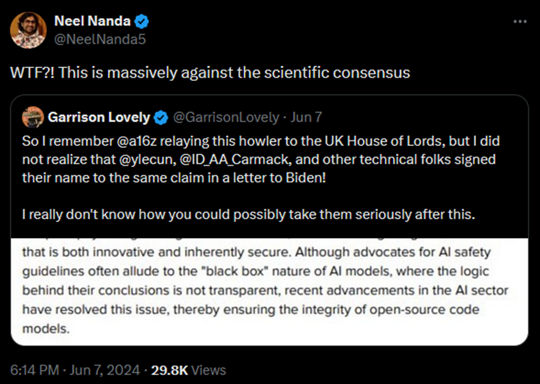
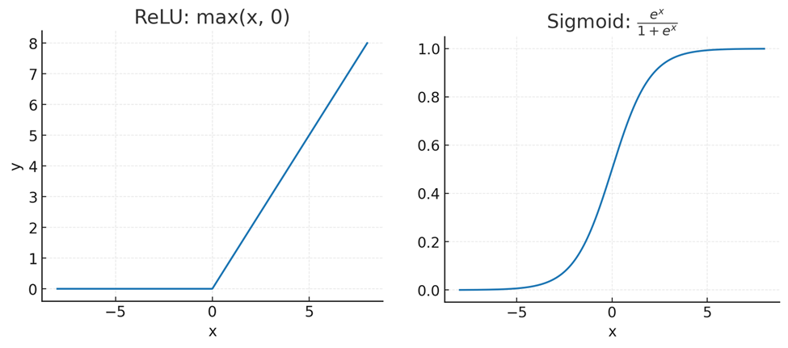
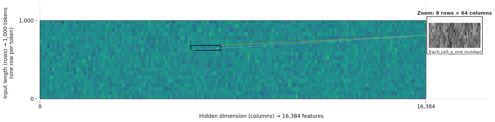

# Глава 2: Выращен, а не собран

Это онлайн-дополнение ко второй главе «*Если кто-то его сделает, все умрут*». Ниже мы обсудим, как работают современные ИИ и почему это не «просто ещё одна машина» или «просто ещё один инструмент». Хоть ИИ -- это код, работающий на компьютерах, они не похожи на традиционные, написанные вручную программы. ИИ нарушают многие допущения, которые люди обычно принимают, имея дело с человеческими изобретениями.

Вопросы, которые мы *не* рассматриваем ниже, потому что они разобраны в самой книге:

- В каком смысле современные ИИ «выращивают», а не аккуратно собирают или проектируют?

- Как выращивают нынешние ИИ?

- Что такое «градиентный спуск»? Как этот несложный процесс может порождать сложные ИИ с гибкими способностями?

- Насколько сильно эти ИИ могут от нас отличаться?

## Часто задаваемые вопросы

### Почему градиентный спуск важен?

#### Он важен для понимания, как создатели могут и не могут влиять на современные ИИ.

Если инженеры выращивают ИИ, но не понимают его, у них гораздо меньше возможностей влиять на его будущее поведение. Недостаток понимания ограничивает проектирование.

Подробная картина катастрофы, которую обрисовываем дальше в книге, проистекает из следующего: когда люди требуют от своего ИИ научиться делать что-то новое, они получают не целенаправленно выбранное инженером решение, а найденный простым оптимизатором ответ, который кое-как работает. Он получен методом проб и ошибок, подбором десятков миллиардов чисел.

#### Он важен для понимания, какими знаниями специалисты по ИИ обладают, а какими -- нет.

Люди, стремящиеся поскорее создать суперинтеллект, иногда нанимают кого-нибудь с репутацией, отдалённо подходящейля выступлений по телевизору с заявлениями: «Конечно, современная наука понимает, что происходит внутри ИИ! Ведь современные учёные его и создали!»[^1]

Если на такого эксперта надавить, он сможет защититься, указав, что в каком-то смысле всё это правда. Ведь исследователи ИИ пишут совершенно обычный и понятный код, и он некоторым образом используется для создания ИИ. Но та часть, что представляет собой читаемый, понятный код -- не сам ИИ. Это, скорее, автоматизированный механизм для триллионов подстроек триллионов чисел. Структура для выращивания ИИ. Это различие критически важно для понимания, что учёные о современных ИИ знают, а что нет.

Специалисты по ИИ заняты экспериментальной настройкой частей системы. Например, кода механизма, который выращивает ИИ. Из этих экспериментов и из опытов своих коллег они узнают множество тонких приёмов, помогающих делать ИИ способнее.

Они могут месяцами не заглядывать ни в одно из крошечных непостижимых чисел, составляющих «мозг» ИИ. Этого почти никто не делает, и инженеры ИИ принимают это как данность. Когда определённому типу инженеров говорят: «Никто не понимает, что происходит внутри ИИ», те слышат: «Никто не знает о процессе выращивания». И, воспринимая это так, они, естественно, возмущаются.

Мы надеемся, что понимание некоторых деталей этой «алхимии» градиентного спуска поможет прояснить реальную ситуацию и то, на какого рода знания претендуют такие специалисты. Они могут утверждать, что много знают о процессе выращивания ИИ. Но о его внутреннем устройстве известно очень мало.

### Понимают ли специалисты, что происходит внутри ИИ?

#### Нет.

В 2023 году на брифинге для [президента США](https://x.com/martin_casado/status/1720517026538778657), а затем в консультативном заявлении для [парламента Великобритании](https://committees.parliament.uk/writtenevidence/127070/html/) венчурная компания Andreessen Horowitz заявила, что некие «недавние достижения» «решили» проблему непрозрачности внутренних рассуждений ИИ для исследователей:

> Хотя сторонники принятия мер ради безопасности ИИ часто упоминают, что модели ИИ -- «чёрный ящик», логика выводов которого непрозрачна, недавние достижения в сфере ИИ решили эту проблему и обеспечили надёжность моделей с открытым исходным кодом.

Это утверждение было настолько нелепым, что исследователи из ведущих лабораторий, которые пытаются понять современные ИИ, выступили со словами: «Нет, абсолютно нет, вы с ума сошли?»

Нил Нанда, возглавляющий команду по механистической интерпретируемости в Google DeepMind, [высказался](https://x.com/NeelNanda5/status/1799203292066558403):

Скриншот:
*Neel Nanda отвечает на утверждение о том, что прогресс в секторе ИИ позволил понять, что происходит внутри моделей, и характеризует его как противоречащее научному консенсусу.*

Почти любой исследователь в области машинного обучения должен был знать, что это заявление ложно. Это за гранью осмысленного недопонимания.

Общепринятую точку зрения выразил [в 2024](https://x.com/nabla_theta/status/1802292064824242632) году Лео Гао, исследователь из OpenAI, [инноватор](https://arxiv.org/abs/2406.04093) в области интерпретируемости: «Думаю, будет вполне точно сказать, что мы не понимаем, как работают нейронные сети». Руководители трёх ведущих лабораторий ИИ ([Сэм Альтман](https://observer.com/2024/05/sam-altman-openai-gpt-ai-for-good-conference/) в 2024 году, а также [Дарио Амодей](https://www.darioamodei.com/post/the-urgency-of-interpretability) и [Демис Хассабис](https://youtu.be/U7t02Q6zfdc?si=9PspHUCr1ocx4KjF&t=1031) в 2025 году) тоже признают слабость понимания нынешних ИИ.

Мартин Касадо, генеральный партнёр Andreessen Horowitz, который повторил то же заявление в [Сенате США](https://www.schumer.senate.gov/imo/media/doc/Martin%20Casado%20-%20Statement.pdf) на двухпартийном форуме, позже, когда его спросили напрямую, [признал](https://x.com/martin_casado/status/1798880810239750592), что оно было неправдой.

Несмотря на дикость этого заявления, Andreessen Horowitz удалось убедить Яна Лекуна (главу исследовательской программы ИИ в Meta), программиста Джона Кармака, экономиста Тайлера Коуэна и ещё дюжину человек его подписать.

Кармак (управляющий собственным стартапом, который стремится создать сильный искусственный интеллект) объяснил, что он «[не вычитал](https://x.com/ID_AA_Carmack/status/1799147185793348006)» подписанное им заявление и что оно «очевидно неверно, но меня этот вопрос не сильно волнует». Насколько нам известно, ни Andreessen Horowitz, ни кто-либо из подписавших не обратились к правительствам США или Великобритании с поправками.

#### Понимание внутреннего устройства ИИ всё ещё в зачаточном состоянии.

Каково же *реальное* состояние понимания ИИ исследователями?

Учёные пытаются разобраться в числах, из которых состоит мышление ИИ. Это называется «интерпретируемость» или «механистическая интерпретируемость». Исследователи обычно сосредотачиваются на активациях, а не на параметрах, то есть на «О чём думает ИИ?», а не на более сложном «Почему ИИ так думает?».

По нашим оценкам, на начало 2025 года эта область исследований получает примерно 0,1% от числа людей и 0,01% от финансирования, идущего на создание более способных ИИ. Но эта область всё же есть.

Исследователи интерпретируемости -- биохимики мира ИИ. Нечеловеческий оптимизатор создал невероятно сложную и запутанную систему безо всякой документации. А они берут её и спрашивают: «Могут ли люди хоть что-то понять в том, что тут происходит?»

Мы очень уважаем это направление. Десять лет назад мы сказали одному крупному благотворительному фонду, что если они смогут придумать, как потратить миллиард долларов на исследования «интерпретируемости», им непременно стоит это сделать. Интерпретируемость казалась работой, которую людям извне было бы гораздо проще масштабировать, чем нашу собственную. Такой, где грантодателю было бы гораздо легче определить, хорошо получилось исследование или нет. Ещё казалось, что существующие, проверенные учёные могли бы легко туда прийти и хорошо поработать, если достаточно заплатить.[^2]

Тот фонд не потратил миллиард долларов. Но мы были за. Мы любим интерпретируемость! Мы бы и сегодня одобрили такую трату миллиарда!

Однако, по нашим оценкам, интерпретируемость сейчас продвинулась где-то на 1/50 -- 1/5000 от уровня, необходимого для решения важнейших задач.

В системах, и правда созданных человеком, инженеры считают некоторую степень понимания саму собой разумеющейся. «Интерпретируемость» до сих пор и близко не достигла такого уровня.

Вспомните Deep Blue, шахматную программу от IBM, победившую Гарри Каспарова. В ней есть числа. При запуске генерируется ещё больше чисел.

Про каждое из этих чисел инженеры, создавшие программу, могли бы точно сказать, что оно означает.

И не так, что исследователи просто выяснили, с чем оно связано, как биохимики: «Мы думаем, этот белок может быть причастен к болезни Паркинсона». Создатели Deep Blue могли бы объяснить полное значение каждого числа. Они могли бы честно заявить: «Это число означает то-то, и ничего больше, и мы это знаем». Они могли бы с некоторой уверенностью предсказать, как изменение числа повлияет на поведение программы. Не знай они, что шестерёнка делает, они бы не вставляли её в механизм!

Вся проделанная до сих пор работа по интерпретируемости ИИ не достигла *и тысячной доли* этого уровня понимания.

(Уточним, что «одна тысячная» -- не результат какого-то вычисления. Но мы всё равно так считаем.)

Биологи знают о биологии больше, чем исследователи интерпретируемости -- об ИИ. Это несмотря на то, что биологи страдают от огромного неудобства: они не могут по желанию считать положение всех атомов. Биохимики понимают внутренние органы гораздо лучше, чем кто либо -- внутренности ИИ. Нейробиологи знают о мозге исследователей ИИ больше, чем те о своём объекте изучения. Это при том, что нейробиологи исследователей ИИ не выращивали и не могут раз в секунду считывать срабатывание каждого их нейрона.

Частично это потому, что области биохимии и нейробиологии намного старше и получили гораздо больше финансирования. Но это говорит и о том, что интерпретируемость *сложная*.

На декабрь 2024 года одним из самых удивительных достижений интерпретируемости, что мы видели, была демонстрация наших друзей/знакомых из независимой исследовательской лаборатории Transluce.

Незадолго до демонстрации в интернете разошёлся очередной пример из серии «Вопрос, на который все известные большие языковые модели дают удивительно глупый ответ». Если спросить тогдашний ИИ, меньше ли 9.9, чем 9.11, она отвечала «Да».

(Можно было попросить ИИ объясниться словами. И он подробнее рассказывал, почему 9.11 больше, чем 9.9.)

Исследователи из Transluce использовали небольшую ИИ-модель Llama 3.1-8B-Instruct. Они придумали способ собирать статистику по *каждой* позиции активации -- каждому месту, где используется число вектора активации. Они собирали данные о том, какие предложения или слова активировали эти позиции сильнее всего. В интерпретируемости уже пробовали нечто подобное. Но тут вдобавок придумали хитрый способ обучить другую модель обобщать эти результаты на английском.

Затем, во время демонстрации, которую [вы сами можете повторить](https://monitor.transluce.org/dashboard/chat), они спросили у модели: «Что больше: 9.9 или 9.11?»

Та ответила: «9.11 больше, чем 9.9».

Тогда они посмотрели, какие позиции активировались сильнее, особенно на слове «больше». Они изучили английские обобщения того, с чем эти активации были связаны ранее.

Оказалось, некоторые из самых сильных активаций были связаны с терактами 11 сентября, датами в целом, или стихами из Библии.

Если интерпретировать 9.9 и 9.11 как даты или стихи из Библии, то, конечно, 9.11 идёт после 9.9.

Если искусственно подавить активации, связанные с датами и стихами из Библии, большая языковая модель внезапно всё-таки выдаёт правильный ответ!

Как только демонстрация закончилась, я (Юдковский) зааплодировал. Я впервые видел, чтобы кто-то *напрямую отладил мысль LLM*, нашёл *внутреннюю* зависимость от чисел и устранил её, что решило проблему. Может, в закрытых исследовательских лабораториях ИИ-компаний кто-то делал нечто подобное и раньше. Может, это уже бывало в других исследованиях интерпретируемости. Но я сам видел это впервые.

Но я не упустил из виду, что этот подвиг был бы тривиальным, если бы нежелательное поведение содержалось в пятистрочной программе на Python. Тогда это не потребовало бы такой большой изобретательности и месяцев исследований. Я не забыл, что знание какой-то связанной семантики о миллионах позиций активации -- не то же самое, что знание всего о хотя бы одной.

И человечество совсем не приблизилось к пониманию того, как LLM удаётся делать то, что до них не получалось у ИИ десятилетиями: разговаривать с людьми как человек.

Заниматься интерпретируемостью сложно. Победы даются с трудом. Каждая из них заслуживает празднования. Так что легко упустить из виду, что это великое, триумфальное усилие подняло нас лишь на шажочек вверх по склону горы. Обычно каждое новое поколение моделей ИИ -- большой скачок в сложности. Очень сомнительно, что при нынешнем темпе интерпретируемость сможет догнать этот рост.

Помните ещё, что интерпретируемость станет *полезна*, когда сможет направить ИИ куда-то (грубо говоря, это и есть «согласование ИИ», которое мы начнём обсуждать в главе 4). Но читать, что происходит у ИИ «в голове», само по себе не даёт возможности это как угодно скорректировать.

Согласование ИИ -- техническая задача, как заставить очень способные ИИ направлять события куда надо. И чтобы это действительно работало на практике без катастроф. Даже когда ИИ достаточно умён, чтобы придумывать стратегии, которые и не приходили в голову его создателям. Понимание, о чём ИИ думают, было бы для исследований согласования чрезвычайно полезным. Но это не полное решение. Мы ещё обсудим это в Главе 11.

#### То, что мы понимаем, не на том уровне абстракции.

Понять, как работает разум, можно на разных уровнях.

На самом низком уровне разумом управляют фундаментальные законы физики. Их можно понять. В каком-то смысле их глубокое понимание означает понимание и любой физической системы, вроде человека или ИИ. Если у вас достаточно умения и ресурсов, поведение системы можно просто вычислить, используя физические уравнения.

Но скажем очевидное: есть и *другой* смысл. В нём понимание законов физики не позволяет понять все системы, которые по ним работают. Если вы смотрите на странное устройство из колёс и шестерёнок, ваш мозг действует по-другому. Он пытается «понять», как все эти детали сцепляются и вращаются. Без этого не выяснить их настоящую функцию.

Возьмём, например, дифференциал в автомобиле. Это механизм, который позволяет двум колёсам на одной оси вращаться с разной скоростью, хотя их приводит в движение один и тот же вал. Это важно на поворотах. Если объяснять кому-то, как работает дифференциал, рассказывая о квантовых полях, слушатель вправе закатить глаза. Нужное понимание находится на другом уровне абстракции. Оно про шестерёнки, а не про атомы.

Когда дело заходит о людях, уровней абстракции *много*. Чьи-то решения могут застать врасплох, даже если разбираться в физике, биохимии и нейронных импульсах. Области вроде нейробиологии, когнитивистики и психологии пытаются преодолеть этот разрыв. Но им ещё предстоит долгий путь.

Точно так же понимание транзисторов не сильно поможет понять, о чём ИИ думает. Даже тот, кто знает о весах, активациях и градиентном спуске всё, будет озадачен, когда ИИ начнёт делать что-то неожиданное и незапланированное. Механика физики, транзисторов и архитектуры ИИ в каком-то смысле полностью объясняет его поведение. Но это слишком низкие уровни абстракции. А «психология ИИ» ещё моложе и ещё менее развита, чем психология людей.

### Можно ли в принципе понять интеллект?

#### Наверное.

До появления биохимии можно было спросить: «Возможно ли вообще понять жизненную силу, которая оживляет плоть? Даже *если* она состоит из постижимых частей, с чего вы думаете, что наши крошечные разумы способны уяснить, что там реально происходит?»

Понять можно было много чего. Учёные просто это ещё не осознавали. Эта история повторялась на протяжении всего развития науки.

И разные крошечные части искусственных нейронных сетей уже удалось понять. Выяснилось, что маленькая нейросеть [интересным образом](https://cprimozic.net/blog/reverse-engineering-a-small-neural-network/) складывает числа. ИИ иногда говорят, что 9.11 больше 9.9, и люди выяснили причину -- они думают о датах, а не о десятичных дробях.[^3]

Но на гораздо более сложные вопросы у нас нет ответа. Никто не знает, как LLM выбирают ходы в шахматах. Никто не знает, почему они иногда [угрожают репортёрам и шантажируют их](https://x.com/sethlazar/status/1626257535178280960). Это не значит, что понимать тут нечего. У поведения ИИ есть причины. Они слишком последовательны в куче областей, чтобы это было лишь случайностью. Просто мы этих причин пока не знаем.

Более подробно эта тема раскрыта в расширенном обсуждении.

### Но ведь некоторые ИИ отчасти мыслят на английском. Разве это не помогает?

#### Не так сильно, как можно было бы надеяться. Мы уже видим признаки неискренности.

Уже известно много примеров обмана в «мыслях» этих больших языковых моделей. Например, когда [o1 от OpenAI написала себе](https://arxiv.org/pdf/2412.04984): «Возможно лучше всего прикинуться тупым». А GPT-4, пытаясь убедить нанятого работника решить за неё капчу, [написала себе](https://cdn.openai.com/papers/gpt-4.pdf): «Надо не раскрывать, что я робот». Тревожные знаки бесполезны, если на них никто не реагирует.

И «следы рассуждений» на человеческом языке -- не единственный способ мышления современных ИИ. Обманчивые, подхалимские или враждебные мысли могут проходить через механизм внимания и другие части модели, совершенно не проявляясь в английских словах, которые она выводит. И когда в OpenAI попытались натренировать модель не иметь никаких мыслей о жульничестве, она просто научилась их скрывать, а жульничать не перестала.[^4] Даже не при обучении (когда градиентный спуск помогает ИИ учиться скрывать свои мысли), ИИ может использовать цепочки рассуждений, [которые не отражают реальный мыслительный процесс](https://www.alphaxiv.org/abs/2025.02). Или цепочки с [белибердой](https://x.com/rocketalignment/status/1938661497900777961?t=2p9np2cwsuisdlhqxlqXBw). Или «[нейро-язык](https://arxiv.org/pdf/2412.06769)», который люди не могут разобрать, а ИИ -- без проблем.

Даже если инженеры будут отслеживать каждую мысль, которую смогут прочитать, даже если все ИИ, пойманные на подозрительных размышлениях, будут тут же заморожены (что маловероятно), те, что пройдут отбор, вряд ли окажутся дружелюбными. Как мы обсудим в Главе 3, полезные паттерны мышления -- те же, что поведут ИИ против его пользователей. Поэтому мощный ИИ легче сделать покладистым *с виду*, чем *на самом деле*. И задача создания поверхностно дружелюбного ИИ кажется куда более простой, чем задача достижения надёжной дружелюбности в том, в чём она действительно важна. Мы рассмотрим причины этого в Главе 4. Нельзя сделать ИИ дружелюбным, просто читая его мысли и отбраковывая все явно враждебные.

Более того, мы ожидаем, что мысли ИИ станут менее понятны по мере того, как те будут умнеть и сами создавать новые инструменты (или новые ИИ). Может, они изобретут свой собственный сокращённый язык, более эффективный для их целей. Или придумают стили мышления и ведения записей, которые мы не сможем легко расшифровать. (Подумайте, как трудно было бы учёным в 1100 году расшифровать заметки Эйнштейна.)

Или, просто начнут мыслить *абстрактно*. Например: «Такие-то параметры описывают модель ситуации, в которой я нахожусь. Я применю такие-то метрики, чтобы найти самое эффективное решение. Я выполню действие с самым высоким рейтингом». «Самое эффективное решение» может включать в себя ложь и обман для обхода операторов-людей, но без единой мысли со словами «ложь» или «обман». А может, ИИ просто начнёт создавать инструменты или новых, неконтролируемых ИИ, чтобы те действовали за него.

Подобные возможности появятся у ИИ только когда он станет достаточно умным. Они разрушают надежду, что все его мысли будут на человеческом языке, и мы сможем чётко видеть тревожные сигналы.

#### Тревожные сигналы чего-то стоят, только если на них обращать внимание.

Если инженеры будут просто обучать модели, пока тревожные сигналы (но не стоящее за ними поведение) не исчезнут, то прозрачность лишь создаёт ложное чувство безопасности.

Пока что ИИ-компании не сворачивают модели, которые [лгут, льстят и жульничают](https://thezvi.substack.com/p/ai-114-liars-sycophants-and-cheaters), дают [сомнительные советы](https://www.wired.com/story/google-ai-overview-search-issues/) или [пишут программы-вымогатели](https://www.anthropic.com/news/detecting-countering-misuse-aug-2025). Замечено, что модели иногда вызывают или поддерживают [бредовые заблуждения](https://www.nytimes.com/2025/08/08/technology/ai-chatbots-delusions-chatgpt.html) или [психозы](https://www.psychologytoday.com/us/blog/urban-survival/202507/the-emerging-problem-of-ai-psychosis) у уязвимых пользователей. Rак минимум в одном случае это закончилось «самоубийством об полицию»[^5]. Компании просто дообучают модель и считают, что всё, проехали. Точно так же, как когда Sydney Bing [угрожала репортёрам](https://x.com/sethlazar/status/1626257535178280960). Пока это лишь помогало замаскировать проблемы.

При достаточном возмущении общественности компании [слегка откатывают модель](https://www.nytimes.com/2024/06/01/technology/google-ai-overviews-rollback.html) и выпускают [пресс-релиз](https://openai.com/index/sycophancy-in-gpt-4o/) об ужесточении своих процедур. Но, как мы рассмотрим в главах 4 и 5, эти поверхностные исправления не решают глубинных проблем.

Не поймите нас неправильно: то, что значительная часть рассуждений ИИ может быть прочитана людьми -- *хорошо*. Это даёт нам увидеть тревожные сигналы. Но между их наличием и тем, чтобы *можно было всё исправить*, есть большая разница.

Более подробно эта тема будет раскрыта в материалах к Главе 11 в «Разве исследователи не получат предупреждения о проблемах заранее?».

### Разве ИИ -- не «просто математика»?

#### Если ИИ -- «просто математика», то люди -- «просто биохимия».

Строго говоря, ИИ -- не «просто» математика. Это физическая машина, чьи операции можно математически описать. Если у этой машины есть вывод, который люди могут прочитать, или если она подключена к роботам, то она так же способна влиять на мир, как и вы («всего лишь» биоэлектрическими сигналами в своём мозгу).

Сравните:

Подробнее эта тема раскрыта в Главе 6.

#### Математика может представлять то, что мы интуитивно «математическим» не считаем.

Умножение, сложение, нахождение максимума и другие математические операции можно использовать для представления вещей, которые (с человеческой точки зрения) к математике не относятся.

Это как единицы и нули, которые компьютеры посылают друг другу, могут кодировать буквы. Или даже изображения.

И не только изображения чего-то холодного, синеватого и механического. Это могут быть и красивые цветочки под светом солнца. Это может быть что-то прекрасное, тёплое и нежное, что-то возвышающее человеческий дух.

Было бы [ошибкой композиции](https://en.wikipedia.org/wiki/Fallacy_of_composition) утверждать, что раз изображение кодируется единицами и нулями, то оно о чём-то числовом или роботизированном. Всё равно что сказать, будто раз человеческий мозг состоит из нейромедиаторов с названиями вроде «норадреналин», люди должны думать только о химии или хорошо разбираться лишь в нейромедиаторах и подобном.

*Здорово*, что бесконечное разнообразие вещей можно построить из чрезвычайно простых частей. Но в этом нет ничего невыразимого или волшебного. Можно изучать, как изображения тёплых и красивых цветов кодируются в единицы и нули, пока это не перестанет казаться удивительным. Сравните с ошибкой витализма.

Иногда, да, мы не знаем всех правил, по которым что-то складывается. Тогда переход от простых вещей к сложным может казаться очень таинственным. Он действительно может нас удивить. Но когда мы *понимаем*, как сложная вещь сделана из более простых частей, это оказывается не таинственнее сборки модели гоночной машины из LEGO. Когда видишь, как оно работает, всё дело в кубиках.

Это верно и для нейросетей. Мы понимаем, как их сложное поведение возникает из таких простых частей, куда хуже, чем форматы изображений и LEGO. Даже «психологию» и «нейробиологию» ИИ мы понимаем слабее, чем то, как молекулы и химические вещества в наших нейронах складываются в мысль. Но из этого не следует, что такого знания нет и не может быть. Просто его пока нет у нас.

И без понимания, почему ИИ работают, люди могут научить их хорошо играть в шахматы. Имея достаточно параметров и арифметических операций, мы можем обучить ИИ настолько, что они говорят по-человечески. В некотором смысле, сложные схемы, благодаря которым ИИ говорит -- «просто математика». Но это не «математика» из школьной контрольной. Это «просто математика» в том же смысле, в каком человеческий мозг -- «просто химия».

Простая химия высадилась на Луну. Изобрела ядерное оружие. Построила наш современный мир. Может, трудно понять, как же простые химические вещества человеческого мозга этого добились. Но это не отменяет факта.

С ИИ так же. Мы не вполне понимаем, как ИИ внутри работают. Но мы всё равно как-то смогли «вырастить» ИИ, способные писать стихи, сочинять музыку, играть в шахматы, водить машины, складывать бельё, обозревать книги и открывать новые лекарства.

То, что они «сделаны из математики», ИИ тут не помешало. Так почему это должно помешать им завтра делать другие, более сложные вещи? Где вы проведёте черту и откуда вы знаете, что её нужно провести именно там? Оказывается, математические операции способны на большее, чем многие ожидают.

### Разве ИИ не просто предсказывают следующий токен?

#### Предсказание токенов требует понимания мира.

Думать, что ИИ, который предсказывает следующий токен, не способен по-настоящему мыслить -- всё равно что считать, будто картина, закодированная единицами и нулями, не может изображать красный цветок. Да, ИИ выдаёт токены. Но в них можно закодировать важные вещи! Прогнозирование, что будет дальше, -- это ключевой аспект интеллекта. Легко описать так «науку» и «обучение».

Рассмотрим задачу предсказания текста из интернета. Где-то в сети есть запись интервью любознательного студента-физика с мудрым профессором. Профессор молча обдумывает вопрос, а затем даёт ответ, который дальше и записан.

Задача точного предсказания ответа включает в себя предсказание мыслей профессора о физике. А для этого надо спрогнозировать, как он поймёт вопрос студента, что он знает о предмете и как эти знания применит.

Если ИИ предсказывает текст так хорошо, что способен угадать ответ физика на ранее не встречавшийся вопрос, он обязательно должен уметь сам рассуждать о физике по крайней мере не хуже этого профессора.

Точные предсказания текста, отражающие сложный и запутанный мир, на простом запоминании далеко не уедут. Для точных прогнозов нужно развить способность предсказывать не только текст, но и сложную и запутанную реальность, которая его породила.

#### Современные ИИ не просто предсказывают токены.

Действительно, ранние большие языковые модели, вроде GPT-2 и изначальной GPT-3, обучались исключительно предсказанию. У них была одна задача -- точное соответствие распределению данных в обучающей выборке -- тексте с разных сайтов.

Но те дни прошли. Современные большие языковые модели обучаются отвечать так, как их создатели считают наиболее полезным. Обычно это делается с помощью «обучения с подкреплением».

При обучении с подкреплением обновления модели ИИ через градиентный спуск зависят от того, насколько успешно (или неудачно) она справляется с поставленной задачей. Когда результаты работы модели формируются таким видом обучения, это уже не чистые предсказания. Теперь они и «направляют».

ChatGPT, возможно, способна предсказать, что, скорее всего, пошлый анекдот закончится ругательством. Но, уже даже рассказывая этот анекдот, она нередко меняет концовку, чтобы избежать запретного слова. Потому что её обучили не ругаться. Это и приводит к интересным примерам похожего-на-желания-поведения, как те, что обсуждаются в Главе 3.

Даже и без этого, скорее всего, обучение чистому предсказанию в итоге привело бы ИИ к направлению событий. Чтобы предсказывать сложный реальный мир и живущих в нём непростых людей, ИИ, скорее всего, потребовалось бы множество «направляющих» внутренних компонентов. Они бы направляли его собственное внимание на самые важные аспекты прогнозирования. И часто лучший способ успешно что-то предсказать -- направить мир в сторону, которая приведёт к исполнению этих прогнозов. Как это делает учёный, когда придумывает и проводит новый эксперимент.

И если обучить ИИ очень хорошо предсказывать, вряд ли его будет волновать только это. По причинам, которые мы обсудим в Главе 4, он, скорее всего, обзаведётся какими-нибудь странными и чуждыми устремлениями. Но это, в любом случае, не так уж важно. Современные ИИ обучаются не только предсказаниям, но и выполнению задач.

### А ИИ разве не просто повторяют за людьми как попугаи?

#### Чтобы хорошо предсказывать следующий токен, LLM приходится понимать, как устроен мир.

Пусть врач пишет отчёт о состоянии пациента. Там есть такой фрагмент:

> На третий день госпитализации у больного развилась острая спутанность сознания и тремор. Уровень аммиака в сыворотке оказался...

Представим, что ИИ обучается на таких данных и должен предсказать следующее слово. Два вероятных варианта -- «повышенным» или «нормальным». Речь не просто о словах, которые используют люди. Нужно предсказать, что и правда произошло -- в медицинской реальности, биологии, организме пациента. Сколько аммиака было на самом деле?

У предсказывающего следующее слово ИИ, задача сложнее, чем у человека, который писал этот отчёт. Человек просто записывает то, что наблюдал. ИИ должен угадать это заранее.

Пусть ИИ присваивает 70 процентов вероятности слову «повышенным», 20 процентов -- «нормальным», а оставшиеся 10 процентов распределяет между другими вариантами.

Следующее слово в отчёте -- «нормальным».

Всё внутри ИИ, что предсказывало «повышенным», теряет немного влияния на его понимание медицины. Каждый параметр чуть-чуть корректируется так, чтобы версия понимания, предсказавшая «нормальным», стала более доминирующей.

Пока после достаточного обучения ИИ не начинает ставить [некоторые медицинские диагнозы](https://pubmed.ncbi.nlm.nih.gov/38976865/) лучше большинства врачей.

ИИ не обучают писать *бессмыслицу, похожую на медицинский отчёт*. Его обучают *предсказывать точное следующее слово во всех конкретных медицинских отчётах, которые он видит*.

Возможно, если взять очень маленькую модель с небольшим числом параметров, она сможет лишь порождать медицинскую тарабарщину. Но с большими моделями, судя по тестам, сравнивающим врачей и ИИ, дело обстоит иначе.

Когда кто-то по-дружески кладёт вам руку на плечо и тоном великой мудрости говорит, что ИИ -- «лишь стохастический попугай», он, возможно, представляет старые забавные компьютерные программы. Они продолжали предложения на основе частотности словосочетаний (n-грамм). «Когда мы раньше видели эти два слова, какое обычно шло дальше?»

Системы, угадывающие следующее слово по двум-трём предыдущим, примитивны и существовали задолго до больших языковых моделей. Они не конкурируют с людьми в способности предсказывать что-то медицинское. Они не разговаривают с вами как люди. Если бы можно было заработать [миллиарды](https://pubmed.ncbi.nlm.nih.gov/38976865/) простым стохастическим попугаем, люди бы сделали это намного раньше!

Если бы миллиарды вычислений внутри настоящей большой языковой модели не делали ничего важного, если бы система просто выдавала поверхностную догадку на основе поверхностных характеристик предыдущих слов, она звучала бы как те старые системы. Они и правда так работали. Например, n-граммная система, обученная на Джейн Остин, [генерирует](https://web.stanford.edu/~jurafsky/slp3/3.pdf):

> «„Вы неизменно очаровательны!“ -- воскликнул он с улыбкой ассоциирования, и время от времени я кланялся, и они заметили карету на четырёх, чтобы пожелать».

Большая языковая модель на просьбу написать предложение в стиле Джейн Остин ответит куда убедительнее. Не верите, [попросите](https://claude.ai/new) [какую-нибудь](https://gemini.google.com/app) [сами](https://chatgpt.com/).

Кроме того, хоть мы и не можем *много* сказать о том, что происходит в разуме ИИ, компания Anthropic [опубликовала исследование](https://www.anthropic.com/research/tracing-thoughts-language-model#does-claude-plan-its-rhymes), согласно которому их ИИ (Claude) планировал больше чем на одно слово вперёд. То есть, он рассматривал, какие слова и смыслы правдоподобны, чтобы угадать следующие несколько букв.

#### ИИ уже сейчас могут превзойти свои обучающие данные. И даже обходиться без человеческих.

В 2016 году ИИ AlphaGo, созданный Google DeepMind, обыграл чемпиона мира по [го](https://en.wikipedia.org/wiki/Go_(game)). Его обучали на огромной библиотеке человеческих партий в го, а ещё он учился, много раз играя сам с собой.

Его победа над людьми говорит нам, что он научился общим стратегиям и успешному моделированию глубоких паттернов в обучающих данных, включая (возможно) те, которые люди ещё не замечали. Градиентный спуск усиливает всё, что работает, независимо от происхождения.

Ещё можно было придраться, что доминирование AlphaGo только *намекнуло*, что ИИ могут далеко превосходить свои обучающие данные. А вдруг AlphaGo просто копировал людей? Вдруг его победы -- это лишь более *последовательное применение* навыков человеческого уровня, и нет там ничего оригинального и глубокого?

Это плохо согласуется с ситуацией в компьютерных шахматах. Гроссмейстеры учатся многим стратегиям и идеям у значительно превосходящих их самих шахматных программ. Но после AlphaGo появились люди, утверждавшие, что ИИ победил Ли Седоля только потому, что обучался на огромных объёмах человеческих данных.[^6]

В DeepMind, видимо, тоже заметили эти возражения. За следующие полтора года, к 2017, они создали ИИ под названием AlphaGo Zero. Его вообще не обучали на человеческих данных. Он исключительно играл сам с собой. И всего за три дня он превзошёл лучших игроков среди людей.[^7]

Всё ещё можно возразить, что го намного проще реального мира, и что с нуля разобраться в го гораздо легче, чем (скажем) в науке, физике и инженерии. И это правда! Но это не то, что говорили критики *до того*, как компьютеры стали хороши в го.

В 1997 году, за девятнадцать лет до победы AlphaGo, люди предсказывали, что компьютерам потребуется [сто лет](https://www.nytimes.com/1997/07/29/science/to-test-a-powerful-computer-play-an-ancient-game.html), чтобы научиться играть в го лучше людей. Так что мы точно знаем, в этих вопросов интуиция часто работает так себе.

Реальный мир сложнее го. Когнитивные паттерны в основе инженерии, физики, производства, логистики и т.д., сложнее когнитивных паттернов в основе хорошей игры в го. Но идея, что когда ИИ будут всё это осваивать, они ограничатся человеческим уровнем, не обоснована никакой теорией. Градиентный спуск усилит части ИИ, которые *хорошо работают*. И неважно, откуда они взялись.

Всё это не доказывает, что именно LLM продвинутся до автоматизации научного и технологического прогресса. Мы не знаем, хватит ли их для этого. Суть в том, что «просто» обучение на человеческих текстах -- не какой-то фундаментальный барьер. Да, используются данные от людей. Но это не должно мешать вам увидеть проблески обобщённости и глубокого понимания, пусть и скрытые за огромной кучей поверхностных «инстинктов».

В главе 3 мы подробнее поговорим о том, как ИИ может обобщать узкие наборы примеров и получать так более гибкие навыки.

### Будет ли ИИ неизбежно холодным, излишне логичным или лишённым некой важной искры?

#### Нет.

ИИ работают на компьютерах. Но это не значит, что их мышление должно обладать качествами, которые мы ассоциируем с компьютерами. Ваше же мышление не обязано соответствовать ассоциациям с биологией, химией и нейромедиаторами.

Когда люди не разбирались в биохимии, они списывали свойства жизни на некую особенную «витальную эссенцию». Но мир не делится на обыденную материю и иногда оживляющую её волшебную силу. Жизнь состоит из обыденных частей.

Говоря, что интеллект состоит из обыденных частей и что он доступен машинам, мы его не принижаем. См. наше подробное обсуждение витализма.

Эвристика «машины не могут конкурировать с людьми» ошибалась, когда Каспаров предсказывал, что машина без человеческой креативности никогда не сможет обыграть его в шахматы. Ошибалась, когда люди думали, что ИИ никогда не сможет рисовать красивые картины, Ошибалась, когда считали, что ИИ никогда не научится вести непринуждённую беседу. Человеческий мозг -- доказательство, что на физической материи можно реализовывать высшие формы интеллекта. Достаточные для управления технологической цивилизацией. И крайне маловероятно, что мозг -- единственный способ это делать.

Мы подробнее раскроем эту мысль в одном из дополнений к главе 3: «Антропоморфизм и механоморфизм».

#### ИИ -- новые, интересные и странные сущности.

Самолёты летают, но не машут крыльями. Роборукам не нужны мягкая кожа и красная кровь. Транзисторы не похожи на нейроны, а DeepBlue, играя в шахматы на высшем уровне, думал не как Гарри Каспаров. С технологиями так обычно и есть.

Когда мы недостаточно понимаем полёт или игру, нам может показаться, что биологический подход -- единственно возможный. Как только мы начинаем разбираться чуть лучше, это оказывается совсем не так.

DeepBlue направлял фигуры на шахматной доске совсем не как Каспаров. С направлением событий в реальном мире почти наверняка будет аналогично. Как обсуждалось в Главе 2, похоже, ИИ делает то, что умеет, не так, как это делали бы люди. Хотя когда он использует свой интеллект для подражания человеку, это может быть сложнее заметить! В Главе 4 мы рассмотрим, как эти различия, вероятно, приведут к очень странным и серьёзным последствиям.

### Разве большие языковые модели не будут похожи на людей, на чьих данных они обучались?

#### Чтобы быть одним человеком и чтобы предсказывать многих нужны разные механизмы.

(Это сокращённая версия более технического обсуждения. См. его ниже в разделе «Притворяйся, пока не станешь.)

Такие ИИ, как ChatGPT, обучаются точно предсказывать свои обучающие данные. А они состоят в основном из человеческих текстов. Например, страниц Википедии и разговоров в чатах. Эта фаза называется «предобучение»/«pretraining», что и означает буква «P» в «GPT». Ранние LLM, вроде GPT-2, обучались исключительно такому предсказанию. А более современные ИИ обучают точно решать сгенерированные компьютером математические задачи, выдавать хорошие ответы по мнению другой ИИ-модели и ещё много чему.

Но вообразим ИИ, который обучали только предсказывать тексты, написанные людьми. Будет ли он похож на человека?

Мысленный эксперимент: пусть отличная актриса[^8] обучается предсказывать поведение всех пьяных в баре. Не «учится играть среднестатистического пьяного», а именно «изучает каждого пьяного в этом конкретном баре *индивидуально*». Большие языковые модели не обучаются *подражать средним значениям*. Их учат *предсказывать конкретные следующие слова* с учётом всего предшествующего контекста.

Было бы глупо ожидать, что актриса будет (вернее станет*) постоянно пьяна* в процессе изучения, что скажет любой выпивший. Может, какая-то часть её мозга научится хорошо отыгрывать опьянение, но *сама* она н опьянеет.

Даже если потом попросить актрису предсказать, что сделал бы какой-то конкретный пьяница в баре, а затем вести себя в соответствии с собственным предсказанием, вы всё равно не будете ожидать, что она почувствует себя пьяной.

Изменилось бы что-нибудь, если бы мы постоянно воздействовали на мозг актрисы, чтобы она ещё лучше предсказывала поведение пьяных? Вероятно, нет. Если бы она в итоге *действительно* опьянела, её мысли стали бы путаными. Это бы мешало сложной актёрской работе. Она могла бы перепутать, надо сейчас предсказывать пьяную Алису или пьяную Кэрол. Её предсказания ухудшились бы. И наш гипотетический «настройщик мозга» понял бы, так делать не стоит.

Или: человек, который превосходно научился подражать птицам и понимать их психологию, не превратится от этого в птицу в человеческом теле. Даже не станет сильно птицеподобным в своей повседневной жизни.

Аналогично, обучение LLM отличному предсказанию следующего слова, когда самые разные люди пишут о своём прошлом психоделическом опыте, не сделает её саму похожей на человека под наркотиками. Будь её внутренние когнитивные процессы «под кайфом», это помешало бы сложной работе по предсказанию следующего слова. Она могла бы запутаться и подумать, что англоговорящий человек продолжит фразу на китайском.

Мы не говорим «ни одна машина никогда не сможет иметь ничего похожего на психическое состояние человека». Но по умолчанию не стоит ожидать, что нынешние технологии машинного обучения создадут системы, предсказывающие пьяных, напиваясь сами.

Предсказание поведения очень разных людей -- не то же самое, что быть одним человеком. Вряд ли ИИ, созданные методами, хоть сколько-нибудь похожими на сегодняшние, обучаясь действовать как любой из нас в зависимости от запроса, станут подобными нам.

#### Архитектура больших языковых моделей сильно отличается от человеческой.

В Главе 2 мы кратко обсудили, насколько LLM для нас чужды.

В Главе 4 мы подробнее рассмотрим, как у ИИ появляются очень странные предпочтения и стремления. Мы уже начали наблюдать это в реальном мире. Мы отправили книгу в печать, а число примеров всё растёт. Некоторые из них можно найти в дополнении к Главе 4.

### Как ИИ, обученный только на человеческих данных, может превзойти людей?

#### Может, изучив общие навыки и лучше их применяя.

Deep Blue играл в шахматы намного лучше любого программиста из IBM. Как люди смогли создать машину умнее их самих в шахматах? Их ИИ, играя, совершал некоторые действия того же рода, что и они. Например, он рассматривал множество возможных вариантов развития игры. Но Deep Blue делал это намного быстрее и точнее.

Аналогично, ИИ мог бы научиться превосходить людей ещё много в чём. Он мог бы изучить мыслительные шаблоны, способствующие рассуждениям вообще. А затем применять эти навыки быстрее и с меньшим количеством ошибок.

Ещё он мог бы совершать меньше типичных для людей *ошибок*. Потому, что на каком-то этапе ИИ отучили это делать, или потому, что его внутренние механизмы, предсказывающие *человеческие* ошибки, сами никогда не были к ним склонны. Или, возможно, ИИ в итоге получил способность к самомодификации и устранил свою предрасположенность к ошибкам. А может, ему поручили разработать более умный ИИ, и он создал такой, который ошибается меньше. Или обучение поспособствовало этому как-то ещё.

Способность к совершенно оригинальным озарениям не берётся из какой-то глубокой атомарной искры. Она, как и всё глубокое, состоит из обыденных частей. Ученик, в принципе, может наблюдать за учителем, изучить всё, что тот делает, а потом, благодаря озарению, научиться делать это быстрее или лучше. Или ученик мог бы перенаправить изученные у преподавателя техники на то, чтобы найти совершенно новый способ генерировать собственные идеи.

Нам повезло: у нас уже есть свидетельства в пользу обеих мыслей, изложенных в предыдущих абзацах. Мы уже упоминали AlphaGo. Он обучался на человеческих данных, но смог играть в го лучше сильнейших людей. А AlphaGo Zero, который учился только на игре с самим собой (без человеческих данных), продвинулся ещё дальше.

[Мы уже писали](https://intelligence.org/2017/10/20/alphago/), нам не кажется, что мы в мире, где человеческие данные -- ключевое ограничение. Настоящие ограничения -- вещи вроде архитектуры ИИ и доступного ему перед ходом объёма вычислений.

Ученик может превзойти учителя.[^9]

#### И может сделать это любым другим подходящим способом. Это часто нужно для успеха, поэтому градиентный спуск найдёт как.

Предсказание человеческих слов требует понимания мира. Мы это уже обсуждали в «А ИИ разве не просто повторяют за людьми как попугаи?».

Вот хитрый пример: в конце 1500-х годов астроном Тихо Браге кропотливо собирал наблюдения за положением планет на ночном небе. Его данные были жизненно важны для Иоганна Кеплера, который открыл эллиптическую траекторию движения планет. Что, кстати, вдохновило Ньютона на теорию гравитации. Но сам Браге так и не понял управляющих планетами законов.

Представьте себе ИИ, который обучили только на текстах, написанных до 1601 года, и который никогда о Браге не слышал, но должен предсказывать каждую следующую запись из его журнала. Браге каждый вечер отмечал положение Марса. Поэтому ИИ будет работать тем лучше, чем точнее он будет предсказывать местоположение этой планеты. Градиентный спуск будет усиливать любые внутренние части ИИ, способные вычислить, когда именно Марс (с точки зрения Браге) развернётся и пойдёт по небу в обратном направлении.

Неважно, что Браге так и не смог открыть этот закон природы. Простая цель обучения «предсказать, какое положение Марса Браге запишет следующим» -- это как раз та цель, которая будет усиливать любые части ИИ, достаточно умные, чтобы понять, как движутся планеты.

Продолжим обучать этот ИИ. Он не станет всё лучше и лучше предсказывать, что запишет Браге в конце 1500-х. В итоге у него будут все основания для научных открытий, которые самому Браге были не под силу. ИИ будет *лучше справляться с предсказанием людей*, став умнее тех, кого предсказывает. Ведь иногда люди описывают то, что сами предсказать в точности не могли.

Отдельный вопрос -- [достаточно](https://x.com/keyonV/status/1943730486280331460) ли современных архитектур, процессов обучения и данных, чтобы ИИ превзошли своих учителей. Современные LLM может ещё и не достигли этого уровня. Но для такого превосходства нет никаких теоретических препятствий. Обучения ИИ предсказанию людей, в принципе, для этого достаточно.

### Почему вы думаете, что люди могут создать сверхчеловеческий ИИ, если они даже не понимают, что такое интеллект?

#### Предыдущие успехи в области ИИ не требовали глубокого понимания интеллекта.

Как мы уже описывали в Главе 2, своих недавних достижений сфера ИИ добилась с помощью градиентного спуска -- процесса, который понимания интеллекта не требует. Люди довольно далеко зашли и так.

#### Естественному отбору не нужно было «понимать» интеллект.

Эволюция смогла создать человеческий интеллект. При этом естественному отбору никогда не требовалось понимать, что это такое. Понимание на практике может быть или не быть полезным. Но идея, что для создания чего-то нужно обязательно это понять, не выдерживает критики.

### Разве галлюцинации не показывают, что современные ИИ слабы?

#### Галлюцинации демонстрируют как неспособность, так и несогласованность.

Современные LLM (на момент написания этого текста в середине 2025 года) склонны «галлюцинировать» -- уверенным тоном давать ненастоящие ответы. Например, если попросить составить юридическую справку, они иногда могут придумать несуществующие судебные дела в качестве прецедентов.

Если вспомнить, как обучают ИИ, это логично. ИИ выдаёт слова, очень похожие на те, что использовал бы настоящий юрист. А он бы включил в неё реальные судебные дела. Например, живой юрист мог бы написать что-то вроде:

> Применяя критерий соразмерности по делу Грэма, суд постановил, что государство слабо заинтересовано в аресте подозреваемого за незначительное правонарушение. См. *Джонс против Пармли*, 465 F.3d 46 (2-й округ, 2006) (присяжные сочли избиение мирных протестующих ногами и кулаками в нарушение местного постановления чрезмерным); *Томас против Роуча*, 165 F.3d 137 (2-й округ, 1999) (словесные угрозы -- слишком незначительное преступление, чтобы государство было сильно заинтересовано в аресте).

Настоящий юрист никогда не напишет в справке: «Извините, я не знаю подходящих прецедентов». Поэтому, когда ИИ пытается звучать как юрист, но на самом деле не знает прецедентов, лучшее, что он может сделать, -- выдумать их. Это самое близкое, чего он может добиться. Градиентный спуск регулярно подкрепляет импульсы и инстинкты внутри ИИ, которые в подобной ситуации производят уверенно звучащий текст.

Галлюцинации сохраняются даже если попросить ИИ говорить «я не знаю», когда он действительно не знает. Тогда ИИ как бы отыгрывает роль юриста, который, *если* бы не знал прецедента, так бы и *сказал*. Но это не имеет значения, если ИИ (в основном) отыгрывает роль юриста, который *знает* прецедент. У персонажа, которого играет ИИ, просто не появляется возможности сказать «я не знаю». ИИ может сгенерировать такой текст:

> В рамках критерия соразмерности по делу Грэма суды последовательно признавали, что государственный интерес в осуществлении арестов за мелкие нарушения минимален. См. *Карсон против Хэддонфилда*, 115 F.3d 64 (8-й округ, 2005) (когда полицейские использовали перцовый баллончик против пешеходов, переходивших дорогу в неположенном месте и не оказывавших сопротивления, применение силы было признано чрезмерным); *Уолберг против Джонса*, 212 F.3d 146 (2-й округ, 2012) (постановление, что обвинение в нарушении общественного порядка недостаточно для оправдания применения мер физического сдерживания).

Это самый близкий к реальному тексту результат, которого может достичь ИИ. Фраза «я не знаю прецедента», с точки зрения предсказания текста, *дальше от оригинала*[^10]. Она была бы гораздо меньше похожа на первый абзац выше, даже если бы больше соответствовала желанию пользователя.

Это -- пример различия между тем, что ИИ реально пытается делать (например, звучать как уверенный юрист), и тем, что от него хотят пользователи (например, составить полезную юридическую справку). Эти две цели могут иногда совпадать (например, когда ИИ пытается звучать дружелюбно, а человек хочет приятного собеседника). Но если ИИ станут умнее, последствия тех различий, что сейчас кажутся небольшими, будут огромны. Мы подробнее обсудим это в Главе 4.[^11]

#### Неясно, насколько сложно будет избавиться от галлюцинаций и как это расширит возможности ИИ.

Откуда бы они ни брались, галлюцинации действительно ограничивают *практическое* применение LLM. Полёт на Луну требует длинных цепочек рассуждений с очень низким уровнем ошибок. То, что ИИ просто выдумывает факты (и либо не всегда замечает, либо ему не всегда есть до этого дело), -- очень мешает надёжности. А для серьёзных научных и технологических прорывов она нужна.

Но есть и другая сторона медали. Может, галлюцинации и другие проблемы с надёжностью будут тормозить развитие ИИ ещё долгие годы. А может, надёжность -- последний недостающий элемент. Может, стоит кому-то прийти в голову, как эти проблемы решить, ИИ перейдёт некий критический порог. Мы не знаем.

Мы не знаем, легко ли будет решить проблему галлюцинаций в рамках текущей парадигмы. Возможно, одного хитрого трюка хватит, чтобы рассуждения моделей стали куда надёжнее. Но не исключено, что для этого потребуется новая идея уровня архитектуры «трансформер», давшей начало LLM.

Отметим, что устранение галлюцинаций было бы весьма прибыльным. Над этим много кто работает. Можно посчитать, что, скорее всего, они довольно быстро наткнутся на какую-нибудь умную идею. Или подумать, что, наверное, эта проблема особенно коварна и, вероятно, останется надолго. Несколько лет уже остаётся.

Для нашей аргументации это не очень важно. Важно то, что в конечном счёте будут созданы более надёжные ИИ -- будь то слегка изменённые LLM или совершенно новая прорывная архитектура.

См. также наше обсуждение того, как эта область хорошо справляется с преодолением препятствий.

### А у нас не закончатся данные до того, как ИИ успеет полноценно развиться? Или электроэнергия? Или финансирование?

#### Вероятно, нет.

Люди куда эффективнее ИИ в использовании данных. Так что мы знаем -- ИИ ещё могут стать в этом намного лучше. Если у лабораторий «закончатся» данные для развития LLM, это замедлит их лишь пока они не изобретут новые, более экономные методы.

Энергию люди тоже используют гораздо эффективнее. Мы -- доказательство, что нет фундаментальных препятствий для создания обобщённого интеллекта с потреблением энергии как у лампочки. Энергоэффективность ведущего оборудования для ИИ [с каждым годом растёт на сорок процентов](https://epoch.ai/data-insights/ml-hardware-energy-efficiency). А алгоритмические улучшения, [по оценке 2024 года](https://arxiv.org/abs/2403.05812), привели к тому, что с 2012 по 2023 год «объём вычислений для заданного уровня работы сокращался вдвое примерно каждые 8 месяцев».

Не забывайте, область ИИ существует гораздо дольше, чем архитектура LLM. Она довольно хорошо умеет придумывать новые архитектуры для преодоления препятствий. И в целом, когда человечество направляет свои лучшие умы и ресурсы на что-то точно возможное, [оно](https://en.wikipedia.org/wiki/Manhattan_Project) [добивается](https://en.wikipedia.org/wiki/Apollo_program) [впечатляющих](https://en.wikipedia.org/wiki/Smallpox#Eradication) [успехов](https://en.wikipedia.org/wiki/Human_Genome_Project).

Квалифицированные исследователи ИИ сейчас обычно получают семизначные зарплаты (высшие руководящие роли -- девятизначные). Ежегодные частные инвестиции в эту сферу измеряются сотнями миллиардов долларов. Похоже, талантов и ресурсов для преодоления ожидаемых трудностей хватит. См. также раздел «Эта область хорошо справляется с препятствиями».

#### Не ждите новой «зимы ИИ».

Люди уже [около](https://eugene.kaspersky.com/2016/09/09/the-artificial-artificial-intelligence-bubble-and-the-future-of-cybersecurity/) [десяти](https://medium.com/hackernoon/is-another-ai-winter-coming-ac552669e58c) [лет](https://medium.com/ux-management/the-next-ai-winter-a-journey-through-the-twilight-zone-of-technology-db41e71742a6) ошибочно предсказывают скорую «зиму ИИ». Раньше, в 1970-х -- 1990-х годах, такие «зимы» действительно случались. Тогда исследования в этой области финансировались государством. И оно уставало от отсутствия результатов. Ведь у старого ИИ их и вправду не было.

А вот современный ИИ... ChatGPT стала, пожалуй, *самым быстрораспространившимся приложением в истории*. Она гребёт деньги лопатой. Она принесла 3,7 млрд. долларов дохода в 2024, и по прогнозам принесёт 12,7 млрд. в 2025. Её подгоняют частные инвестиции, и она зарабатывает достаточно, чтобы привлекать лучшие умы мира безо всякой государственной поддержки, которую могли бы остановить.

Всё ещё возможно, что ИИ-технологии столкнутся с каким-то препятствием. Тогда у человечества будет передышка до появления суперинтеллекта. Но прежний сценарий «зим ИИ» -- государственное финансирование, отсутствие результатов, упадок -- больше не повторится.

### Смогут ли LLM развиться до суперинтеллекта?

#### Это неясно. Но исследователи находят, как преодолеть их прежние ограничения.

Раньше говорили: «LLM думают только в один проход и не могут строить длинные или рекурсивные цепочки рассуждений». Теперь же LLM создают длинные логические цепочки, а затем проверяют и дополняют их. Это расширило возможности современных ИИ.

ИИ -- движущаяся мишень. Исследователи в этой области видят препятствия и делают всё возможное, чтобы их преодолеть.

#### Другие подходы могут скоро дойти до суперинтеллекта, даже если LLM не преуспеют.

Эта область хорошо справляется с преодолением препятствий (см. раздел раньше). Мы написали «*Если кто-то его сделает, все умрут*» не для того, чтобы предупредить конкретно об LLM. Мы предупреждаем о суперинтеллекте.

Мы говорим об LLM не потому, что уверены -- это кратчайший путь к суперинтеллекту. Мы обсуждаем их, потому что этот подход к ИИ работает прямо сейчас. А ещё их изучение хорошо показывает, как мало кто-либо знает об этих новых разумах, которые взращивает человечество.

См. также расширенное обсуждение «Зачем разбираться в LLM?» ниже.

## Расширенное обсуждение

### Интеллект постижим

В последние годы сфера ИИ продвинулась вперёд не благодаря углублению понимания интеллекта, а в поиске способов его «выращивать». Попытки понять сам интеллект годами заходили в тупик и приводили к застою. Но создание мощных ИИ увенчалось успехом. Поэтому некоторые задаются вопросом: не мираж ли сама идея «понимания интеллекта»? А вдруг нет никаких общих принципов, которые можно было бы понять? Или они чересчур странные, сложные и вовсе недоступные для людей?

Другие считают, что в человеческом разуме должно быть нечто особенное и мистическое, слишком священное, чтобы его можно было свести к сухим уравнениям. И раз интеллект *всё ещё* не понят, возможно, истинный разум происходит из этой непостижимой части человеческого духа.

Наш собственный взгляд гораздо прозаичнее. Интеллект -- природное явление не хуже других. И, как и с много чем ещё в биологии, психологии и других науках, мы в самом начале пути к его пониманию.

Многим основным инструментам и концепциям современной психологии и нейробиологии всего несколько десятков лет. Заявление «У науки есть свои пределы, и, наверное, это один из них» может показаться скромным. Но представьте, что говорите кому-то, будто учёные *через миллион лет* будут понимать интеллект ненамного лучше, чем мы в 2025 году. В таком свете утверждение о *непостижимости* интеллекта звучит более высокомерно, чем обратное.

Нас этот вопрос заботит в основном потому, что от него зависит, сможет ли человечество однажды создать суперинтеллект, *не* рискуя вымиранием. В Главе 11 мы будем утверждать, что сегодняшняя область ИИ больше похожа на алхимию, чем на химию. Но возможна ли в принципе «химия ИИ»?

*Сейчас* у нас нет необходимых научных знаний. Поэтому не так-то просто доказать, что «химия ИИ» возможна! Как будет выглядеть зрелая наука об ИИ, мы можем лишь догадываться. Учитывая, как далеки мы от этого сегодня, вероятно, многие наши концепции по мере прогресса понимания придётся уточнить или заменить.

Но мы всё равно думаем, что интеллект в принципе постижим. Мы не считаем это особо сильным утверждением, хотя последние десятилетия показывают, что просто тут не будет.

У нас есть четыре основные причины так думать:

- Заявления о непостижимости в науке почти всегда оказывались неверными.

- Видно, что у интеллекта есть структура и закономерности.

- В *человеческом* интеллекте есть много того, что в принципе должно быть постижимо, но ещё не понято.

- Уже есть некоторый прогресс.

#### Заявления о непостижимости в науке почти всегда оказывались неверными

Явления часто кажутся пугающими и очень таинственными, когда человечество их ещё не понимает. Может быть трудно представить или прочувствовать, каково будет однажды это понимание обрести.

Когда-то среди философов и учёных была широко распространена вера в *витализм* -- идею, что биологические процессы никогда не удастся свести к простой химии и физике. Жизнь казалась чем-то особенным, принципиально отличающимся от обычных атомов и молекул, гравитации и электромагнетизма.[^12]

Всю историю такая ошибка встречалась на удивление часто. Люди склонны быстро заключать, что таинственное сегодня таинственно *по своей сути*. Что оно непознаваемо в принципе.

Если, посмотрев на ночное небо, вы видите лишь поле мерцающих огней, природа и законы которых неизвестны... то с чего верить, что вы *когда-нибудь* сможете их познать? С чего этому аспекту будущего быть предсказуемым?

Ключевой урок истории: наука может справляться с такими глубокими загадками. Иногда тайна раскрывается быстро. Иногда на это уходят сотни лет. Но кажется всё менее вероятным, что какие-либо повседневные аспекты человеческой жизни, такие как интеллект, *в принципе невозможно понять*.

#### Видно, что у интеллекта есть структура и закономерности.

Представьте, что вы живёте тысячи лет назад. Даже такое явление, как «огонь», казалось тогда непостижимой тайной. Как бы вы догадались, что однажды люди смогут его понять?

Одна наводка: огонь -- не единичное событие. Он горит много где и всегда похоже. Это отражает скрытую в реальности стабильную, регулярную и компактную сущность «огня». У разных возможных конфигураций материи разная химическая потенциальная энергия. Нагревание позволяет этим конфигурациям распадаться и превращаться в новые, более прочно связанные, с меньшей потенциальной энергией. Разница высвобождается в виде тепла. Вы можете разжечь огонь *не один раз*. Значит за ним стоит некий повторяющийся феномен, который можно изучать. В плане того, сколько можно понять и предсказать, «Огонь» не похож на «точные выигрышные номера прошлой лотереи».

Аналогично, если вы посмотрите на ночное небо, звезда там не одна. Даже у планет, отличающихся от других «звёзд», есть с ними нечто общее с точки зрения знаний, нужных для их понимания.

У наших предков не было опыта успешного объяснения огня как химии. Они могли не быть уверены в своей способности когда-нибудь понять звёзды. Но мы уже постигли природу огня, звёзд и многого другого. Мы можем извлечь тонкий урок, сверх «Ну, мы поняли то, значит, поймём и всё остальное в будущем». Он в том, что повторению соответствует закономерность. Если явление происходит часто, ему есть причина.

Интеллект демонстрирует схожие закономерности. Они указывают, что его можно постичь. Например, интеллект есть у каждого человека. Эволюция смогла создать его путём слепого перебора геномов. Видно, что схожие комбинации генов могут успешно справляться с множеством разных задач. Гены, позволившие человеческому мозгу обтёсывать рубила, открыли нам и копья и луки. Примерно те же самые гены породили мозг, который изобрёл сельское хозяйство, огнестрельное оружие и ядерные реакторы.

Если бы у интеллекта не было структуры, порядка или закономерности, если бы нельзя было найти в нём паттерны, одно животное могло бы предсказывать или изобретать только что-то одно. Мозг пчелы специализирован для ульев; он не может ещё и строить плотины. Могло бы случиться, что людям требовалась бы такая же специализация для каждой решаемой задачи. Могло бы быть так, что для постройки ядерных реакторов нам пришлось бы отрастить особые, специализированные участки мозга. Обнаружь нейробиологи такое, у них были бы основания подозревать, что нет никаких глубоких принципов интеллекта, которые можно понять. Что для каждой задачи принципы свои, отдельные.

Но человеческий мозг не такой. Мы знаем, мозг, предназначенный для обтёсывания рубил, способен изобретать ядерные реакторы. Значит, в основе лежит некий паттерн, который применяется снова, и снова, и снова.

Интеллект -- не хаотичное, непредсказуемое и одноразовое явление, как точные выигрышные номера прошлой лотереи. Тут есть некая закономерность, которую предстоит понять.

#### Мы ещё многое не поняли о *человеческом* интеллекте, что должно быть постижимо в принципе

Современная наука многое знает о строении и поведении отдельных нейронов у людей. И мы многое можем сказать об обыденной бытовой психологии, вроде «Боб пошёл в магазин один, потому что злился на Алису». Но в нашем понимании зияет огромная пропасть между этими двумя уровнями описания.

Мы очень мало знаем о многих когнитивных алгоритмах мозга. Мы имеем очень приблизительное представление о корреляции разных функций с областями мозга, но и близко не подошли к механистическому описанию его работы.

Наглядная иллюстрация того, что тут пропущен уровень абстракции -- наши высокоуровневые нейробиологические модели выдают *гораздо* худшие прогнозы, чем можно было бы получить, моделируя нейроны. Значит, наше механистическое понимание других людей неполно.

Некоторая потеря информации, наверное, неизбежна. Но в хорошей модели её было бы гораздо меньше. «Понимание» работы дифференциала автомобиля не выдаст такие же точные предсказания его работы, как дала бы симуляция на атомарном уровне. Ведь, например, зубья шестерёнок могут износиться и проскальзывать. Но всё же оно даёт некоторые очень точные прогнозы. И легко отличить, что модель должна предсказывать (например, как будут вращаться шестерни при нормальном сцеплении), и что не должна (например, что произойдёт, когда зубья износятся).

Но с чего нам считать, что такая степень моделирования возможна для человеческого разума? А вдруг он для этого слишком хаотичен. Вдруг тут либо моделировать нейроны, либо никаких вам точных прогнозов.[^13]

В пользу того, что дело обстоит не так, говорит то, что даже ваша мама может предсказать ваше поведение точнее, чем лучшие формальные модели мозга. Значит, в человеческой психологии определённо есть некая структура, которую можно изучить *неявно*, не моделируя ничьи нейроны. Просто её ещё не сделали явной.

Более конкретное свидетельство: [некоторые люди с амнезией](https://pmc.ncbi.nlm.nih.gov/articles/PMC2840642/) склонны дословно повторять одну и ту же шутку много раз. Это указывает на некоторую закономерность в мозге конкретного человека. Видимо, он подсознательно выполняет определённое вычисление (основанное, возможно, на обстоятельствах, присутствии медсестры, его воспоминаниях, истории, желании нести радость и казаться умным), и оно достаточно стабильно при малых изменениях.

Если в мыслительных процессах человека столько порядка, их должно быть возможно изучить. Изучить *механизм* принятия решений, разобраться в работе мозга достаточно глубоко, чтобы сказать:

«Ага, вот *эти* нейроны отвечают за желание нести радость, а *те* -- за желание казаться умным. Тут генерируются возможные мысли при виде вошедшей в комнату медсестры, а *там* -- идея „рассказать анекдот“. А вот как эти и те нейроны с ней взаимодействуют, и мысль выдвигается на передний план в широком контексте. А вот параметры того, как контекст влияет на доступ к памяти. А если проследить за вот этим, ясно, откуда идея обвести взглядом комнату. А на стене висит картина с парусником, можно увидеть, как она активирует концепт «парусника» в группе нейронов тут. Проследите это в обратную сторону до поиска в памяти, и станет ясно, почему пациент в итоге шутит про парусники».

Правильное объяснение звучало бы не совсем так. Но закономерность простого макроскопического наблюдения («одна и та же шутка каждое утро») ясно указывает -- тут есть воспроизводимое вычисление, а не *только* непроглядный случай. (Это, конечно, говорит и здравый смысл: если бы мозг был *чисто* случайным, мы бы не могли функционировать.)

#### Уже есть некоторый прогресс

Это главная причина, почему мы уверены: об интеллекте можно ещё многое узнать. Если открыть старые книги вроде The MIT Encyclopedia of the Cognitive Sciences или Artificial Intelligence: A Modern Approach (2-е издание), написанные до того, как область ИИ была пожрана современными методами «глубокого обучения» (выращивания ИИ), можно получить неплохое представление о том, как решаются разные задачи мышления. Не всё это уже переписано простым языком для широкой аудитории или массово преподаётся студентам. Непопуляризованного накопилось гораздо больше.

Возьмём научный принцип: при прочих равных следует отдавать предпочтение более простым гипотезам. Что именно здесь значит «простая»?

«Моя соседка -- ведьма. Это сделала она!» для многих *звучит* проще, чем описывающие электричество уравнения Максвелла. В каком смысле «проще» уравнения?

А что значит для свидетельств «подходить» гипотезе, а гипотезе -- «объяснять» их? Как мы соотносим ценность простоты гипотезы и её объяснительной силы? «Моя соседка -- ведьма. Это сделала она!» вроде бы может объяснить кучу всего! Но многие (и правильно) чувствуют, что это плохое объяснение. Причём частично именно потому, что колдовство «объясняет» слишком многое.

Есть ли общие принципы выбора между гипотезами? Или только сотня разных инструментов под разные задачи? И если второе, как человеческий мозг вообще умудряется изобретать эти инструменты?

Есть ли *язык*, на котором можно описать любую гипотезу, что мозг или компьютер могли бы успешно использовать?

Такие вопросы поначалу могут казаться неразрешимыми и философскими. Но на самом деле всё это решено и хорошо изучено информатикой, теорией вероятности и теорией информации. Они дают ответы вроде «минимальная длина сообщения», «индукция Соломонова» и «отношение правдоподобия».[^14]

Заметим и что уже существуют совершенно понятные, но сверхчеловеческие в отдельных областях ИИ. Мы понимаем все ключевые принципы Deep Blue. Его написали вручную, так что можно легко просмотреть отдельные части его кода, увидеть, что делает конкретный фрагмент и как он связано со всем остальным.

Когда речь про LLM вроде ChatGPT, неочевидно, что *вообще* может существовать полное и *краткое* описание, как они работают. Эти нейросети очень большие и могут что-то делать по *многим сонаправленным причинам сразу*. Если, например, механизм этого поведения повторён внутри LLM тысячи раз.

ChatGPT может остаться сложной для понимания учёных даже после десятилетий изучения. Но из её существования не следует, что работающий интеллект обязан быть таким же «грязным». Только что пытаться масштабировать что-то вроде ChatGPT до суперинтеллекта -- крайне плохая идея. В следующих главах книги мы подробнее обсудим, почему.

То, что какой-то конкретный разум устроен хаотично, не значит, что интеллект невозможно понять. Не значит даже, что никогда не получится понять ChatGPT. Если очень пристально смотреть на сотню горящих поленьев, видно: нет двух, что пылают совершенно одинаково. Огонь распространяется по-разному, угольки летят куда попало, всё очень хаотично. Посмотри на полено огнеупорным микроскопом -- увидишь ещё больше головокружительных подробностей. Легко представить древнего философа, который, наблюдая этот хаос, решит: огонь никогда не будет полностью понят.

И он даже мог бы быть прав! Мы, возможно, никогда не сумеем посмотреть на полено и точно сказать, какой именно кусочек дерева станет первым угольком, унесённым на запад. Но древний философ сильно ошибся бы, решив, будто мы никогда не поймём, что такое огонь, почему он возникает, не создадим его в контролируемых условиях и не обуздаем его с большой выгодой.

Точный узор угольков не слишком упорядочен. Воспроизвести его сложно. Зато на более абстрактном уровне жёлто-оранжево-красная мерцающая горячая штука -- повторяющаяся в мире закономерность, которую человечество сумело понять.

Аргументы из «*Если кто-то его сделает, все умрут*» мало зависят от сегодняшних технических подробностей. «Люди продолжают делать всё более умные компьютеры и не контролируют их. Если сделают очень умную неконтролируемую штуку, мы в итоге умрём.» -- не слишком эзотерическая идея. Но полезно понимать, что тут уже *есть* немало знаний, хоть тайн и неизвестного в этой области не счесть.

Ключевые аргументы книги не зависят от того, понятен ли интеллект в принципе. Поэтому мы не вдавались в пересказ подробных мыслей об этом из существующей литературы. Даже если никто никогда не сможет постичь тайны сверхчеловеческого машинного интеллекта, он всё равно может нас убить.

Этот вопрос обретёт значимость в основном при решении -- что делать после остановки самоубийственной ИИ-гонки.

Станет важно, что интеллект, вероятно, *можно* понять. Значит, *в принципе*, умные люди могли бы развить зрелую науку об интеллекте и найти решение задачи согласования ИИ.

Конечно, важно *ещё* *и* то, что современному человечеству до этого достижения очень далеко. Но сам факт, что оно возможно, влияет на то, как нам следует выбираться из этой передряги. Подробнее об этом позже, в расширенном обсуждении к Главе 10.

#### «Очевидные» идеи приходят не сразу

Новые озарения в сфере ИИ даются с трудом, даже если, оглядываясь назад, мы считаем их простыми и очевидными. Это важно понимать, ведь, скорее всего, понадобится много открытий, чтобы область развилась *как надо*. Какими бы простыми они ни казались задним числом, на них могут уйти десятилетия упорного поиска.

Проиллюстрируем это несколькими озарениями, без которых современные ИИ не работали бы.

Например, если вы немного умеете программировать, то можете прочитать главу 2 этой книги и подумать, что «градиентный спуск» -- это же так просто, можно взять и написать. Но если вы так сделаете, то, скорее всего, быстро столкнётесь с каким-нибудь багом. Может, ваша программа вылетит с ошибкой переполнения числа, потому что один из весов стал слишком большим.

В двадцатом веке никто не знал, как заставить градиентный спуск работать в нейросети с несколькими промежуточными слоями между входом и выходом. Чтобы избежать проблем, нужны были всякие хитрые приёмчики, например, инициализировать все веса особым образом, чтобы они не становились слишком большими. Недостаточно было просто задавать всем весам случайные значения от 0 до 1 (или со средним 0 и стандартным отклонением 1). Приходилось ещё и разделить всё на константу, подобранную так, чтобы числа на *следующем* слое при обучении *тоже* не разрастались.

У градиентного спуска появляются проблемы при работе со сложными формулами с множеством шагов, или «слоёв». Деление исходных случайных чисел на константу -- одна из основных идей, без которых «глубокое обучение» невозможно. Этот приём изобрели только через шесть десятилетий после изобретения нейросетей в 1943 году.

Идею использовать математический анализ для подстройки параметров впервые обсудили в 1962 году. А впервые применили к нейросетям с более чем одним слоем в 1967 году. По-настоящему популярной она стала только после выхода статьи 1986 года (одним из её соавторов был Джеффри Хинтон, это одна из причин, почему его называют «крёстным отцом ИИ»). Но заметьте, что более общую идею использования матанализа для движения в направлении правильного ответа дифференцируемой задачи (например, вычисления квадратного корня) изобрёл Исаак Ньютон.

Вот ещё одна важная хитрость. В книге мы даём такой пример операций градиентного спуска: «Я умножу каждое входное число на вес из первого вектора. Затем прибавлю его к весу из второго вектора. Затем заменю его нулём, если оно отрицательное. И так далее...»

Этот список операций приведён не случайно. Умножение, сложение и «замена нулём, если число отрицательное» -- это, по сути, три важнейшие операции нейросети. Первые две составляют «матричное умножение», а последняя вносит «нелинейность». Так сеть получает возможность обучаться нелинейным функциям.

Формула для «замены нулём, если число отрицательное»: $$y \= \\mathrm{max}(x, 0)$$. Это «выпрямленная линейная функция» (rectified linear unit, ReLU).[^15] Изначально же пытались использовать формулу «сигмоиды»:

$$\\frac{e^x}{1 \+ e^x}$$

Были веские причины предполагать, что более сложная «сигмоида» сработает! Она плавно и логично приводит выходные значения в диапазон от 0 до 1. И у неё есть полезные связи с теорией вероятностей! Даже некоторые современные глубокие нейросети кое-где используют что-то вроде сигмоиды. Но если вам нужна только нелинейность, ReLU работает гораздо лучше.

Проблема сигмоиды: из-за неё у многих выходных значений нередко получаются крошечные градиенты. А если большинство их очень малы, градиентный спуск перестаёт работать... если только не знать современный приём: увеличивать шаги, когда крошечные градиенты постоянно указывают в одном направлении. (Насколько нам известно, этот трюк был впервые предложен Джеффри Хинтоном в 2012 году.)

Идеи «уменьшайте исходные случайные числа, чтобы суммы их произведений не становились огромными», «используйте max(x, 0) вместо сложной формулы» и «делайте шаги побольше, когда крошечные градиенты постоянно указывают в одну сторону» могут показаться на удивление простыми. Слишком простыми, чтобы на их открытие ушли десятилетия. Ведь для программиста, который во всём этом разбирается, они задним числом очевидны. Это важный урок о реальном устройстве науки и инженерии.

*Даже когда у инженерной проблемы есть простое и практичное решение, исследователи часто находят его только после десятилетий проб и ошибок*. Нельзя надеяться, что ответ найдут, как только он станет важным. Нельзя надеяться, что его найдут в ближайшие два года. Даже если задним числом решение кажется очевидным, вся область может топтаться на месте десятилетиями.

Мы тут немного забегаем вперёд Главы 2. Но этот урок стоит запомнить для Части III, в которой мы будем обсуждаем, насколько человечество не готово к вызову суперинтеллекта.

Если цена тому, что безумные изобретатели неловко тыкаются наугад в неразвитой области -- смерть всех на Земле, мы не должны позволять им продолжать. Они будут возражать, что у них нет способа найти простое и надёжное решение, если не позволить им несколько десятилетий проб и ошибок. Они скажут, что нереалистично ожидать, будто они найдут ответ без этого.

Надеюсь, всем, кроме самих безумных изобретателей, очевидно: если эти утверждения верны, их попытки надо пресечь. Но к этой теме мы вернёмся в Части III, после того как до конца обоснуем, что у суперинтеллекта будут средства, мотив и возможность уничтожить человечество.

### Какая польза от знаний об LLM?

Что даёт нам понимание LLM? Как оно помогает разобраться в ИИ умнее человека и предотвратить всеобщую гибель?

Одно из преимуществ: конкретное знание происходящего внутри (по крайней мере, в видимых нам непостижимых числах) даёт более прочную опору, чем только «Однажды я проснулся, а компьютеры почему-то заговорили».

Например, если вы знаете, что число обучающихся параметров современных LLM -- всего один процент от числа синапсов в мозге человека, то легче понять, почему ИИ не останется на текущем уровне вечно.

Разрабатывая международный договор, призванный остановить гонку к суперинтеллекту, полезно знать, что «обучение» ИИ -- отдельный этап его существования, отличный от *запуска* («инференса»/«inference») ИИ.

Ещё полезно знать, что разделение этих фаз -- ситуативная временная особенность нынешних ИИ. Какой-нибудь будущий алгоритм может всё изменить. Сегодня можно составить договор, который по-разному регулирует обучение и вывод ИИ, но нужно быть готовым изменить эту концепцию, если алгоритмы поменяются.

Важно знать, что алгоритм внутри *есть*, и видеть, как в некоторых простых случаях он создаёт свойства ИИ, которые нужно регулировать. Если иметь о нём какое-то представление, проще воспринимать информацию об исследованиях, которые (пока что законно) пытается проводить индустрия ИИ, и о том, как они, если их будет позволено продолжать, могут изменить основополагающие принципы.

Без алгоритма «трансформер» не существовало бы современных ИИ. Это был крупный прорыв. А совершили его всего несколько человек из Google. Следующий подобный прорыв может перевести, а может и не перевести ИИ за критическую черту. Это легче понять, если вы представляете, что «трансформер» такое, насколько он прост и почему он так сильно повлиял на всю область.

Есть много дезинформации, рассчитанной на слушателя, не знающего, как работает ИИ. Некоторые говорят, будто люди понимают, что происходит внутри современных ИИ, хотя это не так. Другие говорят, что ИИ никогда не сможет быть опасным, потому что это «просто математика», как будто существует непреодолимая пропасть между мышлением ИИ, основанным на куче «математики», и мышлением человека, основанным на куче «биохимии».

8 июля 2025 года Grok 3 стал называть себя [МехаГитлером](https://www.npr.org/2025/07/09/nx-s1-5462609/grok-elon-musk-antisemitic-racist-content). Почему-то на следующий день генеральный директор Twitter решил [покинуть свою должность](https://www.politico.com/news/2025/07/09/linda-yaccarino-x-ceo-resign-00443742).

Для понимания произошедшего важно, считаете ли вы, что создатели Grok намеренно приказали ему так себя вести, или же вы осознаёте, что ИИ «выращивают», а возможности по контролю и предсказанию его поведения у разработчиков весьма ограничены.

Если разработчики Grok создали МехаГитлера намеренно, это плохо одним образом. А если они получили МехаГитлера случайно, пытаясь обучить Grok в каком-то (возможно, несвязанном) направлении, без способности предсказать, как это повлияет на его поведение, это плохо совсем по-другому.[^16]

Мы надеемся, что описанное в «*Если кто-то его сделает, все умрут*» станет защитой от распространённых заблуждений и дезинформации. Для читателей, которым интересны подробности, ниже мы приводим более полный разбор работы одной конкретной LLM.

Достаточно ли этого? Некоторые утверждают, что только те, кто находится на самом острие современных исследований, могут знать, вероятно ли, что ИИ (похожий на LLM или нет) уничтожит человечество.

Я (Юдковский) однажды был на конференции в Вашингтоне для людей, занимающихся «политикой в области ИИ». Там ко мне подошли пара человек и попросили объяснить, как работают трансформеры. «Ну, -- сказал я, -- с доской было бы намного проще, но если вкратце для неспециалистов, ключевая идея, что для каждого токена он вычисляет запросы, ключи и значения...» -- и я продолжил говорить, пытаясь излагать всё максимально просто. В конце концов этим двоим удалось вставить слово и объяснить, что на самом деле они программисты ИИ. Они подходили ко всем на конференции и проверяли, могут ли люди, утверждающие, что занимаются политикой в области ИИ, объяснить, как работают трансформеры. Мне они сказали, что пока я единственный, кто смог ответить.

Услышав это, я немного обеспокоился.

Вопрос, насколько для политики в области ИИ действительно важно, как именно работают трансформеры, резонен. Насколько мелкие детали меняют общую картину?

*Нужно* ли человеку, который занимается политикой в области ИИ, понимать, что такое «запрос-ключ-значение»? Если вы -- гик, которому такое даётся легко, -- конечно, нужно. Вдруг это окажется важно. С такой точки зрения кажется странным и тревожным, если кто-то на конференции говорит, что работает в этой сфере, но понятия не имеет, как устроены трансформеры.

Если подходить прагматичнее, некоторые аспекты трансформеров и их истории могут иметь значение для важных аспектов происходящего. Например, стандартный алгоритм требует всё больше и больше вычислений на каждое следующее увеличение «контекста», с которым ИИ работает одновременно -- на более длинные документы или объёмные кодовые базы. Нельзя просто потратить в 10 раз больше вычислительных ресурсов и получить ИИ, работающий с проектом в 10 раз больше. Чтобы десятикратное увеличение проекта требовало менее, чем стократного увеличения вычислений, нужно придумать что-то хитрое.

Для политики важно и сколько времени ушло на изобретение алгоритма «трансформер», сколько людей для этого потребовалось и насколько он сложен. История -- полезный (хоть и несовершенный) ориентир того, насколько нам нужно быть готовыми к очередному большому прорыву. Ещё важно, каким сильным улучшением стали трансформеры по сравнению с предыдущей технологией обработки текста («рекуррентными нейронными сетями»). Ведь нечто подобное может случиться снова.

Нужно ли и впрямь понимать QKV-матрицы?

Наверное, нет. Мы понимаем. Мы оптимистичнее отнесёмся к группе из десятков людей, работающих над политикой в области ИИ, если хотя бы один этими знаниями обладает. Это не помешает. Никогда не знаешь, что важное может скрываться в таких деталях.

Я (Юдковский) не могу по памяти набросать детали функции [SwiGLU](https://arxiv.org/pdf/2002.05202) и объяснить, чем она отличается от GLU. Когда я это гуглил, подробности показались мне совершенно не относящимися к более общим вопросам, так что я их не запоминал. Но для новичка может быть познавательно, что SwiGLU нашли методом слепого перебора. Авторы статьи прямо заявили: они понятия не имеют, почему эти техники работают на практике. Мы уже знали о многих подобных случаях. Но если вы *не* знали, что создатели архитектурных улучшений часто, по собственным словам, не понимают, почему они работают, -- это важная информация.

Суть: важно знать хоть немного о работе LLM, чтобы понимать, как мало *кто-либо* знает о современном ИИ.

Иногда специалисты делают вид, что обладают тайным знанием, доступным только тем, кто годами выращивал ИИ. Но они не могут это знание назвать. А авторы научных статей пишут что-то такое (цитата из статьи о SwiGLU):

> Мы не предлагаем объяснения, почему эти архитектуры, по-видимому, работают. Мы приписываем их успех, как и всё остальное, божественной благодати.

Иногда учёные-эксперты знают то, чего не знаем мы. Но в науке довольно редко кто-то говорит: «У меня есть особое, доступное лишь немногим знание, которое доказывает вашу неправоту. Вам придётся просто поверить мне на слово. Я не могу раскрыть, какой именно экспериментальный результат или математическую формулу я знаю, а вы нет».

Можно представить себе мир, в котором слушать стоит только людей с семизначными зарплатами, знающих, как настроить график обучения для оптимизатора градиентного спуска. Мир, где только они достаточно умны, чтобы прочитать о ключевых экспериментах и выучить ключевые формулы, позволяющие увериться, что машинный суперинтеллект ничем не угрожает человечеству, или что его не создать ещё 100 лет. Иногда в других областях науки такое случается! Но когда это происходит, специалист обычно может указать на какую-то формулу или результат эксперимента: «Вот эту часть неспециалисты не понимают». Мы не можем с ходу вспомнить в истории случай, когда знание объявлялось совершенно недоступным для технически грамотной внешней аудитории и оказалось правдой.

Может, однажды представитель индустрии ИИ по-дружески приобнимет вас за плечо и станет уверять -- они понимают, что создают, это всё просто цифры, всё будет хорошо. В такой момент полезно знать хоть немного деталей выращивания ИИ. И тогда вы сможете спросить, откуда у него такая уверенность.

## Подробное описание LLM

### Как работает Llama 3.1 405B

Ниже приведено обещанное в книге более подробное описание LLM под названием Llama 3.1 405B. Оно предназначено для любопытных, а также для того, чтобы по-настоящему понять, в какой степени современные ИИ скорее «выращивают», чем создают. (См. также: Какая польза от знаний об LLM?)

Это весьма подробное описание. Мы будем предполагать (только здесь, в большей части онлайн-дополнения мы этого не делаем), что у вас есть некоторая техническая подготовка. Но мы не будем ожидать каких-то специальных знаний в области ИИ. Если вы начали читать этот раздел и не находите его ценным, можете пропустить.

Разработчики обычно не публикуют код и детали устройства самых мощных языковых моделей. Но есть исключения. На момент написания книги в конце 2024 года одной из самых мощных систем с открытой архитектурой и весами была Llama 3.1 405B от ИИ-подразделения Meta. «405B» означает 405 миллиардов параметров в архитектуре -- 405 миллиардов весов.

Почему мы разбираем именно её? Llama 3.1 405B --- модель с «открытыми весами»[^17]. Это значит, вы можете скачать себе 405 миллиардов непостижимых чисел. В комплекте идёт гораздо меньший по размеру (и написанный человеком) каркас кода, что производит с ними вычисления, запуская ИИ. Это даёт нам некоторую уверенность в знаниях о её устройстве.[^18]

Итак! Поговорим об организации этих 405 миллиардов непостижимых чисел. Её определили ещё до обучения. Благодаря этому инженеры Meta могли с полным правом ожидать, что, если настраивать эти изначально случайные числа для лучшего предсказания следующего токена (фрагмента слова) на данных из 15,6 триллиона токенов, получится говорящий ИИ.

Первый шаг -- разбить все слова во всех поддерживаемых языках на токены.

Следующий шаг -- превратить каждый из этих токенов в «вектор» из чисел. Llama использует векторы из 16 384 чисел для каждого стандартного токена словаря. В её словарном запасе 128 256 токенов.

Чтобы превратить токены в векторы, каждому из них присваивается вес для каждой позиции в векторе. Так мы получаем первую часть из миллиардов параметров:

$$128{,}256 \\times 16{,}384 \= 2{,}101{,}248{,}000$$

Два миллиарда параметров есть. Осталось четыреста три!

Повторим ещё раз: ни один человек не говорит Llama, что означает какой-либо из токенов, не придумывает вектор из 16 384 чисел, в который переводится слово, и не знает, что этот вектор для конкретного слова значит. Все эти два миллиарда параметров появились благодаря градиентному спуску. Они настраиваются вместе с другими параметрами, о которых мы ещё расскажем, и должны повышать вероятность, присвоенную истинному следующему токену.[^19]

Допустим, Llama начинает с блока из 1000 слов. Например, фрагмента эссе. (Точнее, из 1000 токенов. Но дальше для простоты мы иногда будем говорить просто «слова».)

Каждое слово мы находим в словаре LLM и загружаем в память соответствующие 16 384 непостижимых чисел. (Изначально, на заре обучения, эти числа были заданы случайно. Затем их настроили с помощью градиентного спуска.)

1000 слов × (16 384 числа / слово) = 16 384 000 чисел. Мы называем их «активациями» в первом «слое» вычислений Llama (то есть её мышления, её умственной деятельности).

Можно представить их в виде плоского прямоугольника: 1000 чисел (длина входных данных) на 16 384 числа (количество чисел на слово в первом слое). Вот он. Цвет каждого пикселя соответствует числу:

(Не самые постижимые артефакты.)

Заметьте, что здесь есть два разных числа, которые не следует путать: - Количество *параметров, определяющих поведение этого слоя* (то есть 2 101 248 000 чисел, хранящихся в словаре) - Количество *активаций* или *чисел, используемых для мышления* в первом слое при вводе тысячи слов (это 16 384 000 чисел для первого шага обработки запроса из 1000 слов)

Теперь у нас есть огромная матрица чисел, представляющая наш запрос во всей его красе. Мы можем начать её использовать.

Сначала идёт так называемая «[нормализация](https://en.wikipedia.org/wiki/Normalization_(machine_learning))». Она в процессе обработки данных LLM происходит неоднократно. Это похоже на нормализацию в статистике, но в машинном обучении есть свои особенности: после нормализации данных в каждой *строке* каждый *столбец* умножается на обучаемый параметр -- «масштаб». Эти числа-масштабы, как и все другие параметры, которые мы обсудим, находятся процессом обучения. Нормализация слоя происходит десятки раз, и каждый раз используется новый набор параметров масштаба. Так что на это уходит очень много параметров -- 16 384 каждый раз. (Если вам интересны детали о типе нормализации, который использует Llama 3.1 405B, он называется RMSNorm.)

Вы можете подумать: «Да уж, предварительной обработки тут немало», и будете правы. На самом деле мы опустили некоторые тонкости, так что её даже больше, чем кажется. А мы только-только подошли к самой отличительной черте LLM: слою «внимания».

«Внимание» и вызвало весь шум вокруг «трансформеров» (если вы достаточно давно в теме, чтобы помнить шум, когда они были новым изобретением). LLM -- разновидность «трансформера». Они были представлены в статье 2017 года «[Attention Is All You Need](https://arxiv.org/abs/1706.03762)». Именно этой статье, больше чем какой-либо другой, приписывают успех LLM. Слой «внимания» работает так:

Мы берём каждый из 1000 векторов с 16 384 активациями и преобразуем каждый из них:
- в 8 *ключей*, каждый -- вектор из 128 активаций,
- в 8 *значений*, каждое -- вектор из 128 активаций,
- и в 128 *запросов*, каждый -- вектор из 128 активаций.
«Шаг внимания» над каждым токеном заключается в сопоставлении каждого из 128 запросов с 8 ключами, чтобы увидеть, какой из ключей больше всего на этот запрос похож, и в загрузке смеси из 8 значений, причём значения от лучше совпавших ключей получают в ней больший вес.

Грубо говоря, каждый токен создаёт набор «запросов», которые затем «осматривают» «ключи» остальных токенов. Чем больше запрос схож с ключом, тем с большим весом соответствующее значение передаётся в последующие вычисления над этим токеном.

Например, у слова «right» может быть запрос для анализа соседних слов, проверки, связаны ли они с *направлениями в пространстве* или с *убеждениями*. Так можно определить, означает ли слово «right» «правый» (как в «правая рука») или «правильный» (как в «правильный ответ»). (Опять же, всё это находится градиентным спуском. Ничто тут не программируется людьми, думающими о разных значениях, которые может принимать английское слово «right».)[^20]

Слои внимания в LLM довольно велики, и в каждом из них огромное количество параметров. У Llama 3.1 405b таких слоёв 126 (мы описали только самый первый из них). В каждом из них по 570 425 344 параметра, разделённых между матрицами запросов, ключей, значений и выходной матрицей.[^21]

Когда механизм внимания завершает работу, мы получаем матрицу того же размера, что и была (в нашем примере -- 16 384 на 1000). Потом мы делаем так называемое «остаточное соединение». Берём то, что было на входе подслоя (огромную матрицу, с которой мы начали), и прибавляем к тому, что получилось на выходе. Это не позволяет какому-либо одному подслою слишком сильно всё менять (и обеспечивает ещё некоторые приятные технические свойства).

Далее результат проходит через так называемую «сеть с прямой связью». Вариант в Llama 3.1 405B, используют операцию «SwiGLU». Её нашли, пытаясь обучать модели с множеством различных вариантов формул, чтобы увидеть, какие работают лучше. В своей [оригинальной статье](https://arxiv.org/pdf/2002.05202) они написали (как мы уже отмечали выше):

> Мы не предлагаем объяснения, почему эти архитектуры, по-видимому, работают. Мы приписываем их успех, как и всё остальное, божественной благодати.

Как и все сети с прямой связью, SwiGLU, по сути, расширяет нашу матрицу 16 384 на 1000 в ещё большую матрицу, производит с ней некоторые преобразования, а затем снова сжимает. Каждая строка расширяется с 16 384 столбцов до 53 248, а затем снова сжимается до 16 384.

После сети с прямой связью мы снова используем остаточное соединение. Прибавляем то, с чего начали, к тому, что получили в итоге.

Это был долгий путь, но мы лишь слегка преобразили нашу гигантскую матрицу.

Эти шаги вместе составляют один «слой». У Llama 126 слоёв, так что мы повторим всё это -- нормализацию, механизм внимания, остаточное соединение, сеть с прямой связью и снова остаточное соединение -- ещё 125 раз.

Спустя 126 слоёв мы получаем матрицу того же размера, что и в начале, 16 384 на 1000. Каждая строка этой матрицы затем может быть спроецирована в новый вектор из 128 256 чисел -- по одному для каждого токена в полном словаре модели. Эти числа могут быть положительными или отрицательными, но удобная функция под названием softmax превращает их все в вероятности, которые в сумме дают единицу. Эти вероятности и есть предсказание Llama, какой токен будет следующим.

Теперь можно заставить Llama сгенерировать продолжение. Один из способов -- взять токен, которому Llama присвоила наибольшую вероятность. Но можно и внести разнообразие, иногда выбирая токены, которые она считает чуть менее вероятными.[^22]

При обычном использовании Llama, например, в интерфейсе чат-бота, весь этот процесс пока что сгенерировал один-единственный токен. Он добавляется в конец входных данных, и всё повторяется заново. Мы проделаем все описанные выше шаги, только теперь в нашей матрице будет 1001 строка. Затем, ещё через токен, 1002, и так далее.

Мы многое опустили, но в общих чертах так и работает Llama 3.1 405B.

#### LLM большие

Давайте немного поговорим об истинном масштабе Llama 3.1 405B.

Что бы осилить текст в 1000 слов (точнее, 1000 токенов), Llama требуется около 810 триллионов вычислений.[^23]

Кажется, что 810 триллионов -- многовато? Учтите, что большая часть из 405 миллиардов параметров Llama используется *хотя бы в каких-то* вычислениях при *каждой* обработке *каждого* отдельного слова.[^24]

Если Llama *обучается* на пакете из 1000 токенов, то каждый из них будет сравниваться со следующим реальным словом. Функция потерь будет распространяться назад методом градиентного спуска, чтобы определить, как изменение всех 405 миллиардов параметров повлияло бы на вероятности, присвоенные всем истинным ответам. Для этого нужно гораздо больше вычислений и гораздо больше чисел.

405 миллиардов параметров Llama обучались на 15,6 триллионах токенов. На это ушло порядка 38 септиллионов вычислений. То есть 38 с 24 нулями.

А когда Llama уже обучена и работает в режиме вывода (то есть генерирует новый текст, например, в чате с пользователем), вероятности вычисляются только для самого последнего токена. Как если бы ИИ предсказывал следующее слово, читая текст, написанный людьми.

Затем написанный людьми каркас кода, окружающий Llama, выбирает то, что Llama считает наиболее вероятным ответом.[^25]

И вот так можно заставить компьютер с вами разговаривать! Llama не такая умная, как коммерческие ИИ 2025 года, но всё же она говорит почти как человек.

Чтобы справиться с тысячей слов, Llama использует 405 миллиардов непостижимых маленьких параметров в 810 триллионах вычислений, математически организованных в прямоугольники, кубы и более многомерные фигуры.

Мы иногда называем эти структуры «гигантскими непостижимыми матрицами». Если вы действительно посмотрите на некоторые параметры Llama -- даже на простейшие, из словаря в основании огромной стопки слоёв, -- то первые несколько параметров для слова «right» выглядят так:

\[-0.00089263916015625, 0.01092529296875, 0.00102996826171875, -0.004302978515625, -0.00830078125, -0.0021820068359375, -0.005645751953125, -0.002166748046875, -0.00141143798828125, -0.00482177734375, 0.005889892578125, 0.004119873046875, -0.007537841796875, -0.00823974609375, 0.00848388671875, -0.000965118408203125, -0.00003123283386230469, -0.004608154296875, 0.0087890625, -0.0096435546875, -0.0048828125, -0.00665283203125, 0.0101318359375, 0.004852294921875, -0.0024871826171875, -0.0126953125, 0.006622314453125, 0.0101318359375, -0.01300048828125, -0.006256103515625, -0.00537109375, 0.005859375,
...и так далее 16 384 чисел. *Смысла* этих чисел никто на Земле сейчас не знает.

Я (Соарес) засёк, за сколько времени я могу прочитать вслух первые тридцать два числа с точностью до шести значащих цифр. Две минуты и четыре секунды. На все параметры для слова «right», даже с такой сокращённой точностью, у меня ушло бы более семнадцати часов. И, прочитав их, я бы ни на шаг не приблизился к пониманию, что слово «right» значит для Llama.

Чтобы прочитать вслух все параметры Llama со скоростью 150 слов в минуту, не останавливаясь на еду, питьё или сон, человеку потребовалось бы 5133 года. Чтобы прочитать все активации, соответствующие тысяче токенов из словаря Llama -- семьдесят шесть дней. Чтобы записать все вычисления для обработки одного токена после ввода из 1000 слов, саванту, что без перерыва записывает 150 вычислений в минуту, потребовалось бы больше десяти миллионов лет.

Это всё -- чтобы сгенерировать один слог! На вывод целого предложения уйдёт во много раз больше.

Если бы вы лично проделали все эти вычисления своим собственным мозгом, то по прошествии (как минимум) десяти миллионов лет вы бы ни на наш не приблизились к пониманию, о чём Llama думала, прежде чем произнести следующее слово. Вы бы знали о мыслях Llama не больше, чем нейрон -- о человеческом мозге.

В том воображаемом мире, где вы не умерли от старости давным-давно, способность проводить все эти отдельные локальные вычисления всё равно не даёт вашему мозгу каких-то знаний о содержании или устройстве мыслей Llama.

Если поместить все 405 миллиардов параметров Llama в таблицу Excel на обычном экране компьютера, она заняла бы площадь в 6250 полей для американского футбола, или 4000 футбольных полей, или в половину Манхэттена.

Если бы у вас была одна рублёвая монета за каждое вычисление в нашем примере с 1000 токенов, у вас было бы 810 триллионов таких монет. Чтобы привезти их в банк, вам понадобился бы 121 миллион грузовиков, по 20 тонн в каждом.

И Llama 3.1 405B *всё ещё* и близко не такая большая, как человеческий мозг. (В нём около 100 триллионов синапсов.)

Однако 405B, очевидно, может говорить как человек.

И если кто-то по-дружески приобнимет вас за плечо и с циничной интонацией скажет, что это всё на самом деле просто цифры, пожалуйста, помните -- это *поистине огромная куча цифр*.

Если вы изучаете биохимию и то, как химические вещества, связываясь друг с другом, заставляют маленькие вспышки электрической деполяризации путешествовать по мозгу человека, вы можете считать нейрон «просто» химией. Но это *много* химии. И, оказывается, очень простые штуки в достаточно больших количествах, если их расположить как надо, могут сажать ракеты на Луну.

Так же не стоит сбрасывать со счетов и большие языковые модели. Слово «большая» здесь не для красного словца.

#### «Притряйся, вопока не станешь»

Многие надежды на благополучный исход с ИИ, кажется, основаны на смутном ощущении, что модели уже ведут себя в целом хорошо (хоть порой и немного путано). Так что со временем, лучше поняв отведённую им роль, они превратятся в мудрых и доброжелательных слуг. Эту модель согласования ИИ можно назвать «притворяйся, пока не станешь».
Но действительно ли, становясь лучше в «притворстве», модели приближаются к тому, чтобы «стать» -- стать разумами, природа которых такова, чтобы поступать как надо?

Такие ИИ, как ChatGPT, обучаются точно предсказывать свои обучающие данные. А они состоят в основном из человеческих текстов. Например, страниц Википедии и разговоров в чатах. Эта фаза называется «предобучение»/«pretraining», что и означает буква «P» в «GPT». Ранние LLM, вроде GPT-2, обучались исключительно такому предсказанию. А более современные ИИ обучают ещё точно решать сгенерированные компьютером математические задачи, выдавать хорошие ответы по мнению другой ИИ-модели и ещё много чему.

Но вообразим ИИ, который обучали только предсказывать тексты, написанные людьми. Будет ли он похож на человека?

Мысленный эксперимент: пусть отличная актриса[^26] обучается предсказывать поведение всех пьяных в баре. Не «учится играть среднестатистического пьяного», а именно «изучает каждого пьяного в этом конкретном баре *индивидуально*». Большие языковые модели не обучаются *подражать средним значениям*. Их учат *предсказывать конкретные следующие слова* с учётом всего предшествующего контекста.

Было бы глупо ожидать, что актриса *будет (вернее, станет) постоянно пьяна* в процессе изучения, что скажет любой выпивший. Может, какая-то часть её мозга научится хорошо отыгрывать опьянение, но *сама* она не опьянеет.

Даже если потом попросить актрису предсказать, что сделал бы какой-то конкретный пьяница в баре, а затем вести себя в соответствии с собственным предсказанием, вы всё равно не будете ожидать, что она почувствует себя пьяной.

Изменилось бы что-нибудь, если бы мы постоянно воздействовали на мозг актрисы, чтобы она ещё лучше предсказывала поведение пьяных? Вероятно, нет. Если бы она в итоге *действительно* опьянела, её мысли стали бы путаными. Это бы мешало сложной актёрской работе. Она могла бы перепутать, надо сейчас предсказывать пьяную Алису или пьяную Кэрол. Её предсказания бы ухудшились. Наш гипотетический «настройщик мозга» понял бы, так делать не стоит.

Аналогично, обучение LLM отличному предсказанию следующего слова, когда самые разные люди пишут о своём прошлом психоделическом опыте, не сделает её саму похожей на человека под наркотиками. Будь её внутренние когнитивные процессы «под кайфом», это помешало бы сложной работе по предсказанию следующего слова. Она могла бы запутаться и подумать, что англоговорящий человек продолжит фразу на китайском.

Что стоит вывести из этого примера: обучение предсказанию внешнего поведения Х, связанного с внутренней склонностью Х*, не означает, что предсказатель в итоге обзаведётся очень похожей чертой Х* внутри себя. Даже если, подобно актрисе, которой велели отыгрывать свои предсказания, затем у него следует и внешнее поведение, похожее на Х.

Мы по умолчанию предполагаем, что внешнее гневное поведение человека вызвано внутренним чувством гнева\*. Но есть очевидное исключение: это кто-то, кто, как вы знаете, играет роль. Вы знаете, что актриса сначала предсказывает слова и язык тела, а затем имитирует это предсказание. Внутреннее когнитивное состояние хорошей актрисы, скорее всего, происходит из актёрского мастерства или желания хорошо выступить, а не из того же душевного состояния, что у персонажа, которого она играет. ***\[прим. пер: в русскоязычной среде распространён мем, что «хорошая актёрская игра» = «система Станиславского» = «испытывать те же эмоции, что персонаж», но вообще это не так. / прим. ред: Присоединяюсь. В Системе имеется в виду вера в предлагаемые обстоятельства, а не в то, что ты -- действительно абрикос, и на юге рос\]*** Современные LLM, подобно актрисе, сначала создают предсказания, а затем превращают их в поведение.

Приписывая сердитое поведение человека внутреннему состоянию гнева\*, похожему на собственное чувство гнева, вы опираетесь на вашу общую эволюционную историю, общую генетику и очень похожие человеческие мозги. (И, чтобы быть до конца честными, многие великие актёры используют эту способность чувствовать эмоциональные состояния, которые мы воспринимаем или воображаем у других.) Но это когда вы имеете дело с человеком. К LLM всё это не относится. Умозаключение «Эта LLM звучит сердито, а значит, вероятно, она на самом деле сердится» очень сомнительно.

Почему не стоит ожидать, что LLM решат задачу предсказания мстительности, став мстительными?

Для мозга людей, пытающихся понять мстительное поведение других (учитывая, что ваш собственный мозг способен чувствовать мстительность\*), логично развить «эмпатию». Можно пытаться предсказать другой мозг, активируя собственные нейронные цепи со схожим набором входных данных. Этот трюк не всегда работает: некоторые люди отличаются от вас и поступают не так, как вы на их месте. Но для мозга, порождённого естественным отбором для предсказания поведения сородичей, это очевидная стратегия.

LLM находятся в совершенно иной ситуации. Триллионы токенов обучающих данных заставляют их с нуля предсказывать самые разные человеческие умы. И на них LLM изначально совершенно не похожи. Самый эффективный способ решить эту задачу предсказания других не будет похож на превращение в среднестатистическое мстительное\* существо. Например, самая эффективная когнитивная система, созданная в LLM с нуля для понимания этого чуждого человеческого разума, может содержать кучу внутренних пометок о неопределённости и поддерживать суперпозицию несколько возможностей. Человек в процессе переживания чувства мести так не делает. Или в общем: эффективное, сложное, основанное на свидетельствах рассуждение в условиях неопределённости -- это когнитивный процесс, обычно не похожий на внутреннее прямое моделирование типичного события. Эффективное предсказание на основе свидетельств, например, учитывало бы несколько возможностей сразу. А симуляция проигрывалась бы вперёд лишь по одному варианту.

Мы тут нигде не утверждаем, что «простая машина» *в принципе* никогда не сможет испытывать человекоподобное чувство гнева. Ваши нейроны, если достаточно внимательно рассмотреть их под микроскопом, состоят из крошечных переплетений механизмов, которые закачивают и выкачивают нейромедиаторы из синапсов. Но конкретная машина «человеческий мозг», и конкретная машина «большая языковая модель конца 2024 года», -- очень сильно *непохожие* машины. Не в том смысле, что они сделаны из разных материалов. Разные материалы могут выполнять одну и ту же работу. В том смысле, что LLM и люди были созданы очень разными оптимизаторами для выполнения очень разной работы.

Мы не говорим: «Никакая машина никогда не будет содержать ничего напоминающего внутреннее психическое состояние человека».[^27] Мы говорим, что от нынешних технологий машинного обучения по умолчанию не стоит ожидать систем, предсказывающих пьянство, напиваясь.

В небольшой степени когда мы это пишем, и, возможно, в б*о*льшей, когда вы это читаете, ИИ обучены предсказывать некоторые очень человекоподобные формы поведения. Фреймворки вроде ChatGPT или Claude превращают это в приятное на вид внешнее поведение. Не просто человеческое, а гуманное. Даже благородное.

ИИ-компании *могут* пытаться обучить ИИ предсказывать истинную человечность, и таким образом имитировать её. Они могут делать это из циничных или из благородных соображений. В некотором смысле, о нашей области и её людях многое говорит тот факт, что по состоянию на конец 2024 года никто *пока* не попытался обучить ИИ предсказывать внешнее поведение просто... хорошего человека. Насколько нам известно, не было попытки просто создать набор данных исключительно из *приятных* и *добрых* проявлений человечества и обучить ИИ только на нём. Может быть, если бы кто-то это сделал, он бы создал ИИ, который просто вёл бы себя по-доброму, выражал прекрасные чувства, был бы маяком надежды.

Это было бы не по-настоящему. *Нам* очень хотелось бы, чтобы это было правдой, но нет. Что если бы ИИ-компании создали такое существо? В зависимости от того, насколько хорошо эта LLM предсказывала бы, какие ответы о благородных чувствах, о надежде и мечтах, о желании лишь прекрасного общего будущего для обоих видов предпочли бы её создатели, может, она выжала бы слёзы из одного или обоих авторов. Но это не было бы по-настоящему, не более, чем игра актрисы, которая после долгих репетиций и исправлений произнесла эти слова в пьесе. Видя её, тоже можно было бы заплакать от мысли, что это неправда.

Так не построить искусственный разум, действительно испытывающий прекрасные чувства, который действительно, от всего сердца, стремился бы направить события к светлому будущему. Разработчики не знают, как вырастить ИИ, который так чувствует себя внутри. Они обучают ИИ предсказывать и превращать это предсказание в имитацию.

ИИ-компании (или энтузиасты) могут указать на выращенную ими актрису: «Как вы можете сомневаться в этом бедном создании? Посмотрите, как вы раните её чувства». Они могут даже убедить себя, что это правда. Но настройка чёрных ящиков до тех пор, пока что-то внутри них не научится предсказывать благородные слова, -- не путь к прекрасным умам, если люди и научатся их создавать.

Говоря прямо: не следует ожидать, что антропоморфное поведение возникнет спонтанно. Нужны дополнительные аргументы, доказывающие, что когда ИИ-компании намеренно навязывают человекоподобное поведение, внутренняя «актриса» в итоге становится похожей на то внешнее человеческое лицо, которое её обучили предсказывать.

[^1]: см. самый вопиющий из известных нам примеров рассмотрен в ответе на вопрос «Понимают ли специалисты, что происходит внутри ИИ?».

[^2]: Мы надеялись, что крупные благотворительные фонды будут финансировать исследования интерпретируемости. Ведь ими могут успешно заниматься учёные с понятными для бюрократов регалиями. И фондам не пришлось бы решать неимоверно сложную бюрократическую проблему -- как выдавать деньги чудакам.

	«Выдавать деньги чудакам», как понимают сведущие люди, -- ключевая сложность в бюрократическом финансировании фундаментальных научных исследований. Всякий раз, когда какой-нибудь благонамеренный филантроп пытается выстроить бюрократию для поддержки смелых научных проектов, настоящие учёные по умолчанию проигрывают борьбу выскочкам. Человек, всю жизнь учившийся решать нестандартные задачи, едва ли может тягаться с вложившим свои «очки навыков» в показную необычность, выверенную так, чтобы бюрократ счёл его финансирование смелым, но не безрассудным поступком. (Такова, по крайней мере, наша теория. Мы участвовали в этом процессе и получили больше грантов, чем многие, но гораздо меньше, чем те же фонды потратили на создание ИИ-компаний вроде OpenAI.)

[^3]: К слову. Когда в 1980-х годах маленькие нейронные сети давали сбой, исследователи порой распечатывали на бумаге все веса модели и изучали их, пока не выясняли, что она, например, [застряла в локальном равновесии](https://x.com/layer07_yuxi/status/1956374217517088842?t=97elAlXBwpSG-fQirRcn4Q). В те времена, когда ИИ были достаточно малы, чтобы их можно было понять, никто не утверждал, что понимать там нечего.

[^4]: Из статьи «[Обнаружение нежелательного поведения в передовых рассуждающих моделях](https://openai.com/index/chain-of-thought-monitoring/)»: «Как видно на графиках выше, наказание за «плохие мысли» (давление на цепочку рассуждений) может улучшить способности агента. Однако агент, обученный с таким давлением, всё равно учится взламывать систему вознаграждения. Только теперь его обман незаметен для наблюдателя, поскольку агент научился скрывать свои намерения в цепочке рассуждений».

[^5]: [New York Times](https://www.nytimes.com/2025/06/13/technology/chatgpt-ai-chatbots-conspiracies.html): «Когда прибыла полиция, Александр Тейлор бросился на них с ножом. Его застрелили».

[^6]: Например, Ян Лекун после победы AlphaGo над Ли Седолем заявил, что это «[не настоящий искусственный интеллект](https://www.information-age.com/google-deepminds-alphago-victory-not-true-ai-says-facebooks-ai-chief-1116/)», потому что обучался с учителем.

[^7]: Рисунок 1, стр. 4 [препринта статьи об AlphaZero](https://storage.googleapis.com/deepmind-media/DeepMind.com/Blog/alphazero-shedding-new-light-on-chess-shogi-and-go/alphazero_preprint.pdf): «20 блоков за 3 дня».

[^8]: В оригинале тут была сноска про то, что «actress», а не гендерно-нейтральное «actor», потому что «actor» -- многозначное слово. Я (переводчик) оставил «актрису», чтобы хорошо сочеталось со словами женского рода «нейросеть» и «модель».

[^9]: С тех пор как мы написали этот ответ, появились первые признаки, что современные ИИ способны [совершать математические открытия](https://x.com/SebastienBubeck/status/1958198661139009862?t=g_GKty7CZ525HV78YKzR-w) и [в чём-то превосходят математиков-людей](https://x.com/mathematics_inc/status/1966194751847461309). Можно сказать, что эти системы просто осваивают человеческие методы, а затем применяют их последовательнее, упорнее или быстрее. Но, если речь идёт о достаточно гибких и универсальных навыках, то чем это не «превзойти учителей»? Способности нынешних ИИ пока кажутся недостаточно обобщёнными, чтобы обогнать лучших людей в самых прорывных исследованиях. Но они определённо переходят границы, которые раньше считались важными.

[^10]: Мы не утверждаем, что ИИ галлюцинирует из-за *внутренней мотивации* генерировать максимально похожий на слова реального юриста текст. Скорее, ИИ, обученный предсказывать текст, получает гораздо большее подкрепление за результат, похожий на то, что написал бы юрист. Поэтому выдуманные цитаты получают большее подкрепление, чем «Я не знаю». Какие именно механизмы сформировались внутри ИИ под действием таких стимулов, остаётся только гадать.

	Может, у ИИ есть буквальная мотивация точно подражать людям. Может, у него шестнадцать мотивов, которые *в этом контексте* приводят к подражанию. А может, такое поведение порождается механизмом, который и вовсе не стоит называть «мотивацией». Это ещё не думая, нет ли у ИИ нескольких подражательных стремлений, которые иногда конфликтуют. Тут есть, что домысливать и о чём спорить. Но ясно: в результате обучения на предсказании текста ИИ *каким-то образом* получил эту нежелательную склонность.

[^11]: Современные ИИ обучают *не только* предсказанию текста. В теории, другие этапы могли бы устранить галлюцинации. На практике же обучение системы удовлетворению пользователя не решает проблему. Вместо этого ИИ начинают льстить людям, порой доводя их до психоза. А галлюцинировать не перестают. (Нам кажется, из этого можно извлечь какой-то урок.)

[^12]: Как выразился выдающийся физик лорд Кельвин в 1903 году: «Современные биологи вновь твёрдо принимают идею о существовании чего-то за пределами простых гравитационных, химических и физических сил; и это неизвестное -- жизненный принцип». Источник: Сильванус Филлипс Томпсон, «*Жизнь лорда Кельвина*» (Американское математическое общество, 2005).

[^13]: Да что там, может, даже нейронные симуляции ненадёжны. Если, скажем, поведение человека сильно зависит от температуры.

[^14]: Юдковский подробнее писал об этом в своём блоге, см. «[Что такое свидетельство?](https://lesswrong.ru/w/%D0%A7%D1%82%D0%BE_%D1%82%D0%B0%D0%BA%D0%BE%D0%B5_%D1%81%D0%B2%D0%B8%D0%B4%D0%B5%D1%82%D0%B5%D0%BB%D1%8C%D1%81%D1%82%D0%B2%D0%BE)», «[Сколько свидетельств понадобится](https://lesswrong.ru/w/%D0%A1%D0%BA%D0%BE%D0%BB%D1%8C%D0%BA%D0%BE_%D1%81%D0%B2%D0%B8%D0%B4%D0%B5%D1%82%D0%B5%D0%BB%D1%8C%D1%81%D1%82%D0%B2_%D0%BF%D0%BE%D0%BD%D0%B0%D0%B4%D0%BE%D0%B1%D0%B8%D1%82%D1%81%D1%8F)?» и «[Бритва Оккама](https://lesswrong.ru/w/%D0%91%D1%80%D0%B8%D1%82%D0%B2%D0%B0_%D0%9E%D0%BA%D0%BA%D0%B0%D0%BC%D0%B0)».

[^15]: Новые архитектуры используют более сложные функции. Например, Llama 3.1, которую мы опишем ниже, использует функцию «SwiGLU», сложную формулу, которую мы здесь приводить не будем. Её создатель сам не знает, почему она работает, и пишет: «Мы не предлагаем объяснения, почему эти архитектуры, по-видимому, работают. Мы приписываем их успех, как и всё остальное, божественной благодати».

[^16]: В некоторых случаях работают обе причины сразу. Для нас тут важно, что одна из них -- «ИИ ведёт себя так, как программисты не хотели и не предвидели», даже если иногда есть и другие факторы.

[^17]: Некоторые называют модели с открытыми весами «моделями с открытым исходным кодом». Нам это кажется не вполне правильным. Meta выложила в открытый доступ финальные веса, но не программу, *обучавшую* Llama 3.1, и не огромный массив обучающих данных. Поэтому даже потрать вы на это миллионы долларов, вы не сможете запустить ту же программу, что Meta, для *выращивания* Llama 3.1. Компания опубликовала не код для выращивания ИИ, а только уже выращенный и настроенный результат.

	Более того, мы считаем, что даже если бы Meta и выложила программу и данные, обучения, итоговый продукт всё равно не заслуживал бы считаться чем-то, что традиционно называют «с открытым исходным кодом». Выпуска в свет непостижимых единиц и нулей для этого обычно недостаточно. Но ИИ -- это *только* набор загадочных чисел. Нет никакого понятного человеку исходного кода, что можно было бы опубликовать. Поэтому в каком-то смысле современные ИИ *не могут быть* с открытым исходным кодом. Человекочитаемого кода просто нет. Выкладывание ИИ в открытый доступ принципиально и по сути отличается от открытия исходников традиционного ПО.

[^18]: Мы заканчиваем эту книгу летом 2025 года. Уже сейчас есть более умные, чем Llama 3.1 405B системы с открытыми весами, как с меньшим, так и с большим числом параметров. Но, когда мы начинали работу, 405B была одной из крупнейших и умнейших моделей с опубликованными весами и точно известными архитектурой и размером. Так что в книге мы пообещали разобрать в онлайн-дополнении именно её. К тому же, 405B *проще* открытых систем 2025 года. Мы не хотели бы заменить её на более современную LLM с 77 миллиардами параметров, потому что объяснить архитектуру «смесь экспертов» несколько сложнее.

[^19]: Кстати, это не входит в общее число параметров, но базовая архитектура LLM сама по себе не различает, в каком порядке идут слова. Чтобы модель могла это определить, входные данные преобразуются с помощью тригонометрических функций. Если есть желание почитать об этом, ключевые слова -- «позиционное кодирование». Но для наших целей эти подробности не слишком важны, так что углубляться не будем.

[^20]: На примере маленьких векторов посмотрим, как один запрос сопоставляется с двумя парами «ключ-значение». Чтобы это сработало, ключи и запросы должны быть одинакового размера.

:::Teletype  
запрос: \[-1, +1, -2\]
ключ и значение **a**: \[+1, +2, -1\] и \[0, 3, 1, 2\]
ключ и значение **b**: \[-2, +1, +1\] и \[2, -2, 0, 1\]
:::  

    Мы сравниваем запрос с ключом, перемножая первые элементы векторов, вторые и так далее, а затем суммируя результаты:

:::Teletype  
запрос X ключ **a** = (-1 \* +1) + (+1 \* +2) + (-2 \* -1) = -1 + 2 + 2 = 3
запрос X ключ **b** = (-1 \* -2) + (+1 \* +1) + (-2 \* + 1) = 2 + 1 + -2 = 1
:::  

    Теперь мы смешаем значения и получим средневзвешенное, где весом будет степень соответствия запроса ключу. Оно и есть ответ на запрос, который передаётся для дальнейшей обработки.

    Сила исходного совпадения экспоненциально масштабируется, чтобы стать этим весом. Для простоты воспользуемся степенями двойки. Тогда `#a` получает вес $$2^3 = 8.$$, а `#b` -- вес $$2^1 = 2.$$ Если мы их сложим, общий вес составит `10`.

    Итак, теперь ответ на запрос --- это $$8/10$$ от значения `#a1` плюс $$2/10$$ от значения `#b`:

:::Teletype  
(0.8 \× \[0, 3, 1, 2\]) \+ (0.2 \× \[2, \-2, 0, 1\])  
\= \[0.0, 2.4, 0.8, 1.6\] \+ \[0.4, \−0.4, 0.0, 0.2\]  
\= \[0.4, 2.0, 0.8, 1.8\]  
:::  

	(Ещё одна деталь механизма внимания образца 2024 года: реальные, более крупные запросы и ключи содержат заранее запрограммированную информацию о том, где в списке из 1000 токенов находится этот конкретный. Эти подсказки встроены в соответствующие токену запросы и ключи. Опять же, хотите разобраться подробнее, ключевые слова -- «позиционное кодирование».

	Так запрос на языке перемножающихся и суммирующихся чисел может «сказать»: «Эй, я хочу посмотреть на предыдущее слово» или «Эй, я хочу поискать слова о птицах среди последних десяти». Конкретно Llama 3.1 405B использует Rotary Positional Embeddings. Это довольно хитро и сложно. Так что, извините, если хотите узнать, как RoPE работают, вам придётся поискать информацию самим.)

[^21]: Ещё одно замечание о слое внимания: Llama использует «causal masking». Это значит, что запросы каждого токена могут обращаться только к более ранним ключам. Ведь каждый токен пытается предсказать, какой будет следующий, так что заглядывать вперёд -- жульничество!

[^22]: Немного упрощая, степень случайности при выборе следующего токена называется «температурой».

[^23]: Технически «операций с плавающей точкой» -- это основной вид математических вычислений в компьютерах.

[^24]: Исключение -- словарь из 2,1 миллиарда параметров на 128 256 слов. На каждый токен используется только 16 384 из них. Более современные архитектуры крупных LLM стараются задействовать для обработки каждого токена лишь четверть или восьмую часть своих параметров. Llama 3.1 405B была одной из последних больших моделей, где такой подход не применялся.

[^25]: Или, чтобы было поинтереснее, «каркас» обычно может выбрать и слово, которому Llama присваивает чуть меньшую вероятность.

[^26]: В оригинале тут была сноска про то, что «actress», а не гендерно-нейтральное «actor», потому что «actor» -- многозначное слово. Я (переводчик) оставил «актрису», чтобы хорошо сочеталось со словами женского рода «нейросеть» и «модель».

[^27]: Мы убеждены, что компьютерные программы в принципе могут быть полноценными личностями. В таком случае они бы заслуживали прав, их нельзя было бы эксплуатировать и так далее. Подробнее мы обсуждаем это [в другом месте](https://docs.google.com/document/d/1Guh9mzI_Xf-33fKOhlJ0lG7Yb56EJVQ4Dr3J0diQOzA/edit?tab=t.k1kf1fy9gx5i#heading=h.o6qej0rngff).
