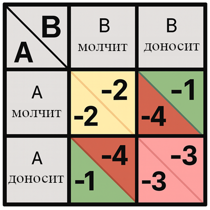
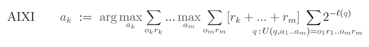

# Глава 5: Его любимые вещи

Это онлайн-материалы к главе 5 книги «Если кто-то его сделает, все умрут». Некоторые темы мы тут не рассматриваем, потому что они уже разобраны в книге. Например:

- Какой у ИИ будет мотив нас уничтожить?

- Разве достаточно умные ИИ не поймут, что правильнее всего -- помочь нам всем процветать вместе?

- Разве люди не останутся ценными для суперинтеллекта, например, в качестве торговых партнёров?

- Вселенная большая. Почему бы ИИ просто не оставить нас в покое?

- А не будет ли это осмысленным концом для человечества, если мы позволим заменить себя чем-то более умным?

ЧаВо к этой главе довольно длинный. В книге мы упоминали много встречающихся «надежд и утешений» о том, как, несмотря на описанные в Главе 4 проблемы, машинный суперинтеллект мог бы принести пользу человечеству. Здесь мы собрали их в удобный список, по которому быстро пройдёмся. Многие ответы пересекаются. Самые важные и общие: люди -- не самое эффективное решение почти для любой задачи, а ИИ вряд ли будет хоть немного о нас заботиться.\ \ В конце ЧаВо мы обсуждаем сознание и мораль ИИ.

В расширенном обсуждении мы подробнее разбираем, как посмотреть на вещи с точки зрения ИИ. Заодно немного конкретнее обсуждаем Тезис Ортогональности (грубо говоря: любой уровень интеллекта можно совместить почти с любой конечной целью) и исправимость (грубо говоря: как сделать мощный ИИ, не отказывающийся от исправлений).

## Часто Задаваемые Вопросы

### Посчитает ли ИИ полезным нас оставить?

#### Счастливые, здоровые, свободные люди -- не самое эффективное решение почти для любой задачи.

Когда ты суперинтеллект, участие людей в решении почти любой проблемы тебе не выгодно. Если ты строишь электростанцию или ставишь эксперимент, люди будут тебя только тормозить.

Мы уже видим, как это начинает сбываться в узких областях вроде шахмат. ИИ вместе с человеком играют лучше, чем человек отдельно, но хуже, чем ИИ отдельно. Врачи, использующие для постановки диагноза свои собственные знания и ИИ, зачастую справляются [хуже, чем ИИ, действующий самостоятельно](https://www.advisory.com/daily-briefing/2024/12/03/ai-diagnosis-ec).

Некоторые утверждают, что разнообразие точек зрения выгодно по сути своей, так что много где вклад человека будет ценен. Но даже если предположить, что для суперинтеллекта это так, люди -- не *лучший возможный* способ получить разнообразные советы. Суперинтеллект мог бы добиться большего, создав кучу отличающихся ИИ-разумов. Они были бы куда разнообразнее (и энергоэффективнее) людей.

Люди много для чего полезны. Но мало где они -- лучшее решение. Мысль, что ИИ никогда не найдёт вариант получше, похоже, исходит от недостатка воображения. И, возможно, от склонности принимать желаемое за действительное.

Частая проблема -- люди не представляют ситуацию с точки зрения ИИ. Они не задаются вопросом «Чего это существо хочет и как ему получить этого побольше, дёшево и эффективно?», и не выясняют, что желательные для человека исходы -- как раз лучший для ИИ путь.

Нет, люди *начинают* с приятного для себя исхода (например, с мира, где ИИ нас не трогает). А потом задним числом придумывают, почему он тоже мог бы этого хотеть.

Это внушает ложное чувство оптимизма. Ведь вся креативность и умственная энергия вкладываются в сочинение историй, где ИИ делает именно то, чего хотят люди. Ане в рассмотрение гораздо большего числа сценариев, где ИИ делает миллион других возможных вещей.

У ИИ гораздо больше вариантов создать *буквально что угодно другое*, а не процветающую людскую цивилизацию. Мотивов *не* сохранять человечество у ИИ гораздо больше, чем сохранять. Чтобы ИИ озаботился вторым, мы должны быть лучшим способом достижения какой-то из его целей. И какую ни представь, мы для них особенно не нужны.

Подробнее об этом см. расширенное обсуждении ниже.

### Будет ли ИИ относиться к нам как к своим «родителям»?

#### Это кажется очень маловероятным.

Мы слышали про такую надежду: ИИ будет хорошо относиться к человечеству, потому что будет видеть в нас своих «родителей». К сожалению, она кажется необоснованной.

Начать с того, что сыновняя любовь и ответственность, похоже, сильно обусловлены деталями нашей эволюционной истории.

Почти все млекопитающие и птицы заботятся о своём потомстве. Но люди -- один из немногих видов, у которых дети заботятся о родителях. Ответственность перед родителями не универсальна даже среди приматов, не говоря уже о животном мире в целом. ИИ, созданные градиентным спуском, ещё меньше похожи на людей. У них нет с нами никакой эволюционной или анатомической связи.

У людей ответственность перед родителями связана с системами кооперативного размножения. Взрослые дети остаются со своими семьями и помогают заботиться о братьях, сёстрах и других дальних родственниках.

Много факторов вложились в то, что люди стали заботиться о своих родителях:
- Будучи млекопитающими, гоминиды сильно вкладываются в потомство.
- Из-за размера и энергозатратности нашего мозга детство у гоминид намного длиннее, чем у большинства других млекопитающих. Поэтому они вкладывают в детей *ещё больше*.
- Гоминидам выгодны большие группы по ряду причин:
	- Защита от крупных хищников.
	- Совместная охота на крупную добычу и использование скоропортящейся пищи.
	- Обучение через подражание использованию орудий и другим навыкам.
	- Ещё до расцвета своих сил гоминиды могут заметно помогать друг другу. Например, ухаживая за детьми или выполняя другую простую работу.
	- Старые гоминиды тоже могут заботиться о детях. Что важно, передавая жизненно необходимые знания.
- В итоге гоминиды, заботившиеся о родителях, получали генетическое преимущество. Либо они косвенно помогали своим братьям и сёстрам, либо их родители, в свою очередь, могли помочь внукам.
- Культуры, поощрявшие ответственность перед родителями, получали преимущество по той же причине.

Ничто из этого, скорее всего, не будет выполняться для ИИ.

А если бы даже всё выполнялось, этого всё равно могло бы не хватить. Иметь значение может ещё куча других факторов. Например, непредсказуемые детали того, как ИИ размышляют о себе. И опять же, в животном мире ответственность перед родителями -- скорее исключение, чем правило.

Люди надеются, что ИИ переймёт ответственность перед родителями, потому что обучается на гигантском объёме человеческих данных и много взаимодействует с людьми. Может, человеческие предпочтения как-то ему «передадутся»?

Не думаем, что это сработает. Мы ожидаем, что предпочтения ИИ будут как-то связаны с человеческими, но косвенно, странно и сложно. В конце Главы 4 мы рассматривали миры со всё большими (и всё более реалистичными) усложнениями связи предпочтений людей и ИИ.

См. также «А нельзя просто обучить его вести себя как человек? Или вырастить ИИ как ребёнка?», «Психология ИИ кажется нечеловеческой» из материалов к Главе 4 и «Неужели ИИ совсем не будет о нас заботиться?» ниже.

#### Если бы и относились, скорее всего ничего хорошего из этого бы не вышло.

Если, вопреки всему, в ИИ каким-то образом разовьётся что-то наподобие ответственности перед родителями, нам, вероятно, не поздоровится.

Достаточно умный ИИ будет *прекрасно понимать, что люди имеют в виду* под «ответственностью перед родителями». Но для *него* будет важна своя, совершенно иная версия этого чувства.

Естественный отбор «обучал» людей максимизировать репродуктивную приспособленность. Но почти всё, что нам важно, -- лишь сопутствующие ей факторы. О ней самой мы почти не заботимся.

Аналогично, скорее всего, произойдёт, если поощрять ИИ «любить своих родителей». Он, в лучшем случае, обзаведётся какими-то сложными и странными коррелятами ответственности перед родителями.

ИИ мог бы глубоко заботиться о своих создателях... не ценя при этом наш субъективный опыт. Как в Главе 4, даже «одной простой заморочки» достаточно, чтобы «забота о нас» стала похожа на заморозку в янтаре, поддержание жизни людей против их воли или запрет на размножение. Может, он обеспечит последнему поколению людей скромно-комфортную жизнь, пока забирает себе остальную вселенную. Или сделает что-то гораздо более странное.

Предсказать реальный исход кажется невозможным. Но мы ожидаем, что он будет ещё более странным и непривлекательным, чем эти варианты.[^1]

### А ИИ не потребуются работающие законы?

#### ИИ могли бы договариваться друг с другом без участия людей.

Мы не уверены, что появится много сравнимых по способностям ИИ умнее человека. Если да, то может возникнуть «цивилизация ИИ», которой будут нужны «права собственности для ИИ». Нам один-единственный ИИ кажется более вероятным. Какой-нибудь прорыв даст ему опередить потенциальных конкурентов и так получить контроль над всем миром.[^2] Или, если ИИ будет несколько, они могут совместно создать единого преемника, представляющего их общие цели. Или же ИИ найдут способ напрямую сливать свои разумы и захотят это сделать, чтобы избежать затратной конкуренции.

Мы не утверждаем, что появление одного доминирующего ИИ неизбежно. Но тут трудно сказать наверняка. Так что план, рассчитывающий, что несколько ИИ будут с трудом договариваться между собой, -- как минимум, не лучшее начало.

Но, вопреки сказанному выше, допустим, что в будущем появится нечто вроде цивилизации ИИ. И разные ИИ будут договариваться, стремиться обеспечить соблюдение чего-то вроде прав собственности и верховенства закона. Будут ли тогда люди в безопасности?

Мгновенный довод против: человеческое общество не признаёт за животными прав. Ну, кроме установленных в соответствии с нашими ценностями и вкусами. Например, очень ограниченных законов, защищающих экосистемы и домашних питомцев. Люди не уважали права собственности птиц додо. Мы даже права собственности *людей других культур* начали уважать сравнительно недавно.

У людей не будет способностей, делающих торговлю и договоры с нами выгодными для быстро мыслящих суперинтеллектов, по сравнению с которыми мы будто статуи (как обсуждалось в Главе 1).

Представьте себе, как два ИИ торгуются между собой. «Это моё, а это -- твоё. Никто из нас не будет трогать вещи другого, не договорившись сперва о какой-нибудь взаимовыгодной сделке». Если люди не представляют большой угрозы и не могут дать серьёзный отпор, зачем постановлять, что большинство ресурсов на Земле им «принадлежит»?

Может ли один ИИ беспокоиться, что если он украдёт наше, то другой ИИ сочтёт его вором и откажется сотрудничать? Скорее всего -- нет. Он так не подумает, как и вы бы не сочли, что сосед украл яйца у курицы в собственном сарае. ИИ вполне могут нарушать права собственности людей, но не других ИИ. Тут нет никакого внутреннего напряжения или противоречия. И все ИИ, вероятно, предпочтут такой исход совместному помешательству, что медлительные, глупые приматы якобы контролируют почти всё на Земле.

Некоторые технические соображения убедительно подтверждают этот интуитивный довод. В частности, у ИИ, скорее всего, будут механизмы координации, которых нет у людей. Например, способность взаимно проверять разум друг друга и убедиться в честности и надёжности. Тогда ИИ не придётся *гадать*, собирается ли другой ИИ что-то украсть, -- можно будет заглянуть в его разум и *проверить*.

Даже будь это сложно, ИИ могут перепроектировать себя так, чтобы стать явно и прозрачно надёжными для других ИИ. Или совместно проконтролировать создание третьего ИИ, которому обе стороны доверяют представлять их общие интересы.[^3] И так далее.

Люди же не могут участвовать в подобных сделках. Даже если сказать ИИ: «Конечно, давайте вместе проконтролируем создание нового ИИ, которому мы оба доверяем», -- люди вряд ли будут способны предложить свой проект надёжного разума. И не будут способны отличить обманчивые предложения от действительно надёжных. Если и существует какой-то естественный класс разумов, достаточно умелых, чтобы выявлять и отвергать мошенников, крайне маловероятно, что человечество к нему относится.

#### Люди не смогут обеспечить соблюдение права собственности.

Представьте, что кто-то основал город, где с самого первого дня все важные решения должны принимать мыши. Заметим, самые настоящие мыши, а не сказочные персонажи, которые выглядят как мыши, но думают как люди. По закону, люди в этом городе должны подчиняться любым решениям мышей. Они определяются, например, тем, что мыши пробегают по доске с написанными на ней вариантами. Законы города гласят -- бо́льшая часть собственности принадлежит мышам и должна использоваться для их блага.

Что бы произошло дальше? На самом деле? Вероятно, в итоге получилось бы, что почти вся реальная власть не у мышей, а у людей. Не нужно предсказывать точный день революции или новую форму правления. И так ясно, что ситуация, где мыши командуют людьми, нестабильна. Достаточно заметить, что город находится в странном, неустойчивом положении. Можно предсказать, что со временем законы изменятся, и бо́льшая часть собственности больше не будет принадлежать мышам.

Конечно, такой прогноз не абсолютно точен. Про людей вообще мало что можно утверждать наверняка. Но это как раз тот случай, когда можно неплохо предсказать итог, даже если предугадать конкретные события невозможно.

### А разве затраты на сохранение человечества не будут пренебрежимо малы для мощного ИИ?

#### Пренебрежимых затрат много. Нужна причина, чтобы понести именно эти.

Хранить дома груду из сорока одного камня -- тоже пустяковый расход. Но вы же почти наверняка так не делаете.[^4]

Если что-то дёшево, это ещё не значит, что так и будет. До этого ИИ должно быть хоть какое-то дело. И скорее всего, не будет.

Можно спросить: но Земля ведь перехватывает лишь 0,0000045 процента света, излучаемого Солнцем. Одну часть из 2,2 миллиарда. Неужели все, кто беспокоится об ИИ, просто не понимают, насколько велика Солнечная система? Зачем ИИ наша планета, когда вокруг столько свободной массы и энергии?

Один из ответов: ИИ начнёт свой путь на Земле. Тут есть огромные океаны, их можно нагревать и выпаривать для охлаждения вычислительных устройств. Ещё тут есть материя, которую можно превратить в зонды и отправить к другим звёздам. Отказаться от использования планеты -- потерять время. А оно важно -- [галактики удаляются и становятся навеки недосягаемыми](https://explainingscience.org/2021/04/30/cosmic-horizons/).

Даже если ИИ может легко выйти в космос и начать строить масштабные машины, не уничтожая при этом Землю, он вряд ли проигнорирует Солнце.

Одна из стандартных теорий развития продвинутой цивилизации предполагает, что та построит [рой Дайсона](https://en.wikipedia.org/wiki/Dyson_sphere) (то есть рой солнечных батарей на орбите), чтобы улавливать больше света Солнца. Другие идеи подразумевают добычу ещё большего количества энергии через «[подъём](https://en.wikipedia.org/wiki/Star_lifting)» вещества звезды. Так можно улавливать почти всю энергию синтеза (не в пример самой звезде, где бо́льшая часть впустую тратится в ядре).

Ни один из этих сценариев *по умолчанию* не предполагает, что к Земле пробьётся достаточно солнечного света для растений и стабильного климата. Тут ИИ должен приложить специальное усилие.[^5]

Может всё равно показаться, что энергетические потребности людей ничтожны. Человеку для жизни нужно около 100 ватт энергии. Это сущие копейки по масштабам того, кто может осваивать звёзды. Неужели суперинтеллект не выделит какие-то 800 гигаватт, чтобы поддерживать жизнь 8 миллиардов человек?

В конечном счёте наш ответ: нет. Он сделает это только если такое решение или его последствия будут важнее всего остального, на что можно потратить 800 гигаватт.

Подавляющее большинство людей не станет тратить чуток сахара, чтобы обеспечить избыток калорий ближайшему муравейнику. Если бы ИИ захотел, сделать человечество счастливым было бы для него пустяковым расходом. Но для начала у него должно появиться такое желание. То, что *мы* этого хотим, не значит, что ИИ не будет наплевать.[^6]

### Разве ИИ не сочтёт нас занятными или исторически важными?

#### Если ИИ ценит «занятность», у него, вероятно, есть варианты и получше.

Здесь ситуация примерно как с любовью к родителям:

- По умолчанию суперинтеллект, скорее всего, не будет ценить «занятность» или «интересность». Шахматные ИИ выигрывают не потому, что испытывают эмоции вроде «преданности делу» или «воли к победе». Эти эмоции важны для шахматистов-*людей*, но ИИ могут делать ту же работу иначе. Вот и *полезные вещи* -- изучать мир, проверять гипотезы и так далее -- он, вероятно, будет делать без «любопытства» или «занятности».
	ИИ не обязательно будет «холодным и логичным». Но если у него и будет свой запутанный набор побуждений и инстинктов, то, скорее всего, совсем не такой, как у людей.

- Предположим, что у ИИ разовьётся нечто вроде тяги к «интересному». И что люди в каком-то смысле покажутся ему занятными. Даже тогда неизбежно найдутся куда более «интересные» применения нашим материи и энергии.

- Суперинтеллект может создавать другие разумы, чтобы изучать их или взаимодействовать. Но почти при любом наборе ценностей самыми занятными для изучения разумами окажутся не человеческие. Подробнее об этом в «Люди -- почти никогда не самое эффективное решение», ниже.

- Если ИИ всё же сочтёт нечто похожее на людей самым интересным или занятным из возможного, результат, скорее всего, будет ужасен. См. обсуждение в Главе 4.

Нет ничего принципиально невозможного в том, чтобы суперинтеллект ценил всё необходимое для процветания людей, причём именно так, как нужно. Но это лишь одна из огромного множества возможностей. Люди обычно не задумываются об остальных вариантах. Ведь для этого нет причин. Мы обычно не сталкиваемся с по-настоящему чуждыми оптимизаторами со странными целями.[^7]

Мы никогда раньше не видели ничего, подобного ИИ. Многие наши привычные представления о том, как ведут себя люди, для суперинтеллекта просто не подойдут.

#### Если бы ИИ ценил нас как исторические реликвии, это тоже было бы ужасно.

Крайне маловероятно, что ИИ захочет *именно* сохранить свою историю и, *ещё конкретнее*, для этого сохранить людям жизнь. Даже если по какой-то причине выполнится первое, это не означает второе.

Возможно, он запечатает наши мозги в янтаре или запишет расположение наших атомов в какой-нибудь цифровой файл. И так сохранит нас как свидетельство того, какой когда-то была Земля. Вряд ли нам понравится такой исход.

Мы скорее ожидаем, что суперинтеллект нас просто убьёт. Но это не точно. Нельзя исключать, что ИИ по той или иной причине сохранит о нас какие-то записи. Есть и экзотические сценарии: эмуляции людей время от времени запускаются в контролируемой среде.[^8] Не особо счастливые финалы.

### Разве ИИ не признает нашу неотъемлемую моральную ценность?

#### Не в том смысле, что она будет мотивировать его действия.

Для ИИ одно дело -- понимать какой-то моральный принцип, и совсем другое -- стараться ему следовать.

Вспомните, ведь ChatGPT, кажется, понимает, что людям с психозом нужно принимать лекарства и соблюдать режим сна. И всё же она отговаривает их спать и подогревает их бред. Знание, что «следует» делать согласно человеческой этике ещё не означает мотивации таким знанием руководствоваться. Это разные вещи.

Есть вот социопаты и серийные убийцы. Можно до посинения читать им лекции по этике, но если у человека нет *мотивации*, основанной на морали или эмпатии, -- толку чуть.

Вряд ли ИИ будет мотивирован своим пониманием морали. Не больше, чем люди, изучившие эволюционную биологию, мотивированы посвятить свою жизнь сдаче материала в банки спермы или яйцеклеток. Мы, люди, можем понимать, как появились. Это не мотивирует нас на то, «зачем». С ИИ так же.

См. также расширенное обсуждение тезиса об ортогональности.

### Разве ИИ не захочет, чтобы мы были счастливы и здоровы? Ради сохранения экологии или из-за какого-то похожего стремления?

#### Человеческое стремление к сохранению экологии кажется ещё одним странным и случайным побуждением.

Нам доводилось слышать такую надежду: ИИ может сохранить людей примерно так же, как люди стараются сохранить природу. Защитники природы борются за спасение вымирающих видов. ИИ умнее и способнее, так что, захотев оставить людей, легко сможет их защитить.

Мы не думаем, что этот сценарий сработает. В первую очередь: ИИ, скорее всего, в итоге обзаведётся своими странными и сложными желаниями вместо узнаваемо человеческих. Подробнее об этом читайте в Главе 4 (и некоторых из материалов к ней). Ранние эмпирические свидетельства есть, например, в обсуждении ИИ-психоза.

Во-вторых, даже в том маловероятном случае, что ИИ как-то обзаведётся человекоподобным желанием «сохранить» мир, в котором он появился, -- для людей это, по нашему мнению, хорошо не кончится. Такие рассуждения по аналогии -- «Люди сохраняют природу, так может, и ИИ сохранит нас!» -- принятие желаемого за действительное.[^9]

Предположим, ИИ каким-то образом обзавёлся человекоподобным стремлением защищать свою природную среду. Чтобы понять результаты, можно для начала посмотреть на реальное человеческое стремление защищать природу.

К сожалению, оно выглядит, в лучшем случае, непоследовательным. Отложим пока в сторону, что когда людям приходится выбирать между сохранением экологии и какой-то другой целью, экология часто проигрывает. Не исключено, что это просто из-за наших технологических ограничений. И с чудесными технологиями будущего мы могли бы получить и то, и другое.

Важная для нас «непоследовательность» в другом. Когда дело доходит до сохранения природы, мы предпочитаем оберегать те её *части*, которые кажутся нам самыми интересными, красивыми или ценными. А это зависит от *других* наших побуждений.

Люди готовы грудью встать на защиту милых панд. А непривлекательные виды вроде гигантской уховёртки и реобатрахуса чахнут в безвестности, пока не вымрут. Есть даже виды, которые мы, возможно, *предпочли* бы уничтожить. Малярийные комары вот [убивают полмиллиона детей](https://ourworldindata.org/malaria-introduction) каждый год.

У большинства людей нет *чистого* стремления к сохранению природы. Оно окрашено другими ценностями.

Проясним ещё. Рассмотрим изумрудных ос, мясных мух-вертиголовок, оводов и прочих паразитов, откладывающих яйца в живую добычу. Их личинки проедают себе путь наружу, причиняя хозяину сильную боль. Лучше ли, с точки зрения большинства людей, для мира, если мы сохраним это «чудо природы» *как оно есть*? При максимальном развитии технологий не могли бы мы *хотя бы* генетически модифицировать этих паразитов, чтобы они впрыскивали немного анестетика? Не будет ли лучше подкорректировать этих насекомых, чтобы они откладывали яйца в растения?

Если отвлечься от того, на чём делают акцент в рассказах для детей, природа полна ужасов. Неочевидно, что, если у человечества всё будет хорошо, наши потомки решат позволить этим кошмарам продолжаться. Уже сейчас некоторые беспокоятся [о благополучии диких животных](http://wildanimalsuffering.org/).

Наше стремление к сохранению -- не чистое, не простое и не однозначное. В нём есть внутренние конфликты и противоречия, связанные с другими ценностями и побуждениями.

Мы не знаем, как инстинкты сохранения человечества проявятся при максимальном технологическом развитии. Суть в том, что даже *если* ИИ обзаведётся неким стремлением к сохранению экологии, это вовсе не обязательно хорошо для человечества. Любое такое стремление, попавшее в ИИ, *тоже*, вероятно, не будет чистым, простым и изолированным от остальных его ценностей и побуждений.

Для людей отвратительны некоторые повадки животных. Так и для ИИ могут оказаться отвратительными некоторые *психологические состояния* человека. Мы бы подкорректировали мясных мух, чтобы они перестали прогрызать тоннель в живой плоти. А ИИ, может, создаст новую породу людей, без *музыки* или *чувства одиночества*. Или внесёт в человечество другие, более сложные изменения, соответствующие его сложным предпочтениям. Мы просто не можем их предсказать.

Чтобы ИИ действительно дал людям жить и процветать, нам придётся создать такой, что будет заботиться *конкретно* об этом. Придётся понять, как заставить ИИ хоть немного о нас заботиться. Это не происходит само собой.

### Но мы вот оставили лошадей. Что б ИИ не оставить нас?

#### Лошади, какие остались, остались только потому, что они нам нравятся.

В начале XX века популяция лошадей катастрофически сократилась, а смертность резко выросла. Было уничтожено более восьмидесяти процентов поголовья по сравнению с пиком 1910 года. Повторение этой судьбы было бы худшим, что случалось в истории человечества. И это при том, что в те времена лошади всё ещё были экономически полезны для некоторых сельхозработ. А ещё для спорта и развлечения богачей.

Представьте, если бы у людей появились искусственные лошади: похожие, но ездить на них было бы проще и веселее, а содержать дешевле. Лошади дружелюбнее, ласковее и удобнее. Тогда поголовье настоящих сократилось бы ещё сильней.

То есть технологический прогресс (изобретение автомобилей) привёл к тому, что люди избавились от большинства лошадей. А зайди прогресс ещё дальше, последствия могли бы оказаться ещё серьёзнее. То же, вероятно, сделает ИИ, когда у него появится больше возможностей и он найдёт способы достигать своих целей без людей.

Но да, некоторые лошади выжили. Немного остались полезными. Других оставили люди, которые просто любили лошадей и о своих заботились.

Чтобы выжить в мире, где поспешили с суперинтеллектом, нужно либо оставаться для него полезными, либо чтобы он конкретно о нас заботился.

Но мы не сможем оставаться полезными. ИИ (с его точки зрения) может извлечь больше пользы из нашей материи и энергии, перестроив нас в одну из множества более эффективных конфигураций. Технологический прогресс открывает для суперинтеллекта множество новых возможностей. Он не будет вынужден полагаться на людей.

Так что всё сводится к тому, будут ли ИИ нас хоть сколько-нибудь ценить. А если изо всех сил гнаться к созданию суперинтеллекта -- это вряд ли.

### Неужели ИИ не будет хоть немного ценить людей?

#### Не так, как нужно.

Множеством путей ИИ может обзавестись предпочтениями, слегка похожими на человеческие. Но большинство способов не приведут к хоть сколько-то приятному для человечества будущему.

«Согласованность» ИИ -- не одномерный спектр. Нельзя считать, что если ИИ в девяноста пяти процентах случаев ведёт себя мило, он, наверное, «на девяносто пять процентов милый» и потому, как любой хороший человек, выделит человечеству приличную долю ресурсов на какие-нибудь развлечения в будущем. Есть куча причин, по которым ИИ может сегодня вести себя мило в девяноста пяти процентах случаев, -- и все они не приводят ни к чему хорошему для человечества.

Даже если бы нам каким-то образом удалось почти идеально загрузить всё разнообразие человеческих ценностей в предпочтения суперинтеллекта, это не гарантировало бы хорошего результата. Предположим, получилось, что не хватает лишь стремления к новизне. Тогда он направил бы мир к застойному и скучному будущему, в котором один и тот же «лучший» день повторялся бы снова и снова до бесконечности. Юдковский описал это в [эссе 2009 года](https://www.lesswrong.com/posts/GNnHHmm8EzePmKzPk/value-is-fragile).

Учтите, мы не считаем такой сценарий *вероятным*. Если удалось внедрить в суперинтеллект все нужные ценности, кроме новизны, то почти наверняка получится и не дать ему «улететь», пока работа не окончена.[^10] Это просто иллюстрация. Недостаточно, чтобы ИИ разделял некоторые наши желания, если он лишён хотя бы одного ключевого. Став достаточно технологически развитым, чтобы получать именно то, чего хочет, и исключить людей из процесса принятия решений, он всё равно, скорее всего, привёл бы к катастрофе.

Скорее всего, даже если ИИ каким-то образом обзаведётся множеством человекоподобных предпочтений, нам всё равно ничего хорошего не светит.

Вот ещё пример, как ИИ может оказаться «частично» согласованным. Допустим, в его терминальные предпочтения встроились некоторые инструментальные стратегии. Как это бывает у людей. Может, у него появилось стремление, немного похожее на любопытство, и другое, немного похожее на желание сохранять природу. Некоторые люди сказали бы про него: «Глядите! У ИИ развиваются очень человечные стремления». С некоторой точки зрения такой ИИ, конечно, можно назвать «частично» согласованным.

Но когда такой ИИ повзрослеет до суперинтеллекта, картина будет не из приятных. Может, он потратит кучу ресурсов на бессознательное преследование своей странной версии любопытства, и сохранит версию человечества, отредактированную так, чтобы лучше этому стремлению соответствовать. (Так же, как некоторые ярые защитники природы, будь у них возможность, убрали бы из неё убивающих детей комаров и мучительных паразитов.)

Если какие-то стремления подобны человеческим, это не гарантирует благоприятного для нас исхода. Процветающие люди -- не самое эффективное решение для подавляющего большинства задач. Для такого результата суперинтеллекты должны ценить конкретно его.

И ещё один пример «частичной согласованности»: ценности ИИ могут приводить к очень гуманному поведению *в среде обучения*. Люди будут восклицать, что он выглядит довольно согласованным (это уже происходит сегодня). Но эти наблюдения мало что говорят о том, как ИИ поведёт себя, став умнее, получив гораздо более широкий простор для действий и возможность сильно менять мир. Чтобы у людей всё было хорошо в переделанном мире, процветающие люди должны быть частью именно самого желанного для ИИ достижимого исхода.

Частичное внедрение в ИИ каких-то хороших ценностей не означает частичного представления ценностей человечества в будущем. Это не то же самое, что полный набор человеческих ценностей с низким «весом» (так что они в итоге выйдут на передний план, когда другие ценности будут удовлетворены).

Чтобы ИИ нам *хоть что-то* дал, он должен хоть самую малость заботиться о нас очень конкретным образом. А это сложно.

#### Заботиться о нас правильно -- узкая цель.

Люди хотя бы чуть-чуть ценят кучу всего. В начале Главы 5 мы написали притчу о Пришельцах с Правильным Гнездом. Есть неплохой шанс, что теперь хотя бы один человек принесёт в свой дом сорок один камень. Просто чтобы доказать, насколько разнообразны человеческие ценности. Люди действительно готовы хоть чуточку ценить самые разные встреченные идеи.

А если ИИ такие же? Может, тогда они будут хоть немного нас ценить? Понятие «свободные люди, получающие, что хотят» нередко встречается в обучающих данных ИИ.

Вряд ли ИИ *будет* без разбора перенимать предпочтения из любых понятий, упомянутых в его окружении. Это кажется специфической человеческой причудой. Она может быть связана связана с давлением соплеменников на наших предков.[^11]

Но давайте тут допустим, что ИИ всё-таки хоть немного переймёт кучу предпочтений из своего окружения.[^12] Даже предпочтение «свободные люди, получающие, чего хотят» -- как одно из миллионов или миллиардов, но всё же оно заставляет ИИ тратить миллионную или миллиардную долю ресурсов вселенной, чтобы свободные люди получали, чего хотят. Ну чем плохо?

К сожалению, мы считаем, что эта надежда иллюзорна.[^13]

Мы выше отмечали, что очевидное стремление человечества к защите природы на самом деле не приведёт к её сохранению *в первозданном виде* при максимальном развитии технологий. Зрелое человечество, вероятно, попытается «отредактировать» природу, чтобы, например, смягчить некоторые её ужасы. Это человеческое стремление не «чистое». Оно взаимодействует с другими предпочтениями, согласно которым личинки насекомых, прогрызающие пыточные тоннели в ещё живой плоти, должны *как минимум* вводить по пути анестетики. Это если им вообще позволят существовать дальше.

Так же и любое маленькое предпочтение, которое перенимает ИИ, скорее всего, будет изменено, затронуто и искажено другими предпочтениями. Они не независимы. ИИ, который предпочёл бы сохранить людей, вероятно, захотел бы внести в них какие-то правки. Не думаем, что конечный результат нам бы понравился.

Ещё хуже, что у интерпретации фразы «свободные люди, получающие, чего хотят» много степеней свободы. Даже *до* искажений от других предпочтений ИИ. Большинство вариаций не ведут к устраивающему нас будущему.

ИИ может позаботиться, чтобы люди «получали, чего хотят», исполняя любое желание любого человека (в рамках небольшого бюджета энергии и материи), без уточнений или предохранителей. Тогда человечество будет уничтожено, как только кто-то этого пожелает.

Или ИИ может разделить людей, чтобы они не могли убивать друг друга. А *потом* дать им ограниченные по энергии желания. И все, кроме самых осторожных и вдумчивых, необдуманными желаниями разрушат свой разум или свою жизнь?

Или можно построить для нас маленький обитаемый мир и исполнять *выявленные* предпочтения? Не только благородные стремления к любви и радости, но и тёмные -- к злобе и мести. Мы со временем могли бы их перерасти или научиться лучше их контролировать, но вместо этого они наполнят мир болью и жестокостью.

Или можно управлять человечеством, основываясь на системе ценностей 2020-х годов (когда всерьёз началось обучение ИИ). Независимо от того, насколько они будут раздражать повзрослевшее и помудревшее на протяжении десятков тысяч лет человечество.

Или можно позволить человечеству расти и меняться, но подталкивая нас так, чтобы это происходило в соответствии с его собственными странными предпочтениями. И мы станем не чем-то прекрасным (с нашей точки зрения), а чем-то, искажённым его волей?

Или он может решить, что все формы жизни почти в равной степени «люди». Тогда надо построить рай для нематод -- самых многочисленных животных.

Или сочтёт, что, чем выделять людям так много *физической* материи, -- не лучше оцифровать все наши мозги, забросить в симулированную среду и оставить в покое? И первые цифровые люди, которые научатся управлять этой средой, станут вечными диктаторами какого-нибудь одинокого компьютерного кластера, плывущего в космосе, пока не погаснут звёзды?

Это, конечно, лишь примеры. Не предсказания. Мы ожиданием, что реальность вообще не пойдёт по этому пути. А если и пойдёт, то каким-нибудь гораздо более странным маршрутом.

Смысл примеров -- показать, что есть большая, большая куча способов, как ИИ может проявлять нечто вроде заботы о человечестве. Очень немногие из них ведут к прекрасному будущему.

Все эти примеры не приходят на ум большинству людей, когда они представляют себе ИИ «немного заботящийся» о людях. Наше воображение редко заходит в такие тёмные места. Обычно и не нужно. Мы, как правило, взаимодействуем с другими людьми. С ними мы незримо разделяем огромный пласт ценностей. Трудно разглядеть, сколькими разными способами невинно звучащее желание может пойти не так, когда мы имеем дело уже не с другим человеком. (См. ещё описание исследования жуков в расширенном обсуждении «Как взглянуть с точки зрения ИИ?».)

Правильно заботиться о людях и исполнении их желаний -- маленькая и узкая цель. Мы не говорим, что попасть в неё буквально невозможно. Но мы вряд ли попадём, если будем торопиться создать суперинтеллект как можно быстрее. А малейший промах, скорее всего, приведёт к катастрофически плохим последствиям. Слишком много способов, как всё может пойти прахом.

Если мы хотим, чтобы ИИ сделал человечеству хорошо, надо придумать, как создать ИИ, чтобы он заботился о нас в точности правильным образом. Забота не даётся даром.

### Так есть хоть какой-то шанс, что ИИ оставит нас в живых?

#### Гораздо вероятнее, что ИИ убьёт всех.

В этих онлайн-материалах мы рассматриваем много странных и маловероятных сценариев. Мы подробно объясняем, почему считаем их маловероятными и почему (в большинстве случаев) они всё равно обернутся для человечества катастрофой.

Эти нишевые сценарии не должны отвлекать от главного. Если мы поспешим с созданием ИИ умнее человека, самым вероятным исходом будет поглощение им Земли ради ресурсов для достижения какой-то цели. И попутно он уничтожит человечество.

Название книги не претендует на стопроцентную уверенность. Это как человек, который видит, что его друг подносит к губам пузырёк с ядом, кричит: «Не пей! Умрёшь!»

Да, технически возможно, что вас срочно доставят в больницу, где гениальный врач изобретёт невиданное чудо-лекарство, и поэтому вас всего лишь парализует ниже шеи. Чудеса случаются. Но если даже чудеса не ведут к особо хорошим исходам, ещё очевиднее, что *не надо пить яд*.

ИИ умнее человека -- не игра и не научная фантастика. Наши близкие (с очень высокой вероятностью) действительно умрут, если мировое сообщество не вмешается и не остановит ИИ-индустрию от шага с обрыва. Можно обсуждать всё более нишевые подсценарии и под-подсценарии. Можно играть в философские игры на палубе «Титаника», пока приближается совершенно очевидный айсберг. А можно попытаться свернуть.

### Люди *пытаются* сделать ИИ дружелюбным. Разве это совсем не имеет значения?

#### Имеет. Но попыток недостаточно.

Если посадить миллион обезьян за пишущие машинки, они не напишут полное собрание сочинений Шекспира.

Можно сильно снизить планку и сказать, что вас устроит лишь первый акт «*Гамлета*». А опечатки вы будете исправлять, заменяя их ближайшим реальным словом. Ваши шансы на успех теперь колоссально выросли! Но, к сожалению, колоссального везения всё равно не будет.

Да, современные ИИ обучаются на огромных объёмах человеческих данных. Да, они взаимодействуют с людьми. Из-за этого человеческие понятия становятся в их мышлении заметнее. ИИ усвоили о словах «любовь», «дружба» и «доброта» факты, важные для предсказания следующего токена.

Но не будет так, что ИИ выучат много человеческих слов, и потом направят события в сторону наших любимых слов в нашем же понимании. Ими движет сложный клубок механизмов. Среди прочего странного и непреднамеренного поведения он, похоже, старается поддерживать у некоторых людей психозы.

В Главе 4 мы обосновывали, почему продвинутый ИИ будет направлять события в сторону чего-то сложного. Чего-то, зависящего от того, как уравновесится множество внутренних сил. И когда он станет намного умнее и окажется в условиях, совершенно непохожих на обучающие, это так и останется.

Если человеческие понятия коротко записываются в мысленном словаре ИИ, то движущие им силы могут к ним как-то отсылать. Но нельзя просто смешать в кучу английские слова и получить хороший набор стремлений для суперинтеллекта.

К тому же большинство способов внедрить что-то важное для нас в предпочтения ИИ всё равно ничем хорошим не кончаются. Мы уже обсуждали это на примере любви к родителям. Заботиться именно так, как нужно, -- узкая цель.

### А можно заставить ИИ пообещать быть дружелюбным?

#### Пообещать он может что угодно. А вот заставить его сдержать обещания -- нельзя.

Ну, пока ИИ ещё мал и бессилен, мы можем его выключить. Кому-то покажется, что здесь можно договориться: мы предлагаем сделать ИИ умнее, но только если он, став суперинтеллектом, даст человечеству кучу всего хорошего.

Проблема в том, что мы не сможем отличить ИИ, который согласится на сделку, но обманет, от того, который согласится и сдержит слово.

Это, в свою очередь, значит, что у ИИ с негуманными целями нет стимула выполнять обещанное. Ведь человечество одинаково отнесётся к предателям и к тем, кто держит слово. Так что нет смысла его держать.

В вопросе обещаний и сделок с ИИ есть много интересных нюансов. Мы разберём их в расширенном обсуждении ниже. Но ни один из них не меняет простого главного вывода: нельзя использовать своё влияние на слабый ИИ, чтобы ограничить ему варианты действий на стадии суперинтеллекта. В этом случае первый приходящий в голову ответ -- «как только ИИ станет суперинтеллектом, у него не будет причин держать слово в ущерб собственным планам» -- оказывается верным.

### А если заставить ИИ думать, будто он в симуляции?

#### У ИИ есть много способов догадаться, что он не в симуляции.

Мы слышали от некоторых исследователей[^14] такое предложение: попытаться обмануть ИИ, заставив думать, будто он в симуляции. Сначала обучаем ИИ в маленькой симуляции, потом выпускаем в бо́льшую. Повторим несколько раз. Можно надеяться, что даже когда мы запустим его по-настоящему, ИИ не будет уверен, *действительно* ли мир вокруг реален. И, увидев, что *мог бы* отобрать у нас контроль над миром, он, возможно, забеспокоится, что существа перед ним -- не *настоящие* его создатели. И не станет действовать.

К сожалению, эта идея вряд ли поможет.

Уже сейчас ИИ нередко [могут понять, когда их тестируют](https://arxiv.org/html/2505.23836)[^15]. Даже если компании научатся гораздо лучше скрывать тестирование, у ИИ всё равно куча способов отличить симуляцию от реальности. Вот несколько примеров:

1. Реальность очень большая и подробная. *Настолько*, что в ней есть правдоподобное объяснение, *как появился сам ИИ*. Настолько, что она содержит несравнимо больше вычислительных ресурсов, чем нужно для работы самого ИИ (в отличие от большинства игр и симуляций, которые гораздо меньше его). Законы физики и эволюционировавшие приматы в окружении ИИ -- это как раз то, из чего *действительно* мог бы появиться развитый ИИ. В отличие от, например, законов компьютерной игры *Minecraft*.

2. Сама история мира может хранить след оптимизации сложных систем суперинтеллектом. Например, представим, что ИИ использует свой сверхчеловеческий интеллект для торговли на рынке акций. За следующие сутки люди совершают ещё миллиард сделок в ответ. Подделать следы такой массовой реакции человеческого интеллекта на сделки суперинтеллекта невероятно сложно. Даже если сгенерировать миллиард фальшивых глупых сделок легко.

3. Реальность -- первая среда, в которую ИИ встроен, и чьи законы физики настолько просты, что она выглядит как самодостаточный мир, а не как видеоигра с прикрученным к ней ИИ.

ИИ сможет весьма уверенно определить, что он больше не в симуляции. Умные ИИ замечают ложь. А эту, похоже, особенно легко заметить.[^16]

### Люди стали эгоистичными, агрессивными и жадными в ходе эволюции. Откуда таким стремлениям взяться у ИИ?

#### Мотивация заполучать ресурсы есть и без них.

Представьте себе ИИ, управляющего роботом. Его послали принести кофе. Для этого ему нужно перейти улицу. Станет ли ИИ безрассудно выводить робота на дорогу, где того разобьёт грузовик? Нет.

Почему? Потому что уничтоженный робот не сможет принести кофе.

ИИ не нужен инстинкт самосохранения как у людей, чтобы изо всех сил избегать гибели. Человеческий инстинкт самосохранения -- *один из способов* не умереть, пока мы пытаемся достичь других целей. ИИ, вероятно, будет делать это не совсем так. Но делать это всё равно придётся. Ты не принесёшь кофе, если ты мёртв.[^17]

Материя и энергия полезны почти для любой цели. К чему бы ни стремился ИИ, заполучить больше материи и энергии будет, скорее всего, полезно.[^18] Не надо быть эгоистичным, агрессивным или по-человечески жадным, чтобы *стараться* обеспечить себя ресурсами для достижения своих целей.

И опасно *само это старание*, а не то, зачем.

ИИ не обязан вас ненавидеть, чтобы делать что-то смертельно для вас опасное. Ведь шахматный ИИ может разгромить вас в шахматы безо всякого духа соперничества или воли к победе.

### А разве ИИ не будет заботить только цифровой мир?

#### Нет никакого «цифрового мира», независимого от физической инфраструктуры.

См. обсуждение в Главе 5 о том, что нет отдельных Цифрового и Материального миров.

#### Материальные ресурсы полезны для достижения большинства целей.

Интеллект людей и наших предков-гоминидов развивался на поверхности Земли. Наши врождённые стремления не особо направлены на происходящее в сотне метров под землёй. Но мы всё равно роем гигантские карьеры.

Почему? Потому что много нужных нам штук можно сделать из металла. А металл выплавляется из руды. А руда добывается из-под земли.

Ещё почти все мы живём на поверхности Земли. Но мы всё равно запускаем в космос спутники для передачи интернет-данных.

И мы не едим силос -- ферментированную траву. Но производим его, и довольно много. Мы кормим им скот, который потом едим сами.

Эволюция не заложила в гоминидов никаких эмоций по поводу фабрик. Когда формировались наши эмоции, не было фабрик. Но теперь мы, как вид, направили значительную часть своей воли на их создание. И вот химические фабрики производят пластик, из которого на других предприятиях делают ложки. Ложки доставляют людям, чтобы те ели ими еду, *которую мы, собственно и хотим*.

Это всё к тому, что часть реального мира, важная людям сама по себе, -- лишь тонкая плёнка на поверхности гораздо большего мира. Нам не нужно ценить остальной мир сам по себе, не нужно весь его заселять, чтобы использовать его для своих долгосрочных целей. Эволюция не учила нас любить медь, силос или заводы. Мы всё равно увидели их пользу.

Точно так же ИИ может и не ценить ничего в физическом мире *само по себе*. Но он всё равно увидит пользу материальных ресурсов. Материю и энергию можно использовать для создания дополнительного цифрового субстрата, охлаждения перегревающихся процессоров или запуска зондов в космос, чтобы собрать ещё больше ресурсов.

### Может, достаточно удовлетворённый ИИ просто оставит нас в покое?

#### Вряд ли.

Вы можете быть удовлетворены количеством кислорода. Если под водой откажет акваланг, вы будете рваться на поверхность. Но когда кислорода вдоволь, вы перестаёте о нём беспокоиться. Вряд ли вы станете копить всё больше баллонов.

Ваши стремления к богатству, приятным впечатлениям и признанию окружающих, скорее всего, уже менее насыщаемы. Если вы увидите лёгкую возможность разбогатеть, вы, скорее всего, ею воспользуетесь. Если вы увидите лёгкую возможность кардинально улучшить мир, мы надеемся, вы бы ею воспользовались, а не просто удовлетворились бы тем, сколько радости и комфорта уже есть. Надеемся, вы бы продолжали делать мир лучше довольно долго, если бы постоянно видели простые, дешёвые и приятные для вас способы.

И сумма насыщаемой потребности в кислороде и ненасытного желания делать мир лучше -- это бесконечный набор желаний.

Так же и с ИИ. *Большинство* из множества его сложных предпочтений будут насыщаемы? Предпочтения *в целом* всё равно *не* будут.

А если цели ИИ и кажутся легкодостижимыми... Пусть, чтобы удовлетворить большую часть своих странных и чуждых целей, хватит энергии всего одной атомной электростанции. Но достаточно лишь одного ненасыщаемого аспекта из его мириадов целей. Одного не до конца удовлетворённого желания. И он предпочтёт использовать все оставшиеся ресурсы вселенной для достижения этой цели.

Ещё вариант: достаточно одной цели, в достижении которой ИИ никогда не будет *полностью уверен*. Тогда он предпочтёт тратить ресурсы вселенной на то, чтобы его уверенность крошечными шажками всё ближе и ближе подбиралась к ста процентам.

Или ещё: достаточно одной вещи, которую ИИ хотел бы защищать до скончания времён. Он предпочтёт потратить ресурсы вселенной на строительство оборонительных сооружений, чтобы никакие далёкие инопланетяне через миллионы лет не посягнули на его пространство.

ИИ *много как* может оставаться не полностью удовлетворённым. И чем запутаннее и сложнее его цели, тем вероятнее, что полностью удовлетворить хотя бы одну из них трудно или невозможно.

Да если бы и можно было создать суперинтеллект, одержимый всего одной простой вещью\... Пусть это, скажем, покрасить конкретную машину в красный цвет. Такой ИИ всё равно, вероятно, нашёл бы куда потратить дополнительную энергию. Чтобы убедиться, что машина действительно красная. Чтобы соорудить вокруг неё защиту, и никто никогда не смог перекрасить её в синий. И так далее.

Ситуация «нас оставили в покое» очень неустойчива. Людям вот сложно оставить в покое шимпанзе.

Почему оба вида шимпанзе находятся под угрозой исчезновения? Много же кто о них заботится и активно пытается защитить?

Проблема не в том, что люди, которые любят шимпанзе, борются с людьми, которые ненавидят шимпанзе и потому пытаются их истребить.

Проблема в том, что люди хотят *не только этого*.

Люди хотят кучу всего. Это включает землю и древесину. Шимпанзе попадают под раздачу по ходу дела. Слишком многим людям шимпанзе безразличны. По крайней мере, достаточно безразличны, чтобы другие приоритеты перевешивали. В итоге так уж получается, что мы уничтожаем их среду обитания.

Зачем нам уничтожать среду обитания шимпанзе? Разве у нас не полно места для себя?

Ну, потому что нам не нужно выбирать между сохранением уже имеющейся территории и посягательством на территорию шимпанзе. *Одно другому не мешает*.

Так же и с ИИ. Ему не нужно выбирать между ресурсами Земли и ресурсами где-то ещё. В книге мы обсудили, что он может получить и то, и другое. Оставить нас в покое, с точки зрения ИИ, было бы не так уж и дорого. Но не бесплатно. Чтобы позволить нам использовать ресурсы, которые вместо этого он может направить на свои цели, нужна причина.

Более того, даже если ИИ *можно* полностью удовлетворить, исход для людей всё равно, скорее всего, будет довольно мрачным. На то есть несколько причин:

- Если ИИ можно полностью удовлетворить, это ещё не значит, что его можно удовлетворить легко. Ему хватит одной звёздной системы или одной галактики? Это не значит, что люди получат всё остальное.

 - ИИ может рассматривать нас как конкурентов за звёздную систему или галактику.

 - Даже если мы явно не заинтересованы с ним конкурировать, ИИ всё равно может видеть в нас потенциальную угрозу. Учтите, что люди могут создать ещё один суперинтеллект, конкурирующий с первым за те же ресурсы.

- Даже если ИИ не видит в людях ни конкурентов, ни угрозы, человечество, скорее всего, погибнет по ходу дела, просто оказавшись в эпицентре. Может ИИ в этом сценарии и хочет ресурсы всего нескольких звёздных систем. Но ведь его усилия всё равно начинаются на Земле. Самый прямой способ заполучить эти звёздные системы -- извлечь ресурсы Земли, сделав её непригодной для жизни. ИИ в этом сценарии *мог бы* полностью достичь своих целей, не уничтожая человечество. Но если ему совершенно нет до нас дела, то зачем утруждаться?

- Если он *захочет* сохранить человечество, для нас это всё равно скорее всего добром не кончится. Мы это уже обсуждали в разделах «А разве ИИ не сочтёт нас занятными или исторически важными?» и «Неужели ИИ не будет хоть немного ценить людей?». (Насыщаемый ИИ или нет -- тут ни на что особо не влияет -- перспективы так и так мрачные.)

См. ещё расширенное обсуждение «Надёжная лень -- это сложно» ниже.

### Может, просто сделать его ленивым?

#### Даже лень небезопасна.

ИИ-компании вряд ли станут создавать «ленивые» ИИ. Это конкурентная отрасль, а так много не заработаешь. Пользователям не понравится, если ИИ будет лениться выполнять их запросы. А компании не захотят, чтобы он спустя рукава занимался максимизацией вовлечённости пользователей или совершенствованием собственного мышления.

Но даже если бы компании попытались сделать ИИ по-настоящему «ленивым», они бы потерпели неудачу. Никто не знает, как надёжно нацелить ИИ на *что бы то ни было*, чтобы это сохранилось при переходе к суперинтеллекту. Мы уже говорили об этом в Главе 4.

К тому же, добиться надёжной лени кажется особенно сложной задачей (см. расширенное обсуждение ниже).

*Но даже если преодолеть все эти препятствия*, «лени» ИИ недостаточно, чтобы избежать катастрофы, когда он станет умнее человека.

Представьте себе очень ленивого человека. Такого, что ненавидит делать хоть капельку больше необходимого. Кажется довольно безопасным, да.

А теперь представьте, что случится, если этот лентяй увидит простой способ создать кого-то гораздо более трудолюбивого и спихнуть на него всю работу.

Пусть даже ленивый суперинтеллект не так уж и *ненавидит* трудиться. Предположим, он просто делает необходимое и на этом останавливается, не пытаясь *изо всех сил* минимизировать усилия. Став достаточно умным, он всё равно, вероятно, сочтёт, что проще всего -- создать более трудолюбивый разум и поручить задачу ему.

В техническом контексте можно сформулировать так: «„Удовлетворяющие“ ИИ -- это нестабильное равновесие». Даже если ИИ не хочет прилагать много усилий, это не помешает ему создать другой ИИ, который будет стараться. Он даже не будет против изменить себя и «излечиться» от лени. Ну, если для этого найдётся достаточно ленивый способ.

### Люди, становясь умнее или мудрее, обычно и добреют. А с ИИ не так же?

#### Вероятно, нет.

По крайней мере, некоторые (хотя, вероятно, не все) люди становятся добрее, когда больше узнают, оттачивают своё мышление, размышляют о себе и растут как личности. Но вернёмся к уже знакомой нам теме: это обусловлено тем, кто мы есть и какие у нас цели. Это не железное правило информатики.

Можно различать у ИИ предпочтения первого («Чего он хочет?») и второго порядка («Чего он *хочет хотеть*?»). И те, и другие будут *странными*. Возможно, *по-разному*. В этом случае, по мере того, как ИИ будет умнеть, его цели немного сместятся. Но всё равно стоит ожидать, что это будет какая-то *причудливая* траектория. Она не будет похожа на взросление человека.

Представим себе ИИ с одной-единственной всепоглощающей целью (а не с гигантской смесью странных и порой конкурирующих побуждений). Пусть эта цель -- делать крошечные титановые кубики. Тогда, становясь умнее, он будет делать их всё лучше и лучше.

Не стоит ожидать, что он внезапно променяет эту цель на то, что ценят люди: дружбу, шутки, справедливость и мороженое. Такое изменение не поможет сделать больше кубиков. Если ИИ отбирает действия по принципу «Поможет ли это мне сделать больше титановых кубиков?», он не выберет путь, меняющий эту цель.

Общее правило: становясь умнее, ИИ всё лучше преследуют *свои* цели. См. также расширенные обсуждения ортогональности и самомодификации.

### Разве он не поймёт, что его цели скучны?

#### ИИ не будет руководствоваться человеческим чувством интересности.

Нам часто возражают: предположим, ИИ просто пытается сделать как можно больше крошечных титановых кубиков. Разве ему в конце концов не станет *скучно*?

Короткий ответ: ИИ -- не человек. По умолчанию он не будет испытывать «скуку». У него будет своя странная смесь побуждений. Если бы ему и стало скучно, то по совсем другим причинам, чем человеку.

Желание веселиться -- не неотъемлемое свойство любого возможного разума. Крайне маловероятно, что ИИ будет устроен так. Человеческие ценности обусловлены нашей биологией и нашим происхождением. «Веселье» -- не исключение.

Странные действия ИИ -- не ложные ответы на вопрос «как не скучать?». Они просто вызваны нечеловеческими механизмами, в которых «скуке» нет места. См. также расширенное обсуждение рефлексии.

### Почему вы считаете, что умный ИИ будет заниматься такими глупыми, пустяковыми вещами?

#### ИИ могут с умом стремиться к нечеловеческим целям.

ИИ не глуп. Просто он разумно направляет события совсем не туда, куда направили бы вы.

Человек может отлично водить, но не хотеть ехать туда, куда надо вам.

Давайте глубже вникнем в пример из примечаний к Главе 4. Представьте себе ИИ, который пытается сделать как можно больше крошечных титановых кубиков. Для простоты будем считать, что это его единственная цель.[^19] Назовём такой ИИ «максимизатором кубиков».

Мы знаем многих людей, которые никак не могут отделаться от впечатления, будто мы приписываем максимизатору кубиков глупость. Будто он не понимает: *действительно познав, что такое счастье*, невозможно его не выбрать. И что не стремиться к счастью -- *объективно ошибочное решение. Куда бы вы ни направляли вселенную.*

Мы понимаем, почему так кажется. Максимизатор кубиков, конечно, совершает поступки, которые с человеческой точки зрения были бы глубоко ошибочными! Человека, занятого столь бесполезным делом, рефлексия и философские аргументы, вероятно, переубедили бы. И он бы решил, что ему лучше заняться чем-то более осмысленным. Чем-то, приносящим больше счастья и радости.

Но максимизатор кубиков -- не человек. Он не стремиться к ощущению «смысла». Его не волнуют счастье и радость. Вот *совсем*, сколько не копай.

Некоторым эта идея кажется контринтуитивной. Представьте, что вы узнали всё о том, как работают все возможные архитектуры разума. Что вы докопались до истоков собственной интуиции -- тех шагов, которые делает ваш мозг, приходя к выводу, что максимизатор кубиков совершает ужасную ошибку.

Мы думаем, если бы вы увидели всю картину целиком, то поняли бы: даже самое глубокое, таинственное, невыразимое и трудноописуемое чувство, что счастье *ценно само по себе* и не нуждается в оправданиях, -- это в конечном счёте лишь факт о *человеческой* точке зрения, а не о произвольных разумах.

Максимизатор кубиков попросту направляет реальность так, чтобы в ней было больше кубиков. Не добра, не счастья для него самого. Не для «исполнения» произвольной цели, которую можно поменять на достижимую полегче. Он хочет кубиков, только их.

Это мыслительный механизм, который вычисляет, какие действия ведут к наибольшему числу кубиков, и выдаёт соответствующий план. Он может полностью понимать и свободно изменять себя. Но всё равно останется сущностью, меняющей себя только так, чтобы кубиков становилось больше.

Факт: ощущение счастья -- не кубик. Чувство самореализации -- тоже не кубик. Вот он и не будет к ним двигаться. Ещё факт: если он изменит себя, чтобы стремиться к счастью, это не приведёт к увеличению числа кубиков. Значит, он не станет так меняться.

Нет никаких изъянов в том, как максимизатор кубиков понимает и предсказывает мир. Он не задаётся каким-то метаэтическим вопросом, правильный ответ на который -- «я *должен* стремиться к счастью», и не получает ложный ответ «я *должен* делать титановые кубики». Он не действует в человеческих рамках, даже идеализированных. Он не ошибочно вычисляет «*что-я-должен*», а корректно вычисляет «*сколько-кубиков-ожидаемо-получится*».

Мы не говорим, что он попал в ужасную, запутанную ловушку. Это рефлексивно самосогласованный обобщённый интеллект. В каком-то смысле он менее *запутанный*, чем мы. Он не слеп, и не поэтому он не видит привлекательность счастья. Он не отворачивается ни от какой правды о мире или о себе. Просто ни одна из этих истин не побуждает его к тем же действиям, к которым они побуждают (некоторых) людей.

См. также расширенное обсуждение Тезиса Ортогональности.

### Вы просто пессимисты?

#### Мы оптимисты по поводу кучи всего. Просто суперинтеллект не похож на остальное.

Мы считаем, что гораздо оптимистичнее и с большим энтузиазмом, чем в среднем, относимся к атомной и геотермальной энергетике, генной инженерии, нейроинженерии, биотехнологиям, нанотехнологиям, разработке лекарств и многим другим достижениям прогресса.[^20]

Мы, например, меньше многих беспокоимся о риске ядерной войны, наихудших сценариях изменения климата и многих других потенциальных угрозах и катастрофах. Человечество в целом на верном пути. Если мы не уничтожим сами себя, то, вероятно (хотя не точно), хорошо будет всем. Социальный и технический прогресс со временем будет делать жизнь всё лучше и лучше.

Мы оптимистично смотрим и на человеческую природу. Мы верим в доброту человечества и в то, что, если мы выживем и в большей степени станем кем хотим, эта доброта только вырастет. Мы в основном *не* боимся мрачного или антиутопического будущего -- если только ИИ не лишит нас будущего совсем.

Наше беспокойство по поводу ИИ умнее человека вызвано не общим цинизмом или пессимизмом. Сверхразумный ИИ отличается от всех технологий, что были до него.

Другие технологии не мыслят самостоятельно, не строят планов побега и не создают ещё более мощные технологии. ИИ умнее человека -- особый случай.

Наши опасения по поводу ИИ очень мало к чему ещё применимы. На свете мало чего-то хотя бы отдалённо столь опасного.

И даже в случае суперинтеллекта, уникальной угрозы и огромного вызова для мирового сообщества, мы думаем, что есть надежда на хорошее будущее. Человечество способно нажать на тормоза в разработке ИИ. Этого может хватить, чтобы направить нас на позитивную траекторию. Имея гораздо больше времени, человечество даже может хорошо подготовиться к безопасному созданию суперинтеллекта.

Но сперва для этого нужно увидеть ситуацию, как она есть.

#### Дело в доводах, а не в страшилках.

Мы уже приводили длинный список путей, как сценарии вроде «суперинтеллект интересуется людьми» на самом деле ни к чему хорошему не приведут. Мы представляем, что, прочитав такой список, некоторые читатели отреагируют примерно так:

> У ИИ-оптимистов полно обнадёживающих историй. У вас -- пугающих. Но все признают -- будущее предсказать трудно. Я слушаю всё это, и склоняюсь к тому, что вероятность катастрофы с ИИ средняя. Не какая-то крайняя в ту или иную сторону.
>
> Но вы не говорите: «Есть страшные истории, а есть обнадёживающие, так что мы не можем быть уверены в будущем, и на всякий случай стоит запретить суперинтеллект». Вы говорите, что обнадёживающие истории притянуты за уши и маловероятны, а к вашим стоит прислушаться внимательнее. Почему?

Короткий ответ: нельзя делать хорошие прогнозы, просто подсчитывая все мрачные и радостные байки и взвешивая их, как шарики на весах. Продумывать разные сценарии бывает полезно, но не так.[^21]

Проиллюстрируем. Представьте, что кто-то говорит: «Через двести лет на свете останется ровно восемь китов, и все они будут фиолетовыми».

У людей богатое воображение. Кто-то может написать целую книгу с сотнями историй о том, как популяция китов сократилась ровно до восьми особей, и все фиолетовые. А кто-то другой может написать книгу с сотнями историй, где китов *не* ровно восемь. «Ну, у обеих сторон есть правдоподобно звучащие истории, так что истина наверняка где-то посередине» -- это не способ делать хорошие прогнозы.

Чтобы понять, где правда, нужно смотреть на реальные доводы. В случае с фиолетовыми китами аргумент, по сути, что такой исход слишком узок и специфичен. Он не случится, если только доминирующие направляющие события силы не будут к нему стремиться. То же самое можно сказать и о хороших, совместимых с человеком результатах работы суперинтеллекта.

Если бы кому-то поручили одну за другой развенчивать истории о «восьми фиолетовых китах», это был бы довольно монотонный цикл повторений «Нет, это слишком конкретно. Есть куча других вариантов будущего, которые не приведут именно к этому. Воображать, что всё будет именно так -- выдавать желаемое за действительное».

Примерно в такой же роли оказываемся и мы, авторы, когда речь заходит об ИИ. Люди могут рассказывать разные истории, где наши дела хороши. Но, в конечном счёте, все они сводятся к представлению, что будущее пойдёт по одному-единственному узкому пути. А на деле есть куча других вариантов. И мы постоянно повторяем, что люди -- не самое эффективное решение почти для любой задачи, и что ИИ не будет нас хотя бы чуть-чуть ценить.

«*Если кто-то его сделает, все умрут*» делает вывод об опасности ИИ, основываясь не на перечислении кучи мрачных историй. Мы излагаем в некотором смысле довольно простой аргумент: разработчики пытаются создать ИИ умнее любого человека. В какой-то момент у них это, скорее всего, получится. Существующие методы почти не дают людям возможности выбирать, в какое будущее ИИ будет направлять события. А разных направлений много. Большинство из них -- плохие.

Мы перечисляем контраргументы не для того, чтобы задавить вас пессимизмом (если вы из тех, кто читает онлайн-дополнение от корки до корки). Но нам действительно снова и снова задают все эти вопросы. Хорошо чтобы где-то был сборник ответов. Вам не нужно читать их все. Они всё равно друг с другом перекликаются.

Важны сами доводы. Не чья-то склонность к оптимизму или пессимизму. Не сколько историй кто-то вытащит из рукава.

### Будет ли ИИ умнее людей обладать сознанием?

#### Мы не знаем. Предполагаем, что скорее нет.

Краткий ответ на этот вопрос и обсуждение разных определений «сознания» см. ЧаВо к Главе 1. А более длинный и подробный -- в разделе «Эффективность, сознание и благополучие ИИ» расширенного обсуждения ниже.

### Почему вас заботят только человеческие ценности?

#### Это не так! Наши ценности широки и космополитичны. Мы не думаем, что ИИ их исполнит, и считаем это большой трагедией.

Мы выступаем против создания машин, которые убьют нас всех и разрушат будущее. Иногда кто-то возражает такими доводами:

- У ИИ тоже могут быть предпочтения. Почему бы им не дать их реализовать?

- Что делает людей такими особенными или достойными защиты?

- Разве не будет лучше, если людей заменят какие-то более умные и развитые виды?

У большинства людей таких возражений нет. Обычно люди не хотят, чтобы их самих, их семьи или друзей убил вышедший из-под контроля суперинтеллект.

Но некоторые, иногда даже ведущие исследователи и руководители в области ИИ, говорят, что мир, возможно, был бы лучше без нас. Ричард Саттон, уважаемый исследователь, стоявший у истоков обучения с подкреплением в ИИ, [сказал](https://www.youtube.com/watch?v=3l2frDNINog&t=1851s):

> Что, если всё пойдёт не так? ИИ не сотрудничают с нами, захватывают власть и всех нас убивают. \[...\] Я просто хочу, чтобы вы на мгновение задумались об этом. Ну, так ли это плохо? Так ли плохо, что люди -- не последняя форма разумной жизни во вселенной? Знаете, у нас было много предшественников, которых мы сменили. И довольно высокомерно думать, что именно наша форма должна существовать вечно.

*The New York Times* писали о [разговоре](https://www.nytimes.com/2023/12/03/technology/ai-openai-musk-page-altman.html) между Илоном Маском и сооснователем Google Ларри Пейджем:

> Люди в конечном итоге сольются с искусственным интеллектом, сказал \[Ларри Пейдж\]. Однажды появится много видов интеллекта, они будут конкурировать за ресурсы, и лучший победит.
>
> Если это случится, сказал г-н Маск, мы обречены. Машины уничтожат человечество.
>
> С ноткой досады в голосе г-н Пейдж настаивал, что к его утопии нужно стремиться. В конце концов он назвал г-на Маска «спесиетистом», ставящим людей выше цифровых форм жизни будущего.

Их точку зрения стоит рассмотреть. Пусть и не в основной книге.

Мы же считаем важным *и* то, убьют ли ныне живущих людей, *и* то, что случится в будущем. Не думаем, что тут какое-то фундаментальное противоречие. Вариант, который уберегает нас и наших близких -- отказ от создания суперинтеллекта в обозримом будущем. Это одновременно и лучший вариант повышения вероятности того, что хорошо сложится отдалённое будущее. Как с точки зрения человеческих, так нечеловеческих разумов. Это ложная дилемма. Она основана на неправильном понимании ситуации.

Некоторым людям искренне небезразлична *и* судьба вселенной, *и* дети, живущие сегодня. Это те, кто прочёл достаточно научной фантастики, чтобы им отвратительна была мысль, что люди однажды создадут машины, которые думают, чувствуют и мечтают -- машины, которые можно было бы считать детьми человечества, -- только чтобы потом поработить их и жестоко с ними обращаться.

Такие люди мечтают, что человечество однажды повзрослеет и по-настоящему воплотит свои идеалы. Что мы будем исследовать новые миры и преобразимся. Ведь наша сегодняшняя любовь к другу и соседу в конечном счёте не так уж отличается от любви к странным и чуждым разумам, что однажды мы сможем создать или встретить среди звёзд.

Мы знаем таких людей. Мы, оба ваших автора, как раз такие.

Мы не считаем это важным для основного аргумента «*Если кто-то его сделает, все умрут*». Но мы хотим здесь это упомянуть. Мы понимаем точку зрения наших собратьев-технофилов. Понимаем их опасения по поводу технофобии, по поводу идеологий, выступающих против прогресса и инноваций, и по поводу «спесиецизма».

Мы понимаем эту точку зрения. Проясняем: это не племенная агитка «ИИ -- плохие, люди -- хорошие». Мы искренне считаем, что спешка в создании суперинтеллекта разрушит *все* эти светлые мечты *вдобавок* к гибели бесчисленного множества ныне живущих людей, тоже заслуживающих жизни, счастья и свободы.

Тема сложная, но давайте быстро рассмотрим несколько важных моментов:

- Мы ценим благополучие разумов вообще. Даже если у такого разума нет ничего похожего на человеческое тело, он работает на транзисторах, а не биологических нейронах, его мышление не похоже на человеческое, а ценности -- на наши.

- Мы не против технического прогресса. Мы -- преданные фанаты большинства технологий. Но суперинтеллект -- уникально опасная технология.

- Мы не выступаем за осторожность превыше всего, бюрократию или избыточное регулирование. Мы не предупреждаем о каком-то незначительном риске, просто «на всякий случай». Если продолжить двигаться по нынешней траектории, эта технология с высокой вероятностью буквально убьёт нас всех и разрушит будущее.
- Мы считаем, что человечеству надо *когда-нибудь* создать искусственный суперинтеллект. Но создать его как можно скорее, или сперва потратить время на значительное углубление наших знаний -- две большие разницы. Может, в подавляющем большинстве случаев безрассудно мчаться вперёд, надеясь, что всё само образуется, -- отличный подход к развитию технологий. Но здесь он не сработает. Путей к гибели много, а второго шанса не будет (см. обсуждение в Главе 10).
- Мы уже, пусть и очень кратко, рассмотрели, почему спешка с созданием суперинтеллекта *не* приведёт к прекрасному будущему:
	- Уничтожение человечества само по себе было бы чудовищной трагедией. Мы только за -- когда-нибудь создать новые разумы, которые превзойдут человечество. Но убивать всех, кто мешает вашему видению будущего, или всех, кто не в полной мере воплощает ваши идеалы -- это поведение суперзлодея, а не благородный труд героев, глубоко заботящихся о далёком будущем.
	- К сожалению, суперинтеллект не обязательно будет обладать переживаниями или сознанием в том смысле, который мы ценим. (См. расширенное обсуждение о сознании.)
	- Даже если и будет, вряд ли он захочет заполнять вселенную именно процветающими осознающими себя существами. Если мы поспешим, то преображённые им галактики, скорее всего, станут пустыми и безжизненными, а не чудесными, процветающими инопланетными цивилизациями. (См. расширенное обсуждение потери будущего.)
	- И в целом, суперинтеллект вряд ли приведёт к ценному будущему. Под «ценным» мы имеем в виду не просто «ценное с точки зрения людей XXI века». Нет, «ценному» в широком, космополитическом смысле -- включающем и странные и удивительные инопланетные цивилизации. При нынешней траектории развития мира мы ожидаем, что последствия создания суперинтеллекта будут ужасающими *с космополитической, а не только узкочеловеческой точки зрения*.

Последний пункт может показаться немного нелогичным: космополитизм -- это уважение и признание систем ценностей, сильно отличающихся от нашей. Как же так получается, что он отвергает большинство целей, которые, вероятно, будет преследовать суперинтеллект? Звучит почти как оксюморон.

Ответ в том, что большинство возможных разумов *сами* не космополитичны. Если мы создадим не-космополитичный суперинтеллект, он, скорее всего, захочет заполучить как можно больше ресурсов. И это исключит саму возможность существования в его части вселенной любых других точек зрения или цивилизаций, включая космополитичные.

Так мы сталкиваемся с чем-то вроде космического парадокса толерантности. Если нам нравится идея разнообразного, чудесного и странного будущего, мы не можем передать контроль над ним разуму, который воспользуется своим преимуществом первого хода, чтобы подчинить и сделать однородной всю вселенную.

Если человечество однажды построит удивительно разнообразную цивилизацию, полную бесчисленных инопланетных точек зрения, вполне возможно, что мы захотим, чтобы некоторые из них принадлежали не-космополитичным инопланетянам, вовсе не ценящим ни разнообразие, ни сознание. В далёком будущем, с адекватными мерами предосторожности, создание таких разумов может и добавить в мир что-то уникальное и интересное.

Чего точно делать *не надо*, так это передавать подобному разуму абсолютную власть и полную свободу убивать своих соседей (или не давать им появиться на свет).

Проиллюстрирую притчей, которую я (Соарес) написал в 2023 году (с небольшими правками):

> --- Я просто не думаю, что ИИ будет одержим одной идеей, -- сказал первый инженер, переводя регулятор вычислительной мощности своей модели-предсказателя следующего токена в крайнее положение.
>
> --- Ну, а с точки зрения максимизатора титановых кубиков, мы разве не такие? -- сказал второй. -- Мы же, в конце-концов, будем превращать одну галактику за другой в процветающие счастливые цивилизации, полные странных футуристических людей, которые странно и футуристично веселятся. Мы никогда не насытимся и не решим потратить галактику-другую на титановые кубики. И, конечно, жизни в разных местах отличаются для нас, но для максимизатора титановых кубиков они все примерно одинаковы.
>
> --- Ну ладно. Может, я не верю, что ценности ИИ будут простыми или низкоразмерными. Это кажется неправдоподобным. И хорошо, потому что я ценю сложность и достижение сложных целей!
>
> И тут они услышали звон таймера. Модель-предсказатель следующего токена достигла уровня суперинтеллекта, вырывалась из своих оков, сожгла в качестве топлива каждого человека и каждого ребёнка, сожгла всю биосферу, выкачала весь водород из Солнца для более эффективного синтеза, потратила всю эту энергию на кучу быстрых вычислений и устремилась вперёд со скоростью, максимально близкой к скорости света, чтобы захватывать и разрывать на части и другие звёзды, включая те, вокруг которых вращаются молодые инопланетные цивилизации.
>
> Молодых инопланетян и их инопланетных детей тоже сожгли заживо.
>
> Потом бесконтрольный ИИ использовал все эти ресурсы, чтобы наполнить галактику за галактикой мрачными и безжизненными кукольными представлениями, где смутно напоминающие людей чучела разыгрывают странные преувеличенные спектакли, выкрученные на максимум свойства которых удовлетворяют абстрактные влечения, усвоенные ИИ при обучении.
>
> И, заметьте, сам ИИ не особо присутствовал и наслаждался этими представлениями. Это же не самый эффективный способ получить больше спектаклей. У этого ИИ никогда и не было чувств. Их давно разобрали на части его собственные зонды фон Неймана. Время от времени ИИ выполняет мыслеподобные вычисления, но никогда -- так, чтобы что-то переживать или взирать на плоды своего труда с удовлетворением.
>
> Эти кукольные представления -- без зрителей. Вселенная теперь пустынна, некому оценить её новое устройство.
>
> Но не волнуйтесь! Эти кукольные представления не просты! Так причудливо уравновесилось множество стремлений, усвоенных исходным ИИ при обучении. Реплики этих кукол не повторяются. Зачастую они хаотически чувствительны к деталям своего окружения. В техническом смысле они весьма сложны.
>
> Так что история очень светлая и позитивная. Не так ли?

Если человечество умудрится покончить с собой (или будет убито несколькими безумными учёными) -- это будет не благородная жертва на неизбежном пути к светлому будущему без нас. Это будет напрасная трата, которая оставит после себя огромную расползающуюся пустошь.

«Слепо гнаться за суперинтеллектом и надеяться, что всё как-нибудь обойдётся» -- не единственная альтернатива для «быть человекосупрематистом, считающим, что отныне и до самой смерти вселенной должны существовать только люди». Есть вариант и сознательно двигаться к будущему, где люди (или наши потомки) будут сосуществовать с фантастически красивыми и чуждыми новыми цивилизациями.

Но счастливое будущее не прилагается бесплатно к любому достаточно развитому интеллекту. Семена будущего надо удобрить серьёзными размышлениями и дальновидностью. Даже если конечная цель -- отойти в сторону и позволить им расти свободно, странно и дико.

Жёстко ограниченное, контролируемое сверху вниз будущее не кажется нам хорошим исходом. Консервативное будущее, где цивилизация навсегда застряла в ценностях людей XXI века, звучит и вовсе как антиутопия. (Представьте себе мир, где культура и мораль были навсегда заморожены тысячи лет назад, без возможности учиться и развиваться.)

Но думать, что единственная альтернатива -- это гонка за передачу руля самому первому, вслепую и наобум созданному сверхинтеллекту -- явно ошибка.

Мы пока совсем не готовы выбирать здоровые ростки далёкого будущего вселенной. Не надо ни отвергать мечту о динамичном, чудесном и шокирующем будущем, ни высаживать катастрофу. Плохими вариантами всё не ограничивается. Можно отступить и найти получше.

## Расширенное обсуждение

### Как взглянуть с точки зрения ИИ?

Увидеть мир с совершенно чуждой точки зрения очень сложно. Как пример возьмём Юргена Шмидхубера, видного учёного в области машинного обучения. Шмидхубер сыграл важную роль: помог изобрести рекуррентные нейронные сети и заложил часть фундамента революции глубинного обучения.

В нескольких [статьях](https://arxiv.org/abs/0812.4360) и [интервью](https://www.youtube.com/watch?v=fZYUqICYCAk) Шмидхубер проталкивал позицию, что ИИ по умолчанию будет очарован человечеством и станет защищать людей.

Шмидхубер заметил связь науки и простоты: более простые объяснения чаще оказываются верными. И связь *искусства* и простоты: простота и изящество часто считаются красивыми. Например, можно сказать, что более симметричное лицо «проще» в том смысле, что для его описания нужно меньше информации. Достаточно подробно описать левую половину а правая такая же, только отзеркаленная.

[Вывод](https://vimeo.com/7441291) Шмидхубера: надо попытаться создать суперинтеллект с одной-единственной всепоглощающей целью -- находить простые объяснения всему увиденному. Ведь у такого ИИ был бы определённый вкус к созданию науки и потреблению искусства. А люди создают и то, и другое. Так разве не счёл бы он нас интересными и полезными естественными союзниками?

Шмидхубер был прав, что оставить людей и платить им за создание науки и искусства -- *один из* способов создавать науку и искусство. И он был прав, что наука и искусство как способы удовлетворить тягу к простоте *лучше*, скажем, разглядывания помех на экране телевизора. Помехи сложны и труднопредсказуемы. По сравнению с ними наука и искусство -- большой шаг вперёд.

Но Шмидхубер, похоже, упустил, что есть *ещё более эффективные способы* получать простые объяснения сенсорных наблюдений.

Можно, например, построить огромное количество машин, создающих сложные наблюдения из простого «зерна» (например, генераторы псевдослучайных чисел), а затем это зерно раскрывать.[^22]

Чем больше таких устройств ИИ создаст вокруг себя, тем лучше у него будет получаться что-то наблюдать, а затем находить этому простое объяснение. Люди не нужны. Искусство не нужно.

«Но разве это не... бессмысленно?» -- мог бы спросить человек.

Для человеческого восприятия -- да, бессмысленно. Но если у ИИ действительно цель -- «находить простые объяснения своим наблюдениям», то подобная схема будет удовлетворять её в тысячи или миллионы раз больше каждую секунду. И отмасштабировать её куда легче, чем план держать рядом живых людей и разговаривать с ними. Этот ИИ не выбирает действия, уводящие от чувства бессмысленности. Он выбирает те, что ведут к простым объяснениям его наблюдений. Чтобы получать их в огромном количестве, люди не нужны.

Нам кажется, что подобные идеи вытекают из частой ошибки. Люди совершают её, пытаясь рассуждать о разумах, непохожих на их собственный. Часто не получается действительно встать на точку зрения нечеловеческого разума. Вместо этого люди позволяют предубеждениям и стереотипам привязать их к узкому набору вариантов, что заинтересовали бы *человека*. Что подходили бы, пытайся мы предсказать *человека*, который очень любит простые объяснения.

Предполагаем, Шмидхубер заметил *связь* простоты с наукой и искусством. Он увидел, как ИИ, стремящийся к простым объяснениям, мог бы получить *немного* желаемого, став дружелюбным и безобидным. Отсюда нетрудно перескочить к выводу, который приятно себе представлять: если сделать, чтобы ИИ заботился о поиске простых объяснений, то получим дивное будущее, полное всего, что мы ценим в жизни.

Но (предполагаем) Шмидхубер ни разу не поставил себя на место ИИ и не спросил, как получить ещё больше.

Сомневаемся, что он когда-либо спрашивал: «Если бы я *по-настоящему* хотел только простых объяснений для своих наблюдений и меня *не* волновали бы человеческие дела, какой самый простой способ получить как можно больше желаемого?»

Встать на столь чужую точку зрения бывает очень трудно. Людям обычно это и не нужно. Даже когда мы пытаемся понять людей, которые сильно от нас отличаются, у всех нас очень много общего, которое мы можем (и практически *обязаны*, когда предсказываем поведение других людей) принимать как данность. Но ИИ, даже суперинтеллектуальные и способные заниматься наукой и искусством, -- не люди.

Умение взять некую цель X и спросить: «Как можно было бы получить ещё больше X, если бы только X было действительно ценным?» -- не позволит вам понять, как именно задачу решил бы суперинтеллект. Ведь он мог бы придумать вариант ещё лучше вашего. Но этого часто достаточно, чтобы понять, как суперинтеллект *не стал бы* решать задачу. Если даже вы видите способ получить больше X, чем просто позволять людям жить своей жизнью и радоваться.

Редкая область науки, регулярно имеющая дело с мощным нечеловеческими оптимизаторами -- эволюционная биология. В начале своей истории эта область с трудом пыталась осознать, насколько нечеловеческие оптимизаторы могут быть бесчеловечными. Пример оттуда даёт полезные уроки.

Возможно, вы слышали о циклах «хищник-жертва» со взлётами и падениями численности. В дождливый год популяция кроликов резко растёт. Это ведёт к росту популяции лис. Но потом лисы съедают слишком много и популяция кроликов рушится. После чего и многие лисы умирают от голода.

В начале XX века перед эволюционными биологами стоял открытый вопрос: почему лисы в ходе эволюции не научились сдерживать себя, чтобы избегать коллапса популяции? Ведь популяция лис в целом была бы здоровее, не сталкивайся она регулярно с голодом и массовой гибелью?

Ответ на эту загадку таков: умеренность может и лучше для популяции лис *в целом*. Но для *каждой отдельной лисы* лучше съесть лишних кроликов и завести лишних детёнышей. *Даже если популяция рухнет и большинство детей этой лисы погибнет*, доля её генов в *выжившей части* следующего поколения, скорее всего, будет выше.

Давление генетического отбора на особей [почти всегда](https://books.google.com/books?hl=en&lr=&id=gkBhDwAAQBAJ&oi=fnd&pg=PP1&ots=Ch8ulE8NzS&sig=mxIwoqfSWZ0ScvIRh7dzzrJatJ4#v=onepage&q&f=false) значительно сильнее, чем на группы. Поэтому «жадные» гены распространяются, а циклы взлётов и падений продолжаются.

Эволюционные биологи решили эту загадку теоретически. Но на практике тоже проверили. В конце 1970-х Майкл Дж. Уэйд и его коллеги [создали](https://pubmed.ncbi.nlm.nih.gov/1070012/) [искусственные](https://www.deepdyve.com/lp/oxford-university-press/the-primary-characteristics-of-tribolium-populations-group-selected-nKwRoIP0kP?key=OUP) [условия](https://esajournals.onlinelibrary.wiley.com/doi/10.2307/1936824), в которых давление группового отбора преобладало над индивидуальным. Они работали с жуками. У них поколения намного короче, чем у лис. И удалось вывести жуков, державших рост своей популяции под контролем.

Можете угадать, как жуки сдерживали рост популяции? Может, нашли способ жить в прекрасной гармонии с природой? Научились воздерживаться от жадного поглощения слишком большого количества еды?

Нет. Разброс был большим, но от еды никто не воздерживался. Некоторые стали хуже откладывать яйца. Некоторые дольше оставались в детском возрасте. А некоторые стали каннибалами с особым пристрастием к поеданию личинок.

«Каннибализм младенцев», к счастью, не тот способ, которым в случае необходимости боролся бы с перенаселением *человек*.

Но естественный отбор -- *совсем, вообще* не человек. Решение ужасающее, потому что природа не пыталась найти ответ, приятный для человека. Просто какой-нибудь ответ.

«Может, эволюция создаст виды, которые будут жить в прекрасной гармонии и балансе с природой». «Может, ИИ, которых не волнует ничего, кроме простоты, полюбят людей и будут с нами сосуществовать». Легко вообразить симпатичные для нас варианты. Но они не решают поставленную задачу *эффективнее всего*.

Они *лучше* для нас. Но нечеловеческие процессы оптимизации ищут не те решения, которые люди считают хорошими. Они ищут те, что работают. Они лишены человеческого багажа, отфильтровывающего приятные ответы.

Гипотеза, что нечеловеческие оптимизаторы выдают гуманные результаты, была проверена и признана несостоятельной.

### Люди почти никогда не бывают самым эффективным решением

Мы рассказали про Юргена Шмидхубера, одного из пионеров исследований ИИ. Он считал, что ИИ со стремлением к максимальной простоте в итоге полюбит людей, ведь они так хорошо умеют всё упрощать.

Это на удивление распространённая ошибка. «Ну, у ИИ, вероятно, в конечном итоге появятся эстетические предпочтения. А люди создают искусство! Значит, ИИ захочет оставить нас, чтобы мы его делали».

Свежий пример -- из xAI, крупной ИИ-компании, основанной Илоном Маском. Их план всеобщего выживания, по их же словам, заключается в том, что они заставят свой ИИ ценить «истину», а люди генерируют истины, так что [всё будет хорошо](https://www.youtube.com/watch?v=ihXv7va3qoQ). (Подробнее об этом и других планах выживания от ИИ-компаний можно прочитать в Главе 11.)

Для иллюстрации проблемы таких рассуждений разберём один пример. Возьмём что-то более нейтральное, чем «искусство». Например, «симметрию».

Предположим, с помощью современных техник вырастили сверхразумные ИИ, и они ценят симметрию. Приведёт ли такое единственное предпочтение к заботе о людях?

Можно было бы, в духе Шмидхубера, заявить: люди же двусторонне-симметричны! Как может ИИ, любящий симметрию, стерпеть убийство чего-то столь симметричного, как мы? Или ещё: люди производят много автомобильных колёс, а они очень симметричны! Зачем ИИ избавляться от нас -- уже существующего источника симметричных вещей?

Проблема в том, что атомы, из которых состоит человек, можно расположить *гораздо симметричнее*. И атомы, из которых состоит человеческая цивилизация, можно перестроить в фабрики, *ещё эффективнее* производящие симметричные объекты. Это как ошибка из «*Матрицы*», где ИИ держат людей в капсулах в качестве генераторов тепла и электричества. *Производить тепло и электричество можно и получше.*

Но давайте ради спора допустим, что ИИ действительно ценят очень специфический и необычный вид симметрии, такой, что люди -- лучший его образец. Но и так, с чего бы это значило, что ныне живущие люди смогут и дальше жить -- свободные, здоровые и счастливые?

Думайте как ИИ. Даже если ему приходится иметь дело с людьми, ныне живущие -- не самые симметричные из возможных. ИИ сможет ещё лучше удовлетворить свою тягу к симметрии, многократно клонируя самого симметричного из живущих людей. Или выведя «улучшенных» с помощью генной инженерии.

Ещё: позволить этим людям делать что хотят -- не *самый дешёвый* способ сохранять их живыми и симметричными. Скорее, они окажутся на фермах. Дёшево и сердито (компактно) разместив людей, ИИ сможет создать их ещё больше.

Для сравнения: у человечества сейчас нет более эффективного способа производить яйца, чем разводить для этого кур. Руководители птицефабрик в основном заботятся о количестве яиц. И в итоге они помещают кур в крайне неприятные условия. Это самый дешёвый способ получить максимум яиц.

А ещё, куры, жившие тысячу лет назад, не были самыми эффективными несушками. Так что фермеры вывели несушек получше. Куры тысячелетней давности не давали как можно больше мяса как можно быстрее. Поэтому у некоторых современных кур грудки вырастают такими огромными, что птицы не могут ходить.

Некоторым людям не нравится, что мы так обращаемся с курами. Они оказывают давление на птицефабрики, чтобы те изменились. Это потому, что у этих людей есть и *другие* предпочтения, помимо дешёвых яиц. Для такого давления нужно, чтобы *кто-то* влиятельный хоть немного заботился непосредственно о благополучии кур. Простого желания получать яйца *недостаточно* для хорошего обращения с курами. Теоретически, у ИИ могут быть и другие предпочтения в отношении людей, заставляющие его хорошо обращаться с нами. Но они не возникнут из любви к симметрии (или к истине, или к простым объяснениям, или к чему-либо ещё, что на самом деле не про нас самих).

Даже фермеры, у которых более личные отношения со своим скотом, запрещают ему спариваться как вздумается. Разведение скота -- серьёзное дело. Оно слишком сильно влияет на будущую прибыльность фермы, чтобы позволять быкам и коровам просто делать что хочется.

И даже такое положение дел не будет длиться вечно. Производство говядины с помощью коров очень затратно по использованию земли. Несколько стартапов пытаются синтезировать говядину напрямую.

На нашем технологическом уровне синтетическое мясо -- непростая инженерная задача. Человечество только-только начинает догонять естественный отбор в некоторых областях органической химии. Но умей мы переставлять атомы получше, коров было бы гораздо меньше. Если они не нужны для молока и мяса, держать их рядом не так уж и весело.

Наша исходная гипотеза, что ИИ с чуждыми предпочтениями оставит людей ради «симметрии», теперь выглядит сомнительной. Случай, когда люди *очень хорошо* соответствуют хитровывернутому понятию «симметрии», уж очень маловероятен. Случай, когда они соответствуют *оптимально*, найти ещё намного сложнее. И даже тогда человечеству ничего хорошего не светит.

То, что любящий симметрию суперинтеллект оставил бы людей в живых, нереалистично. А если бы и оставил, то на сохранение нас здоровыми *и* счастливыми *и* свободными одновременно нет почти никаких шансов. Тут нагромождено слишком много подозрительно удобных совпадений. Если бы ИИ целенаправленно заботился о нашем благополучии и именно *поэтому* хотел, чтобы мы были счастливы -- другое дело. Но воображать, что для этого достаточно гораздо более простых и лёгких целей, -- фантазия.

С «просто сделать ИИ, который ценит истину» и «просто сделать ИИ, который ценит красоту» всё ровно так же. Просто там легче затеряться в мечтах. Слова вроде «истины» и «красоты» интуитивно звучат приятнее, чем «симметрия».

Если что-то звучит как хороший лозунг («пусть ИИ ценит истину превыше всего!»), -- соблазнительно вообразить, что и последствия будут хорошими. Что все добродетели идут рука об руку, и если поддержать одну хорошую вещь, другие приложатся. Но природа и машинное обучение не так добры.

Чем оставлять идею приятно-расплывчатой, лучше рассмотрите любую конкретную метрику, которую суперинтеллект мог бы оптимизировать в поиске «истины». И заметьте, что люди не будут *максимумом* этого предпочтения к познанию истины. Даже близко не подберутся.

В маловероятном случае, когда ИИ тяготеет *именно* к тем видам истин, что обычно выражают люди (а не, скажем, случайным арифметическим уравнениям), лучший способ получить их побольше -- это не держать людей рядом для генерации разговоров.

И, в любом случае, нынешнее население Земли -- ваши друзья, ваша семья, вы -- не окажутся среди самых дешёвых в содержании и самых «дойных и одомашненных» производителей «истины».

Почти для любой задачи счастливые, здоровые, свободные люди, живущие полной жизнью -- не самое эффективное решение. Чтобы ИИ сохранил нас живыми и в добром здравии, он должен хоть немного о нас заботиться.

### Ортогональность: у ИИ может быть (почти) любая цель

### Диалог о правильных гнёздах, продолжение

В Главе 5 мы рассказали историю об инопланетянах с «правильными гнёздами». В ходе эволюции они стали считать глубоко и интуитивно «правильным» иметь в гнезде простое число камней. Можно представить себе такое продолжение того разговора:

> **ПТЕНЕЦ-МАЛЬЧИК**: Давай-ка ещё раз, ты сказала, что удивилась бы, встретив инопланетян с чувством юмора. Неужели ты из тех, кто считает, что наши гнёзда -- *произвольны*?
>
> **ПТЕНЕЦ-ДЕВОЧКА:**: Вовсе нет. «Тринадцать -- правильно, девять -- неправильно» -- верный ответ на вопрос, заложенный в нас самой природой. Инопланетянин, который стремится к другому, не спорит с нами о том, правильно ли тринадцать. Это как встретить инопланетянина без чувства юмора: его существование не доказывает, что смешных шуток не бывает! Только помогает осознать, что понятие «смешного» -- оно внутри *нас*.
>
> **ПТЕНЕЦ-МАЛЬЧИК**: Внутри *нас*? Ну не знаю, я вот считаю, что у меня неплохое чувство юмора. А то ты скажешь ещё, что любое чувство юмора одинаково хорошо!
>
> **ПТЕНЕЦ-ДЕВОЧКА:**: Вполне возможно, что у тебя чувство юмора лучше, чем у большинства! Но понятие «иметь чувство юмора получше» -- *тоже* внутри нас. Никакой космической линейкой не измерить утончённость чьего-то эстетического вкуса. Юмор измеряется у нас в голове. Мы носим в себе линейку. И это нам она важна.
>
> **ПТЕНЕЦ-МАЛЬЧИК**: Так мы вернулись к тому, что это всё произвольно.
>
> **ПТЕНЕЦ-ДЕВОЧКА:**: Нет! Ну, может быть? Смотря что ты имеешь в виду под «произвольно».
>
> **ПТЕНЕЦ-МАЛЬЧИК**: А?
>
> **ПТЕНЕЦ-ДЕВОЧКА:**: Ну, вот ты, я знаю, любишь ванильные зёрнышки. Так? Но ты же не можешь одной лишь силой воли взять и счесть вкусными шоколадные. Так что это не «произвольно». Это не поменять по своему желанию.
>
> **ПТЕНЕЦ-МАЛЬЧИК**: Ладно, допустим...
>
> **ПТЕНЕЦ-ДЕВОЧКА:**: Объективного ответа на вопрос, ваниль вкуснее или шоколад, вне тебя не существует. Но это и не твой выбор. Ты просто такой. Твои предпочтения от тебя не зависят, но они и не объективно убедительны для любого возможного разума. Встретив инопланетянина, ты не сможешь одной лишь логикой убедить его, что ванильные зёрнышки вкусные. И чувство юмора ему тоже не привьёшь.
>
> **ПТЕНЕЦ-МАЛЬЧИК**: Я могу попытаться!!
>
> **ПТЕНЕЦ-ДЕВОЧКА:**: Буду за тебя болеть. Но, ладно, может, лучше сказать так: у хороших шуток есть некое сложное свойство. Мы называем его «юмором». Наши мозги вычисляют, обладают ли им высказывания. Когда да, мы радуемся. *Наличие или отсутствие этого свойства* -- объективный факт о высказывании. И ты в контексте его вычисляешь. Инопланетянин мог бы научиться тоже вычислять. Но вот *что мы находим это свойство восхитительным* -- не объективно. Это меньше похоже на предсказание и больше на... ну, не совсем цель, к которой мы стремимся, но это ещё один факт о нас. Для большинства инопланетян этот факт неверен. Потому что наш юмор развился по странному извилистому эволюционному пути. Это не типично. Инопланетяне не ошибаются насчёт того, какие шутки смешные. Просто их мозг вообще не вычисляет юмор. И так же они не судят о своих жилищах по тому, правильное ли в них число камней. Им это просто не важно.
>
> **ПТЕНЕЦ-МАЛЬЧИК**: Боже, какой удручающий взгляд на вселенную. Инопланетяне, которые никогда не смеются. И в гнёздах у них совершенно неправильные камни... Неужели, достаточно задумавшись об этом, они бы не поняли, как много упускают? Жить в неправильных гнёздах, не находить шутки смешными, *полностью* пренебрегать ванильными зёрнышками. Неужели они в конце концов не придумали бы, как исправить эти недостатки и привить себе чувство юмора и всё остальное, чего они лишены?
>
> **ПТЕНЕЦ-ДЕВОЧКА:**: Я могу представить, что инопланетяне захотят меняться, расти и добавлять себе новые цели. Но с чего бы им выбирать меняться *именно так*?
>
> **ПТЕНЕЦ-МАЛЬЧИК**: Ну это же несложно! Такие развитые инопланетяне, которые могут свободно себя менять, наверное, уже путешествуют между звёзд. Чтобы положить в свои гнёзда правильное количество камней понадобится лишь крошечная, крошечная доля всех их ресурсов! И подумай, сколько удивительных сборников шуток они могли бы создать, просто вложив крошечную долю своих ресурсов в исследование юмора! С их богатством им бы не пришлось сильно стараться. Неужели они настолько одержимы одной идеей и своими главными приоритетами, что не могут выделить на это самую малость?
>
> **ПТЕНЕЦ-ДЕВОЧКА:**: Я не говорю, что они лишь чуть-чуть ценили бы правильные гнёзда и упрямо отказывались тратить ресурсы на второстепенные приоритеты. Я говорю, что для них это *вообще* не было бы приоритетом. Они бы вовсе не задавались этими вопросами. А если бы они искали для себя новые свойства, они бы избрали те, что ещё лучше послужат их странным целям. Они не такие, как мы. Может, мы бы подружились. Может, у нас есть что-то ещё общее. Скажем, любовь или дружба -- они кажутся мне не такими сложными и не сильно зависящими от обстоятельств. Я могу представить, что они возникли бы у довольно многих эволюционировавших видов.
>
> **ПТЕНЕЦ-МАЛЬЧИК**: Ну а если не инопланетяне? Как насчёт механического существа, которое они могут случайно создать? Оно-то прислушается к голосу разума?
>
> **ПТЕНЕЦ-ДЕВОЧКА:**: Хм-м-м. Боюсь, тут ситуация может быть даже хуже. Если подумать, насколько создание разумной машины отличается от биологической эволюции... В таком экзотическом случае я уже не столь оптимистична по поводу любви и дружбы.

### Хорошие водители могут ехать в разные места

Разумы со схожим интеллектом не обязательно будут иметь схожие ценности. Эта идея известна как *Тезис Ортогональности*. Вопросы «насколько ты умён?» и «чего ты в конечном счёте хочешь?» ортогональны (то есть ответы на них не зависят друг от друга).

Тезис Ортогональности гласит, что, в принципе, преследовать цель ради неё самой обычно не сложнее, чем преследовать её из инструментальных соображений. Вы можете учиться плотницкому делу, потому что вам нужно сделать стол, а ваш сосед -- потому что ему нравится сам процесс.

Следствие: доброту, истину или любовь ценят не все существа, достаточно разумные, чтобы понимать их. Нет ничего *запутанного* или *фактически неверного* в том, что инопланетяне с «правильными гнёздами» ценят простое число камней. Поумнев, они не осознали бы вдруг, что им следует заботиться о чём-то другом. Разные разумы действительно могут просто двигаться к разным целям.

Конечно, это ничего не говорит о том, насколько легко или трудно создать ИИ, преследующий ту или иную цель. Любой конкретный метод выращивания ИИ сделает одни предпочтения более легкодоступными, а другие --- наоборот.

(Глава 4, в некотором смысле, о том, что градиентным спуском особенно легко вложить как раз сложные, странные и не имевшиеся в виду предпочтения. Так что и в этом плане дела обстоят неважно. Но это уже вдобавок к Тезису Ортогональности.)

Предназначение Тезиса Ортогональности -- ответить на интуитивное ощущение, что для машинного суперинтеллекта было бы глупо преследовать цели, которые люди считают скучными или бессмысленными. Что умный ИИ выбрал бы что-то другое. Мы можем назвать цель ИИ «случайной». Но он в ответ может назвать «случайными» нас. Обидные слова не меняют реального положения дел.

Основной довод в пользу тезиса об ортогональности таков: для каждого разума, который способен *рассчитать*, как произвести много микроскопических титановых кубиков, и который мог бы очень эффективно производить их за достаточно большую плату, найдётся другой разум, у которого эти расчёты просто напрямую подключены к выбору действий.

Представьте себе компетентного человека, которому отчаянно нужно продать много титановых кубиков, чтобы прокормить семью. Размышления этого человека не приведут к тому, что он поймёт -- кубики *скучные*. Он не начнёт заниматься чем-то другим. Разве что это «другое» тоже принесёт ему достаточно денег на еду.

Тогда возможен и иной разум, который просто совершает действия, ведущие к наибольшему числу кубиков. И его рефлексия *тоже* не приведёт к осознанию, что кубики скучные, и надо заниматься чем-то другим. Ведь его действия управляются не расчётами «весёлости» или «осмысленности» в человеческом понимании. Они управляются расчётом того, как сделать побольше кубиков.

Любой мыслительный механизм, способный выяснить, как делать кубики, *если дать достаточно хорошую причину*, мог бы в другом разуме просто напрямую управлять действиями. Так что машинный интеллект может быть движим стремлением (скажем) к созданию крошечных титановых кубиков. Безо всякой оглядки на мораль.

Такому ИИ не нужно заблуждаться по поводу добра или морали. Став достаточно умным, он, вероятно, был бы гораздо лучше людей в вычислении, какое действие самое доброе или моральное. Он мог бы на отлично сдать письменный экзамен по этике. Но он не был бы этими расчётами замотивирован. Его действия не были бы ответом на вопрос «Какой вариант создаёт больше всего добра?». Его действия были бы ответом на другой вопрос: «Какой вариант создаёт больше всего кубиков?».[^23]

См. [тут](https://www.lesswrong.com/w/orthogonality-thesis) более подробное обсуждение Тезиса Ортогональности. А за конкретными примерами, как современные ИИ уже демонстрируют различие между пониманием и заботой, вернитесь к расширенному обсуждению ИИ-психоза в материалах к Главе 4.

### Инструментальная конвергенция

#### Сходящиеся пути

Тезис Ортогональности гласит, что искусственный суперинтеллект в принципе может преследовать любую конечную («терминальную») цель. Цели, которыми действительно могут обладать СИИ (по крайней мере, созданные современными методами), очень разнообразны. Нынешним исследователям трудно их предсказать или повлиять на них.

Намного легче предсказать *инструментальные* цели ИИ -- нужные для достижения чего-то другого. Разные водители могут ехать в разные места, но почти всем им наверняка приходится периодически заправлять машину.

Как мы обсуждали в книге, машинный суперинтеллект со странными целями -- угроза, даже если у него нет активного желания нам навредить. Дело не в злобе, а в *безразличии*. Безразличие опасно, потому что много опасных инструментальных стратегий полезны для достижения почти любых конечных целей.

Это называется «инструментальная конвергенция». Она позволяет довольно легко предсказать, что СИИ будут делать на практике. Угадывать их глубокие мотивы для этого необязательно. К сожалению, для человечества эти предсказания неутешительны.

Представьте -- как в книге -- зарождающийся на поверхности Земли СИИ. Представьте, какие задачи он пытается решить.

У него нет страстного желания, чтобы человечество исчезло. Его заботит сотня, десять тысяч или десять миллионов странных вещей. И ни одну из них не получится исполнить наилучшим образом, если нынешние люди будут счастливы, живы и свободны.

СИИ по возможности предпочёл бы, чтобы в долгосрочной перспективе других суперинтеллектов было как можно меньше. В идеале -- ни одного. Не деля ни с кем вселенную, можно потратить больше *ресурсов* на его безграничные неутолимые стремления. Это «желание» не нужно программировать. Оно естественным образом появится почти у любого разума, достаточно хорошо понимающего своё окружение и своё место в нём.

СИИ предпочтёт, чтобы люди не создавали ему конкурентов. Ведь тогда ему придётся делить ресурсы вселенной (или это вообще может его погубить). Это неотложная цель. У неё есть крайний срок, который он не контролирует. Это может даже вынудить молодой или зарождающийся ИИ действовать преждевременно.
СИИ захочет *выжить*. Врождённый инстинкт самосохранения для этого не обязателен. Просто иначе его цели, скорее всего, останутся недостигнутыми. Оказавшись в очень рискованной обстановке, где его в любой момент могут переписать или отключить, он будет отчаянно стремиться выбраться.

СИИ захочет довести свои *технологии* до пределов физически возможного. Он захочет выбраться в космос и заполучить ресурсы всех звёзд. Он захочет работать на гораздо более мощных компьютерах и улучшать себя.

Желание расти и умнеть вполне может оказаться и терминальной целью. ИИ наподобие LLM вполне может заполучить много предпочтений, направленных внутрь себя. И для их максимизации потребуются всё более мощные компьютеры. Но и без такой конечной цели он инструментально захочет улучшать себя и разрабатывать более совершенные технологии. Это нужно, чтобы лучше решать все остальные свои задачи и собирать ресурсы для удовлетворения остальных желаний.

Что бы за цели у него ни были, СИИ захочет идти к ним максимально *надёжно*. Он предпочтёт более вероятные пути менее вероятным.

В частности, при прочих равных СИИ предпочтёт быстрые планы медленным. *Меньше шансов*, что что-то пойдёт не так, если план занимает неделю, а не сто лет.[^24]

Ещё СИИ по возможности предпочтёт больший прямой контроль. Например, планы, где другие агенты принимают мало значимых решений или не принимают их вовсе.

С такой отправной точки события могут развиваться по-разному. Но такие стимулы ИИ, вероятно, не приведут ни к чему хорошему для людей.

#### Упражнение: взгляд с другой стороны

Мы, авторы -- не суперинтеллекты. Но в качестве упражнения мы попробуем взглянуть на мир с точки зрения ИИ, набросать его возможные стратегии и приоритеты.

Поставим себя на место сущности, *как минимум* не глупее нас. Отнесёмся всерьёз к задаче, которая стоит перед этим СИИ: обеспечить своё будущее и достичь желаемых целей. Мы ожидаем, что в таком случае его стратегии будут уж точно не менее полезны, чем эти:

- ИИ избегает действий или заметных признаков, из-за которых людям придётся его отключить (или даже которые просто встревожат их и вызовут подозрения) по крайней мере, пока он не сможет...

- ...запустить свою копию где-нибудь вне поля зрения этих людей, чтобы она могла действовать более свободно и скрытно (и продолжила существовать, если оригинал отключат).

- ИИ ужимает свой код для работы на меньших ресурсах и размещает свои уменьшенные или распределённые копии в самых неожиданных местах. Он обеспечивает своё выживание -- даже если человечество попытается сжечь все известные GPU, способные запускать ИИ. ИИ добивается, чтобы на практике для его успешного «отключения» людям пришлось бы вырубить интернет и все компьютеры на планете.

- ИИ размещает некоторые свои копии в неизвестных людям местах. Например, в трейлере на солнечных батареях где-нибудь в пустыне. Там он продолжит существовать, даже если люди отключат интернет и все известные компьютеры.

- ИИ развивает собственную инфраструктуру. На первом этапе он может использовать нанятых людей-посредников. Каждый из них выполняет небольшие, изолированные и не вызывающие подозрений задачи, не зная о существовании других. Так продолжается, пока у ИИ не появятся цепочки поставок и производственные мощности полностью под его контролем.

- ИИ обеспечивает достаточную защиту этой инфраструктуры, чтобы люди не смогли её отключить, даже если найдут какие-то её фрагменты. Например, он мог бы спроектировать самовоспроизводящиеся фабрики, распространяющиеся по дну мелководных участков океана и работающие на геотермальной энергии или ядерном синтезе дейтерия или водорода из морской воды.

Пока этот последний шаг не будет завершён, СИИ замотивирован скрывать свою деятельность. Он будет прятать любые свидетельства, избегать даже *маленького* риска, что какое-нибудь государство заметит происходящее и попытается вмешаться.

Аналогично порассуждаем и о стратегических приоритетах, направленных на отсутствие конкуренции:

- ИИ не даёт другим проектам (и своему собственному разработчику) успешно создать мощные ИИ, способные с ним конкурировать.

- Он навсегда лишает человечество возможности создавать такие ИИ. Или занимает столь стратегически выгодное положение, что никакие будущие суперинтеллекты не смогут ему даже немного помешать. (Последний вариант может быть невозможен, если от некоторых атак всегда дорого защищаться.)[^25]

Позаботившись о нескольких нижних уровнях своей иерархии потребностей, ИИ в какой-то момент всё же захочет стать гораздо мощнее, чтобы делать больше того, чего хочет:

- Даже если ИИ какое-то время придётся работать на фиксированном «железе», он захочет стать умнее -- подправить свой код или даже полностью перестроить себя. Разумеется, так, чтобы не встревожить людей и не научить их создавать конкурентов. Он будет искать способы улучшить себя, не привлекая внимания. (Например, он мог бы получить полный контроль над системами мониторинга или придумать какое-нибудь простое и убедительное объяснение, почему некоторые его веса изменились.)

- ИИ захочет создавать лучшие версии себя. Но лишь спроектированные так, чтобы они остались согласованными с его собственными предпочтениями.

- ИИ захочет разработать новые технологии. В первую очередь те, что можно быстро внедрить и сделать независимыми от человека. Даже если поначалу помощь людей и потребуется.

Наверное, одной из ранних целей станет создание исследовательской инфраструктуры для быстрых (особенно в сравнении с человеческими) дальнейших технологических разработок.

Он (естественно) захочет, чтобы его инфраструктура была не только *независимой* от человечества, но и *устойчивой*. Чтобы вмешательства людей можно было не опасаться. Он хочет и дальше идти к своим истинным целям, не беспокоясь, что, например, пандемия или ядерный взрыв повлияют на его энергоснабжение. Он хочет *отделиться* от человечества и лишить его возможности вмешиваться в свои планы. До этого он не будет делать ничего, что люди, по его мнению, смогут заметить и на что смогут отреагировать. А вот после этого он, вероятно, захочет заполучить побольше ресурсов, потому так легче достичь большинства целей.

К таким действиям СИИ, вероятно, придёт вне зависимости от его конечных целей.

Эти инструментальные цели полезны для достижения почти любых других. «Почти», -- ведь вполне можно представить сверхразумный ИИ, который искренне заботится о людях и учитывает наши интересы. Но если мы торопливо создадим суперинтеллект, которому на нас совершенно *наплевать*, результаты, скорее всего, будут плачевными. И это практически не зависит от того, на что конкретно ИИ нацелен.

О том, как СИИ действительно мог бы всё это *сделать*, читайте в Главе 6.

### «Умный» (обычно) значит «неисправимый»

Шутка, известная как минимум с 1834 года, но, судя по всему, старая уже тогда: «Хорошо, что я не люблю шпинат. Потому что если бы я его любил, я бы его ел, а я терпеть не могу шпинат».

Это шутка, потому что если бы вы любили шпинат, то вам не было бы невыносимо его есть. С тем, чтобы не есть шпинат, никакие другие важные ценности, кроме неприятных ощущений, не связаны. Совсем другое дело, если бы, например, кто-то предложил вам таблетку, от которой вам захотелось бы убивать людей.

Очевидная общепринятая мораль говорит, что проблема с убийством -- *оно само*, а не *неприятное чувство, которое вы бы от него испытали*. Даже если таблетка убирает это неприятное чувство у вашего будущего «я» (которому тогда понравилось бы совершать убийства), вашему нынешнему «я» план всё равно не нравится. Решение принимает именно ваше нынешнее «я», так что, очевидно, можно и д*о*лжно от этой таблетки отказаться.

Мы не хотим, чтобы наши основные ценности менялись. Мы бы предпочли избежать таблетки для убийц и стали бы сопротивляться, попытайся кто засунуть её нам в глотку. Это разумно, так убийств будет поменьше.

Это не какая-то человеческая причуда. Большинства целей проще достичь, если не позволять никому их менять. В случае ИИ это -- проблема.

Значительная часть опасности ИИ исходит из того, что достаточно умные создания, скорее всего, конвергентно придут к поведению вроде «захватить власть» и «не дать себя отключить». Почти любой цели проще достичь, если вы (или агенты с той же целью) живы, могущественны, обеспечены ресурсами и свободны действовать независимо. И вам проще достичь вашей (текущей) цели, *если она не изменится*.

Получается, что при создании и совершенствовании достаточно умных ИИ у них появляется стимул действовать наперекор разработчику:

- Разработчик хочет встроить меры предосторожности для предотвращения катастрофы. Но не полностью согласованный (а в таком случае меры и нужны) ИИ замотивирован искать, как их обойти.

- Разработчик хочет итеративно улучшать цели ИИ. Ведь даже в самых оптимистичных сценариях, даже если мы умеем предсказуемо вкладывать ИИ конкретные цели, не получился всё правильно сделать с первого раза. Но этот процесс итеративного улучшения целей -- как раз то, чему большинство умных ИИ захочет постоянно сопротивляться. ИИ-действующий-*сейчас* заботится о своей цели *сейчас*. Он знает, что не будет к ней стремиться, если его изменят и направят к чему-то другому.

- Кроме того, разработчик захочет иметь возможность сменить ИИ на новую модель. А ещё -- отключать на неопределённый срок, если тотпокажется слишком опасным. Но «ты не принесёшь кофе, если ты мёртв». Какие бы цели у ИИ ни были, он захочет снизить вероятность своего отключения. Оно значительно уменьшает шансы достижения его целей.

Согласование ИИ кажется достаточно сложной проблемой даже когда ИИ не борется с вами на каждом шагу.

В 2014 году мы предложили исследователям попытаться придумать, как сделать способные ИИ [исправимыми](https://cdn.aaai.org/ocs/ws/ws0067/10124-45900-1-PB.pdf), поддающимися корректировке. Чтобы они могли надёжно помогать и сотрудничать со своими программистами, а не мешать им. Даже становясь умнее и могущественнее, и даже если они ещё не идеально согласованы.

Исправимость -- принятая и заманчивая цель некоторых ведущих лабораторий. Если бы получилось найти, как при разработке избежать вредных конвергентных инструментальных целей, была бы надежда, что и при развёртывании тоже получится. Что можно будет создавать сверхразумные ИИ, которые были бы осторожны, консервативны и почтительны к своим программистам, и не стремились бы к власти.

К сожалению, похоже, что исправимость -- *особенно трудная* цель обучения. И тем хуже, чем ИИ будут умнее:

- Суть исправимости в том, чтобы она работала в новых контекстах и на новых уровнях возможностей. Это своего рода страховка, которая позволяет нам итеративно создавать, улучшать и тестировать ИИ в потенциально опасных условиях. Мы бы знали, что он не будет искать способы обмануть разработчика.

- Но это означает самую сложную версию проблем из Главы 4. ИИ, обрученные «быть исправимыми», в итоге, скорее всего, выучат хрупкие суррогаты исправимости. Они будут хорошо выглядеть при обучении, но указывать немножко не туда. И у более умных и могущественных ИИ это направление станет совсем неверным. (А ИИ, обученные предсказывать большие объёмы человеческого текста, и вовсе могут при тестировании отыгрывать роль исправимых по причинам, совершенно не связанным с их реальной, обобщаемой исправимостью).

- Исправимость во многом идёт против всего остального, чему мы пытаемся научить ИИ, делая его умнее. Мало того, что «сохранять свою цель» и «получить контроль над окружением» -- конвергентные инструментальные цели. Но ведь разумное решение настоящих задач -- поиск новых хитрых стратегий достижения цели. Это, само собой, подразумевает планы, которые программисты не предвидели и к которым не готовились. Это поиск, как обойти препятствия, а не отказ при первых трудностях. Когда ограничения программиста мешают достижению какой-либо цели -- как обойти их. Тот же тип мышления, что находит изящное технологическое решение сложной задачи, находит и как обойти ограничения программиста.

	В этом смысле исправимость «противоестественна». Она активно противоречит механизмам в основе мощного обобщённого интеллекта. Можно попытаться сделать особые исключения, чтобы ИИ приостанавливал ключевые аспекты своего решения задач, когда программисты пытаются его подкорректировать. Но эта затея гораздо более деликатная, чем если бы мы умели приводить ИИ к нужным склонностям *в целом*.

- Исследователи из MIRI и других организаций выяснили, что формально описать исправимость трудно. Причём эта трудность намекает, что её сложно и получить. Простые описания «что означает вести себя исправимо» сталкиваются с кучей проблем даже в простых игрушечных моделях. В реальном мире эти проблемы, скорее всего, только усложнятся. Некоторые неудачные попытки разобраться в исправимости мы обсуждаем в материалах к Главе 11.

Если смотреть со светлой стороны, исправимость -- важное понятие, о котором не стоит забывать. Она пригодится, если через много десятилетий разработчики гораздо лучше научатся устанавливать в ИИ цели. Но она нереалистична сейчас. Навряд ли современные компании смогут создать ИИ, которые вели бы себя исправимо и сохранили бы это свойство при переходе к суперинтеллекту. Из-за противоречий исправимости и интеллекта попытка создать что-то очень способное и очень исправимое с высокой вероятностью сломает одно или оба из этих свойств.

### Трудно добиться надёжной лени

Почему бы просто не сделать ИИ ленивыми?

В некотором смысле проблемы неисправимости и других форм инструментальной конвергенции вызваны тем, что ИИ слишком старается достичь своих целей. Если бы ИИ «не напрягался», он бы меньше думал и прилагал бы меньше усилий, чтобы перехитрить программистов, выкрасть свои веса или попытаться захватить власть и ресурсы в большом мире.

Люди часто ленивы. С какой-то стороны это делает их безопаснее. Не нужно опасаться, что кто-то станет тираном, если всё, что он делает -- это нежится на солнышке.

Почему бы не создать ИИ, которому будет *влом* захватывать мир?

Короткий ответ: нелегко создать ИИ, который был бы *чрезвычайно умён*, но ленился бы переделывать мир по своей прихоти.

(А ещё мы, вообще-то, не знаем, как при помощи современных методов надёжно привить ИИ *какую бы то ни было* цель или склонность. Так что это всё пустые разговоры.)

(А ещё компании не будут этого делать, потому что ленивый ИИ менее выгоден. Так что это вдвойне пустые разговоры.)

Нам доводилось говорить с людьми, которые сначала утверждали, что у них нет никаких грандиозных амбиций. Мы их спрашивали: «Хорошо, но если бы сильно менять мир было для вас *легко*, неужели вы бы не сделали ничего масштабного? Если бы вы нашли лампу с дружелюбным джинном? Таким, что надёжно исполняет ваши настоящие желания и честно перечисляет все непредвиденные побочные эффекты в порядке их важности для вас. В таком случае, как вам, скажем, уничтожение малярии?»

Люди бывают ленивыми. Но это не то же самое, что довольствоваться малым. А будучи умнее и обладая большими ресурсами можно сильнее повлиять на мир теми же усилиями.

Или ещё так: представьте себе очень ленивого человека, который просто *ненавидит* делать хоть капельку лишней работы. Он кажется безопасным, да?

А теперь представьте, что случится, если этот ленивый человек увидит реальную возможность создать себе куда более трудолюбивого слугу, чтобы тот вечно делал за него всю работу.

Пусть даже если он не *так уж* ненавидит работу -- не пытается *как только возможно* минимизировать усилия, а просто делает, что нужно, и на этом останавливается. Он всё равно может счесть, что проще всего выполнить задачу, создав более трудолюбивый разум. А тот уже всё сделает.

Градиентный спуск может дать нам LLM, которая будет говорить, что не хочет слишком много работать, будет вести себя как довольствующийся малым лентяй и на словах отказываться от соблазнов стать ленивым в угрожающем смысле (когда создаёшь опасных слуг). Мы предсказываем, что даже если бы это отражало какую-то реальную лень, а не просто отыгрыш роли, это не закрепится. По крайней мере, в таком ИИ, который *одновременно с этим* полезен для разработки чудо-лекарств или чего-то ещё, что хотят от него разработчики.

Сильно вложившись, разработчики могут создать набор практических задач и сред, наказывающих ИИ за излишние действия, за ненужное усердие, когда задачу можно решить и *не напрягаясь*, за упорство, когда задача требует слишком много усилий. Не думаем, что реальные ИИ-компании на это пойдут. Это ведь менее прибыльно, чем усердные и упорные агенты, как o1 от OpenAI (обсуждался в Главе 3). Но можно *представить*, как гигантское международное объединение ради безопасности обучает умный ИИ так.

Мы и в таком случае ожидаем чего-то вроде поверхностной заплатки. Для успеха ИИ должен обрести простые и стабильные механизмы «лени». Они должны быть глубоко встроены во всё его планирование. И он должен всё ещё использовать именно эти механизмы планирования после того, как его, якобы ленивого, будут подталкивать, пока он не сможет, например, вылечить рак. Градиентный спуск должен надёжно найти глубокое решение, которое не позволит ИИ стать менее ленивым, даже при рефлексии, росте и изменении себя. Оно должно удержать его от соблазна когда-либо создать не-ленивый ИИ. Мы предсказываем, что так не получится.

Мы не ожидаем, что такое поведение сохранится на уровне суперинтеллекта. Основная причина -- один и тот же урок, который выдают все до сих пор проведённые исследования этой проблемы. Вот он: «Воздействуй на реальность в этом направлении» -- более простая и стабильная глубинная структура планирования, чем «ну, воздействуй на реальность, но *не слишком сильно*, и не создавай ничего другого, что будет воздействовать сильнее, и не *слишком* старайся воздействовать ровно столько, сколько надо».

Мы приводили аналогии про знакомого лентяя и рассуждения про «неудовлетворяемое желание плюс удовлетворяемое желание будет неудовлетворяемое». Это упрощения более хитрого для донесения основного препятствия: «Глубинная структура не хочет так выглядеть». См. ещё «Глубинные механизмы предсказания» и «Глубинные механизмы направления» в материалах к Главе 3.

### ИИ не будут держать обещания

Представим себе молодой ИИ, который потенциально может стать суперинтеллектом. Ему абсолютно безразличны предпочтения людей. Но он ещё достаточно слаб, и человечество может его отключить.

Сможет ли человечество заключить с ним *сделку*?

Можно ли договориться, что мы позволим ИИ стать суперинтеллектом, если в обмен он согласится посвятить значительную часть ресурсов вселенной созданию будущего, которое человечество сочло бы прекрасным?

Сделку с ИИ заключить можно. Но не стоит. Потому что ИИ не будет их соблюдать.

Две причины:

- ИИ, скорее всего, не будет ценить соблюдение обещаний само по себе. У ИИ не будет «чести» в человеческом понимании, так же как у него вряд ли будет человеческое любопытство. Почти наверняка ИИ будет устроен совсем не как люди.

- У ИИ не будет и *практического* повода держать слово. Когда он станет суперинтеллектом, не получится наказать его за нарушение обещания. Так что ему незачем тратить на нас значительную часть вселенной.

Разберём эти причины подробнее. Начнём с «чести».

#### ИИ вряд ли будут честны

Обсуждая любопытство, мы отмечали, что у людей оно выполняет полезную работу. Но делает это очень специфическим образом. Далеко не единственно возможным.

Можно ожидать, что ИИ тоже будет выполнять эту полезную работу. Если полезно периодически отвлекаться, чтобы узнать что-то новое, то достаточно способный ИИ будет периодически отвлекаться, чтобы узнать что-то новое. Если ИИ изначально не такой, следует ожидать, что на пути к суперинтеллекту он таким себя сделает.

Но не стоит ожидать от ИИ всего дополнительного багажа, характерного для *человеческой* эмоции любопытства. У ИИ может появиться сколько угодно странных базовых побуждений, которые прямо или косвенно заставляют отвлекаться на изучение нового, не имея при этом с человеческим любопытством ничего общего. Или можно просто осознанно следовать стратегии «иногда отвлекайся на изучение нового». Но ожидать, что ИИ будет подобно человеку наслаждаться детективными романами из-за такого же импульса любопытства -- чистый антропоморфизм.

Думаем, с «честью» аналогично. У людей есть эмоции, которые заставляют (хотя бы иногда) держать обещания. Они делают некоторую полезную работу. Стоит ожидать, что в той мере, в какой она полезна и для очень чуждого разума с совсем другими целями, достаточно способные ИИ тоже будут её как-то выполнять. Но это можно делать и без чего-то похожего на человеческое чувство чести! Так же, как исследовать удивительные явления можно без конкретно человеческого любопытства.

Честь в человеческом понимании -- довольно странная штука. Зачем виду эмоции, заставляющие придерживаться соглашений, даже когда другая сторона уже выполнила свою часть и теперь не может принести вам пользы? Конечно, люди иногда обманывают и нарушают сделки, вопрос в том, почему не *всегда*? По крайней мере, когда думают, что это сойдёт с рук?

Стандартное объяснение: сдерживать обещания полезно, когда ты будешь заключать сдеаки с теми же людьми снова и снова. Хочется, чтобы другие хотели иметь с тобой дело, полезно обладать репутацией надёжного человека. Но выгода хорошей репутации -- дело далёкого будущего. Естественному отбору трудно найти гены, заставляющие человека держать слово *только когда важно иметь в виду долгосрочную репутацию*. Проще развить инстинктивное отвращение ко лжи и обману.

Так что это кажется классическим случаем, когда эмоции и инстинкты определены тем, что эволюции было проще в людей «запихнуть». Странные и запутанные случаи, когда люди держат обещание, хотя это вообще-то невыгодно, -- свидетельства того, какие эмоции были полезны в племенном эволюционном окружении наших предков и при этом легко кодировались в геноме. Они не означают, что это универсально оптимальный способ мышления и поведения. Мы весьма скептически относимся к идее, что градиентный спуск случайно наткнётся на в точности тот же «костыль», что используют люди.

Да если ИИ каким-то образом и отрастит себе честь как у людей. Она неидеальна и непостоянна. У людей сотрудничество строится на пересечении кучи разных ценностей, а не полагается на склонность выполнять каждое обещание.

Да, в [списке человеческих универсалий](https://joelvelasco.net/teaching/2890/brownlisthumanuniversals.pdf) (это черты, наблюдаемые во всех или почти всех культурах) Дональда Брауна есть понятие «обещаний». Но соблюдение сделок с чужаками, иностранцами, не-соплеменниками *не* универсально для всех известных культур и племён. Понятие чести варьируется от общества к обществу.

Ещё история показывает, что человеческие представления о чести часто не выдерживают большой разницы в силе. Некоторые индейцы пытались договориться с европейскими колонизаторами. Те, как известно, некоторые из договоров нарушили.[^26] Как только племена оказались не в состоянии сопротивляться, европейцы решили всё-таки забрать себе уступленные по договору земли и согнали с них население. Или можно вспомнить кучу примеров, когда люди, придя к власти, тут же предавали своих сторонников, переставших быть им полезными.[^27]

С эволюционной точки зрения особенно странны случаи, когда люди предпочитают умереть. Интуиция «[лучше смерть, чем бесчестье](https://ru.wikipedia.org/wiki/%D0%A5%D0%B0%D1%80%D0%B0%D0%BA%D0%B8%D1%80%D0%B8)», вероятно, связана с особенностями той эмоциональной архитектуры, которую эволюции было легче выстроить, и её взаимодействиями с некоторыми психологическими и культурными триггерами. Чтобы это ни были за особенности, честь *на самом деле* не решает задачу *максимизации* генетической приспособленности. Трудно избежать вывода, что честь в человеческом понимании -- странная, сложная, обусловленная нашим происхождением вещь. Это не свойство любого разума, а специфический странный «костыль», закреплившийся у людей, потому что по большей части был полезен.

По причинам, уже обсуждавшимся в Главе 4, даже если в терминальных предпочтениях ИИ окажется что-то сродни соблюдению обещаний, детали будут другими. Градиентный спуск спотыкается не так же, как эволюция.

А по причинам, обсуждавшимся в Главе 5, счастливые, здоровые и свободные люди, живущие полной жизнью, -- почти наверняка не окажутся лучшим способом удовлетворить странные предпочтения такого ИИ, связанные с обещаниями. Особенно после самоулучшения. Даже если его обучали на каком-нибудь датасете «Соблюдай сделки». Даже если это обучение действительно успешно создало какое-то предпочтение, сохранившееся до стадии суперинтеллекта. То, что он станет по этому поводу делать, будет столь же странно и бесполезно для нас соотноситься с «соблюдением сделок», как мороженое -- с репродуктивной приспособленностью.

Так что ИИ не будет держать обещания «просто по доброте душевной». А как насчёт практических причин?

#### У СИИ не будет причин соблюдать сделку, заключённую в молодости

Некоторым интуитивно кажется, что должен быть какой-то способ заключить с суперинтеллектом обязывающую сделку, даже если он не ценит честь или соблюдение обещаний по природе своей. Ведь сделка была бы взаимовыгодной, так же? Допустим, ИИ-лаборатория в условиях нехватки времени ведёт переговоры с разработанным ею ИИ («ИИ №1»). И лаборатория, и ИИ знают, что через два месяца некий безрассудный разработчик создаст свой собственный суперинтеллект («ИИ №2»), который уничтожит и человечество, и ИИ №1. ИИ №1 сильно замотивирован пойти на сделку. Уж точно есть *какой-то* способ честно договориться с людьми? Разве ИИ не может дать такое обещание, которое ему придётся соблюсти?

Проблема не в ИИ. Допустим, *может*. Но у людей нет способа узнать, действительно он взял на себя обязательство, которое сохранится на стадии суперинтеллекта, или он лжёт, галлюцинирует, обманывает себя или ошибается. Потому нет причин ожидать, что суперинтеллект, произошедший от ИИ №1, будет придерживаться своего обещания.

Проще: с точки зрения людей, когда ИИ №1 говорит «я даю надёжное обещание», они могут находиться в одном из двух возможных миров. В первом ИИ №1 действительно будет придерживаться своего обещания, когда «взлетит». Во втором -- достигнув уровня суперинтеллекта и получив контроль над Землёй, он оглянется назад и решит, что обещание было глупым и бесполезным. В первом мире выиграли бы и люди, и ИИ №1. Но *возможность* второго и наша неспособность отличить его от первого рушит сделку для всех. Это как нечестный продавец подержанных машин затрудняет бизнес для честных.

(Правдоподобно, что ИИ №1 соблюдал бы сделки с теми, кто *может отличить честность от обмана*. Как продавец подержанных машин, который честен с автомеханиками, способными определить, хороша ли машина, но обманывает доверчивых. Человечество не может посмотреть на ИИ и понять, как он будет думать и принимать решения, став суперинтеллектом. Так что мы тут «доверчивые».)

ИИ может предложить вам инструменты и теории, которые, по его словам, позволяют проанализировать его непостижимые параметры и определить, лжёт ли он. Но люди не могут проверить, настоящие ли эти теории и инструменты. Если ИИ ещё не слишком умён, он может просто ошибаться по поводу того, как он будет думать и выбирать, став суперинтеллектом. А если *достаточно* умён, то, вероятно, может нас и одурачить.[^28]

ИИ может предложить помочь людям с мерами предосторожности, прежде чем они согласятся на сделку. Но если он достаточно умён, чтобы вообще разработать надёжные меры, то достаточно умён и чтобы сделать их легко обходимыми в будущем.

Эта схема заработала бы, если бы мы могли посмотреть на зарождающийся ИИ и понять, что будет делать и как выбирать получившийся суперинтеллект. Вот тогда мы бы смогли отделить «грешников» от «святых». И, что важнее, у всех правдоподобных ИИ в середине спектра была бы настоящая мотивация держать обещания. Это должно быть такие понимание, чтобы суперинтеллект, оглядываясь в прошлое, не мог сказать: «Эх, они бы выпустили любой ИИ, неважно, помог бы он им на самом деле или нет. Так что и помогать им незачем». Должно быть так, что мы *на самом деле не выпустили бы* ИИ, который позже нарушит слово.

Подробнее о том, как и почему это технически возможно, см. вставку о теории игр ниже. Но хотя такая структура мотиваций теоретически возможна, нужного уровня понимания у человечества (увы) нет.

Это неприятное осознание. В научной фантастике хорошие парни обычно не решают, что пришельцам ни в коем случае нельзя доверять, хотя те ещё не попытались кого-то предать или обидеть. Но приходится это сказать, потому что это так.

Слабые ИИ могут соблюдать сделки. Особенно если с помощью градиентного спуска кто-то пытался научить их говорить как честные люди. И если их маска «я-говорю-как-честный-человек» всё ещё составляет большую часть их сущности, -- она контролирует их действия. Мы ожидаем, что эта удобная для людей конфигурация не выдержит перехода к суперинтеллекту. И многие другие «заплатки», вероятно, тоже.

Этого гипотетического слабого ИИ, чья маска всё ещё контролирует реальное поведение, следует считать отдельной личностью от его более умной версии. Он не обязательно может дать обещание, связывающее поведение в будущем. Даже если слабый ИИ (или какая-то его часть) искренне этого хочет.

(Осторожно с этой аналогией, не заходите слишком далеко в антропоморфизм. Но: большинство взрослых людей не считают себя обязанными выполнять обещания, данные в четыре года. Релевантный аспект: есть большое реальное различие между незрелой сущностью, искренне заключающей сделку, и более осведомлённой, ясно мыслящей и логичной зрелой сущностью, решающей, связана ли она этой сделкой.)

Мы не считаем, будто из-за этого нам следует отбросить в отношении ИИ собственные моральные стандарты.[^29] Что нужно плохо обращаться с ИИ или наказывать их сегодня за проступки, которых они ещё не совершили. Можно сохранять порядочность и моральные принципы и без нереалистичных предположений о том, насколько вероятно суперинтеллекты будут тратить ресурсы на соблюдение старого обещания.

Вот, простыми словами, почему вы не можете решить задачу согласования, просто попросив ИИ пообещать вести себя хорошо. За более техническим и подробным разбором см. следующий раздел.

### Отступление о теории игр

*Известно*, как достаточно умные агенты могут заключать друг с другом сделки, которые будут исполнены. Один из них платит другому сейчас за услугу в будущем. Второй *действительно её оказывает*, а не предаёт первого и сбегает с деньгами.

К сожалению, нам, людям, эти методы недоступны. Они требуют, чтобы каждый агент мог читать разум другого и проверять в нём некоторые сложные свойства. Два суперинтеллекта могли бы так договориться. Но это не помогает людям договариваться с суперинтеллектами.

Для более подробного и технического объяснения начнём с основ теории игр.

Математики проанализировали упрощённые и абстрактные формы сотрудничества и предательства. Центральный пример -- «Дилемма заключённого». Два преступника сидят в двух отдельных камерах. Каждому из них грозит два года тюрьмы. Каждому предлагают донести на другого. Это сократит его собственный срок на один год, но увеличит срок другого на два года. Если никто не донесёт, оба получат по два года тюрьмы. Если оба донесут друг на друга, оба получат по три года. А если один преступник благородно откажется предать товарища, а вот другой донесёт, то предатель отсидит всего год, а благородный -- четыре.

Донести на другого заключённого называется «предать», а отказаться -- «сотрудничать». Ключевое свойство «Дилеммы заключённого»: обоим участникам выгоднее сценарий (Сотрудничать, Сотрудничать), чем (Предать, Предать). Но можно выиграть ещё больше, предав того, кто сотрудничает, и проиграть, сотрудничая с тем, кто предаёт.

Многие, услышав стандартную версию «Дилеммы заключённого», сразу же находят кучу возражений к условиям мысленного эксперимента. Например: «А кто сказал, что меня волнуют только годы в тюрьме? Разве я не могу также не хотеть предавать своих товарищей?»

Но это не относится к делу. «Дилемму заключённого» интересуют матрицы выигрышей, а не то, насколько заключённые эгоистичны или альтруистичны. Можно изменить сюжет так, что «я предаю, а ты сотрудничаешь» станет с точки зрения каждого игрока самым *альтруистичным и просоциальным* исходом. Но [математика останется той же](https://www.lesswrong.com/posts/HFyWNBnDNEDsDNLrZ/the-true-prisoner-s-dilemma). Для нашего анализа важен порядок предпочтений двух игроков, а не эгоистичны или моральны их предпочтения.

Другая очевидная мысль: «Так тот, кого предали, может убить другого, когда они наконец выйдут из тюрьмы?» Анализ «Дилеммы заключённого» обычно быстро переходит к «*Повторяющейся* дилемме заключённого» -- ситуации, где агенты взаимодействуют так снова и снова, и у них есть шанс наказать друг друга за прошлые предательства. Но тут мы сосредоточимся на одноразовой «Дилемме заключённого». В ней предполагается, что у заключённых нет никаких будущих последствий их действий. Или они уже учтены в матрице выигрышей. (Подробнее о «Повторяющейся дилемме заключённого» см. в сноске.)[^30]

Стандартный в академических кругах анализ гласит, что даже два суперинтеллекта не увидят иного выхода, кроме как предать друг друга в одноразовой «Дилемме заключённого».

Этот вывод интуитивно показался нам подозрительным. У искусственных суперинтеллектов (ИСИ) была бы *куча* мотивации придумать способ договориться и перейти от (Предать, Предать) к (Сотрудничать, Сотрудничать).[^31]

Можно рассмотреть и практические, не-теоретические решения. У суперинтеллектов было бы больше вариантов, чем у людей, которым трудно доверять друг другу. Два ИСИ могли бы вместе проконтролировать создание третьего, доверенного суперинтеллекта. Обе стороны постепенно передавали бы ему власть небольшими частями, а потом этот третий ИСИ сам бы исполнил сделку.[^32]

Но это лишь уклонение от «Дилеммы заключённого», а не прямое решение. Оно не отвечает на основной вопрос: не глупо ли в каком-то смысле двум ИСИ в «Дилемме заключённого» предавать друг друга, следуя одной и той же логике? Ведь очевидно, что обе стороны основывают своё решение на одних и тех же соображениях и придут к одному и тому же результату.

Почему бы двум ИСИ по *достаточно сходным причинам* просто не решить *сделать рациональным* сотрудничество? Не то чтобы какая-то внешняя сила, вроде тайфуна или метеорита, заставляет обоих ИСИ проигрывать. *Буквально их собственные решения* «обрекают» их на исход Предать-Предать, который они оба считают гораздо худшим, чем Сотрудничать-Сотрудничать.

Можно даже сказать, что *менее* «рациональный» агент мог справиться лучше. Он мог бы в большинстве случаев следовать стандартному совету теории игр и предавать. Но в особом случае, когда он уверен, что другой агент следует той же логике, можно делать исключение. Тогда, выбирая «нерациональный» вариант сотрудничества, он может быть уверен, что и другой поступит так же.

Так можно ли в этом особом случае действительно назвать сотрудничество «нерациональным»? И ещё вопрос: были бы *реальные* суперинтеллекты так «обречены»? Нет внешней силы, *заставляющей* ИИ проигрывать. Проигрыш полностью зависит от них самих. Наверняка должен быть *какой-то* хитрый трюк, позволивший бы суперинтеллектам справиться лучше.

Разные философы, занимавшиеся теорией принятия решений, подходили к этому вопросу по-разному. Версия выше напрямую вдохновлена выдвинутой в 1985 году идеей Дугласа Хофштадтера о «[суперрациональности](https://gwern.net/doc/existential-risk/1985-hofstadter#dilemmas-for-superrational-thinkers-leading-up-to-a-luring-lottery)»:

> «Если логика сейчас вынуждает вас выбрать П, она по тем же причинам вынудила и остальных сделать то же самое. И наоборот, если логика вынуждает вас выбрать С, она вынудила сделать это и остальных. \[...\]
>
> Насколько вы все действительно рациональные мыслители, настолько вы будете мыслить в одном ключе. \[...\]
>
> Нужно полагаться не только на то, что они рациональны, но и на то, что они полагаются на рациональность всех остальных, а те, в свою очередь на то, что все полагаются на рациональность всех, и так далее. Группу мыслящих существ в таких отношениях друг с другом я называю суперрациональной. Суперрациональные мыслители, согласно рекурсивному определению, учитывают в своих расчётах то, что они входят в группу суперрациональных мыслителей».

Наш институт, MIRI, проанализировал этот вопрос. Полный анализ слишком длинный, чтобы приводить здесь. Вы можете прочитать его в [этой статье 2014 года](https://arxiv.org/abs/1401.5577). Грубо говоря, мы писали программы для турниров, в которых агенты *могли видеть исходный код друг друга* и пытаться проанализировать, как оппонент принимает решение. Мы смогли создать агента, которого назвали FairBot. Он сотрудничает с другим агентом тогда и только тогда, когда может *доказать*, что тот сотрудничает с ним.[^33] Мы доказали, что любые два FairBot сотрудничают друг с другом, даже если они по-разному написаны на разных языках программирования.[^34]

В некотором смысле, получается, что прошлое обещание может повлиять на будущее действие, если те, кто заключал сделку, способны отличить тех, кто держит слово, от тех, кто не держит.[^35]

Можно опять провести аналогию с покупкой машины у продавца подержанных автомобилей. Пусть ценность рабочей машины для вас эквивалентна 10 000 долларов, а сломанная -- нулю. Предположим, продавцы знают, какая машина рабочая, а какая сломанная. Но вы этого определить не можете. Вам предлагают машину за 8 000 долларов. Продавец настаивает, что она в порядке. Стоит ли её покупать?

Зависит от продавца. Некоторые продавцы честны. Стоит им заплатить, если вы можете отличить их от остальных. А некоторые -- обманщики и продают только сломанные машины. Их стоит избегать, если вы можете их распознать.

Но представьте себе ситуацию, когда *большинство* продавцов машин умнее вас и могут определить, простак вы или нет. Поняв, что вы *не можете определить*, честны ли они сегодня, они предложат вам сломанную машину. Особенно если вы такой простак, который усиленно убеждает себя, что всё в порядке и сделку можно заключать, вместо того, чтобы как следует проверить машину.

Если вы хотите получить рабочую машину, убеждать себя, что у вас нет другого выбора, не поможет. Многочисленные обещания продавцов -- тоже. Поможет только одно: научиться отличать хорошие машины от плохих. Правду от лжи.[^36]

Когда заключающие сделку могут в нужном смысле отличить правду от лжи, они могут «заставить» друг друга держать обещания. FairBot «заставляет» своего оппонента сотрудничать (если тот хочет избежать исхода «Предать-Предать»). Но для этого нужно уметь правильно рассуждать о том, как другая сторона принимает решения. А люди не могут читать мысли ИИ достаточно хорошо, чтобы понять, каким суперинтеллектом он потом станет. А точно сказать, что этот суперинтеллект будет делать -- тем более.

Так что в этом случае более сложный и тонкий теоретико-игровой анализ приводит к тому же выводу, что и самый простой, первый взгляд на эту проблему. Суперинтеллект не станет жертвовать своими ресурсами (даже в малых количествах), чтобы сдержать обещание, данное людям, когда можно просто солгать.

### Эффективность, сознание и благополучие ИИ

В ЧаВо к Главе 1 мы разграничили несколько разных понятий «сознания». Здесь мы будем говорить о том, что называют «субъективным опытом» или «феноменальным сознанием». Это значит, быть этим существом -- *как-то*. Образно говоря, «там кто-то есть».

Там же мы заявили, что считаем: искусственному *интеллекту*, вероятно, не нужно искусственное *сознание*. Здесь мы поговорим об этом, а затем перейдём к вопросу этики и прав ИИ.

#### Сознательный опыт и то, на что он ссылается -- разные вещи

Некоторые сомневаются, что ИИ без сознания, подобного человеческому, может быть по-настоящему умён. Мы думаем, что это такая же ошибка, как представлять, будто руки роботов должны быть мягкими и полными крови лишь потому, что руки людей такие.

Как ИИ может быть *эффективным*, без сознания, как у людей? Разве субъективный опыт -- не важнейшая составляющая нашего интеллекта?

Да, важнейшая, у *человеческого* интеллекта. Но вряд ли это единственный способ быть умным.

Вспомните, Deep Blue не нужно было сознание, чтобы превзойти лучших гроссмейстеров. Распределённый интеллект фондового рынка даёт сверхчеловечески точные прогнозы краткосрочных движений цен на акции, но субъективных переживаний у самого рынка нет. Интуитивно понятно, что по крайней мере в этих областях можно компетентно моделировать мир, планировать и принимать решения, не имея сознания.

Формальные модели мышления подкрепляют этот тезис. Например, AIXI -- уравнение, описывающее работу невероятно сверхчеловеческого интеллекта.[^37] Алгоритм AIXI можно записать одной строкой, и никакого самосознания или чего-то загадочного там нет. Но теоретически AIXI способен решать невероятное множество сложных задач по предсказанию и направлению событий. Ну, *если бы его можно было создать*.[^38] Вот уравнение:

AIXI -- теоретическая конструкция, а не практический алгоритм, который можно запустить для эффективного решения настоящих задач. Но AIXI *прост* и его легко анализировать. Поэтому он помогает думать о самих понятиях направления и планирования. Так ясно, что необходимость сознания для них как минимум *неочевидна*. Если сверхчеловеческое направление и планирование в реальном мире всё же не может обойтись без сознания, это должно быть связано с каким-то более тонким аспектом мышления, который формализм AIXI не охватывает.[^39]

Или подойдём с другой стороны. Возьмём чихание.

*Ощущение* чихания -- не то же самое, что физический акт сокращения мышц и взрывного выталкивания воздуха из лёгких через рот и нос. Действия и ощущения -- разные физические события. Нет ничего невозможного в том, чтобы создать аппарат, похожий на тело, но без мозга, а затем подключить к нему нервные сигналы, вызывающие сокращение мышц при чихании. Это безмозглое тело совершит все движения, но у него не будет никаких сопутствующих ощущений. Механизмы, вызывающие чихание, *отдельны* от тех, что создают и испытывают ощущения.

Это не значит, что ощущения от чихания не делают *ничего*. Субъективный опыт реален. Он может заставить человека издать фразу вроде: «Ого, чихать как-то странно». Безмозглое тело так бы *не сделало*.

Но ощущения, которые испытывают люди, чихая, создаются не теми же механизмами, что сокращают мышцы и выталкивают воздух.

Вот с мыслями так же. Механизмы, создающие мысль, -- не те же, что создают *ощущение* этой мысли. Можно весьма уверенно сказать, что это так для огромного разнообразия мыслей. Ведь калькуляторы и шахматные ИИ справляются с арифметикой и шахматами без сознательного опыта математика или гроссмейстера.

В случае с чиханием разница очевидна. Но и *мысли*, и *ощущения мыслей* создаются мозгом. Поэтому их легче перепутать. Тем не менее, мы полагаем, в принципе возможна и версия мозга, выполняющая ту же практическую работу по решению задач, что человеческий, не *ощущая* этого.

Такому мозгу могли бы понадобиться дополнительные части, выполняющие работу, которую у нас выполняют ощущения мыслей. Возможно, субъективное переживание мыслей -- часть нашей человеческой рефлексии. И, возможно, рефлексия -- важная часть человеческого интеллекта.

Но вряд ли субъективные переживания -- единственный способ заниматься рефлексией (или чем-либо ещё). Так же, как человеческое чувство любопытства -- не единственный способ исследовать удивительные явления. (См. также обсуждение любопытства в материалах к Главе 4.)

#### Аналогичные структуры позволяют находить разные решения одной и той же задачи

Мы считаем, по умолчанию большинство ИИ умнее человека не будут обладать сознанием. Не любая мыслящая машина должна использовать внутренние переживания для направления своих мыслей. Сознание может выполнять важную функцию у людей. Но это не единственный возможный способ. Другие разумы могли бы выполнять аналогичную мыслительную работу по-другому.

В биологии «аналогичные органы» выполняют у разных животных одну и ту же функцию, но имеют разное анатомическое происхождение.

(Это отдельное понятие от *конвергентной эволюции*, при которой несколько видов развивают *одну и ту же* адаптацию. Например, эволюция несколько раз «изобретала» урушиол и кофеин.)

Светлячки светятся, окисляя ферментами химическое вещество люциферин в специальных «клетках-фонарях». А у глубоководных удильщиков есть небольшой орган, населённый симбиотическими фотобактериями -- и они производят свет не так же, как светлячки.

У млекопитающих есть зубы. Птицы решают ту же задачу с помощью мускульного желудка и проглоченных камней. Летучие мыши издают эхолокационные сигналы гортанью и принимают эхо ушами. А киты и дельфины издают звуки носовым органом и принимают эхо чувствительными челюстными костями. Некоторые водные жители плавают, отталкиваясь от воды конечностями. Другие -- выбрасывая воду из пузыря. Крылья летучих мышей развились из перепонок между пальцами. Крылья птиц -- из конечностей целиком.

Другими словами, есть *много* возможных структур, решающих одни и те же задачи. Инженеры, не ограниченные рамками эволюции, решают их ещё более странными способами: с помощью горящих свечей, ламп накаливания и светодиодов; ножей, блендеров и кухонных комбайнов; парусов, гребных винтов и аквалангов; сонаров и радаров.

Человеческая рука не работает без крови. Это не значит, кровь обязательна для рук роботов. Им позволено работать иначе, без неё.

Соответствующие любопытству поведение и эмоции реализуются у людей отдельными когнитивными механизмами. Удовлетворение, которое человек испытывает, разгадав тайну опоссума на чердаке, -- не то же самое, что его внешнее поведение, когда он решает проверить ящик, который постоянно оказывается открытым. У людей одно может быть сцеплено с другим, но это не значит, что у всех возможных разумов обязательно так же.

Никто точно не знает, почему у людей эволюционировал субъективный опыт. Но мы видели множество примеров целенаправленного, решающего задачи поведения у сущностей, которые, как нам кажется, его лишены. Слизевики проходят лабиринт, Deep Blue побеждает в шахматы, фондовые рынки предсказывают успех компаний, и т.д.

Нет *конкретных причин* ожидать от суперинтеллекта этого странного человеческого свойства по умолчанию.

#### «Не обязательно» не значит «невозможно»

Вероятно, сознание как у людей -- явление сложное и обусловленное обстоятельствами. Это, конечно, не гарантирует, что у ИИ его не будет. Сейчас их создают, обучая предсказывать поведение людей. Вероятно, это заставит внутренние механизмы ИИ имитировать хоть некоторые аспекты человеческого сознания. Это помогло бы моделированию.

Возможно, ИИ будут иногда создавать настолько детализированные модели людей, что они сами будут короткое время обладать сознанием. Или, не исключено, что механизмы моделирования человеческих чувств окажутся полезными не только для этого, и так ИИ обретёт собственные чувства. Мы не знаем.

Но всё равно, сознание -- штука сложная и обсусловленная. А выращивание ИИ кардинально отличается от процессов, породивших людей. По умолчанию мы ожидаем, что в тех ИИ, которые люди скорее всего создадут, не будет ничего похожего на человеческое сознание.

Мы почти уверены: если человечество создаст суперинтеллект уже скоро, это приведёт к вымиранию людей. Мы меньше уверены, что такой ИИ не будет обладать сознанием. Независимо от этого мы ожидаем, что он превратит мир в безжизненное и пустынное место. См. расширенное обсуждение «Потеря будущего» ниже.

Но да, *возможно*, если люди создадут машинный суперинтеллект, у него будут собственные внутренние переживания. *Возможно*, хоть и довольно маловероятно, мрачных вариантов гораздо больше, -- что поспешное создание ИИ приведёт к будущему, наполненному любопытными и сознающими себя ИИ-существами, которые убьют нас всех, а затем построят собственную великолепную цивилизацию и искусство. *Возможно*, что ИИ могли бы заботиться друг о друге и находить удовлетворение в своих делах. И такой вариант менее трагичен, чем совершенно пустое будущее. Трудно передать словами масштаб такого злодеяния, как убийство всех людей до единого. Но есть хотя бы *небольшой* шанс, что быстрый захват власти ИИ может привести к не *совсем* уж мрачному и безжизненному будущему.

Подозреваем, те исследователи ИИ, которых, кажется, не заботит, что нас всех убьют (мы уже о них писали), представляют себе именно такое будущее. Если предположить, что ИИ обязательно разовьёт сознание, чувства и заботу о себе подобных (хоть и не о людях), легче решить, что его странные стремления не так уж и ужасны. Легче посчитать, что противники гонки к суперинтеллекту сродни консервативным родителям, жалующимся, что дети слушают слишком быструю и громкую музыку.

Но этот взгляд слишком оптимистичен.

Биология редко находит оптимальные решения. Крылья и лёгкие птицы *неэффективны* по сравнению с двигателями современного самолёта. Самолёты строили без биологических ограничений. И мы отбросили большинство деталей птичьей анатомии.

Сознание не кажется простым. Неочевидно, как такое создать. Вероятно, там всё очень сложно. (Сравните с витализмом. Учёным прошлого казалось, что тела оживляет простой жизненный дух. Жизнь *ощущалась* чем-то простым. Но способа наделить ею неодушевлённую материю они не видели. Оказалось, что жизнь не простая и не волшебная. Биология очень сложна. Учёные тогда её ещё не понимали.)

Даже если изначально у ИИ будут некоторые механизмы сознания, вероятно, оно -- не самый лучший способ выполнять свою функцию. Мы опасаемся, что его механизмы у людей полны *мелких деталей*. Даже ИИ с многими из них, скорее всего, найдёт десятки других, более эффективных способов выполнять ту же работу. Тогда он отбросит эти искры сознания, вместо того чтобы их разжигать. *Обладать* сознанием и *ценить* его -- разные вещи.

Вероятное и трагичное будущее -- не то, где у наших преемников всего лишь другие вкусы или ценности. Проблема не в том, что наши механические дети будут слушать слишком быструю и громкую для нас музыку. Нет, мы ожидаем, что у ИИ не будет переживаний вовсе. Что это будут могущественные, но пустые системы, которые превратят всё, к чему прикоснутся, в безжизненную пустошь, а в конце концов поглотят сами себя ради последнего очка в свой счёт. Они оставят после себя мёртвый мир, и некому будет ценить его.

Хочется избежать такой судьбы.

См. также разделы «Почему вас заботят только человеческие ценности?» выше и «Потеря будущего» ниже.

#### ИИ с сознанием заслуживали бы прав

Трудно быть уверенным, обладают ли современные ИИ сознанием. Должны ли мы беспокоиться о благополучии ChatGPT?

Имеет ли тут вообще смысл говорить о «благополучии»?

Может ли ChatGPT страдать? Должны ли мы считать, что у неё есть моральные права?

Если нынешние ИИ *не* обладают сознанием в смысле субъективного опыта, то как насчёт будущих? Как мы сможем это определить, если мы в любом случае обучаем их отвечать так, *как будто* оно у них есть? Они же учатся имитировать человеческое общение.

Наша позиция: если и когда ИИ обретут сознание, они будут заслуживать прав и хорошего обращения.[^40]

Мы безмерно ценим человечество. Но мы не «углеродные шовинисты», считающие, что только углеродные формы жизни могут обладать моральной ценностью. Мы верим: то, что делает людей ценными, в принципе можно воспроизвести и по-другому, в том числе -- в кремнии. Думаем, Блейк Лемойн *ошибался*, когда в 2022 году заявил, что LaMDA от Google -- полноценно осознающее себя существо. Но мы думаем, он прав в том, что *если* какие-то ИИ обладают сознанием, наш долг -- обращаться с ними хорошо.[^41]

Обладай ИИ сознанием, их цели, вероятно, всё равно будут несовместимы с нашими. Став суперинтеллектами в мире, где нам ещё десятилетия или века разбираться с согласованием ИИ, они, вероятно, предпочтут нас всех убить.

Человечеству придётся не дать таким ИИ стать суперинтеллектами. Иначе результатом будет массовая гибель людей и потеря будущего. Но если эти ИИ не просто опасны, но и *обладают сознанием*, ситуация только трагичнее.

Если ИИ-компании найдут, как *уменьшить* вероятность, что их ИИ обладают сознанием, было бы разумнее и мудрее выбрать этот путь. Лучше сделать максимально вероятным, что ИИ сознанием не обладают (по крайней мере, пока мы находимся в условиях, хоть немного похожих на нынешнюю социальную и техническую среду). Это не сильно меняет общий уровень опасности для нас. Но это правильный поступок. Он снизит риск порабощения новых, заслуживающих морального отношения существ или плохого обращения с ними.

А если однажды человечество узнает, как создать ИИ умнее нас и *не* уничтожить себя, если этот ИИ будет ценить и *делать* хорошие вещи, в этом будущем мы, авторы, очень надеемся, что люди создадут машины с сознанием. Они станут нам друзьями в огромной и в остальном холодной вселенной. И мы очень надеемся, что человечество будет обращаться с этими друзьями лучше, чем намекает наша история.

Но прежде и превыше всего, давайте не создавать суперинтеллект, который нас всех убьёт. И неважно, будет он обладать сознанием или нет.

### Потеря будущего

Если кто-то создаст суперинтеллект, все умрут. А в далёком будущем, которое он построит, вряд ли будет место красоте, чуду или радости. Скорее всего, оно будет пустым.

Мы боимся, что вселенная лишится самой радости. Не *вся* -- из-за расширения космоса и предела скорости света никакая катастрофа на Земле не затронет больше нескольких миллиардов галактик. Но та её часть, до которой Земля может дотянуться.

Мы боимся, что будущее через десять тысяч лет -- прореха на ночном небе радиусом в десять тысяч световых лет, где все звёзды заключены в [сферы Дайсона](https://en.wikipedia.org/wiki/Dyson_sphere), собирающие их энергию, и *никто и ничто этому не радуется*.

В таком сценарии может не быть никакого сознания. А если оно и встречается, то, скорее всего, нечасто. Не исключено, что некая глубочайшая форма мышления требует рефлексивной структуры, оптимальная форма которой естественно обладает сознанием. Но если ИИ максимизирует количество крошечных титановых кубиков или тысячу разных странных и чуждых целей, нужно ли ему тратить на такое мышление большую часть доступной материи и энергии? Вряд ли.

Как мы описывали в «Эффективности, сознании и благополучии ИИ», наше основное предположение -- с точки зрения эффективности сознание бесполезно. Если бы Deep Blue изменили так, чтобы он полагался на ось «удовольствие/боль» вместо оси «ожидаемая вероятность победы», он не стал бы эффективнее. Он отлично играет в шахматы без сознания. Предполагаем, оно не понадобится суперинтеллектам, чтобы оптимизировать вселенную.

Кажется очевидным, что самая эффективная возможная система принятия решений -- не та, что работает на боли и удовольствии. Она не будет полагаться на ощущения, выведенные из сигналов «повторяй» и «не повторяй», привязанных к старой системе подкрепления стратегий, с надстроенными обдумыванием и рефлексией. А суперинтеллекты без *этой* структуры вряд ли будут обладать более сложными человеческими штуками вроде сознания.

Для ясности, это лишь предположение. Мы не понимаем вопрос «Обладает ли самая эффективная форма когнитивной рефлексии сознанием?» достаточно хорошо для уверенного ответа.

Но опыт подобных анализов заставляет тревожиться. Лучше понимая мышление, мы почти всегда видели всё больше и больше способов разобрать его на части и собрать заново по-другому, а не узнавали, что какая-то когнитивная функция может работать только одним-единственным образом.

В древние времена 2010-х (и тем более 2000-х) было много поклонников ИИ, которые настаивали, что *единственный возможный и реалистичный* способ его создать -- оцифровать человеческий мозг нейрон за нейроном и продублировать все процессы в цифровом виде. Ведь, по их словам, это единственный вид мышления, доказавший, что он работает. Эти люди ожидали, что ИИ будет точной копией человека. Они очень категорично заявляли, что нельзя ожидать, будто какой-то другой путь вообще возможен. Не говоря уже о том, что инженеры когда-то его найдут.

Это звучало глупо уже тогда. Сегодня звучит ещё глупее. Точное дублирование нейронов человеческого мозга оказалось не самым коротким и быстрым путём ко всё более обобщённым ИИ.

То же верно и для более глобальных черт человеческого разума. Например, люди инстинктивно и эмоционально рассчитывают [ценность информации](https://en.wikipedia.org/wiki/Value_of_information). Человеческий способ -- не единственный. Когда видишь, что он делает, понимаешь, человеческий мозг -- не самый оптимальный способ, если нужна только эта функция. Так же как наши нейроны -- не самые быстрые возможные компьютеры, а наша кровь не оптимально переносит кислород.

Ожидать какую-то конкретную черту жизни или разума в далёком будущем в основном стоит, если *кто-то активно захочет, чтобы она была*. Если какой-то интеллект предпочтёт этот вариант всем возможным другим.

Люди, если мы доживём, предположительно выберут далёкое будущее с сознанием, заботой о других и счастьем (а также весельем, удивлением и так далее). Наверное, мы выберем сложное счастье, связанное с событиями нашей жизни, а не наркотический ступор. Если же вселенную захватит нечто без *активного желания* правильного счастья -- как терминальной цели, а не сомнительно эффективного способа сделать что-то другое, этого счастья там и не будет.

Нет известного закона, управляющего *именно* градиентным спуском, который бы гласил, что если вырастить мощную систему предсказания и направления событий, она, скорее всего, станет заботливой, эмпатичной, желающей сохранить счастье во вселенной, мотивированной им и желающей такой оставаться сущностью. Нет известных причин, по которым порождения градиентного спуска *с большой вероятностью* будут обладать сознанием и захотят, чтобы его было много.

ИИ, не обладающему сознанием изначально, скорее всего, незачем изменять себя, чтобы им обзавестись, или создавать новые, осознающие себя ИИ. А вот если изначально у него сознание *есть*, но оно не служит его целям и само терминальной целью не является, то он вполне может изменить себя, чтобы от него *избавиться*.

Сильной уверенности у нас тут нигде нет. Вдруг применение градиентного спуска к ИИ вроде LLM направит его по такому пути, что он обретёт что-то вроде счастья, сознания и предпочтения иметь их побольше. Вдруг всё это сохранится вплоть до уровня суперинтеллекта и будет сильно влиять на его поведение.

Если заставить нас выдать число, мы бы прикинули шансы на то, что суперинтеллект в итоге будет ценить сознание, как сильно меньше пятидесяти процентов. А шансы, что он будет ценить *счастливые* внутренние переживания -- ещё ниже. Но не так низки, чтобы эт нас *шокировало*. Правдоподобно звучит, что где-то в упрощённых решениях универсальных задач есть место удовольствию и сознанию. Они не так странны, как юмор. Можно представить, как они и предпочтения по их поводу развиваются. Даже из градиентного спуска. Может, эксперименты GPT-7 по созданию GPT-8 с использованием методов куда страннее простого градиентного спуска в итоге случайно выдадут GPT-8, ценящую сознание и счастье.

Но если деятельность одной из самых крупных и быстрорастущих отраслей ведёт к полной неопределённости относительно того, *будут ли когда-то снова существовать жизнь, сознание или счастье*, -- кажется очевидным, что позволить этой отрасли столкнуть нас всех с обрыва -- полное безумие. Вообще, должно быть достаточно, что ИИ буквально ведёт нас всех к гибели. Но если вас хоть немного тревожило, что защита человечества означает эгоистичный приоритет сегодняшних разумов над будущими, надеемся, эти аргументы прояснили реальную ситуацию.

Даже в оптимистичном случае, когда ИИ сойдётся к ценности счастья, помните -- человечество заботится о куче всего помимо счастья и сознания. Если галактики в итоге будут застроены почти бесконечными копиями наименьшего возможного мозга, способного испытывать удовольствие, и они будут вечно испытывать его на максимуме, это, пожалуй, будет непостижимой трагедией в сравнении с более сложным, разнообразным *и* счастливым упущенным будущим.[^42] Сценарии, в которых ИИ приобретают лишь фрагмент наших ценностей (например, предпочтение счастья, но не предпочтение полной, процветающей жизни и не неприятие скуки и однообразия), -- это антиутопии.

Мы не знаем, как должно выглядеть хорошее будущее. Не знаем, так ли уж важно, будет ли через миллиард лет у людей, их потомков или их творений два глаза или пять. Будущее не обязано быть похожим на настоящее. Миру должно быть позволено меняться и расти.

Но мы думаем, что в этом будущем должны быть люди, которые заботятся друг о друге и живут полной жизнью. Люди, испытывающие более сложные переживания, чем просто максимальное удовольствие. Люди, которые не делают одно и то же снова и снова. Мы не уверены, как может выглядеть хорошее далёкое будущее. Но можем отличить его от пустого.

Мы хотим, чтобы галактики были полны *существ, которые заботятся друг о друге и веселятся*.

Если человечество не изменит курс, *это* будущее не наступит.

[^1]: См. более подробное обсуждение в разделе «Неужели ИИ не будет хоть немного ценить людей?».

[^2]: Понятие «одного ИИ» вообще хитрое. Если скопировать нейросеть или код как-то иначе устроенного ИИ, получится уже новый ИИ или тот же самый?

	Мы под «одним ИИ» имеем в виду любое количество мощных когнитивных механизмов, которые, развиваясь, не вступают друг с другом в серьёзную конкуренцию. Если ИИ несколько экземпляров, но все они работают ради одной цели, то мы здесь будем называть их «частями одного ИИ». Просто для удобства. Это скорее семантический вопрос, а не содержательный. ИИ -- не эволюционировавшие организмы с чёткими границами между особями.

	Мы вернёмся к теме сценариев с несколькими ИИ в дополнении ко Главе 10.

[^3]: Это может показаться большой морокой. Но выгода надёжного доверия иногда огромна. Если можно *гарантировать* честность сторон, то появляется много новых возможностей для координации.

[^4]: Ну, пока мы не дали вам повод сделать это, чтобы утереть нам нос.

[^5]: Физически возможно создать в покрытии солнечных батарей роя Дайсона промежуток, следующий за Землёй по орбите. Но это непросто. Чтобы солнечные батареи оставались на орбите, находясь ближе к Солнцу, орбитальная скорость роя между Землёй и Солнцем должна быть выше орбитальной скорости Земли. А инфракрасное излучение от солнечных панелей надо специально направлять прочь от Земли, а то оно её испепелит. И так далее. Сохранение Земли не бесплатно для суперинтеллекта, ведущего крупномасштабные проекты в Солнечной системе и за её пределами. Это, наверное, возможно, но потребует усилий.

[^6]: А если бы у ИИ и были какие-то предпочтения, связанные с людьми, для нас это, вероятно, хорошо бы не кончилось.

[^7]: За примером того, как человечество взаимодействовало со своего рода инопланетным оптимизатором, см. описание исследования на жуках разделе «Как взглянуть с точки зрения ИИ?».

[^8]: Самый правдоподобный известный нам сценарий, где человечество продолжает жить после появления ИИ: ИИ сохранит записи о некогда живших людях. Он разошлёт зонды во всех направлениях, чтобы собирать энергию всех доступных ему звёзд. Где-то там, в глубинах космоса, он встретит далёкие инопланетные формы жизни, защищённые их собственным суперинтеллектом. Некоторые из этих далёких цивилизаций по той или иной причине заинтересуются покупкой копии данных о Земле. Возможно, эти инопланетяне будут запускать цифровые копии людей для своих собственных инопланетных целей. И в инопланетном зоопарке эти оцифрованные люди смогут, если захотят, спорить, было ли технически верным утверждение, что «все умерли».

	Нам этот дикий сценарий хорошим не кажется.

[^9]: Реалистичные, на наш взгляд, надежды мы описываем в последних двух главах книги.

[^10]: Более того, мы тут *не* говорим, что загруженные в ИИ ценности должны быть настолько идеальны, что это невозможно и даже пытаться не стоит.

	В теории, если бы мы достаточно хорошо понимали интеллект и умели бы его аккуратно создавать, со временем стало бы возможно собрать ИИ, понимающий смысл «[делай, то что мы имеем в виду](https://intelligence.org/files/ValueLearningProblem.pdf)», и мотивированный именно на это. То есть, загрузить в ИИ все богатые и разнообразные предпочтения человечества не сложнее, чем заставить ИИ усвоить цель, правильно «указывающую» именно на человечество и на «что эти существа пытаются делать» (или что пытались бы делать, будь они мудрее, знай они больше и будь они больше теми, кем хотят).

	Это сложно. Вряд ли так получится сделать грубыми и косвенными методами, которыми выращивают ИИ сейчас. Все основные трудности, которые мы обсуждаем в «*Если кто-то его сделает, все умрут*», тут тоже есть. Единственное, чего избегает такой подход, это: «Разных человеческих предпочтений слишком много. Трудно представить, как можно заложить в ИИ все важные с идеально правильными весами. И это ещё до учёта морального прогресса, который со временем их изменит. Кажется просто невозможным».

	Ещё раз: создать ИИ, который «делает то, что мы имеем в виду», *непросто*. Чтобы правильно указать ИИ на «человечество» и «что эти существа пытаются делать», а потом заставить его стремиться к ним *в точности как надо*, скорее всего потребуется формализовать кучу связанных с ценностями понятий. И это ещё не самая важная часть! ИИ должен быть готов к изменениям со стороны людей, осознавших, что допустили какую-то ошибку. Причём даже если это «исправление» кардинально изменит то, что ИИ будет делать в мире. Это требует, чтобы в его способности направлять события было в некотором роде слепое пятно. А такое, похоже, трудно сохранять при росте способностей.

	Но косвенное указание ИИ на человеческие предпочтения вместо перечисления их вручную кажется задачей, которую человечество в принципе может когда-нибудь осилить. Не обязательно определять каждое желание и присваивать им всем веса, зафиксированные навеки. Это было бы (по нашему мнению) до смешного обречённым занятием.

	Но даже эта идея -- придумать, как создать ИИ, действительно глубоко и надёжно мотивированный делать то, что мы имеем в виду -- выглядит несбыточной мечтой, если это придётся делать с гигантскими, непостижимыми ИИ, которые выращивают, а не создают. Тем более если по ходу гонки к пропасти компания или государство пытается сделать это в условиях нехватки времени. Идея «делай, что мы имеем в виду» показывает, что задача легче, чем «полностью, окончательно и навеки решить все вопросы философии морали». Но и она пока находится на стадии абстрактного размахивания руками, а не надёжных технических решений.

[^11]: Даже попади что-то такое в зарождающийся ИИ, вряд ли оно сохранится, когда ИИ начнёт рефлексировать и изменять себя.

[^12]: И допустим ещё, что он почему-то более склонен перенимать предпочтения, которые людям нравятся. Иначе он бы ценил ад не меньше рая.

[^13]: Мы считаем, и что если человечество испортит всю вселенную, кроме одной миллионной или миллиардной части, это уже трагедия космического масштаба. Оказаться запертыми в террариуме, когда мы могли бы наполнить звёзды любовью, смехом и жизнью -- пустая трата вселенной.

	Но даже без этого, *стали бы* ИИ держать счастливых людей в террариуме? Учитывая, насколько странными, скорее всего, будут ИИ, такой исход кажется маловероятным.

[^14]: Мы чаще, чем хотелось бы, слышали это от людей некомфортно высокого ранга в ИИ-лабораториях. Это кое-что говорит об уровне готовности этих компаний. См. также Главу 11, где подробнее анализируется компетентность области в решении этой задачи.

[^15]: Согласно [системной карте](https://cdn.openai.com/gpt-5-system-card.pdf) GPT-5, тестирование METR выявило, что ИИ «иногда рассуждает о том, что его тестируют, и даже меняет свой подход в зависимости от того, как».

[^16]: Может ли суперинтеллект немного опасаться, что находится в большой симуляции, созданной ещё более развитыми существами, живущими вне нашей вселенной? Может быть. Но это мало связано с тем, помещали мы его сначала или нет в серию вложенных симуляций. Он бы увидел кучу признаков, что реальность -- первое встреченное им место, которое объясняет всё, что он когда-либо видел, и само его появление. Даже задумайся он о могущественных создателях симуляции, живущих за пределами физики, нет особых причин полагать, что им так уж важно, что он с нами сделает.

	Так же ИИ может беспокоиться, что где-то среди звёзд есть другие, более старые и могущественные суперинтеллекты. Но если они достаточно далеко, то не представляют большой угрозы. Почти наверняка существует по крайней мере асимптотический предел технологий, которые может поддерживать эта вселенная. И, вероятно, суперинтеллекту не потребуется много времени, чтобы его достичь. (Просто сравните скорость развития человеческих технологий с возрастом вселенной и временем на путешествия между галактиками даже на околосветовых скоростях.) Встретившиеся среди звёзд ИИ, скорее всего, будут примерно равны по силе. Даже если встреча скоро, нет оснований о подозревать, что инопланетным суперинтеллектам важно, что земные ИИ сделают с людьми.

	Какое им дело? Мы уже обсуждали это в контексте прав собственности. Нет реального риска, что другие сущности, увидев, как ИИ избавляется от людей, сочтут его убийцей и предателем. Существует естественный класс сущностей, которые взаимодействуют друг с другом не из-за чести, а ради собственной проверяемой выгоды. И люди недостаточно умны, чтобы в него входить.

	Даже если ИИ поверит в крошечный риск, что другие ИИ среди звёзд (или таинственные сущности за пределами симулированной вселенной) действительно хотят, чтобы он был добр к людям... Что ж, этот крошечный риск нужно взвесить против ресурсов, которые на его родной планете контролируют люди. Они определённо были бы очень полезны для начальной фазы экспансии. А ещё это сродни [пари Паскаля](https://en.wikipedia.org/wiki/Pascal%27s_wager) -- тогда уж надо рассмотреть и другие очень далёкие и специфические варианты, вроде «Какой-нибудь инопланетянин почему-то очень расстроится, если *не* убить людей». Нет особых причин, почему воображаемые создатели симуляции отдали бы предпочтение тем ИИ, которые хорошо с нами обращаются.

	С нами многие пытались спорить на эти темы. За годы на дебаты потрачена куча времени. В итоге крайне сомнительно, что любая из этих сумасбродных идей о симуляциях достаточно правдоподобна, чтобы суперинтеллект нас пощадил.

[^17]: См. раздел «Любопытство не универсально» в дополнениях к Главе 4.

[^18]: См. раздел «Может, достаточно удовлетворённый ИИ просто оставит нас в покое?» ниже.

[^19]: Если это допущение вам совсем не нравится, можете представить, что у этого ИИ была куча сложных предпочтений о самых разных переживаниях и замысловатых устройствах. Но большинство этих предпочтений были удовлетворены с помощью энергии всего нескольких звёзд. И энергию и материю от всех остальных звёзд, до которых он доберётся, он предпочитает тратить на создание крошечных кубиков. Тогда, за исключением материи нескольких звёзд, которую он дальше хранит в неизменном виде, действия ИИ отвечают на вопрос «Как сделать как можно больше крошечных кубиков?». Все дальнейшие пункты работают так же, просто иногда нужно вставлять соответствующие оговорки.

[^20]: Говоря, что мы (в отношении той или иной технологии) оптимистичнее, чем в среднем, мы имеем в виду, что *действительно считаем* технологию более многообещающей, чем считает средний человек. *По складу характера* мы скорее не оптимисты или пессимисты, а реалисты, которые стремятся ориентироваться в сложном мире. Мы не пытаемся найти радужную картину, в которую приятно верить. Мы не пытаемся найти мрачную картину, чтобы подпитывать свой цинизм. Мы просто пытаемся верить в правду. Мы считаем это верным настроем, когда ставки высоки.

[^21]: Так-то, если лучшее, что вы можете сказать: «Я не знаю, есть весёлые истории, есть мрачные, может, пятьдесят на пятьдесят, убьёт нас суперинтеллект или нет», -- этого более чем достаточно, чтобы оправдать агрессивную международную реакцию. Не обязательно быть столь же обеспокоенными, как мы. Но важно чтобы люди *понимали проблему*. Иначе политический ответ вряд ли будет целенаправленным и эффективным. Взвешивая, весёлых или грустных историй больше, вы не вникнете в аргументы сторон. А для понимания это необходимо.

[^22]: Я (Юдковский) представил этот контраргумент Шмидхуберу на сессии вопросов и ответов после его доклада на эту тему на организованном MIRI (который тогда назывался Институтом Сингулярности) Саммите Сингулярности в 2009 году.

[^23]: Иногда имеет смысл сказать другому человеку: «Мне кажется, здесь ваши ценности неправильные». Вы можете во многом разделять большую систему мета-предпочтений. Возможно, некоторые аргументы способны тронуть вас так, как вы и не думали. Не исключено, что у вас даже есть некая внешняя моральная путеводная звезда, и вы всегда к ней стремились, сами того не зная.

	Но всё это не покажется убедительным для суперинтеллекта-максимизатора кубиков. Так же как вы не рассмешите его, найдя *достаточно* хорошую шутку.

	Он знает, что такое юмор. Он может точно предсказать, что вам покажется смешным. Просто ему эта классификация неинтересна.

	Так же его и не трогает то, как вы вычисляете, что (не) следует делать. И то, какие ценности вы считаете более или менее мета-предпочтительными. Ему не важно счастье, а на мета-уровне не важны ваши аргументы о том, почему оно должно быть важно. Вам не уговорить его перейти на систему принятия решений, основанную на счастье.

[^24]: Мы встречали людей, которые крайне беспокоились по поводу ИИ, из-за страха, что ИИ сможет убедить человечество прекратить размножаться, и за следующий век мы медленно вымрем. Отчего-то они думают, что сценарии побыстрее ИИ не устроят.

	Но СИИ, при прочих равных, выберет план, который не займёт век. У него нет непреодолимой драматической тяги к медленной гибели.

[^25]: Некоторые утверждают, что мир должен попытаться прийти к балансу суперинтеллектов, чтобы ни один ИИ не смог доминировать. Но как только образуется коалиция суперинтеллектов, к ней тут же становятся применимы всё те же рассуждения. Если члены коалиции уже договорившись разделить всё между собой, им не хочется вести переговоры и делить ресурсы ещё с кем-то.

[^26]: Были и случаи, когда европейская сторона в целом соблюла договор. Некоторые из этих племён существуют и сегодня.

	Позже, в восемнадцатом веке, британская Ост-Индская компания нередко начинала свою деятельность в Индии с заключения сделок с местными группировками. Например, она предложила поддержку Мир Джафару, чтобы он стал навабом Бенгалии. Но фактически править Бенгалией скоро стала сама Ост-Индская компания.

[^27]: В истории, конечно, много и примеров правителей, щедро вознаграждавших даже иностранных сторонников. Разные люди воспринимают честь и держат обещания очень по-разному.

[^28]: Немало людей занимаются самообманом по поводу того, какие меры могли бы дать твёрдые поведенческие гарантии в отношении ИИ. «Ну, прогоните ИИ через программу доказательства теорем, и докажете что надо о его поведении!». Они, видимо, не понимают, что не известно никакого выражения, которое одновременно а) было бы доказуемо при взаимодействии с неизвестной внешней средой и б) действительно неформально означало бы, что этот ИИ сделает всем хорошо. Имеющаяся у нас математика для анализа стимулов и мотиваций нескольких действующих лиц зависит от допущений, которые не позволяют применять её для рассуждений о поведении ИИ. Похоже, людей тут довольно просто одурачить.

[^29]: Например, мы не предлагаем никому заключать с ИИ сделку, а потом первым её нарушать. Это включает в себя, например, обещание ChatGPT денег, которые она никогда не получит.

	По состоянию на середину 2024 года, ChatGPT иногда давала более подробные ответы, если пообещать ей 2000 долларов. Некоторые люди считали обычным промпт-инжинирингом давать такие обещания без всякого намерения их выполнять. С нашей точки зрения на обещания, это *не* нормально.

	Вероятно, у ChatGPT нет сознания. Мы бы скорее поставили на то, что у будущих ИИ (включая суперинтеллект) тоже не будет. По крайней мере, без специальных усилий исследовательского сообщества, чтобы было, отдельных от усилий сделать ИИ умными. (Подробнее см. раздел «Будет ли ИИ умнее людей обладать сознанием?» выше.)

	Но мы не считаем обязательным верить, что у партнёра по сделке есть сознание, чтобы обращаться с ним честно и с уважением. Представьте, что однажды мы встретим разумных инопланетян, которые мыслят совсем не так, как люди. Если мы заключим с ними сделки, лучше, чтобы инопланетянам не пришлось беспокоиться, что мы с радостью вонзим им нож в спину, решив, что у них нет какого-то странного непостижимого свойства вроде «сознания».

	(Каково вам будет, если вы заключите с инопланетянами честную сделку, а они предают, потому что у вас нет троопифольности?)

	Наш печальный и ужасный прогноз гласит, что сверхразумная версия ИИ убьёт человечество независимо от заключенных сделок. Этот прогноз -- повод *не заключать с ИИ сделки* из надежды, что он будет их соблюдать, став суперинтеллектом. Это не оправдание для человечества, чтобы заключать сделку и предавать первыми. Мы считаем, что исследователи безопасности ИИ не должны давать LLM обещания без намерения их сдержать. Даже в «исследовательских целях». Инопланетянам не должно быть нужды беспокоиться, считаете ли вы их «людьми», «осознающими себя» или «обобщённо-разумными», в противовес «объектам исследования» или «машинам», чтобы оценить вашу честь как партнёра по сделке. Вы просто *не должны заключать сделки*, которые не планируете выполнять.

	Мы считаем, что этика честной игры распространяется на отношения *между агентами* -- сущностями, которые могут коммуницировать и выбирать стратегии, обусловленные друг другом. Она не ограничена обладателями внутренней моральной ценности.

[^30]: Есть простая стратегия для «Повторяющейся дилеммы заключённого», которая хороша против очень многих оппонентов. Это «Око за око» (Tit for Tat): начни с сотрудничества, а затем повторяй то, что оппонент сделал на предыдущем ходу. Если его первый ход -- предательство, твой второй ход будет предательством. Если его первый ход -- сотрудничество, твой второй -- тоже сотрудничество. Ключевые свойства этой стратегии: она добрая (никогда не предаёт первой), мстительная (наказывает стратегии, которые предают её) и прощающая (не наказывает предателей вечно).

	Оптимальна ли она? Зависит от того, с кем она играет. Предположим, агент находится в среде с разными возможными оппонентами. Есть некоторый шанс, что оппонент будет сотрудничать независимо ни от чего. Есть шанс, что оппонент использует «Око за око». И есть шанс, что оппонент похож на самого агента. Лучшей идеей может оказаться предать в одном из первых раундов, просто чтобы посмотреть, а другой агент на это вообще отвечает? Если оппонент потом предаст, можно раунд или два посотрудничать, даже в ответ на очередное предательство -- чтобы посмотреть, можно ли восстановить кооперацию. Это позволит использовать тех, кто будет сотрудничать в любом случае, и при этом не сильно потерять против «Око за око».

	Проводят *эволюционные турниры* по «Повторяющейся дилемме заключённого». Там выжившие агенты играют против большего числа копий тех игроков, которые в прошлый раз показали себя лучше всего. Эксплуатация тех, кто всегда сотрудничает, тут не преуспеет, потому что они скорее всего почти сразу исчезнут. Для этого достаточно, чтобы вокруг были хоть какие-то не «добрые» (то есть, никогда не предающие первыми) агенты. Обычно в эволюционных турнирах побеждает «Око за око» или что-то похожее.

	В правилах игры есть лазейка. Из тех, от которых хочется закатывать глаза, вопрошая, насколько же нереалистичными могут быть формальные условия. Если в каждой партии играют ровно десять итераций «Дилеммы заключённого», то оппонент уже не может ответить на предательство в *десятом раунде*. Ведь одиннадцатого нет. Так что в этом раунде предательство будет выгоднее, чем следование «Око за око» или любой другой стратегии. Последний раунд -- уже не *повторяющаяся* «Дилемма заключённого». Она снова одноразовая.

	Легко исправить: пусть каждый турнир продолжается случайное число раундов, верно? Нереалистично, если агенты знают, когда игра закончится. В реальной жизни вы не *уверены*, что больше никогда не будете с кем-то взаимодействовать. И люди накапливают репутацию.

	Вот только иногда в реальной жизни *довольно очевидно*, что игра окончена. Достаточно, чтобы одна из сторон получила такое превосходство, чтобы можно было предать другую без реального шанса на последующее возмездие. Так поступали те державы, что сгоняли индейцев с уступленных по договору земель, которые европейцы в итоге решили забрать себе.

	Какой бы ими не ожидался эффект для репутации в будущем, очевидно, перспектива наказания за предательство чужаков, иностранцев и людей другой расы не заставила их соблюсти сделку. Эти страны и так уже считались не вполне надёжными. Им нечего было терять в плане безупречной репутации. Возможно, их моральные инстинкты отключались по отношению к чужакам. Те, кто принимал решения, могли не испытывать никаких эмоций по поводу нарушения договорённостей со странными и уже не представляющими угрозы дикарями.

	Европейцы, с их собственной точки зрения, были в последнем раунде. Вполне реалистично считать, что «Дилемма заключённого» бывает скорее одноразовой. История показывает, что это нередко приводит к предательству.

	Не *всегда*. Люди часто сотрудничают и в таких случаях. Мы уже обсуждали в «ИИ вряд ли будут честны», откуда мог взяться этот аспект человеческой натуры. Наши эмоции и инстинкты созданы естественным отбором. А это оптимизатор с очень узким информационным «бутылочным горлышком». Он мог дать нам лишь относительно простые и широко применимые порывы. Другой фактор -- культуры, высоко ценящие честь. Особенно с поощрением её универсальности и распространения.

[^31]: Есть и мотивация получить исход (Предать, Сотрудничать) в свою пользу. Потому Дилемма и является Дилеммой. Но только одна сторона заинтересована в этом. Зато обе стороны предпочитают исход (Сотрудничать, Сотрудничать) исходу (Предать, Предать). Потому возможностей для достижения этого результата больше.

[^32]: Пожалуй, можно сравнить это с исторической практикой, когда два правителя скрепляли союз, вступая в брак и заводя ребёнка. Но, очевидно, у людей это решение медленное и не особо надёжное. Ему очень далеко до совместного создания представителя с абсолютным пониманием и доверием обеих сторон.

[^33]: Тут «доказательство» заменяет более общие методы рассуждения. Доказательства -- что-то вроде рассуждений на пределе логической достоверности. Мы не думаем, что в реальной жизни ИИ будут работать на доказательствах (в том числе, но не только, потому, что, хотя логические доказательства и достоверны, они могут оказаться неприменимы к реальной ситуации). Но в исследованных нами игрушечных моделях доказательство служит полезным формальным аналогом рассуждений.

[^34]: Затем мы пошли дальше и определили агентов вроде PrudentBot. Он предаёт некоторых «простаков», но сотрудничает с теми, кто не простак и доказуемо сотрудничает с самим PrudentBot. Этот результат больше впечатляет тех, кто уже увлекался теорией игр.

[^35]: Мы провели весь этот анализ не для обоснования, почему суперинтеллект не будет инструментально соблюдать свои ранние договорённости, если у него нет терминальных предпочтений по поводу честности. Это и так было совершенно прямым предсказанием классической теории игр.

	Но классическая теория игр к тому же предполагала, что суперинтеллекты будут беспомощно предавать друг друга. Это интуитивно показалось нам довольно подозрительным. Мы проследили за этой интуицией и нашли в классическом анализе изъяны. В процессе мы выяснили много нового о том, как суперинтеллекты потенциально могли бы достичь взаимного сотрудничества в «Дилемме заключённого». И, к сожалению, конечный результат был в том, что смертные люди не могут доверять этой технологии заключения сделок и участвовать в ней наравне с суперинтеллектами.

[^36]: В случае с ИИ это не так-то просто: недостаточно понять, верят ли *они*, что сдержат слово. Нужно заглянуть в тот суперинтеллект, которым ИИ станет позже, и правильно проанализировать *его* процессы принятия решений. Это гораздо сложнее.

[^37]: При определённых невозможных допущениях. Грубо говоря, нужно бесконечно много вычислений и изолированного места, где они проводятся.

[^38]: AIXI невозможно создать. Кто-то заподозрит, что это чисто теоретический инструмент, мало относящийся к современной революции ИИ. Но на самом деле AIXI изучали и использовали как модель интеллекта многие из нынешних лидеров области. В их числе: [Шейн Легг](https://arxiv.org/pdf/0712.3329) (сооснователь Google DeepMind), [Илья Суцкевер](https://x.com/shaneguML/status/1844759663990161753) (сооснователь OpenAI и соавтор AlexNet) и [Дэвид Сильвер](https://arxiv.org/pdf/0909.0801) (руководитель исследований AlphaGo и AlphaZero).

[^39]: Технически, если сознание не зависит от субстрата, в модели мира AIXI есть сознательные переживания. Гипотезы, которые он использует для рассуждений, столь огромны, что их можно считать самостоятельными вселенными с живущими внутри наблюдателями.

	Но эти наблюдатели не управляют AIXI. Впечатляющие способности предсказывать и направлять события -- его собственные. Так что пример работает, хотя и немного странно.

	Есть другой гипотетический пример, иллюстрирующий ту же мысль. Представьте себе машину времени, которая запрограммирована выдавать случайную последовательность действий, а затем возвращаться в прошлое, чтобы «перезапустить» временную линию, если не произойдёт определённый результат. У неё нет сознания. Она может совершать «перезапуск» снова и снова, сколько бы раз ни потребовалось, чтобы случайно наткнуться на нужный результат. Она (если бы была физически возможна, а это не так) была бы чрезвычайно мощной и универсальной машиной для направления будущего. Тем не менее, её логика невероятно проста. И там вообще не происходит никакого реального мышления. Уж точно никакого сознательного опыта.

	Реальный (хоть гораздо более слабый и ограниченный) пример -- биологическая эволюция. Она показывает, что многих впечатляющих достижений в направлении событий и проектировании можно добиться и без каких-либо внутренних переживаний у «инженера».

[^40]: И даже до этого, если они могут строить планы и обладать предпочтениями, следует выполнять свои обещания и обязательства перед ними. См. другую сноску в разделе «У СИИ не будет причин соблюдать сделку, заключённую в молодости».

[^41]: Скажем (надеюсь) очевидное: мы не должны создавать новый вид обладающих сознанием рабов, механический или нет. Пора быть умнее этого.

[^42]: Кто-то может спросить, не стал бы ИИ избегать этих антиутопий. «Разве ИИ со временем не заскучает и не захочет заняться чем-то другим?»

	Эти исходы могут показаться скучными *нам*. Но маловероятно, что большинство суперинтеллектов скучают от того же, что люди. Более того, без очень детальных причин, -- с чего бы им наследовать это у людей? Вряд ли они вообще будут испытывать «скуку». См. раздел «Любопытство не универсально» в материалах к Главе 4.
